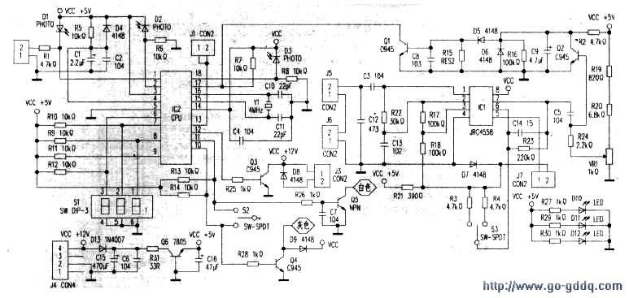

# Coin Pusher
## fix
一般比较式投币器由比较线圈，4558运放，CPU，检测光眼，电磁铁等组成，工作原理如下：当投入硬币后，当硬币经过样币时，比较线圈感应出比较电压，送入到运放4558进行比较放大，当所投之币和样币一样大时，4558产生一个控制信号，送到CPU, CPU的工作条件一是有时钟信号。
二是各对光眼必须正常工作，当这些条件符合时，CPU会产生一个控制信号，经过一个三极管放大后，驱动电磁铁吸合，硬币就能通过币道并经过最后一个光眼，产生信号电压。如果所投硬币不符合样币标准，则不能产生驱动电磁铁吸合，币道不通，投币失败。
维修比较式投币器要记住几个关键点：
一、是供电线路， 一个是外部+12V输入是否正常，二是78L08输出是否正常。
二、三对光眼是否正常，用逻辑笔很好判断的，通电后用逻辑笔测每一个接收管的正极，然后隔断发射管与接收管之间的光路，电平应该变换，否则发射或接收一般有一损坏。
三、比较电路是否正常只要测4558第7脚，当投币时是否有信号变化，没有就是比较部分有问题，一般是比较线圈断路或4558本身或外围有问题。
四、电磁铁驱动电路是否正常只要在通电的情况下将驱动三极管的C. E两脚短路，如果电磁铁正常就会吸合，如不吸合就是电磁铁坏了，
如果这四部分都正常，但还是不能投币，那一般就是CPU坏了，但这种情况很少。
## theory
从原理图中可以看出，其电路是用光电二极管的发射和接收来完成对游戏币的计数，用游戏币的滑动来实现对光电管的动态识别。也就是说，输入游戏机内的游戏币，都是在电子线路的监控之中。当有假币时，经过比效放大的信号就会使电路中的继电器不能吸合，那么假币就会从另外的一个通道出来，由于另一个通道没有光电计数，不会有电平输出到CPU 识别，其投入是无效的，这就防止了假币的使用。
　　在使用时，要用一个样品币夹在线圈比较器上面，由其产生一个比较电压送入运放的⑤脚，当所投的币与样品币材料一样时，其线圈上感应的电压与样品币感应的电压相等，那么由运放组成的比较器就会输出一个脉冲，从电路的⑦脚输出，经过三极管Q2 放大后，输出一个脉冲电压到三极管Q1 的基极，由其给CPU 电路（17）脚输出一个电压脉冲，当CPU（17）脚的电压脉冲正常并幅度够大时，CPU 的⑩脚就会输出一个高电平，继电器会在0.5 秒的时间内吸合一次，让币在设定的时间内从通道内通过。当然，其通过必须与继电器的吸合同步的，要不然的话，币也不会从计数器的通道内过去，也就是说，在CPU 识别的时候，币已经从通道内过去。这一个过程要机械与电路的配合十分紧密。
　　三极管 Q3 是继电器的驱动管，其基极有高电平时，三极管导通，继电器吸合，游戏币通过。
　　平时三极管的基极为低电平，继电器处于不导通的状态。图中的D10、11、12 均为发光二极管，其在电路一开始工作时就发光，电压约为1.1V，这与常用的发光二极管的两端电压0.7V 不同，在检修时要注意。电路中的D1、D2 为光电接收管，在其被发光管所发的光照时，其两端的电压不能变化，当有币进入时，并挡在通道中，那么D1 不被光照，两端电压就会有一个跳变，此电压送到CPU 的①脚，与D2 送来的跳变电压一起送入CPU 的信号识别端，当然其电压脉冲是一前一后送到CPU 的①脚和②脚。电路中CPU 的⑥、⑦、⑧，三个脚所接的开关负责工厂模式开关，打在工厂模式时，可以对电路的进币灵敏度进行调节，也是速度调节开关。电路中的VR1为线圈的灵敏度调节，调节其大小可以调节线圈的感应灵敏度。

