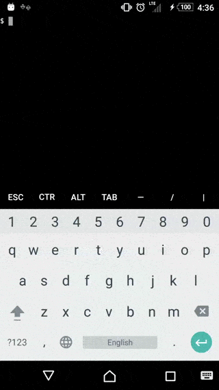

# Git on phone
## Termux
### Introduction
* Termux is an Android terminal emulator and Linux environment app that works directly with no rooting or setup required.
* can install via the built-in package manager apt, and it will work exactly like the one on a Linux machine.
* an open-source project
### Installation
      $ apt update && apt upgrade
      $ apt install git
      $ apt install openssh
### About the directory
*  by default, Termux stores the $HOME folder into the application's private storage, the one provided by Android application sandbox and which by design is unique and only accessible to the app itself 
* If you want a cloned repository to be accessible by other Android applications
 * You should configure the external storage for usage with Termux by issuing the following command:
        $ termux-setup-storage
       This is create a directory on your $HOME directory with the name storage, which is a symlink to the external storage directory. The storage directory will in turn contain several sub-directories that serve various different purposes, the one we'll be using is storage/shared which is the root of your device's external directory, the same one that can be accessed by other Android applications.
### Copy SSH keys
1. Copy your keys to your device's sdcard. You can use MTP for file transfer or use adb.
2. Open Termux, and navigate to /sdcard/ as you normally would on the command line.
3. Use `mv` to move the files to `/data/data/com.termux/files/home/.ssh/`
### Test it

