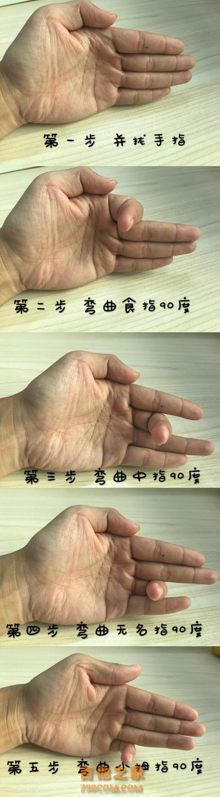

# 进阶篇
## 要做的APP
* C调级数: 1-C, 2-Dm
* CDEFGAB的纯四度和大三度关系
* 随机提示CDEFGAB 并显示图片的APP
* 3625147的次序关系
* mi la re sol do fa ti 的次序
* EADGCFB的次序
* D调级数
* A 调级数
* G调级数
## 指板:要用手来记指板 
* 记忆指板还是要简单粗暴，死记硬背，以减少弹奏时的反应时间。
* 就像键盘的记忆和熟练应用一样，是通过打字来让手指记住每个字母的位置，甚至不甚清晰地知道具体哪个字母在哪个位置。指板也类似，要通过大量地弹旋律来让手指记住音的位置
* 吉他相邻弦之间的音程关系
* 吉他音名图
* 练习从1开始从1结束
* 要熟记65弦的音名分布
* 唱名音名要正背倒背如流，各个度的上下推导要张口就来，往前四度就是上个八度的五度，往前三度就是上个八度的六度，往后四度就是，有一部分的唱名的位置特别是在低音弦上的位置可以由和弦的根音得知。
* 指板音阶练习不要分什么调，随便给一个音的位置，利用音程关系（可以是纯四度大三度或者五和弦）快速推导并弹出周围的音阶。
* 在吉他指板上练习记忆音阶及音程关系，达到唱哪个音马上就能弹出来的程度，练一串音阶的时候要习惯回到1，这样养成习惯后方便以后找调。
* 虽然短期达不到视唱的水平，但是还是要向着这个方向培养乐感，对以后即兴和弹出旋律音都很有好处，视唱很难吗？
* 吉他如何视唱练习，唱名直接弹出的程度，听到或者嘴里哼出的旋律能很快地弹出来，最好能唱出唱名。练习简谱，首先唱出唱名（不要唱歌词，唱唱名），然后在指板上迅速弹出。12、13、14、15、16、17、11要唱出来识别准。
* 五、六弦上的音名肯定是要记住的，但说记住指板所有的音名还是有一个相对的概念，比如说，六弦三品音名是G，就可以知晓到一弦三品也是G，通过隔一品、隔一个弦是高八度的关系得到四弦五品也是G，四弦到三弦是纯四度关系又可以得到三弦五品是C......
* 总得来说还是有一个相对的概念进行推算，不会把指板上所有的音名用死记硬背的方式去记它，不然太痛苦了。
* 二弦指板记忆，空弦是B，一品开始是C，往后顺DEFG就可以了
* 一弦跟六弦是相同的
* 第一个，升降开始的音(确切的说是有升降开始的调)，比如：五弦四品是升do，或者降re，音名是#C或者是bD，(注：音名在指板上的位置是固定不变的)，从这个音开始推算音阶，可以按照首调唱名法进行推算，也就是把#C或者是bD，当成do来唱/看，进行推算，其实也就是我在视频中分享的方式，任何位置都可以。
* 第二个，我理解的意思是：在推算中碰到升降音怎么办！其实，很少会在推算中会推算到带升降的音，即使碰到了，也会“避开”或者记住，比如：五弦五品是fa音的话，四弦五品是降xi，记住就可以了，实在记不住的话，可以选择“避开”，五弦五品是fa音，五弦四品，半音关系，就是mi音，四弦四品就是la了，再过来一个全音，也就是四弦六品就是xi音了
* 你这么推弹奏的时候有用吗？个人的方法：第一步记34（EF）向邻，71(GA）相邻；第二步记指板的0品、5品、10品。第0品是362573（EADGBE），5品是625136（ADGCEA），10品251462(DGCFAD）。记住这3个以后你弹的任何一个音，看看他是靠近0、5、10之间的哪个品，马上就知道了。
* 我锁屏密码就是用的362573，每根弦的空弦音，up的方法只要背住36251473,遇二弦，遇7右移和一个特例就行了，十分好用，我们一般的方法是用全全半全全全半去推，总之up的方法很有趣！
* 进低减四，进高加三
* 把36251473改为mi la re sol do fa si mi
* 把36251473改为EADGCFBE也可以记住音名分布
* 先记住五六弦往高音弦推
* 记音阶位置要的不是推导，而是要做到每一品看到即知道音名，或者是随唱随找，视、唱、弹，合一体。
* 左下右上一一六，左上右下二二四
* ???caged？
### 先记住并彻底熟悉所有的音名
* 先把CDEFGAB和1234567对应起来
* CDEFGAB正背倒背如流
* 把CDEFGAB的大三度和纯四度记熟
* 4品是大三度，5品是纯四度，7品唱名是7,12品是八度，10品比12品低一个全音。
* 熟记各弦0品，5品，10品的音名。
* 先记好各个音名位置
* 用下载的APP来练习音名位置
	* 听音名找位置时不要来回摩挲，要准确地一下按对位置。
* 不要只从低到高练习音名，也要从高到低地练习。
* 用做的APP进行随机练习(有快速的和常规的)
    * 练习要包括纵向的和把位横向的
* 把唱名上面标上音名进行音名的练习
### 然后记熟C调的音名和唱名的对应
到本能反应的程度。
### 再熟练5种主音形状
### 用简谱练习
* 总想上主要有三个区域:1品－4品区，4品－8品区，8品－13品区
* 横向和纵向的练习都要有
## 即兴及前奏间奏
* 我最近看了很多吉他教学视频 我觉得简谱还是要唱会的 然后再把指板练熟 会唱的歌就容易即兴配和弦和solo了
* 五线谱，音程，大三小三要记忆吗，知凡，先记好这些基础的音阶音程关系，再开始熟悉指板？然后再练和弦的组成音吗？还可以通过和弦组成音来看其他把位的相同的和弦，比如高把位的C和弦。熟悉指板音阶有便于自己前奏时添加旋律音。可以通过弹奏简谱来练习熟悉音阶
* ???什么是调内音，C大调音阶表
* 装饰音
  * 什么是装饰音，和弦外的装饰音
  * 怎么在和弦走向里寻找装饰音旋律音，以形成好听的前奏间奏，问问里茶，旋律音不一定是和弦的组成音。弹旋律音时可以多试试向高把位滑音，会好听很多。
  * 弹出装饰音，弹的时候动动（抬起或落下）高音弦（特别是一二弦）上的手指，一二弦的。0123品。形式可以是根据歌曲的感觉和歌词间隙的大小，比如几个音连弹，或者滑音，击勾弦，轮指
* 视唱也要到位？
* 跟着和弦进行练和弦音，solo的时候加点变化就行了。前三句用相同或相似，第四句变化要大，当包袱抖。然后加上强弱。对（调内音）-更对（和弦组成音）-不要太对（不要只是和弦组成音，还要有一些变化）
* 和弦=GDCC，至于solo...它其实就是：1搭配GDCC的根音进行和，2高把位GDCC，和..私信喊我一声语音说
* 低把位和弦音不怎么丰富，应该是和弦加音阶是比较好听的，反正就是练，很棒的教学，最起码能给人一种想法。
* 效果器加和声，和声不是和弦，和声一般跟着旋律走，一般比旋律高或者低较小的音程（二度或三度），一直随着旋律变化
* 通过练习乐句比如说布鲁斯乐句来练习指法和窜把
* 每个把位五声音阶记熟（do.re.mi.sol.la.do）
* 把一整个把位的窜把改为两根弦的窜把
* 通过指型音阶某个音或某个手指的滑音在弹奏的过程中弹奏练习曲来达到窜把的目的。
* 调外和弦有时候会产生意外的好效果
* 和弦走向后如何加旋律，首先按好和弦，然后需要非常熟悉和弦所在区域的音阶，凭感觉试着按出所需要的旋律。
* C和弦加小拇指可以创造旋律。
## 扒歌和定调
### 定调
* 扒歌怎么找do
* 如何定调,前提是要把歌的一句很准确地哼出来，最好听很多遍，保证哼出来的音准
* 笨办法：把旋律在吉他上弹出来，利用七音阶的全半音程关系的唯一性来确定1的位置
* 一般情况下前奏结束的时候的稳定音也是do
  * 大调2171到稳定的地方，最后一个1拉长音(要尽量在低音的句子后面添加，而且用“噔噔噔噔”代替“re do si do”）也可以不在低音句的后面，实际上在高音字后面（这一句不用结束）直接“噔噔噔噔”到稳定的感觉或者用吉他弹出2171，这样会更容易找到调。也可以是542171 321 54321 71 
  * 小调用656或者121756，小调歌曲怎么找调？或者还是用2171来定调，定出来就当大调，只不过是从大调的六级和弦开始弹的，常用的和弦走向有6451
* 用pitch monitor的音名怎么确定调，如果有绝对音感，怎么确定是什么调，跟笨办法一样，但是人声经常音高不准，所以要保证人声的音高准确，或者还是用吉他弹出来。
* 大调找do，do所在的位置对应的音名就是所找的大调的名称；小调找la，la所在的位置的音名就是所找的小调的名称。
* 如果找到一个稳定音，但不知道是大调还是小调，假设稳定的音的位置上的音名是C，则可能是C大调或者C小调，就需要分别弹弹C大调和C小调的和弦看看哪个跟歌曲和谐。
* 如果是根据半音关系确定的do的位置，则如果是大调的话，do所在位置的音名就是所找的大调名称；如果是小调则就是do所在音名代表的大调的关系小调，或者用五和弦推导出la所在的位置，查看此位置的音名就是所找小调的名称，跟前面用do所在位置的大调的关系小调的结果是相同的结果。
* 找好调之后要放着音频配合着和弦听听和不和谐
* 大调和小调说的是音阶的排列模式，自然七音阶的大调模式是“全全半全全全半”，自然七音阶的小调模式是“全半全全半全全”。
* 关系大小调
* 互为关系大小调的大小调的音阶是相同的，只不过音阶的主音不同，大调音阶的主音是1（do），其对应的关系小调音阶的主音是6（la）。
* 大调的六级音就是其对应的关系小调，也可以往前推小三度的音级也是其对应的关系小调。
### 如何扒歌
#### 和弦走向及伴奏
* 和弦的级数正好是这个级数和弦的根音的唱名，用级数和1234567根音位置（在六弦和五弦的）加A Am E Em指型来记和弦，根音在四弦的怎么办？
* 用E、A指型进行推导，对于刚接触这个知识的朋友来说，是最容易按的[微笑]；其实和弦的推导所用的指型不止E、A这两种，C、D、G也是可以的，但你会发现很难按[笑哭][笑哭]
* 创作时旋律不一定是和弦走向里的组成音，听着和弦就好
* 在中把位或者高把位弹出1级和弦后就可以顺着弹出后面级数的和弦了，只需要两点：后面级数的根音所在和需要的指型。
  * 后面所需弹的级数的和弦的根音可以用上下弦之间的音程关系以及五和弦指型快速确定其位置（往五六弦上推导）；
  * 知道根音的位置后再结合是大三和弦还是小三和弦就可以快速弹出该和弦。
  * 首先要熟练的：根音在六弦的大三和弦（也就是第135级和弦）用E的推导指型，也就是无名指和小拇指按五弦和四弦，中指按四弦，食指大横按；根音在六弦的小三和弦（也就是236级和弦）用Em的推导指型，即无名指和小拇指按五弦和四弦，食指大横按；根音在五弦的大三和弦（也就是第135级和弦）用A的推导指型，也就是中指无名指小拇指按四三二弦，食指大横按；根音在五弦的小三和弦（也就是236级和弦）用Am的推导指型，即无名指小拇指按四弦三弦，中指按二弦，食指大横按。五和弦的音阶推导应用到和弦级数里面很好用，可以迅速弹出下一个和弦，即使不知道是什么调的，只要一级和弦弹出来，就可以接着弹出来。
  * 那么如何快速确定并弹出1级和弦呢？
  * 记住由E推出来的根音在六弦的大三和弦一三五七八十二品分别是 F G A B C E ，以及由A和弦推导的二三五七八十品分别是B C D E F G。 
* 和弦级数的走向需要大量歌曲的积累归纳总结，这样才能慢慢熟悉听出来
##### 编配和弦
* 转位、挂留、六和弦、七和弦、九和弦
* 编配和弦，尽可能让和弦能包住所在小节的旋律，每首歌至少加一个中、高把位的和弦，至少加一个转位和弦或七和弦。自己扒完之后一定要跟原版的进行一个对比，汲取原版的灵感。和弦与旋律之间的关系不是死的固定的，因为一个和弦可以涵盖很多音，还是要多试试。
* 有根音尽量听根音，也就是低音（用好一点的听低音的耳机，或者听伴奏，或者用软件加强低音），像base之类的，找到根音位置之后，再结合可能的级数，和弦也就确定了（除了基本和弦加一些转位和弦如4/5、G/B、G/F、F/D、D7/#F（xi）之类的Am7 Dm7等，效果也会不错）。先编配三和弦，三和弦熟悉之后再听听高音部分加点七和弦之类的，因为七和弦就是在三和弦的基础上加的七度音。 
* 有些地方听不清根音可以尝试着根据唱的音高来试着编配和弦。如果听到的根音在四弦且不是空弦的话可以选用包含此根音的和弦。或者根音在四弦的话怎么快速按出和弦。注意用根音配和弦的方法只适用一部分歌曲，需要听着和谐或者用和弦套路来试。
* 调外和弦。每个调的自然七音阶是1234567,顺阶和弦都是由这些调内音阶组成的，以C调为例顺阶和弦有C、Dm、Em、F、G、Am这些按正常的三度关系组成的顺阶和弦。但是如果第二级和弦Dm的组成音由2、4、6（先小三度后大三度）变为2、#4、6（先大三度后小三度）组成的D和弦，因为#4在C调内不在调内七音阶里面是调外音，所以D在C调内是调外和弦。顺阶和弦和调外和弦的区别在于三音（都是三和弦的情况下），根音和五音都是相同的，三音与根音是大三度音程关系的话就是大三和弦在调的145级的话就是顺阶和弦，在调的236级的话就是调外和弦；三音与根音是小三度的音程关系的话就是小三和弦，如果在调内处于145级的话就是调外和弦，处于236级的话就是顺阶和弦。当然D和弦在别的调内就不一定是调内和弦了，要看其在别的调内的组成音是不是有调外音。用到调外和弦的例子有“海阔天空”里面的4级小和弦，“恰似你的温柔”。
  * 除了1级和弦，剩余的六个和弦都可以试试用调外和弦看看感觉如何。
  * 一般如果歌曲的旋律中出现了调外的音，尽量用相对应的调外和弦（也就是包含这个调外音的调外和弦）来编配；
  * 如果三音是调内的三音，一般是用顺阶和弦的，但是也可以多试试调外和弦，有时候会有很好的效果；
  * 如果三音不是调内的音，要多试试调外和弦。这样每个调内就有11个和弦可供选择尝试了。“十年”“小时候”“彩虹”“你要的爱”。
  * 有时看和声走向  比如E和弦强烈倾向Am   D和弦倾向于G   
  * 有时是因为和弦色彩   还有七和弦  留挂和弦  讲的非常好呀。而且和声也不是越复杂越好，看情况而定，和弦变化紧凑就比较跌宕，声部流向多样，和弦变化简单的话，就比较舒缓，像贝多芬的悲怆那首，前奏部分就很有有意思，转位和弦的运用那一段都可以说明白。
* 歌曲开头一般是1级或6级和弦，
* 如果小节末尾比较平缓，那这个小节就用一个和弦就行了；如果小节末尾有转音，需要加一个和弦来修饰这个转音
* 小调的话一般试试从6级开始，后面接的和弦可能性比较多，4级比较高昂，C和Am之间衔接适合起伏不大。到最后基本上也回到6级。 小调也常用6451、6415
* 1级和弦后面一般接6级（再往后就很可能是45了）或5级
* 副歌部分如果是节奏比较明显的话开始一般如果不是特别高亢的话比如“怎么会爱上了她”、“听妈妈的话”就从1级开始（后面如果比较跳跃就接5级，有时候是比较跳跃的话就两拍换一次和弦。然后后面可能接6级，再后面常接3级，需要再根据歌曲修改和弦，比如5级和弦用G的兄弟和弦去掉六弦手指，3级和弦不用Em而是用以六弦为根音的C按法Am7/G。然后后面很可能是4或者2，后面如果是小段落结束还没整个副歌彻底结束就用5级，如果是彻底结束就回到1级）或如果属于高亢的开始就从4级开始，常用45(有时候4/5)36 4(有时候用七和弦)5(有时候用七和弦)11(有时候用七和弦)
* 也可以用leading bass的方法编配和弦。用低音下行来确定和弦走向的根音1(上一点)7654325（C G/B Am7 Am/G F C/E Dm7 G。leading bass就是在下行的两个音之间加一个音级，让下行更好听，一般加进去的这个音的和弦用转位和弦，转位和弦会让和弦的衔接不那么突兀，或者使色彩更加缥缈朦胧。
* 在强拍加入根音，次强的拍加入拍弦，是种不错的方法。
* 主歌试试常用的走向15634125（旋律变的较快的情况下）、1345（旋律变化比较慢的情况下）、1645（旋律变化比较慢的情况下），6和3是互成替代的关系，1212和1414里2和4是互成替代的关系。1541。经常用25结尾。4536251、1433223
* 4536251改版：44/5(G/F弹六四三二弦)362七(Dm7) “演员”
* 在所在的调内一个个试看哪个和弦和谐
* 转位和弦，常用的转位和弦。我也试了一下转位和弦，发现每个小节的第一个音，使用相同根音的和弦或者转位和弦，会更舒服，更容易唱，还有就是两小节原来是相同的和弦，使用转位和弦也会更有感觉。谢谢伍伯伯!其实就是bass line嘛 根音下行或者上行都是和声升级的一些技巧 不一定非得转到和弦内音 比如匆匆那年这首歌 主歌就一个6级和弦 但跟音走了半音下行6 #5 5 #4 有內味r了 此外还有很多用法 比如周董歌曲里常见的大二级转升四 举个栗子 烟花易冷主歌使用六级 五级再大二级转升四就很好听
## 和弦
* 一个三和弦是由三个不同的音组成的，一个很简单的问题: 你怎样让六根弦一起发出三个音？ 答案是它必然有重合的音。你在第一品扫出一个大横按的F和弦，你制造出了六个音(从低到高) F C F A C F，你可以看到F出现了三次，C出现了两次。
* 好和弦
* 和弦级数记忆表，和弦的级数正好是这个级数和弦的根音的唱名，所有调的相同级数的和弦组成音的唱名都是一样的，因为虽然调不同，级数相同说明根音的唱名相同，那么叠加方式也相同，组成音的唱名就相同
* 和弦级数对照表
* B和弦
* C调、D调、G调和弦，A调呢？搜怎么记各个调的和弦级数
* 和弦原理，大三小三减三属七
* 出门和回家
* 4536和4516基本等效
* 回复 @平头金属 :是的，和弦功能、色彩是一样的。听感上面不一样是因为声场不一样，再一个是因为：拿C和弦举例，开放的C和弦，从5弦往1弦拨的音是1、3、5、1、3；三品封闭的C和弦是1、5、1、3、5，注意看，虽然都是由1、3、5构成，但音的顺序不一样、而且重复的音也不一样，自然听感也会不一样[微笑]
* 转位和弦、中把位、高把位和弦
* ???代理和弦
## 右手
* 右手节奏
* 第29节的两种右手节奏闷音和切音
* 多在那个APP鼓机的节奏
* 根音在强拍要弹
* 节奏感强的歌在次强拍或者第二拍第四拍拍弦（如果是四拍换一次和弦的话就在次强拍也就是第三拍加入增强节奏的比如拍弦打板之类的，如果是两拍换一次和弦的话就在第二拍第四拍加入增强节奏的动作比如拍弦打板之类的）,也可以拍弦的同时也可以扫一二弦，也可以拍六弦扫二三弦，是扫二三弦还是一二三弦要根据歌曲需不需要高音而定；向下扫弦要用力，扫弦后手指要离开，不要停靠，拇指拍六弦和中指无名指食指扫弦都是靠的手腕的甩动，朝着大拇指肚面朝自己的方向甩动；还有一种大鱼际敲击面板的同时食指中指或无名指下扫，然后食指上勾。也是靠手腕的转动，但是转动方向跟前面有所不同，手掌偏竖直，手腕转动时大鱼际打板，食指中指或无名指向下外翻扫弦，打板和扫弦都比较快速有力，其实是手指开始时拳着用大鱼际打板，打板的同时手指由拳着弹出去。
* 高音拍试试双音
* 手指打不开
* 先爬格子 再分指
## 学习资料
* 里茶叔叔开口跪
  * 里茶叔叔10、12、16、17、
  * 前奏间奏尾奏按和弦进行的freestyle
  * 扫弦节奏型
  * 治本之道 右手原则
  * 右手五六个技巧
  * 和里茶叔叔学扒歌先看7个视频
  * 里茶叔叔根音
  * 里茶叔叔右手拨弦
  * 里茶叔叔五种难度的拨弦
  * 用鼓机熟悉记忆节奏
  * 里茶叔叔热闹的扫弦
  * 里茶扒歌学和弦
  * 里茶音阶目录
  * ???里茶叔叔怎么练手指里面需要哪些技术前提，要会视唱和熟悉指板吧
* 卡尔卡西
* 教材
  * 《卡尔卡西古典吉他教程六线谱版本》
  * 《民谣吉他考级标准教程》王鹰
* 老墨开指练习
* 罗罗
## 技巧
### 一些技巧
* 拨片和拇指肚扫弦
* 泛音：先用指尖柔软的地方贴住弦，然后用力拨动琴弦，左手指肚感受到琴弦的振动之后再离开。
### 要学的技巧
* 桥边姑娘打板技巧
* 快速下去然后马上拉回的技巧
* 最后快速上下弹
* 最好练会折指
* 几个弦一起拨像钢琴一样
* 聊斋鬼神歌
* 打板加拍弦技巧，用桥边姑娘练习，打板是用大鱼际还是拇指关节。两种打板：一是大鱼际加拇指关节，要甩过去，基本上是大鱼际先接触琴板，然后拇指关节；二是用无名指指尖戳板，声音较小，需用力。打板的关键在于打板过后不耽误后面的指弹，比如能及时食指拨弦。（如果是四拍换一次和弦的话就在次强拍也就是第三拍加入增强节奏的比如拍弦打板之类的，如果是两拍换一次和弦的话就在第二拍第四拍加入增强节奏的动作比如拍弦打板之类的）
* 人工泛音
* am指法pm技巧
## 设备等
* 拾音器：无线的 加震拾音器带调音功能
* DI
* odak音箱T76，三路音箱
* 换琴弦，伊利克斯
## 想学的歌及歌手
* 时光
* 许巍
## 左手开指
* 重心放在左手，也就是下巴靠左手的位置
*
* 开指练习
    * 手掌小也不影响
    * https://www.bilibili.com/video/BV1NJ41177Wr/?spm_id_from=333.788.videocard.0
    * 手指操
	* 
