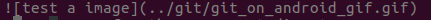
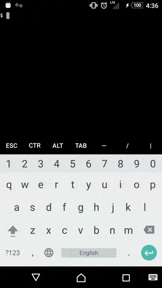

# Markdown Learning <a name=markdown_learning></a>
## Note: 
* \ for trans, e.g. \\_ \\\*   \\\*\\* 
There is no need to trans when in code format
* indent
    * for sub: presee o in normal mode
    * for parallel: press enter in insert mode
    * press Esc to avoid indent
* use more headers and less lists.
* 好象是list里面第二级只需比第一级缩进1位，第三级要比第二级缩进2位，第四级要比第三级缩进3位甚至更多，反正是越往后的级数要比前一级缩进的越多。
* add blank lin before the header when the text before the header is in normal format
* Actually there must be blank line both before and after the normal text.

##  Text format  
* Italics and Bold  
 * \_Italics\_: _Italics_
 * \*\*Bold\*\*: **Bold**
 * \*\*\_both Italics and Bold\_\*\*: **_both Italics and Bold_**
 * \_\*\*both Italics and Bold\*\*\_:_**both Italics and Bold**_
Note: The * and the _ is replacable.
* strike through
     \~\~text\~\~ : ~~text~~

## code <a name=tocode></a>
* inline code
       \`inline code\` : `inline code`
       _*Note: can only be used in one line*_
* code block 
         indenting by 4 spaces will turn an entire paragraph into a code-block
Blocks of code are either fenced by lines with three back-ticks ```, or are indented with four spaces. I recommend only using the fenced code blocks -- they're easier and only they support syntax highlighting.
        ```javascript
        var s = "JavaScript syntax highlighting";
        alert(s);
        ```
         
         ```python
         s = "Python syntax highlighting"
         print s
         ```
          
          ```
          No language indicated, so no syntax highlighting. 
          But let's throw in a <b>tag</b>.
          ```
```javascript
var s = "JavaScript syntax highlighting";
alert(s);
```
 
 ```python
 s = "Python syntax highlighting"
 print s
 ```
 
  ```
  No language indicated, so no syntax highlighting. 
  But let's throw in a <b>tag</b>.
  ```
## Headers
* \# Header One : 
    # Header One
* \# Header Two :
    ## Header Two

## links <a name=links></a>
* inline links
          [Visit Github](www.github.com) :
    [Visit Github](www.github.com)
     _Although it might make for an awkward experience, you can make links within headings too._
* reference link
           Do you want to [see something fun][a fun place]?
           Well, I do have [another website for you][another fun place].
             [a fun place]:www.zombo.com
             [another fun place]:www.stumbleupon.com

  Do you want to [see something fun][a fun place]?
  Well, I do have [another website for you][another fun place].
  [a fun place]: www.zombo.com
  [another fun place]: www.stumbleupon.com
* anchors in Github wiki page
    If you have a wiki page named Questions.md and you create heading tags ## Latest and ### Ask Your Question, woking links will be like this:
    * from the same page
	 * `[See the latest questions](#latest)`
	 * `[Ask me something](#ask-your-question)`
    * from a different page
     * `## code <a name=tocode></a>`
       `[go the code](markdown/markddown.md#tocode)` 
       _*Note: have to write the ".md" extension and add the relative directory!!!*_
                .. for the up parent directory
    * or use the githubusercontent.com link
        **最简单就是讲需要上传的文件放在项目里面，上传到github上。到文件的页面，点击download就可以跳转到新的一页，复制其URL就可以啦。**

## image

### inline image links
   * display the inline image
              
        
        
        *.. stands for the up parent directory*
        
   * does not display the inline image
              [Benjamin Bannekat](https://octodex.github.com/images/bannekat.png)
          [Benjamin Bannekat](https://octodex.github.com/images/bannekat.png)

### reference image links
* display the reference image
              ![The first father][First Father]
              ![The second father][Second Father]
              [First father]: http://octodex.github.com/images/founding-father.jpg
              [Second father]: http://octodex.github.com/images/foundingfather_v2.png
![The first father][First Father]
![The second father][Second Father]
[First father]: http://octodex.github.com/images/founding-father.jpg
[Second father]: http://octodex.github.com/images/foundingfather_v2.png

   *  does not display the reference image
              [The first father][First Father]
              [The second father][Second Father]
              [First father]: http://octodex.github.com/images/founding-father.jpg
              [Second father]: http://octodex.github.com/images/foundingfather_v2.png
   [The first father][First Father]
   [The second father][Second Father]
   [First father]: http://octodex.github.com/images/founding-father.jpg
   [Second father]: http://octodex.github.com/images/foundingfather_v2.png
   *Note: the text in the brackets is the alt text or the descriptive text for the image.*

## Blockquotes
To create a block quote, all you have to do is preface a line with the "greater than" caret (>).
        `I read this interesting quote the other day:`
        > "Her eys had called him and his soul had leaped at the call. To live, to err, to fall, to triumph, to recreate life out of life!"
I read this interesting quote the other day:
> "Her eys had called him and his soul had leaped at the call. To live, to err, to fall, to triumph, to recreate life out of life!"

You can also place a caret character on each line of the quote. This is particular useful if you quote spans multiple paragraphs. 
> His words seemed to have struck some deep chord in his own nature. Had he spoken of himself, of himself as he was or wished to be? Stephen watched his face for some moments in silence. A cold sadness was there. He had spoken of himself, of his own loneliness which he feared. >
>
> —Of whom are you speaking? Stephen asked at length. 
> 
> Cranly did not answer.

Notice that even blank lines must contain the caret character. This ensures that the entire blockquote is grouped together.
You'd better to insert a blank line after the blockquotes before the normal text.
Do not forget the space after the caret.

## List

### unordered list
        * Milk
        * Eggs
        * Salmon
        * Butter
* Milk
* Eggs
* Salmon
* Butter

        * Unordered list can use asterisks
        - Or minuses
        + Or pluses
* Unordered list can use asterisks
- Or minuses
+ Or pluses

### ordered list
        1. Crack three eggs over a bowl 
        2. Pour a gallon of milk into the bowl 
        3. Rub the salmon vigorously with butter 
        4. Drop the salmon into the egg-milk bowl
1. Crack three eggs over a bowl 
2. Pour a gallon of milk into the bowl 
3. Rub the salmon vigorously with butter 
4. Drop the salmon into the egg-milk bowl
Note: Don't forget the space character.

### Nested list
 All you have to do is to remember to indent each asterisk one space more than the preceding item.
好象是list里面第二级只需比第一级缩进1位，第三级要比第二级缩进2位，第四级要比第三级缩进3位甚至更多，反正是越往后的级数要比前一级缩进的越多。
        * Tintin  
         * A reporter  
         * Has poofy orange hair  
         * Friends with the world's most awesome dog 
        * Haddock  
         * A sea captain  
         * Has a fantastic beard  
         * Loves whiskey    
           * Possibly also scotch?
* Tintin  
 * A reporter  
 * Has poofy orange hair  
 * Friends with the world's most awesome dog 
* Haddock  
 * A sea captain  
 * Has a fantastic beard  
 * Loves whiskey    
   * Possibly also scotch?

### Paragraph

#### single straight line
            Do I contradict myself?
            Very well then I contradict myself,
            (I am large, I contain multitudes.)
Unfortunately, you'd be wrong! This Markdown would render simply as a single straight line:
            Do I contradict myself? Very well then I contradict myself, (I am large, I contain multitudes.).

#### hard break
If you forcefully insert a new line, you end up breaking the togetherness:
  Do I contradict myself?  Very well then I contradict myself,  (I am large, I contain multitudes.)

Do I contradict myself?

Very well then I contradict myself,

(I am large, I contain multitudes.)

#### soft break

You can accomplish this by inserting two spaces after each new line. This is not possible to see, since spaces are invisible, but it'd look something like this:

     Do I contradict myself?··
     Very well then I contradict myself,··
     (I am large, I contain multitudes.)
Do I contradict myself?
Very well then I contradict myself,
(I am large, I contain multitudes.)
## Horizontal rules
        <hr>
<hr>

        Three or more...
        
        ---
        
        Hyphens
        
        ***
        
        Asterisks
        
        ___
        
        Underscores

Three or more...

---

Hyphens

***

Asterisks

___

Underscores

## Tables
Tables aren't part of the core Markdown spec, but they are part of GFM and Markdown Here supports them. They are an easy way of adding tables to your email -- a task that would otherwise require copy-pasting from another application.

        Colons can be used to align columns.
        
        | Tables        | Are           | Cool  |
        | ------------- |:-------------:| -----:|
        | col 3 is      | right-aligned | $1600 |
        | col 2 is      | centered      |   $12 |
        | zebra stripes | are neat      |    $1 |
        
        There must be at least 3 dashes separating each header cell.
        The outer pipes (|) are optional, and you don't need to make the 
        raw Markdown line up prettily. You can also use inline Markdown.
        
        Markdown | Less | Pretty
        --- | --- | ---
        *Still* | `renders` | **nicely**
        1 | 2 | 3
Colons can be used to align columns.

| Tables        | Are           | Cool  |
| ------------- |:-------------:| -----:|
| col 3 is      | right-aligned | $1600 |
| col 2 is      | centered      |   $12 |
| zebra stripes | are neat      |    $1 |

There must be at least 3 dashes separating each header cell.
The outer pipes (|) are optional, and you don't need to make the 
raw Markdown line up prettily. You can also use inline Markdown.

Markdown | Less | Pretty
--- |:---:| ---:
*Still* | `renders` | **nicely**
1 | 2 | 3
## Youtube Videos
    [](http://www.youtube.com/watch?v=YOUTUBE_VIDEO_ID_HERE)
[](https://www.youtube.com/watch?v=LpsW9N3Ih5Y)
Note: There must be line (either normal or innormal) after the link.
[local_video](test.mp4)
<video src="https://www.youtube.com/watch?v=LpsW9N3Ih5Y" controls="controls">
Your browser does not support the video tag.
</video>
<iframe  src="test.mp4" frameborder="0" allowfullscreen></iframe>
