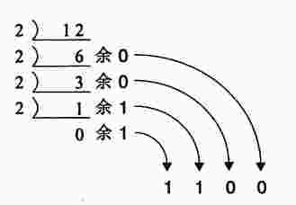
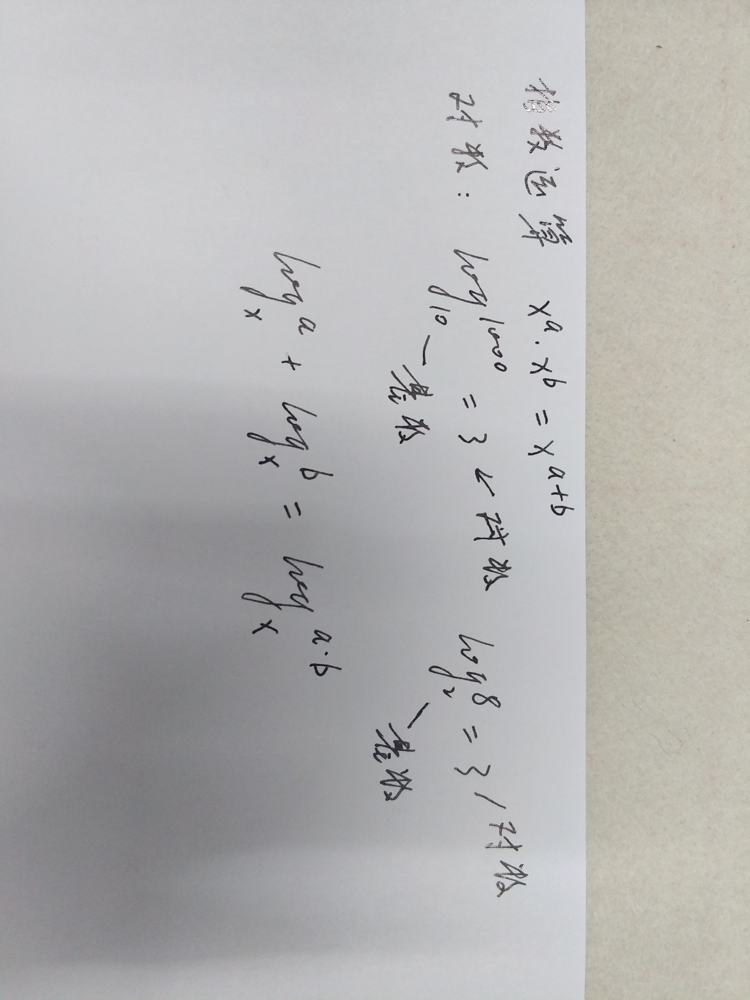

# Python

## Math

### 0
  
Transfer decimal to binary

  
0的占位功能

### 逻辑
原则：不重复，不遗漏。
  
二值逻辑

  
三值逻辑

  
逻辑的表达形式

### 余数-周期性和奇偶性
通过枚举前几例，发现其中的周期性规律和奇偶性规律，进而解决问题。
* 100天以后是星期几？
* 10^100天后是星期几？
* 1234567^987654321的个位数是几？
* 奇偶校验
* 哥尼斯堡七桥问题
    * 

### 数学归纳法
  
多米诺骨牌

  
数学归纳法证明思路

  
数学归纳法证明高斯断言

  
数学归纳法求数组之和

  
数学归纳法无限远方

### 排列组合-解决计数的问题
不要重复和遗漏。
  
排列组合

### 递归
  
递归GUN

  
递归-汉诺塔问题

  
递归-杨辉三角

### 指数爆炸与二分法
  
指数爆炸(干瞪眼翻倍问题亦是如此)

  
利用指数爆炸的力量进行二分法查找

  
指数和对数运算

  
加法计算尺

  
指数乘法计算尺

  
对数乘法计算尺

### 不可解问题
#### 反证法
1. 首先，假设“命题的否定形式”成立。
2. 根据假设进行论证，推到出矛盾的结果。从而说明假设不成立，即原命题成立。
例：证明不存在最大的数。
反证法：假设存在最大的数，并设为P. 则P+1还比P大，这与假设P是最大的数矛盾，所以假设不成立，即不存在最大的数。
#### 可数
当“集合的元素是有限的，或者集合中的所有元素都与正整数一一对应”时，这个集合就是可数的（countable）。
* 有限集合是可数的
* 所有整数是可数的
* 所有有理数是可数的
    
* 程序的集合是可数的
    * 因为编写程序的字符是有限的。
* 所有实数的集合是不可数的
    * 对角证明法
* 所有整数数列的集合是不可数的
    * 对角证明法

#### 不可解问题
“不可数集合”和“可数集合”之间不能形成一一对应的关系。当需要这两者建立因果关系时，就会产生不可解问题。
停机问题：会一直运行下去的程序（比如无限循环的程序），就会造成停机问题。停机问题是不可解问题之一。
可以用反证法证明HaltChecker程序是无法写出的。
* compiler
* source code checker
* debugger  
* Halting Problem
    * Halt Checker

## [Learn Python the Hard Way](https://shop.learncodethehardway.org/customers/)
### Preface
### Introduction: The Hard Way Is Easier
### Exercise 0: The Setup
#### Install python and python3
* `sudo add-apt-repository ppa:jonathonf/python-3.6`
* `sudo apt update`
* `sudo apt install python3.6`
#### run and quit
* `python3.6`
* `quit()`
* `mkdir lpthw`
* `cd lpthw`
* `touch test.txt`
* `ls`
#### All you need is a simple text editor, a shell, and Python
Do not use an Integrated Development Environment (IDE) while you go through this book. Relying on an IDE means that you can't work with new programming languages until some some company decides to sell you an IDE for that language. This means you can't use that new language until the language is large enough to justify a lucrative customer base. If you are confident you can work with only a programmer's text editor (like Vim, Emacs, Atom, etc.) then you don't have wait for a third party. IDEs are nice in some situations (such as working with a giant existing code base) but being addicted to them will limit your future.
You should also not use IDLE. It has serious limitations in how it works and isn't a very good piece of software. All you need is a simple text editor, a shell, and Python.

### Exercise 1: A Good First Program
* `vim ex1.py`
    * 

        print("Hello World!")
        print("Hello Again!")
        print("I like typing this.")
        print("This is fun.")
        print('Yay!Printing.')
        print("I'd much rather you 'not'.")
        print('I "said" do not touch this.')
* `python3.6 ex1.py`
* about errors
    * error prompt

        $ python3.6 python/ex1.py
          File "python/ex1.py", line 3
            print("I like typing this.
                                     ^
        SyntaxError: EOL while scanning string literal
    * It puts a `^` (caret) character to point at where the problem is. Notice the missing `"` (double-quote) character?
    * Finally, it prints out a "SyntaxError" and tells us something about whtat might be the error. Usually these are very cryptic, but if you copy that text into a search engine, you will find someone else who's had that error, and you can probably figure out how to fix it.
    * `#`: octothorpe/pound/hash/mesh

### Exercise 2: Comments and Pound Characters
* `vim ex2.py`

        # A comment, this is so you can read your program later.
        # Anything after the # is ignored by python.
        
        print("I could have code like this.") # and the comment after is ignored
        
        # You can also use a comment to "disable" or comment out code:
        
        # print("This won't run.")
        
        print("This will run.")
* the `#` in `print("Hi # there.")` is not treated as the comment sign.
* How do I comment out multiple lines
    * Put a `#` in front of each one.
* Review each line going backward. Start at the last line, and check each word in reverse against what you should have typed.

### Exercise 3: Numbers and Math
* math symbols
    * `+`: plus, addition
    * `-`: minus, subtraction
    * `/`: slash, division
    * `//`: double-slash, integer division
    * `*`: asterisk, multiplication
    * `%`: modulus, modulation
        * X divided by Y with J remaining. The result of `%` is the J part,
    * `<`: less-than
    * `>`: greater than
    * `<=`: less-than-equal
    * `>=`: greater-than-equal
* the order of operations: PE(M&D)(A&S)
    * P: parentheses
    * E: Exponents
    * M: Multiplication
    * D: Division, including `/`, `//`, and `%`
    * A: Addition
    * S: Subtraction
    * (M&D): The actual order is you do the multiplication and division in one step, from left to right.
    * (A&S): then you do the addition and subtraction in one step from left to right.
* `vim ex3.py`

        print("I will now count my chickens:")
        
        print("Hens", 25 + 30 / 6) # 30 ??? the result is 30.0, the scale in python???
        print("Roosters", 100 - 25 * 3 % 4) # 97
        
        print("Now I will count the eggs:")
        
        print(3 + 2 +1 - 5 +4%2-1/4+6) # 6.75
        
        print("Is it true that 3+2<5-7?") # False
        print(3+2<5-7)
        
        print("What is 3+2?",3+2)
        print("What is 5-7?",5-7)
        
        print("Oh, that's why it's False.")
        
        print("How about some more.")
        
        print("Is it greater?",5>-2) # true
        print("Is it greater or equal?",5>=-2) # true
        print("Is it less or equal?",5<=-2) # False
* blank lines: A logical line that contains only spaces, tabs, formfeeds and possibly a comment, is ignored.

### Exercise 4: Variables and Names
## Learning Python

