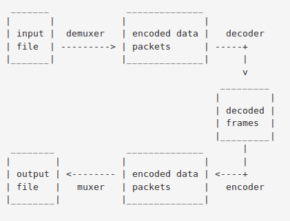
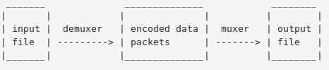
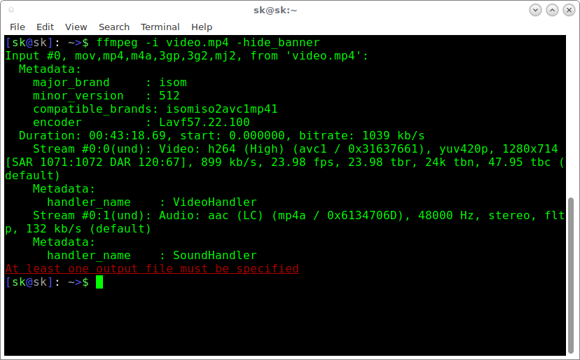
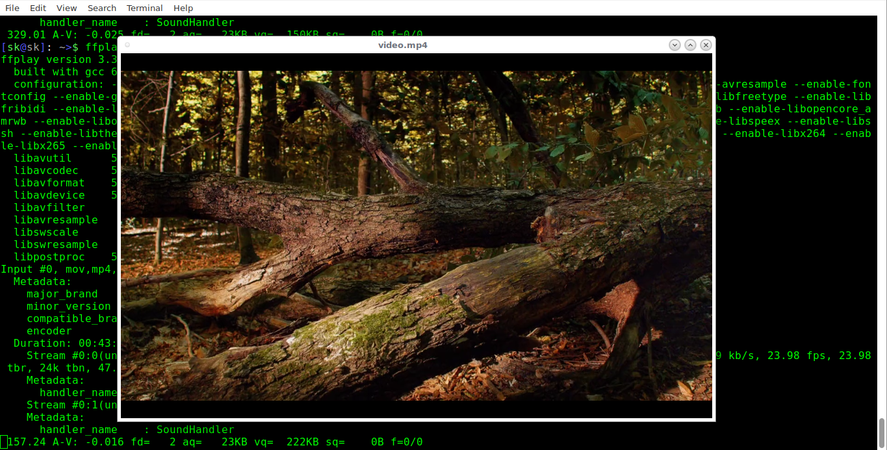
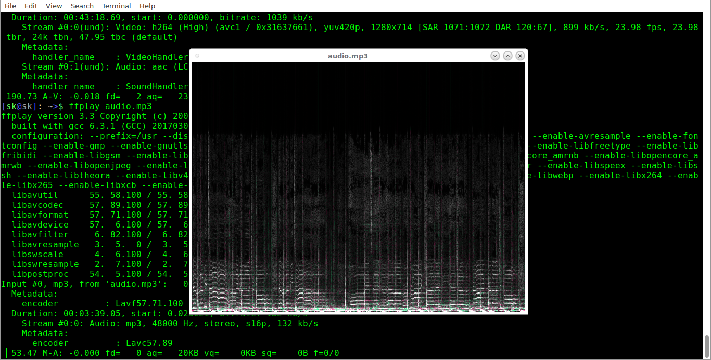
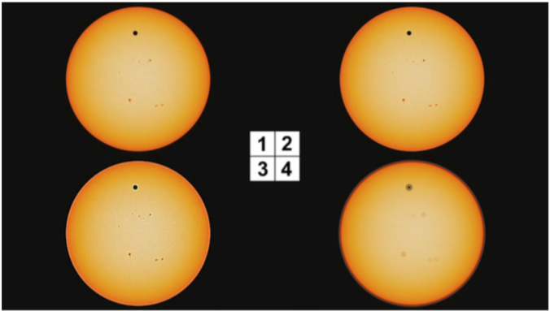
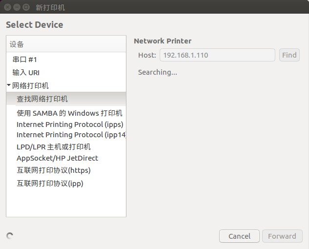
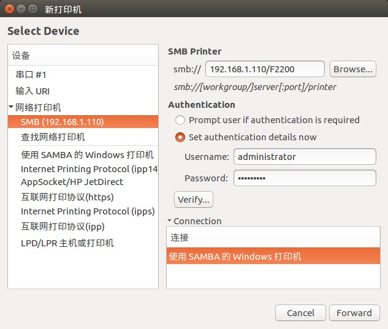

# Ubuntu skills
## how to get a colored bash in command line
Open ~/.bashrc in text editor and uncomment line:
`#force_color_prompt=yes`
to be:
`force_color_prompt=yes`
save then execute source ~/.bashrc
## had link and soft link

"An example is worth a hundred paragraphs..."

Create two files:

    $ touch blah1   
    $ touch blah2

Enter some data into them:

    $ echo "Cat" > blah1
    $ echo "Dog" > blah2

And as expected:

    $cat blah1; cat blah2
    Cat
    Dog

Let's create hard and soft links:

    $ ln blah1 blah1-hard
    $ ln -s blah2 blah2-soft

Let's see what just happened:

    $ ls -l
    blah1
    blah1-hard
    blah2
    blah2-soft -> blah2

Changing the name of blah1 does not matter:

    $ mv blah1 blah1-new
    $ cat blah1-hard
    Cat

blah1-hard points to the inode, the contents, of the file - that wasn't changed.

    $ mv blah2 blah2-new
    $ ls blah2-soft
    blah2-soft
    $ cat blah2-soft  
    cat: blah2-soft: No such file or directory

The contents of the file could not be found because the soft link points to the name, that was changed, and not to the contents.
Similarly, If blah1 is deleted, blah1-hard still holds the contents; if blah2 is deleted, blah2-soft is just a link to a non-existing file.
**Note: Cannot make hardlink for a directory!**

    cdutboy@ubuntu:~/testlink$ touch hard
    cdutboy@ubuntu:~/testlink$ echo "cat" > hard
    cdutboy@ubuntu:~/testlink$ ls
    hard
    cdutboy@ubuntu:~/testlink$ cat hard
    cat
    cdutboy@ubuntu:~/testlink$ ln hard hardlink
    cdutboy@ubuntu:~/testlink$ ls
    hard  hardlink
    cdutboy@ubuntu:~/testlink$ cat hardlink
    cat
    cdutboy@ubuntu:~/testlink$ echo "dog" > hard
    cdutboy@ubuntu:~/testlink$ cat hard
    dog
    cdutboy@ubuntu:~/testlink$ cat hardlink
    dog
## 截屏
### shutter 
#### SYNOPSIS
       shutter [options]
#### capture mode options
* -s, --select=[X,Y,WIDTH,HEIGHT]
    Capture an area of the screen. Providing X,Y,WIDTH,HEIGHT is optional.
* -f,--full
    Capture the entire screen.
* -w, --window=[NAME_PATTERN]
    Select a window to capture. Providing a NAME_PATTERN (Perl-style reges) ist optional.
* -a, --active
    Capture the current active window.
* --section
    Capture a section. You will be able to select any child window by moving the mouse over it.
* --web=[URL]
    Capture a webpage. Providing an URL ist optional.
* -r, --redo
    Redo last screenshot.
#### setting options
* -P, --profile=NAME
    Load a specific profile on startup.
* -o, output=FILENAME
    Specify a filename to save the screenshot to (overwrites any profile-related setting).
    Supported image formats: You can save to any popular image format (e.g. jpeg, png, gif, bmp). Additionally it is possible to save to pdf, ps or svg.
    Please note: There are several wildcards available, like
    %Y = year
    %m = month
    %d = day
    %T = time
    \$h = height
    \$w = width
    \$name = multi-purpose (e.g. window title)
    \$nb_name = like $name but without blanks in resulting strings
    \$profile = name of current profile
    \$R = random char (e.g. $RRRR = ag4r)
    %NN = counter
    As an example: shutter -f -e -o './%y-%m-%d_$w_$h.png' would create a file named '11-10-28_1280_800.png' in the current directory.
* -d, --delay=SECONDS
    Wait n seconds before taking a screenshot.
* -c, --include_cursor
    Include cursor when taking a screenshot.
* -C, --remove_cursor
    Remove cursor when taking a screenshot.
#### application options
* -e, --exit_after_capture
    Exit after the first capture has been made. This is useful when using Shutter in scripts. 
## 录屏软件
### peek
* installation
         sudo add-apt-repository ppa:peek-developers/stable
         sudo apt-get update
         sudo apt-get install peek
* how to use
    * peek
    * 需要手动调整录屏区域，而且不能动态地跟着移动的窗口。
    * 可以录gif.
### kazam
* installation 
      sudo apt-get install kazam
* how to use
    * kazam
    * 可以录全屏和窗口，但是不能录gif
### 视频转GIF
#### 将视频转换为GIF
`apt install ffmpeg imagemagick`
`ffmpeg -ss 00:00:20 -i input.mp4 -to 10 -r 10 -vf scale=200:-1 output.gif`
#### 合并多个GIF文件
`convert -delay 120 -loop 0 *.gif output.gif`
 * `-delay 120`:表示GIF动画速度
 * `-loop 0`:表示无限循环
#### 从jpg图片序列创建gif动图
`convert -delay 120 -loop 0 *.jpg linux.gif`
## [ffmpeg](https://www.ffmpeg.org/ffmpeg.html)
### 1 Synopsis
`ffmpeg [global_options] {[input_file_options] -i input_url} ... {[output_file_options] output_url} ... `
### Description
ffmpeg is a very fast video and audio converter that can also grab from a live audio/video source. It can also convert between arbitrary sample rates and resize video on the fly with a high quality polyphase filter. 
ffmpeg reads from an arbitrary number of input "files" (which can be regular files, pipes, network streams, grabbing devices, etc.), specified by the -i option, and writes to an arbitrary number of output "files", which are specified by a plain output url. Anything found on the command line which cannot be interpreted as an option is considered to be an output url. 
Each input or output url can, in principle, contain any number of streams of different types (video/audio/subtitle/attachment/data). The allowed number and/or types of streams may be limited by the container format. Selecting which streams from which inputs will go into which output is either done automatically or with the -map option (see the Stream selection chapter). 
To refer to input files in options, you must use their indices (0-based). E.g. the first input file is 0, the second is 1, etc. Similarly, streams within a file are referred to by their indices. E.g. 2:3 refers to the fourth stream in the third input file. Also see the Stream specifiers chapter. 
As a general rule, options are applied to the next specified file. Therefore, order is important, and you can have the same option on the command line multiple times. Each occurrence is then applied to the next input or output file. Exceptions from this rule are the global options (e.g. verbosity level), which should be specified first. 
Do not mix input and output files – first specify all input files, then all output files. Also do not mix options which belong to different files. All options apply ONLY to the next input or output file and are reset between files. 
* To set the video bitrate of the output file to 64Kbit/s:
    `ffmpeg -i input.avi -b:v 64k -bufsize 64k output.avi`
* To force the frame rate of the output file to 24fps:
    `ffmpeg -i input.avi -r 24 output.avi`
* To force the frame rate of the input file (valid for raw formats only) to 1 fps and the frame rate of the output file to 24 fps:
    `ffmpeg -r 1 -i input.avi -r 24 output.avi`
### Detailed description
The transcoding process in ffmpeg for each output can be described by the following diagram: 

ffmpeg calls the libavformat library (containing demuxers) to read input files and get packets containing encoded data from them. When there are multiple input files, ffmpeg tries to keep them synchronized by tracking lowest timestamp on any active input stream. 
Encoded packets are then passed to the decoder (unless streamcopy is selected for the stream, see further for a description). The decoder produces uncompressed frames (raw video/PCM audio/...) which can be processed further by filtering (see next section). After filtering, the frames are passed to the encoder, which encodes them and outputs encoded packets. Finally those are passed to the muxer, which writes the encoded packets to the output file. 
#### 3.1 Filtering
Before encoding, ffmpeg can process raw audio and video frames using filters from the libavfilter library. Several chained filters form a filter graph. ffmpeg distinguishes between two types of filtergraphs: simple and complex. 
#### 3.2 Stream copy
Stream copy is a mode selected by supplying the copy parameter to the -codec option. It makes ffmpeg omit the decoding and encoding step for the specified stream, so it does only demuxing and muxing. It is useful for changing the container format or modifying container-level metadata. The diagram above will, in this case, simplify to this: 

Since there is no decoding or encoding, it is very fast and there is no quality loss. However, it might not work in some cases because of many factors. Applying filters is obviously also impossible, since filters work on uncompressed data. 
### 5 Options
All the numerical options, if not specified otherwise, accept a string representing a number as input, which may be followed by one of the SI unit prefixes, for example: 'K', 'M', or 'G'.
If 'i' is appended to the SI unit prefix, the complete prefix will be interpreted as a unit prefix for binary multiples, which are based on powers of 1024 instead of powers of 1000. Appending 'B' to the SI unit prefix multiplies the value by 8. This allows using, for example: 'KB', 'MiB', 'G' and 'B' as number suffixes. 
Options which do not take arguments are boolean options, and set the corresponding value to true. They can be set to false by prefixing the option name with "no". For example using "-nofoo" will set the boolean option with name "foo" to false. 
#### 5.1 Stream specifiers
Some options are applied per-stream, e.g. bitrate or codec. Stream specifiers are used to precisely specify which stream(s) a given option belongs to. 
#### 5.2 Generic options
These options are shared amongst the ff* tools. 
#### 5.3 AVOptions
#### Main options
### Some FFmpeg commands for beginners 
The typical syntax of the FFmpeg command is:
      ffmpeg [global_options] {[input_file_options] -i input_url} ... {[output_file_options] output_url} ...
1. Getting audio/vidio file information
       ffmpeg -i video.mp4
     Sample output:
        ffmpeg version 3.3 Copyright (c) 2000-2017 the FFmpeg developers
        built with gcc 6.3.1 (GCC) 20170306
        configuration: --prefix=/usr --disable-debug --disable-static --disable-stripping --enable-avisynth --enable-avresample --enable-fontconfig --enable-gmp --enable-gnutls --enable-gpl --enable-ladspa --enable-libass --enable-libbluray --enable-libfreetype --enable-libfribidi --enable-libgsm --enable-libiec61883 --enable-libmodplug --enable-libmp3lame --enable-libopencore_amrnb --enable-libopencore_amrwb --enable-libopenjpeg --enable-libopus --enable-libpulse --enable-libschroedinger --enable-libsoxr --enable-libspeex --enable-libssh --enable-libtheora --enable-libv4l2 --enable-libvidstab --enable-libvorbis --enable-libvpx --enable-libwebp --enable-libx264 --enable-libx265 --enable-libxcb --enable-libxvid --enable-netcdf --enable-shared --enable-version3
        libavutil 55. 58.100 / 55. 58.100
    	libavcodec 57. 89.100 / 57. 89.100
    	libavformat 57. 71.100 / 57. 71.100
    	libavdevice 57. 6.100 / 57. 6.100
    	libavfilter 6. 82.100 / 6. 82.100
    	libavresample 3. 5. 0 / 3. 5. 0
    	libswscale 4. 6.100 / 4. 6.100
    	libswresample 2. 7.100 / 2. 7.100
    	libpostproc 54. 5.100 / 54. 5.100
    	Input #0, mov,mp4,m4a,3gp,3g2,mj2, from 'video.mp4':
    	Metadata:
    	major_brand : isom
    	minor_version : 512
    	compatible_brands: isomiso2avc1mp41
    	encoder : Lavf57.22.100
    	Duration: 00:43:18.69, start: 0.000000, bitrate: 1039 kb/s
    	Stream #0:0(und): Video: h264 (High) (avc1 / 0x31637661), yuv420p, 1280x714 [SAR 1071:1072 DAR 120:67], 899 kb/s, 23.98 fps, 23.98 tbr, 24k tbn, 47.95 tbc (default)
    	Metadata:
    	handler_name : VideoHandler
    	Stream #0:1(und): Audio: aac (LC) (mp4a / 0x6134706D), 48000 Hz, stereo, fltp, 132 kb/s (default)
    	Metadata:
    	handler_name : SoundHandler
    	At least one output file must be specified
_As you see in the above output, FFmpeg displays the media file information along with FFmpeg details such as version, configuration details, copyright notice, build and library options etc._
If you don’t want to see the FFmpeg banner and other details, but only the media file information, use -hide_banner flag like below.
		ffmpeg -i video.mp4 -hide_banner
Sample output:

2. Converting video files to different formats
FFmpeg is powerful audio and video converter, thus It’s possible to convert media files between different formats. Say for example, to convert mp4 file to avi file, run:
		ffmpeg -i video.mp4 video.avi
For example, to convert youtube flv format videos to mpeg format, run:
		ffmpeg -i video.flv video.mpeg
If you want to preserve the quality of your source video file, use ‘-qscale 0’ parameter:
		ffmpeg -i input.webm -qscale 0 output.mp4
To check list of supported formats by FFmpeg, run:
		ffmpeg -formats
3. Converting video files to audio files
To convert a video file to audio file, just specify the output format as .mp3, or .ogg, or any other audio formats.
		ffmpeg -i input.mp4 -vn -ab 320 output.mp3
lso, you can use various audio transcoding options to the output file as shown below.
		ffmpeg -i input.mp4 -vn -ar 44100 -ac 2 -ab 320 -f mp3 output.mp3
Here, 
 * -vn: Indicates that we have disabled video recording in the output file. 
 * -ar: Set the audio frequency of the output file. The common values are 22050, 44100, 48000 Hz. 
 * -ac: Set the number of audio channels. 
 * -ab: Indicates the audio bitrate. 
 * -f : Output file format. In our case, it's mp3 format. 
4. Change resolution of video files
Suppose, you want to set a particular resolution to a video file, you can use following command:
		ffmpeg -i input.mp4 -filter:v scale=1280:720 -c:a copy output.mp4
Or,
		ffmpeg -i input.mp4 -s 1280x720 -c:a copy output.mp4
The above command will set the resolution of the given video file to 1280×720.
Similarly, to convert the above file to 640×480 size, run:
		ffmpeg -i input.mp4 -filter:v scale=640:480 -c:a copy output.mp4
Or,
		ffmpeg -i input.mp4 -s 640x480 -c:a copy output.mp4
This trick will help you to scale your video files to smaller display devices such as tablets and mobiles.
5. Compressing video files
It is always better to reduce the media files size to lower size to save the harddisk’s space.
The following command will compress and reduce the output file’s size.
		ffmpeg -i input.mp4 -vf scale=1280:-1 -c:v libx264 -preset veryslow -crf 24 output.mp4
Please note that you will lose the quality if you try to reduce the video file size. You can lower that crf value to 23 or lower if 24 is too aggressive.
You could also transcode the audio down a bit and make it stereo to reduce the size by including the following options.
		-ac 2 -c:a aac -strict -2 -b:a 128k
6. Compressing audio files
Just compressing video files, you can compress audio files using -ab flag in order to save some disk space.
Let us say you have an audio file of 320 kbps bitrate. You want to compress it by changing the bitrate to any lower value like below.
		ffmpeg -i input.mp3 -ab 128 output.mp3
 The list of various available audio bitrates are:
   *  96kbps
   *  112kbps
   *  128kbps
   *  160kbps
   *  192kbps
   *  256kbps
   *  320kbps
7. Removing audio stream from a media file
If you don’t want to a audio from a video file, use -an flag.
		ffmpeg -i input.mp4 -an output.mp4
Here, ‘an’ indicates no audio recording.
The above command will undo all audio related flags, because we don’t audio from the input.mp4.
8. Removing video stream from a media file
Similarly, if you don’t want video stream, you could easily remove it from the media file using ‘vn’ flag. vn stands for no video recording. In other words, this command converts the given media file into audio file.
The following command will remove the video from the given media file.
		ffmpeg -i input.mp4 -vn output.mp3
You can also mention the output file’s bitrate using ‘-ab’ flag as shown in the following example.
		ffmpeg -i input.mp4 -vn -ab 320 output.mp3
9. Extracting images from the video
Another useful feature of FFmpeg is we can easily extract images from a video file. This could be very useful, if you want to create a photo album from a video file.
To extract images from a video file, use the following command:
		ffmpeg -i input.mp4 -r 1 -f image2 image-%2d.png
Here, 
 * -r: Set the frame rate. I.e the number of frames to be extracted into images per second. The default value is 25. 
 * -f: Indicates teh output format, i.e image format in our case.
 * image-%2d.png: Indicates how we want to name the extracted images. In this case, the names should start like image-01.png, image-02.png, image-03.png and so on. If you use %3d, then the name of images will start like image-001.png, image-002.png and so on. 

10. Cropping videos 
It is somewhat similar to change the resolution of the video file. let us say you want to a video with size 300×300. You could do that using command:
		ffmpeg -i input.mp4 -croptop 100 -cropbottom 100 -cropleft 300 -cropright 300 output.mp4
Please note that cropping videos will affect the quality. Do not do this unless it is necessary.
11. Convert a specific portion of a video
Sometimes, you might want to convert only a specific portion of the video file to different format. Say for example, the following command will convert the first 50 seconds of given video.mp4 file to video.avi format.
		ffmpeg -i input.mp4 -t 50 output.avi
Here, we specify the the time in seconds. Also, it is possible to specify the time in hh.mm.ss format.
12. Set the aspect ratio to video
You can set the aspect ration to a video file using -aspect flag like below.
		ffmpeg -i input.mp4 -aspect 16:9 output.mp4
The commonly used aspect ratios are:
    16:9
    4:3
    16:10
    5:4
    2:21:1
    2:35:1
    2:39:1
13. Adding poster image to audio files
You can add the poster images to your files, so that the images will be displayed while playing the audio files. This could be useful to host audio files in Video hosting or sharing websites.
		ffmpeg -loop 1 -i inputimage.jpg -i inputaudio.mp3 -c:v libx264 -c:a aac -strict experimental -b:a 192k -shortest output.mp4
14. Cut a video file into smaller clip
To trim down a video to smaller clip, we could the command like below.
		ffmpeg -i input.mp4 -ss 00:00:50 -codec copy -t 50 output.mp4
Here, 
 * -s: Indicates the starting time of the video clip. In our example, starting time is the 50th second. 
 * -t: Indicates the total time duration. 
15. Split video files into multiple parts
Some websites will allow you to upload only a specific size of video. In such cases, you can split the large video files into multiple smaller parts like below.
		ffmpeg -i input.mp4 -t 00:00:30 -c copy part1.mp4 -ss 00:00:30 -codec copy part2.mp4 
Here, -t 00:00:30 indicates a part that is created from the start of the video to the 30th second of video. -ss 00:00:30 shows the starting time stamp for the video. It means that the 2nd part will start from the 30th second and will continue up to the end of the original video file.
16. Joining multiple video parts into one
FFmpeg will also join the multiple video parts and create a single video file.
Create join.txt file that contains the exact paths of the files that you want to join. All files should be same format (same codec). The path name of all files should mentioned one by one like below.
		/home/sk/myvideos/part1.mp4
		/home/sk/myvideos/part2.mp4
		/home/sk/myvideos/part3.mp4
		/home/sk/myvideos/part4.mp4
Now, join all files using command:
		ffmpeg -f concat -i join.txt -c copy output.mp4
The above command will join part1.mp4, part2.mp4, part3.mp4, and part4,mp4 files into a single file called “output.mp4”.
        ffmpeg -i "concat:0119_0159.mpg|0228_0342.mpg" -c copy output.mpg
17. Add subtitles to a video file
We can also add subtitles to a video file using FFmpeg. Download the correct subtitle for your video and add it your video as shown below.
		ffmpeg -i input.mp4 -i subtitle.srt -map 0 -map 1 -c copy -c:v libx264 -crf 23 -preset veryfast output.mp4
18. Preview or test video or audio files 
You might want to preview to verify or test whether the output file has been properly transcoded or not. To do so, you can play it from your Terminal with command:
		ffplay video.mp4

Similarly, you can test the audio files as shown below.
		ffplay audio.mp3

19. Increase/decrease video playback speed
FFmpeg allows you to adjust the video playback speed. To increase the video playback speed, run:
`ffmpeg -i inputvideo.mp4 -vf "setpts=0.5*PTS" outputvideo.mp4`
To decrease playback speed, run:
`ffmpeg -i inputvideo.mp4 -vf "setpts=4.0*PTS" outputvideo.mp4`
对视频进行加速时，如果不想丢帧，可以用-r 参数指定输出视频FPS
`ffmpeg -i input.mkv -an -r 60 -filter:v "setpts=0.5*PTS" output.mkv`
调整音频播放速度
`ffmpeg -i input.mkv -filter:a "atempo=2.0" -vn output.mkv`
同时调整音频视频
`ffmpeg -i input.mkv -filter_complex "[0:v]setpts=0.5*PTS[v];[0:a]atempo=2.0[a]" -map "[v]" -map "[a]" output.mkv`
20. Turn X images to a video sequence
        ffmpeg -f image2 -i image%d.jpg video.mpg
This command will transform all the images from the current directory (named image1.jpg, image2.jpg, etc…) to a video file named video.mpg.
21. Turn a video to X images 
        ffmpeg -i video.mpg image%d.jpg
This command will generate the files named image1.jpg, image2.jpg, …
The following image formats are also availables : PGM, PPM, PAM, PGMYUV, JPEG, GIF, PNG, TIFF, SGI.
22. Encode a video sequence for the iPod/iPhone
        ffmpeg -i source_video.avi input -acodec aac -ab 128kb -vcodec mpeg4 -b 1200kb -mbd 2 -flags +4mv+trell -aic 2 -cmp 2 -subcmp 2 -s 320x180 -title X final_video.mp4 
Explanations:
 * Source: source_video.avi
 * Audio codec: aac
 * Audio bitrate: 128kb/s
 * Video codec: mpeg4
 * Video bitrate: 1200kb/s
 * Video size: 320px par 180px
 * Generated video: final_video.mp4
23. Encode video for the PSP
        ffmpeg -i source_video.avi -b 300 -s 320x240 -vcodec xvid -ab 32 -ar 24000 -acodec aac final_video.mp4
Explanations:
 * Source : source_video.avi
 * Audio codec : aac
 * Audio bitrate : 32kb/s
 * Video codec : xvid
 * Video bitrate : 1200kb/s
 * Video size : 320px par 180px
 * Generated video : final_video.mp4
24. Extracting sound from a video, and save it as mp3
        ffmepg -i source_video.avi -vn -ar 44100 -ac 2 -ab 192k -f mp3 sound.mp3
Explanations:
 * Source video: source_video.avi
 * Audio bitrate: 192k/s
 * output format: mp3
 * Generated sound: sound.mp3
25. Convert a wav file to mp3
        ffmpeg -i son_origine.avi -vn -ar 44100 -ac 2 -ab 192k -f mp3 son_final.mp3
26. Convert .avi video to .mpg
        ffmpeg -i video_origin.avi video_final.mpg
27. Convert .mpg to .avi
        ffmpeg -i video_origin.mpg video_final.avi
28. Convert .avi to animated gif (uncompressed)
        ffmpeg -i video_origin.avi gif_anime.gif
29. Mix a video with a sound file
        ffmpeg -i son.wav -i video_origin.avi video_final.mpg
30. Convert .avi to .flv
        ffmpeg -i video_origin.avi -ab 56 -ar 44100 -b 200 -r 15 -s 320x240 -f flv video_final.flv
31. Convert .avi to dv
        ffmpeg -i video_origin.avi -s pal -r pal -aspect 4:3 -ar 48000 -ac 2 video_final.dv
Or:
        ffmpeg -i video_origin.avi -target pal-dv video_final.dv
32. Convert .avi to mpeg for dvd players
        ffmpeg -i source.video.avi -target pal-dvd -ps 2000000000 -aspect 16:9 final_video.mpeg
Explanations:
 * target pal-dvd: Output format
 * ps 2000000000 maximum size for the output file, in bits (here, 2 Gb)
 * aspect 16:9: Widescreen
33. Compress .avi to divx
        ffmpeg -i video_origin.avi -s 320x240 -vcodec msmpeg4v2 video_final.avi
34. Compress Ogg Theora to Mpeg dvd
        ffmpeg -i file.ogm -s 720x576 -vcodec mpeg2video -acodec mp3 film.mpg
35. Compress .avi to SVCD mpeg2
 * NTSC format:
            fmpeg -i video_origin.avi -target ntsc-svcd video_final.mpg
 * PAL format:
            ffmpeg -i video_origin.avi -target pal-svcd video_final.mpg
36. 截取一张352x240尺寸大小，格式为jpg的图片
        ffmpeg -i input_file -y -f image2 -t 0.001 -s 352x240 output.jpg
37. 把视频的前30帧转换成一个Animated Gif
        ffmpeg -i input_file -vframe 30 -y -f gif output.gif
38. 在视频的第8.01秒出截取230x240的缩略图
        ffmpeg -i input_file -y -f mjpeg -ss 8 -t 0.001 -s 230x240 output.jpg
39. 每隔一秒截一张图
        ffmpeg -i input_file -f image2 -vf fps=fps=1 out%d.png
40. 每隔20秒截一张图
        ffmpeg -i input_file -f image2 -vf fps=fps=1/20 out%d.png
41. 从视频中生成GIF图片
        ffmpeg -i input.mp4 -t 10 -pix_fmt rgb24 out.gif
42. 转换视频为图片（每帧一张图）
        ffmpeg -i out.mp4 out%4d.png
43. 图片转换为视频
        ffmpeg -f imge2 -i out%4d.png -r 25 video.mp4
44. 切分视频并生成M3U8文件
        ffmpeg -i input.mp4 -c:v libx264 -c:a aac -strict -2 -f hls -hls_time 20 -hls_list_size 0 -hls_wrap 0 output.m3u8
相关参数说明：
-i 输入视频文件
-c:v 输出视频格式
-c:a 输出音频格式
-strict
-f hls 输出视频为HTTP Live Stream（M3U8）
-hls_time 设置每片的长度，默认为2，单位为秒
-hls_list_size 设置播放列表保存的最多条目，设置为0会保存所有信息，默认为5
-hls_wrap 设置多少片之后开始覆盖，如果设置为0则不会覆盖，默认值为0。这个选项能够避免在磁盘上存储过多的片，而且能够限制写入磁盘的最多片的数量。
45. 分离视频音频流
        ffmpeg -i input_file -vcodec copy -an output_file_video //分离视频流
        ffmpeg -i input_file -acodec copy -vn output_file_audio //分离音频流
46. 视频解复用
        ffmpeg -i test.mp4 -vcoder copy -an -f m4v test.264
        ffmpeg -i test.avi -vcoder copy -an -f m4v test.264
47. 视频转码
        ffmpeg -i test.mp4 -vcoder h264 -s 352*278 -an -f m4v test.264 //转码为码流原始文件
        ffmpeg -i test.mp4 -vcoder h264 -bf 0 -g 25 -s 352-278 -an -f m4v test.264 //转码为码流原始文件
        ffmpeg -i test.avi -vcoder mpeg4 -vtag xvid -qsame test_xvid.avi //转码为封装文件 -bf B帧数目控制， -g 关键帧间隔控制， -s 分辨率控制
48. 视频封装
        ffmpeg -i video_file -i audio_file -vcoder copy -acoder copy output_file
49. 视频剪切
        ffmpeg -i test.avi -r 1 -f imge2 imge.jpeg //视频截图
        ffmpeg -i input.avi -ss 0:1:30 -t 0:0:20 -vcoder copy -acoder copy output.avi //剪切视频： -r 提取图像频率， -ss 开始时间， -t 持续时间。
        ffmpeg -i 180405.mpg -ss 02:28 -t 74 -c copy ~/work/videotodeal/0228_0342.mpg
50. 视频录制
        ffmpeg -i rtsp://hostname/test -vcoder copy out.avi
51. YUV序列播放
        ffplay -f rawvideo -video_size 1920x1080 input.yuv
52. YUV序列转AVI
        ffmpeg -s w*h -pix_fmt yuv420p -i input.yuv -vcoder mpeg4 output.avi
53. 常用参数说明
 * 主要参数
     * -i 设定输入流
     * -f 设定输出格式
     * -ss 开始时间
 * 视频参数
     * -b 设定视频流量，默认是200Kbit/s
     * -s 设定画面的宽和高
     * -aspect 设定画面的比例
     * -vn 不处理视频
     * -vcoder 设定视频的编码器，未设定时则使用与输入流相同的编解码器
 * 视频参数
     * -ar 设定采样率
     * -ac 设定声音的Channel数
     * -acodec 设定音频的Channel数
     * -an 不处理音频
54. 使用ffmpeg合并MP4文件
        ffmepg -i "Apache Sqoop Tutorial Part 1.mp4" -c copy -bsf:v h264_mp4toannexb -f mpegts intermediate1.ts
        ffmepg -i "Apache Sqoop Tutorial Part 2.mp4" -c copy -bsf:v h264_mp4toannexb -f mpegts intermediate2.ts
        ffmepg -i "Apache Sqoop Tutorial Part 3.mp4" -c copy -bsf:v h264_mp4toannexb -f mpegts intermediate3.ts
        ffmepg -i "Apache Sqoop Tutorial Part 4.mp4" -c copy -bsf:v h264_mp4toannexb -f mpegts intermediate4.ts
        ffmpeg -i "concat:intermediate1.ts|intermediate2.ts|intermediate3.ts|intermediate4.ts" -c copy -bsf:a aac_adtsoasc "Apache Sqoop Tutorial.mp4"
55. 使用ffmpeg转换flv到mp4
        ffmpeg -i out.flv -vcodec copy -acodec copy out.mp4
56. 视频添加水印
        ffmpeg -i out.mp4 -i sxyx2008@163.com.gif -filet_complex overlay="(main_w/2)-(overlay_w/2):(main_h/2)-(overlay/2)" output.mp4
参数解释：
    -i out.mp4(视频源)
    -i sxyx2008@163.com.gif(水印图片)
    overlay 水印的位置
    output.mp4 输出文件
57. 视频翻转和旋转
 * 翻转
            ffplay -i out.mp4 -vf hflip
            ffplay -i out.mp4 -vf vflip
 * 旋转
            ffplay -i out.mp4 -vf transpose=1
            ffplay -i out.mp4 -vf transpose=1,hflip
    语法：transpose={0,1,2,3}
       * 0:逆时针旋转90°然后垂直翻转
       * 1:顺时针旋转90°
       * 2:逆时针旋转90°
       * 3:顺时针旋转90°然后水平翻转
58. 添加字幕
        ffmpeg -i my_subtitle.srt my_subtitle.ass
        ffmpeg -i inputfile.mp4 -vf ass=my_subtitle.ass outputfile.mp4
一般我们见到的字幕以srt字幕为主，在ffmpeg里需要首先将srt字幕转化为ass字幕，然后就可以集成到视频中了(不是单独的字幕流，而是直接改写视频流)。
但是值得注意的是：
    my_subtitle.srt需要使用UTF8编码，老外不会注意到这一点，但是中文这是必须要考虑的；
59. 嵌入字幕
        ffmpeg -i input.mp4 -i subtitles.srt -c:s mov_text -c:v copy -c:a copy output.mp4
    在一个MP4文件里面添加字幕，不是把 .srt 字幕文件集成到 MP4 文件里，而是在播放器里选择字幕，这种集成字幕比较简单，速度也相当快
60. 锐化
语法：
        -vf unsharp=l_msize_x:l_msize_y:l_amount:c_msize_x:c_msize_y:c_amount
所有参数都是可选的，默认值是5:5:1.0:5:5:0.0
l_msize_x:水平亮度矩阵，取值范围是3-13，默认值为5
l_msize_y: 垂直亮度矩阵，取值范围3-13，默认值为5
l_amount: 亮度强度，取值范围-2.0-5.0，负数为模糊效果，默认值1.0
c_msize_x: 水平色彩矩阵，取值范围3-13，默认值5
c_msize_y: 垂直色彩矩阵，取值范围3-13，默认值5
c_amount: 色彩强度，取值范围-2.0-5.0，负数为模糊效果，默认值0.0
举例：
* NASA图片锐化举例
    
    1. 是原图
    2. `-vf unsharp`
    3. `-vf unsharp=6:6:3`
    4. `-vf unsharp=6:6:-2`
* 使用默认值，亮度矩阵为5x5和亮度值为1.0
        ffmpeg -i input -vf unsharp output.mp4
* 高斯模糊效果（比较强的模糊效果）
        ffplay -f lavfi -i testxrc -vf unsharp=13:13:-2
* 降低锐化
        ffmpeg -i input -vf unsharp=6:6:-2 output.mp4
* ffmpeg预处理，增加亮度
        ffmpeg -i E:\music\1\1.mov -vf "scale=-1:720,unsharp=luma_msize_x=7:luma_msize_y=7:luma_amount=1.5" -f mp4 E:\music\1\out_sharpen.mp4
* 增加亮度
        ffmpeg -i 0228_0342.mpg -vf unsharp=luma_msize_x=7:luma_msize_y=7:luma_amount=1.5 -f mp4 -strict -2 0228_0342_sharpen.mpg
## youtube-dl
## mplayer
* Q = Quit
* P = Pause
* Up arrow = Jump forward in file more
* Right arrow = Jump forward in file less
* Down arrow = Jump back in file more
* Left arrow = Jump back in file less
* ) = Volume up
* ( = Volume down
* M = Volume mute
* F = Full screen view
* O = On-screen display
* V = Toggle subtitles in video
* time control
    * Stop at 56 seconds.
            -endpos 56
    * Stop at 1 hour 10 minutes.
            -endpos 01:10:00
    * Stop at 1 minutes 6 seconds.
            -ss 10 -endpos 56
    * Stop playback after reading 100MB of the input file.
            mplayer -endpos 100mb
## display a picture
        gwenview test.gif
        ffplay test.gif
## zathura 
### navigation and shortcuts
* same as vim navigation
* f: Follow links on the page
* F: Display link target
* r: Rotate by 90 degrees
* ^r: Recolor
* Tab: Show index and switch to Index mode
    * k,j: Move to upper or lower entry
    * l: Expand entry
    * L: Expand all entries
    * h: Collapse entry
    * H: Collapse all entries
    * space, return: Select and open entry
* 100gg: go to page 100
* d: Toggle dual page view
* F11: Switch to fullscreen mode
* +,-,=: Zoom in, out or to the original size
* zI, zO, z0: Zoom in, out or the oringal size
* a: Zoom to fit
* s: Zoom to width
* mX: Set a quickmark to a letter or number X
* \`X: Goto quickmark saved at letter or number X
* /: Search forwards
* ?: Search backwards
* q: Quit
### commands
* :: Enter command
* bmark: Save a bookmark
* bdelete: Delete a bookmark
* blist: List bookmarks
    press Tab after blist to show all the bookmarks and Press Tab to go through the bookmarks and then press return to open one.
* close: Close document
* exec: Excute an external command ???
* info: Show document information
* open: Open a document
* print: Print document
* write(!): Save document (and force overwritting) ???
* export: Export attachments
        export attachment-{name} {file-name}
        export image-p{page_number}-{image_number} {file_name}
  Press Tab to show all the images that can be exported and then press Tab to go through the images and press return to select one.
* dump: Write values, descriptions, etc. of all current settings to a file.
### Enable copy to clipboard
        vim ~/.config/zathura/zathurarc
        set selection-clipboard clipboard
## webtorrent
* [Download](https://webtorrent.io/desktop/)
* install
        dpkg -i webtorrent-desktop_0.19.0-1_amd64.deb
* put torrent to `https://instant.io/` if cannot play
* can only be launched from gui
## xdg-open
### Examples

        jelline@jelline:~$ xdg-open la_isla_bonita.mp3
        jelline@jelline:~$ xdg-open http://baidu.com
### Usage

        xdg-open { file | URL }
        xdg-open { --help | --manual | --version }
### Manual
    xdg-open opens a file or URL in the user's preferred application. If a URL is provided the URL will be opened in the user's preferred web browser. If a file is provided the file will be opened in the preferred application for files of that type. xdg-open supports file, ftp, http and https URLs.
    xdg-open is for use inside a desktop session only. It is not recommended to use xdg-open as root.
## 用专门的程序打开文件

        libreoffice 文件名 &
* 打开  .doc .docx .xls .xlsx .ppt .pptx
* 打‘&’的目的是让文件在后台运行，命令行终端还能用。如果忘了打&可以 Ctrl+z，然后打bg回车
* 文件名中含空格要打成'\ '
*  文件名太长不用打完，如 abcdefghijklmn.pdf,可以打完前几个abc,然后点tab键，剩下的就自动打出来了。
## ffplay
        ffplay videofile
        ffplay picfile
* time control
        -ss pos
        -t duration
## Adding shared printers
1. 查找网络打印机，输入对方IP地址，然后查找

2. 输入对方用户名和密码
3. 记得点下面的Set authentication details now，然后输入对方的用户名和密码，这样就不会出现等待验证的问题了。

4. 后面就是选择合适的驱动就行了。
## To expand virtual disk for ubuntu in vmware workstation
1. 先查看要扩展的vmdk文件是哪个
2. 执行扩展命令：
        vmware-vdiskmanger -x 80GB "G:\Ubuntu_64_new\Ubuntu_64-000003_single.vmdk"
 - 如果是单个磁盘文件，则上述命令可以正常进行。
 - 如果是分开的文件，会出现错误：`The called function cannot be performed on partial chains: please open the parent virtual disk. `需要先合并,在vmware的安装目录运行cmd：
            vmware-vdiskmanager -r "G:\Ubuntu_64_new\Ubuntu_64-000003.vmdk" -t 0 "G:\Ubuntu_64_new\Ubuntu_64-000003_single.vmdk"
3. 在vmware中虚拟机的硬盘查看磁盘大小是否已经变化
4. 进入ubuntu进行配置
 - 查看已有分区
            sudo fdisk -l
 - 分区
            sudo fdisk /dev/sda
            m
            n
            p
            default
            default
            如果大小只有1023B，则再进行一遍：
            m
            n
            p
            default
            default
            出现大小50GB的分区则可以。
 - 查看分区是否正确
            sudo fdisk -l
 - reboot (否则不能格式化分区）
 - 格式化分区
            sudo mkfs -t ext4 /dev/sda4
 - 挂载分区
    + 手动挂载
            mkdir ~/disk
            sudo mount /dev/sda4 /home/cdutboy/disk
    + 自动挂载
            sudo vim /etc/fstab
            /dev/sda4 /home/cdutboy/disk ext4 defaults 0 0
## vmware ubuntu share folder
1. 安装vmware tools
    - 挂载镜像文件
        从虚拟机CD/DVD里挂载镜像文件，在vmware workstation的安装目录。
    - 进入ubuntu后，打开DVD光驱，解压VMware*tar.gz的压缩包，然后`sudo ./vmware-install.pl`,然后一直默认回车。
2. 添加共享目录，必须在虚拟机关机的状态下。
3. 进入虚拟机ubuntu，如果`/mnt/hgfs`下有共享的目录就说明可以了。
4. 刚开机时vmhgfs-fuse会占用挺多cpu,过一会会儿记好了。
## top
`top`
`top -o P` (_if `top` cannot show pid_)
top 交互命令：
`h`: to show help information
`0`: Zero-Suppress toggle
`A`: Alternate-Display-Mode toggle
`B`: Bold-Disable/Enable toggle
`k`: Kill a task
`q`: Quit
`m`: Memory/Swap-Usage toggle
`t`: 切换显示进程和CPU状态信息
`c`: 切换显示命令名称和完整命令行
`M`: 根据驻留内存大小进行排序
`P`: 根据CPU使用百分比大小进行排序
`T`: 根据时间/累计时间进行排序
