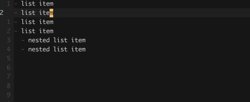
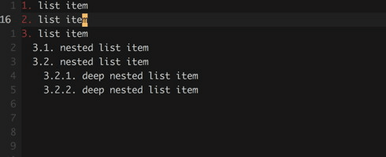
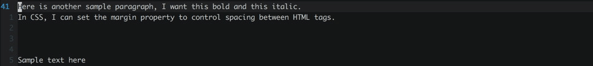
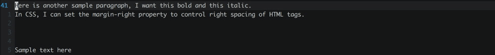

# Vim Markdown Plugins
## 1. [iamcco/markdown-preview.vim](https://github.com/iamcco/markdown-preview.vim)
* 支持滚动
* commands:
    * MarkdownPreview
    * MarkdownPreviewStop
* iamcco's vim-markdown plugin sometimes cannot show the content of md file. Maybe it is a problem of port. 
    * To solve this problem:
        * Open a *.md file before configuring the shadowsocks proxy
        * or close the md file and open it agin for a few times.
* page: random port
* install through vim-plug
## 2. [suan/vim-instant-markdown](https://github.com/suan/vim-instant-markdown)
* 不支持滚动
* install through vundle
* page: http://localhost:8090/
## 3. [python-vim-instant-markdown](https://github.com/isnowfy/python-vim-instant-markdown)
* install through vundle
* command :Instantmd
* page: http://localhost:7000/
## 4. [plastic/vim-markdown](https://github.com/plasticboy/vim-markdown)
* Syntax highlighting, matching rules and mappings for the original Markdown and extensions.
* mappings
    * gx
    * ge
    * ]]
    * [[
    * ][
    * `[]`
    * ]c
    * ]u
 * install it through vundle
## 5. [mkdx.vim](https://github.com/SidOfc/mkdx)
### Install
Vundle
            Plugin 'SidOfc/mkdx'

            :so $MYVIMRC
            :PluginInstall

### `g:mkdx#settings.map.prefix`
            " :h mkdx-setting-map-prefix
            let g:mkdx#settings = { 'map': { 'prefix': '<leader>' } }
### Folds
            let g:mkdx#settings = { 'fold': { 'enable': 0 } }

### Insert mode fragment completion
### Dead link detection
### Insert fenced code block
### Insert `<kbd></kbd>` shortcut
### Inserting list items

`g:mkdx#settings.enter.enable = 1`

### `Toggling lines from / to task items`
### `Toggling lines from/to list items`
### `Toggling lines from/to checklist items`
### completing Checkboxes/Checklists
### Toggling and promoting/demoting Headers
### Toggling <kbd/> shortcuts
### Toggling Quotes
### Wrap as link
### wrap as bold/italic/inline-code/strikethrough
* Normal mode
    
* Visual mode
    
* `<PREFIX>/` => italic
* `<PREFIX>b` => bold
* `<PREFIX>`\` => inline code
* `<PREFIX>s` => strikethrough

# vim-plug and vundle and pathogen
## [vim-plug](https://github.com/junegunn/vim-plug) 
* commands:
  * PlugInstall
  * PlugStatus
  * PlugUpdate
  * PlugClean
    * Delete or comment the "Plug ..." in the .vimrc, and then run :PlugClean to uninstall the plugin.
## [vundle](https://github.com/VundleVim/Vundle.vim)
* commands:
 * InstantMarkdownPreview 
 * PluginInstall
 * PluginUpdate
 * PluginSearch markdown
   * i for isntall; c for clean; 
 * PluginClean
 * to uninstall a plugin:
  * comment the plugin in `.vimrc`
  * Open a new tab and run `sudo vim`
  * run `PluginUpdate` (if this does not work,rm the directory of plugin under `.vim/bundle`)
## pathogen
* installation
mkdir -p ~/.vim/autoload ~/.vim/bundle && \
curl -LSso ~/.vim/autoload/pathogen.vim https://tpo.pe/pathogen.vim
* configuration
    execute pathogen#infect()
* how to install plugins through pathogen 
    cd ~/.vim/bundle && \
    git clone https://github.com/tpope/vim-sensible.git
## Note:
* **The spf13-vim makes many things not working and me really confused!!!**
* Reinstall the plugin `iamcco` when it doesn't work properly.
* Run `MarkdownPreviewStop` if the `iamcco` plugin doesn't work properly.
