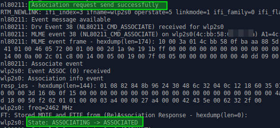

### [Getting PMKID using wpa_supplicant](https://www.wifi-libre.com/topic-1161-captura-pmkid-con-wpasupplicant.html)
In this topic we will focus on obtaining the PMKID (and the other necessary chains) with the Swiss WiFi knife in Linux: `wpa_supplicant`.
The advantage of this method is that it does not require any "extra" dependency and it is "univeral": We can do it in eny OS in Linux, no matter what the device is, what the chipset of the WiFi interface is.
#### Scanning
We do it with `wpa_cli`, the interactive command interpreter included in wpa_supplicant.
* First run `sud -i` to obtain administrator privileges in the console (we will need to be "root" all the time)
* Then we detect the available WiFi interfaces to know their names by running `iw dev`.
    * In my case I have a single interface called `wlp2s0`
        
        and I also note my mac address that I'll need later.
* We wrote a very basic configuration file to be able to execute `wpa_cli`. We will save it in `/tmp` (this will be erased) by calling it `wpacli.conf`
    `echo "ctrl_interface=/var/run/wpa_supplicant" >> /tmp/wpacli.conf`
* Before we start pulling `wpa_cli` we turn off NetworkManger and make sure the interface is ready to scan
    `systemctl stop NetworkManager; rfkill unblock wifi; ip l s wlp2s0 up`
* We execute `wpa_supplicant` indicating the configuration file (`/tmp/wpacli.conf`) and the WiFi Interface (`wlp2s0`)
    `wpa_supplicant -i wlp2s0 -c /tmp/wpacli.conf -B`
* We so the scan with
    `wpa_cli scan`
* And we get the result with
    `wpa_cli scan_results`
    We collect two data: the eSSID (name of our network) and the bSSID (the mac address of our network):
    
* We kill the `wpa_supplicant` process that we have sent in background (option `-B`) to prevent conflicts and we will be ready to pick up the PMKID and the hashes
    `killall wpa_supplicant`
#### Capture PMKID and hashes
We continue in our console with administrator privileges.
* Let's first write a configuration file with a "junk" key first to connect to our Access Point. We use the `wpa_passphrase` command (also part of `wpa_supplicant`)
    `wpa_passphrase MIWIFI_XXXX 12345678 >> /tmp/pmkid.conf`
    The eSSID that we can copy and paste from the scan should be put before the key. The file will be `/tmp/pmkid.conf`
* Now we can make the attack with: `wpa_supplicant -c /tmp/pmkid.conf -i wlp2s0 -dd`
    Everything goes very fast, leave it 4-5 seconds and for the process with `Ctrl+C`. The "trick" is to use the "debug" mode with double output level (argument `-dd`)
* Before picking up the PMKID and the chains that were used to generate them, we see that they are:
    * bSSID that we have already seen in the scan... Anyway, it comes out again in the output of our `wpa_supplicant`
    * our mac: We have seen it in detecting the interfaces. Anyway, it's at the exit.
    * eSSID in hexadecimal format. We do not have it (we have it in ascii format) and we just got it
    * the PMKID
* We make a scroll until the beginning of the sequence (the order `wpa_supplicant`) and we have the eSSID in hexadecimal:
    
    "the essid in hexadecimal is obtained when starting wpa_supplicant"
* We go down the console until we fall in the EAPOL zone. We are in it when we begin to see the hexadecimal long chains multiply (the packages in their original format). The PMKID is in the first EAPOL message. We thus obtain all the elements that were missing.
    
    I suggest trying to follow the process when we scroll. It is interesting to see in detail the steps of a wpa connection with wpa_supplicant:
    * After teaching the essid in hexadecimals that from our configuration file the program "makes a hand on the interface"
        
    * search our essid until you find it
         (here it is)
    * then the association is made
        
    * And later we fall in the EAPOL zone where we find the PMKID
    So far we arrived.
    The "crack" part (attack by dictionary or brute force) can be done at the moment with hashcat.
    We have all the elements to form our "hash". There will probably be alternatives soon. But we already left the focus of this topic: get the PMKID (and the other chains) with the most fundamental: bash and wpa_supplicant. Two things that we will find in all linux systems.
* Form the 16800 file
The content of the written file will look like this: `2582a8281bf9d4308d6f5731d0e61c61*4604ba734d4e*89acf0e761f4*ed487162465a774bfba60eb603a39f3a` The columns are the following (all hex encoded):
    * PMKID
    * MAC AP
    * MAC Station
    * ESSID
